# 遗传模糊树

遗传模糊树及其在无人机编队自主训练与控制中的应用

论文：[Genetic Fuzzy Trees and their Application Towards Autonomous Training and Control of a Squadron of Unmanned Combat Aerial Vehicles](https://www.researchgate.net/publication/277020517_Genetic_Fuzzy_Trees_and_their_Application_Towards_Autonomous_Training_and_Control_of_a_Squadron_of_Unmanned_Combat_Aerial_Vehicles)

GFT是遗传模糊系统的自然进化，利用GA对多个级联模糊系统进行优化。
任务：UCAV小队穿过作战区域，应对敌人威胁、利用不完善的系统、解决不确定性、成功摧毁敌方目标。敌方威胁主要是空中拦截机（AIs）、地对空导弹（SAM）阵地、电子战(EWAR)站。

用GA同时训练和调整多种模糊推理系统(FISs)，他们具有不同程度的连通性。本文提出学习增强战术处理算法(LETHA)，可以创建控使用DL、应对不确定性和对变化场景的控制器。产生的确定性模糊控制器容易理解、高效、高性能，并且能够一致性地完成新的和不同的任务。

## 1 前言
UCAV用来完成空对地打击任务。在远程控制信号延迟的情况下完成。更高的速度飞行、高精度传感器和武器系统，以及对抗敌人威胁的动态规划，都需要巨大的带宽和接近于零的延迟，如果基于光速的限制要求卫星系统是不可能的。

目标：UCAV个体或中队自带智能控制器，减少与指挥中心的通信（只需要高级别的命令）

困难：对不确定性的适应能力，对动态状态的适应能力，以及推断深度学习并将其应用于不同和新的场景。计算复杂度

遗传模糊系统训练模糊推断系统（FIS）很有效，但是单个FIS需要大量输入输出，复杂性很高。级联FIS更有效。

模糊树：具有许多FIS，都不需要自上而下的结构，每个控制问题的较小部分的方法都更好，可以为要考虑的许多不同状态创建专门的规则集。

遗传模糊树：训练一个FIS队伍，每一个有不同的连通度和多种输出。可以训练产生有效的规则，其相应的隶属度函数（MF）微调，对复杂的问题进行确定性控制。

### 1.1 问题描述

LETHA：从遗传级联模糊系统进化来的。
仿真系统：Hoplologic自主防御仿真（HADES）是LETHA用来训练模糊树的高效，低保真度的仿真，尽管最终的控制器不需要低保真度环境，并且可以适应更现实的仿真器。 

静止的红色地对空导弹基站（SAM）、电磁基站（EWAR）、空中拦截器(AI)巡逻区；
- 红色AIs在设定的边界内巡逻，一旦蓝色无人机被探测到，AIs就可以离开该边界，交战并发射导弹
- 当蓝色UCAV在SAM的射程内时，会发射导弹组，每一组有6个导弹；除另有明确规定的任务；
- SAM和AI系统在蓝色无人机进入射程后立即开火并与之交战，假定导弹恒定加速度。
- EWAR工作站通过阻塞在指定半径内的无人作战系统之间的所有通信进一步复杂化了对中队的控制。这限制了无人机在EWAR地区协调行动的能力，降低了中队的效率。

LETHA控制器两个主要防御武器：
- 激光武器系统(LWS)，可以摧毁导弹，不能摧毁AI，发射需要冷却时间；冷却时间取决于导弹距离、可见的导弹轮廓。LWS可再生、但是容量小、冷却时间长。所以正确使用LWS很重要。
- 提供自卫导弹(SDMs)，可以摧毁任何来袭的红军导弹、或AIs

任务：每个任务都在标准化大小的战场上进行。 
- UCAV中队遵循一条预定路线，以摧毁静止的，未武装的关键目标。 这些目标代表了诸如飞机场，雷达站，营房等目标。
- LETHA仅知道任务中一定比例的威胁，并在向小队射击后立即发现其他威胁。 
- 另一不确定性是LWS和SDM击毁率90％。LWS发射失败不能立即重新发射。 
- **SDM和LWS的有效关注领域不在此工作范围之内**。
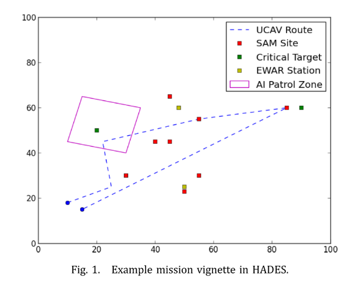


## 2 文献

### 2.1 UCAV
与JFACC计划不同，本研究严格处理自主无人系统，而不涉及有人和远程操作。 由于存在SDM和LWS，而不是简单的一堆空对地武器，因此没有任何公开的方法可以轻易地作为适合本研究的比较方法。

### 2.2 无通信协作
考虑通信故障，LETHA训练的无需指挥中心命令，但会相互通信以确定最优的任务分配。

- 在有限的分布式网络中，杰克逊提出了一个经常研究的合作问题。 为任务分配进行了一个投标过程，由于每个成员只能与该组的有限子集进行通信，因此延迟了该组动作的同步。 对于仅在中队某些成员之间失去通信的情况，这种算法在LETHA中很有用，尽管目前认为这不在本研究范围之内
- 无沟通WLAN信道选择：彼此范围内的多个无线路由器必须正确选择不同的信道来建立其网络。 但是，LETHA的浪费不是时间，而是LWS容量和SDM。 从理论上讲，导弹来袭时，UCAV可以在非常短的时间间隔指定所需的动作，以便在没有通信的情况下使团队的动作同步，但这将需要传感器同时监视每个来袭的导弹，并且LWS对每枚来袭导弹的锁定延迟为零。
- LWS和SDMs都不能立即产生结果，这一事实不允许使用许多方法。预先给智能体指定了位置或角色。每个角色都有定义其行为的不同参数。利用这种方法，当通信出现时，UCAVs同步并修改它们的角色，一旦切断，遵循它们预定义的角色以努力减少资源浪费。
- 利用角色分配和间接通信，UCAV的LETHA控件将了解并至少估计每个机组成员的下一步行动。

### 2.3 Learning

推断或使用规则；控制领域算法：GA、模糊逻辑、DNN

模糊逻辑：训练有效，规则库和MFs易于定义和编码

LETHA是遗传模糊系统的一种，而神经模糊逻辑是另一种自主开发模糊逻辑系统的方法。遗传模糊系统比神经模糊系统产生更好的结果。

遗传模糊方法不仅限于规则库的学习。 实际上LETHA可以同时进行规则库学习和MF调整。

### 2.4 模糊结构

**模糊树**的结构是级联模糊系统的自然进化。 级联模糊系统解决如果只使用一个控制器的话则规则太多的问题；

**模糊网络**，该网络与模糊树有一些相似之处，但是遵循更严格的结构，并且使用了与模糊树不同的模糊逻辑控制器表示。 
模糊树中的FIS不需要以任何特定的连接方式，也不需要特定的层。 因此，模糊网络的形式属性不会扩展到模糊树。

## 3.方法论

### 3.1 遗传模糊系统
学习规则库、微调隶属度函数。
与GA一样，会创建解向量的初始种群。规则库编码和MF修改有很多方式。

匹兹堡方法的编码类型：假设FIS的一些任意规则库：
```
If X0 is 1 and X1 is 1, Y is 0 . 
If X0 is 1 and X1 is 2, Y is 1 . 
If X0 is 1 and X1 is 3, Y is 2 . 
If X0 is 2 and X1 is 1, Y is 1 . 
If X0 is 2 and X1 is 2, Y is 2 . 
If X0 is 2 and X1 is 3, Y is 3 . 
If X0 is 3 and X1 is 1, Y is 1 . 
If X0 is 3 and X1 is 2, Y is 3 . 
If X0 is 3 and X1 is 3, Y is 3
``` 
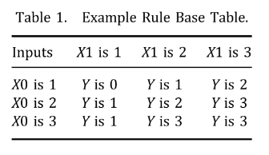

现在逐行获取单元格的值，将获得字符串012123133。这一串编码能够表示遗传if-then规则，字符串长度与计算时间有关。一个字符串表示整个规则库和MF参数。因此在每一代都可以创建和评估多个控制器，这是匹兹堡方法的特点。

一旦确定了字符串编码，就必须评估。这在遗传模糊系统中尤其困难。在这里使用**模拟估计**。

### 3.2 模糊树

通用FIS将观测数据作为输入，通过MF模糊处理，利用一组if-then规则确定模糊输出，然后将模糊输出转换为简单控制动作。 
对于具有许多输入和输出的复杂问题，单个FIS可以正确控制。但是，输入状态和输出状态的每种可能组合都需要一个if-then规则。计算困难。

最初的LETHA由级联模糊结构而来，Quite simply, the number of rules for this system is shown in Eq. (1). If we assume a; b; c; d = 4, and n = 5, this system would have 1280 rules.
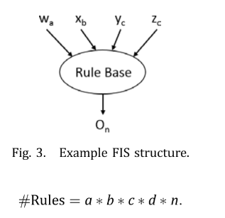

当如果输出MFs的子集i不完全与所有输入相关，那如下图
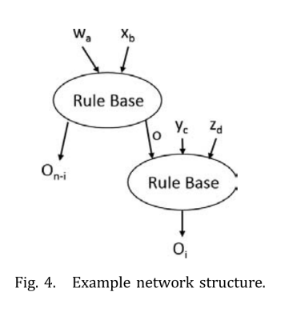
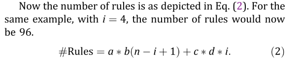

当变量不是完全独立时，执行类似分割的决策就会更加复杂。即使一个输入预期会对系统产生极小的影响，规则表面也会随着它的包含而改变。这仍然可能导致微不足道的变化，以crisp控制输出，但如果不是决定严重依赖性能和效率的要求。
但是，利用这一技术可以提高使用一个控制器的效率。 甚至更复杂的问题也可能要求使用模糊树。 在这种技术中，大量的FIS处理特定的状态集，并以与级联模糊系统相似的方式相互关联。 可以将其建模为一组不同的级联模糊结构，因为仍然有一些高级FIS仅接收清晰的数据，而那些FIS则采用了清晰和模糊输入的某种组合。 FIS之间的连接更为复杂，并不总是遵循自上而下的方法。

### 3.3 遗传模糊树

遗传模糊系统中染色体只在相似的部分与其他交叉繁殖，而GFT字符串对于每个FIS都有很多这些部分。 繁殖在字符串的每个部分上独立发生，因为每个部分很可能具有不同的可能值。

如果初始化时MF形状猜不到，就可以把它当作字符串的一部分，而不是简单微调。但是会增加字符串长度，增加了解决空间的维数，从而增加了所需的计算时间。**在LETHA的情况下，利用了一个简单的MF形状，因此初步的猜测是令人满意的**。

GFT用GA训练多个FIS，解决困难问题。但存在耦合问题，如果某单FIS连接所有输入输出，那它就是瓶颈，限制整个GFT的性能。
然而，为控制整个复杂系统而创建的单个FIS的自动优化常常是一项不可行的任务。例如本问题,如果单个FIS的形式,将有一个长6.58 * 10^14数字字符串,将通过GA优化。
显然无效的；利用GFT技术，LETHA的架构是一个448位的长字符串。

为了不损失分辨率减少解空间，如果对特定规则或隶属函数的确定性有任何疑问，则应将其包括在GFT的GA优化中。
但是，例如，分析确定餐厅小费的经典模糊方案。 如果食物一般，但服务略好，那么小费的多少就有争议了。如果食物和服务都是坏的，那么小费显然应该是零。
同样，当LETHA决定防御系统时，如果没有SDM了，且LWS有能力发射，那么LWS应该被选择。**使用这个过程来消除明显的if-then规则，我们可以获得额外的计算效率。**

GFT，效率，鲁棒性，性能和适应性

## 4.实现

### 4.1 HADES

作为GA的cost函数，从二维、连续、高层次的视角看问题。

假设简化：
- 经过一段时间的延迟后，根据威胁的类型，蓝军知道每枚导弹的预计撞击时间，以及可用于LWS打击的导弹的轮廓。 
- UCAV没有机会改变航向并逃避导弹。 
- UCAV的传感器被认为具有完善的功能，因此中队的每个成员都能够独立确定这些值。 
- 在正常条件下，UCAV会同步系统状态和计划动作的所有信息。

过程：
- 当通信被EWAR中断，UCAV不能同步信息，当导弹被LWS击中时，所有无人机可以看到。 
- 同时，如果UCAV发射了SDM，其目标别的无人机不知道。
- UCAV可以发射1s的LWS发射后发射SDM，作为间接通信手段。
- SDM发射后不能改变目标，
- LWS可以随时取消，当为导弹指示目标完成后，冷冻1s，才可以计算新的目标导弹的延迟。

蓝方被发现：
- 空导弹阵地将确定在什么点发射导弹，以便在飞机飞越其导弹可能的射程时对其进行打击。因此，无人机必须在到达交点之前对抗所有导弹，否则红色导弹将击中目标。
- 一旦发射，所有的导弹都被认为在轨道上。
这可以在图5中看到，蓝色的圆圈表示地对空导弹的传感器半径，红色的圆圈表示导弹的最大平面距离。
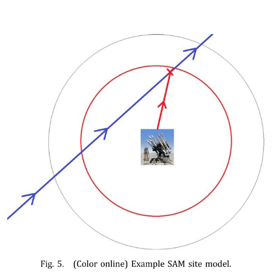

表示：
- 等式（3）向量b是特定UCAV的主要状态，矩阵B是整个机组的状态。
- 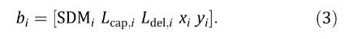
- 当前剩余的SDM、当前LWS容量，当前LWS延迟，位置为xi和yi。 LWS延迟-指定LWS必须完成其当前或计划的行动的时间，以及何时准备向另一枚红色导弹发射。 SDM弹药因每次任务而异，在所有任务中，LWS的最大容量设置为10秒发射时间，每秒补给速度为0.15秒。
- 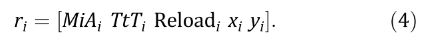
- 等式（4）是红方，当前空中导弹数量、导弹到达最近蓝方目标的时间，实体再次发射的剩余时间、位置坐标，除了AI，其他的都不变。
- 注意对于红方拦截机,reload时间无限,因为它发射所有导弹.

训练时：
- 用奖励值引导动作，选择与每个动作相关联的权重传授控制器经验教训。例如，蓝方SDM打导弹没有奖励、用LWS小奖励、活着离开战场大奖励。
- 在整个任务运行中得分越高，表示性能越高的控制器。 不承担任何损失； 如果中队的UCAV被摧毁，任务将停止并给予惩罚。 这些失败的适合性仍在评估中，因为很可能许多控制器在整个训练过程中都会使任务失败，并且仍然需要区分其性能。 本研究中使用的要点见下表2。
- 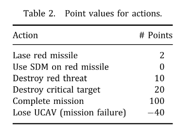

### 4.2 LETHA

1. 模糊控制
    - GFT内有8个FIS，每个都是多输入单输出系统。利用归一化值对输入进行模糊化，并采用等分线去模糊化方法。
    - 左边是可以通信的，右边是EWAR干扰通信的。
    - 使用三角隶属度函数
    - 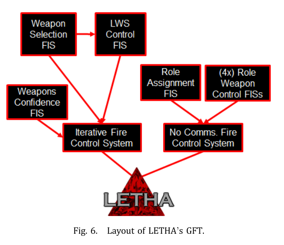
2. Weapon confidence FIS
    - 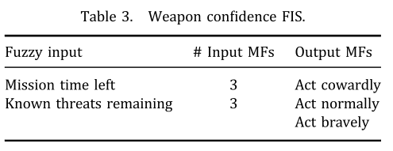
    - 独立部分，只考虑任务剩余时间和剩余已知威胁，没有威胁的完整信息。
    - 不直接把输出给其他FIS，但与其他FIS间接连接，
    - 输出：勇敢的，正常的或怯懦的（brave, normal, or cowardly）
    - cowardly：保守的，对每个威胁多次反击。内在逻辑是有其他威胁，例如，SAM发射一组6枚导弹，cowardly希望计数12个。每个导弹至少被一个counter覆盖；
    - bravely：节约资源
    - normal：两者之间，有其他FIS规则指定。
    - 该控制器必要，否则无人机会为了保护资源死掉，
3. Weapon selection FIS
    - 武器信心FIS决定多保守之后，使用武器选择FIS，决定每个UCAV选择什么武器应对威胁。
    - iterative fire control system把它的输出和LWS控制系统的输出整合，决定每个UCAV的动作。
    - 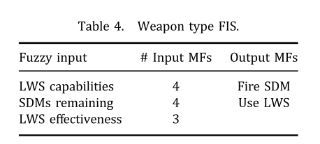
    - 输入：**LWS有效性，是针对每种导弹确定的，但仅考虑导弹的外形**，导弹轮廓所造成的损失被认为是恒定的。 LWS功能：LWS容量和延迟的组合，判断轻武器是否可以摧毁导弹，如果可以，有多少种不同的发射方法。
    - 输出：UCAV选择哪种武器。SDM无记忆、无智能控制，LWS只有在确保成功时才被选择。如果一个UCAV不能摧毁且没有SDM了，则跳过，考虑下一个UCAV。
    - 唯一不用训练的规则: 当LWS或SDM有一个是none，将自动选择相反的武器类型。当没有可用的武器时，将跳过该无人机，考虑下一个。
4. LWS control FIS
    - 注意单个UCAV的防御状态不是本阶段的输入,因为该阶段在武器选择之后。
    - 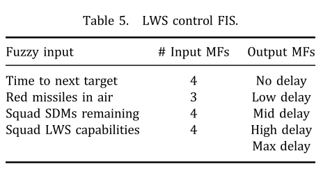
    - 延迟时间在预处理阶段计算。最小延迟与当前容量有关、最大延迟与允许导弹接近多长时间再炸掉有关。还有其他中间状态。
    - 不关心是否使用LWS或SDM，只关心最有效地使用LWS
    - 整个编队的防御系统与此阶段密切相关。单个UCAVs SDMs剩余弱独立的，剩下数量在很重要
    - 有通信时，在空中每个红方导弹迭代，灵活考虑战略。
    - 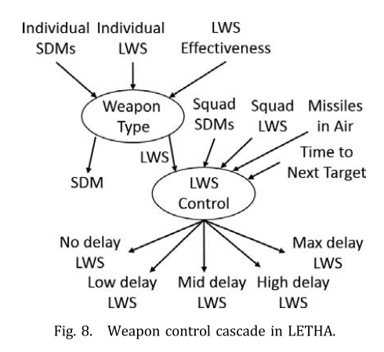
5. Role assignment FIS
    - 当通信受阻，按预定义角色行动。该分配在通信可用时按一定的频率发生，默认为10秒；
    - 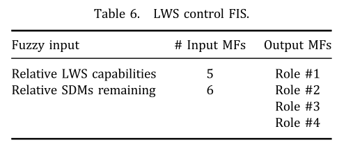
    - 由于该FIS不一定触发，因此唯一可能的输入是与UCAV本身有关的输入，相对状态。
    - 角色数量不一定与无人机数量一致。
6. Role weapon control FISs
    - 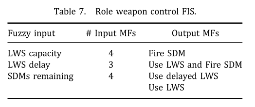
    - 每个角色都有一个选择FIS，是前面武器选择FIS的简单组合。
    - LWS容量和延迟在这里没有合并成一个能力的度量，这主要是由于采用LWS标记目标然后触发SDM的新可能动作
    - 由于每个UCAV根据其作用采取自己的独立行动，因此其他UCAV可以组成一个安全网，如果在特定点之前未对它们采取任何行动，则可以准备对付其他导弹。
7. String structure
    - 字符串是数字，输入的组合和输出的MFs。被分成很多部分，每个部分进行交叉繁殖。
    - 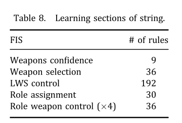
    - MF的调整是通过类似字符串部分的实现来进行的。 字符串中的数字对应于每个MF端点的某些变化。 在LETHA中，值5表示端点无偏移。 较小的值（最小值为0）表示负向移位，较大的值表示为9（正向）。 彼此相邻的MF在调谐期间保持在一起，以确保每个输入的整个范围至少被一个MF覆盖。 如表9所示，树的EWAR mitigation 分支的调整比武器系统分支的调整少得多。这是由于每个角色武器控制FIS的后处理比其他FIS复杂得多，并且依赖于恒定的MF分布，角色分配FIS是该部分中唯一经过调整的。
    - 染色体被分为10个部分，总长度为448位。 
8. 进化过程
    - 使用GA训练。
    - 使用锦标赛轮询样式。 从总体中随机选择多个字符串，然后从该池中选择最适合的字符串进行繁殖。没有精英保留政策。 在每一代末期，所有成员都死了，只有子孙后代存在。
    - 每个部分独立进行杂交、翻转和随机替换突变
    - 变异率、交叉率使用外部遗传策略优化。
    - 使用基因库记录最优适应度的染色体。在每一代之后，如果字符串在当前全局最优值的某个分数之内收到适应性值，则该字符串将记录在单独的库中。 请注意，它仍然是从下一代中移除的。
    - 所有代训练完，使用MC模及运行染色体库里的每个字符串。这里是每个字符串40次额外运行，最高总得分或平均分的选为最佳控制器。

### 4.3 有通信的整个过程

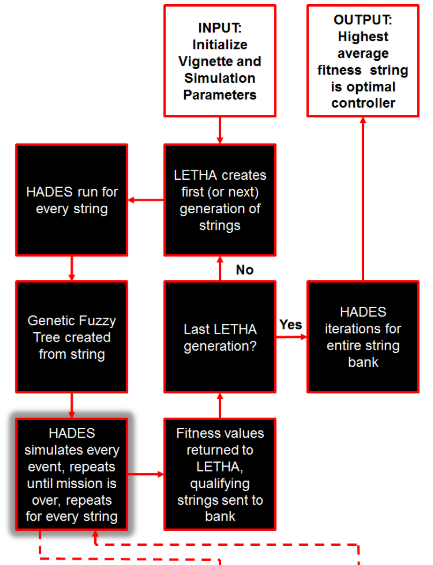
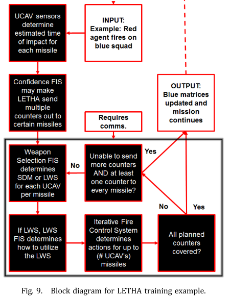

```
(i) 初始化任务和模拟器参数
(ii) LETHA 创建染色体串 
    (a) if 第一代，随机创建
    (b) 否则，锦标赛式的交叉、变异繁殖，没有精英策略。
(iii) 在每个任务上，每个字符串运行HADES. 
(iv) 从string创建模糊树 
(v) 处理每个事件，直到任务结束 (see next section).
(vi) 返回适应度给 LETHA. 
(vii) 高质量的串发给bank. 
(viii) 最后一代? 
    (a) 否，返回第2步. 
    (b) 是，继续.
(ix) 在string bank中迭代运行HADES. 
(x) 把最优的串作为控制器.
```

事件处理过程取决于当前中队之间的数据链路是否完好。如果是这样，则事件的过程为：
```
(i) 相关参数导入. 
(ii) 红方向编队开火. 
(iii) UCAVs 确定撞击时间和LWS效能.
(iv) 置信度FIS确定要多少counters（反击）. 
(v) 武器选择FIS从每个无人机提供所需的行动.
(vi) 如果选择LWS，LWS控制FIS给出延迟时间. 
(vii) 每次迭代最大反击导弹数 = 编队中UCAV数量.
(viii) 所有理论上的红方导弹都覆盖到了? 
    (a) 否，返回第5步.
(ix) 输出控制、更新状态和时间矩阵，继续模拟直到下一个事件.
```

90%的概率蓝方反击没有命中目标，反击武器的结果需要验证。通常这是红色开火后的下一个事件，然而当威胁聚集在一起时，多个红色实体可以同时对中队开火。检查蓝方反击武器有效性的流程为:
```
(i) 蓝方激光或者SDM有效?
    (a) 是, 取消瞄准同一个导弹的激光，移除模拟环境中同一路线上的SDM.
    (b) 否，继续. 
(ii) 确定被击中的剩余时间.
    (a) 如果小于最小激光发射限制，根据置信度（confidence）发射一定数量的SDM. 
    (b) 否则，继续.
(iii) 重新迭代一次单武器系统FIS和群组武器系统FIS.
(iv) 输出控制，更新状态和时间矩阵，继续模拟直到下一个事件.
```

### 4.4 训练
文献（`N. Ernest, D. Casbeer, K. Cohen and C. Schumacher, Learning of intelligent controllers for autonomous unmanned combat aerial vehicles by genetic cascading fuzzy methods, SAE 2014 Aerospace Systems and Technology Conf., Cincinnati, OH, 23–25 September 2014, DOI:10.4271/2014-01-2174.`）讨论了在这样的环境中训练GFT。每个FIS中的每个MF都应该进行测试，但是如果任务时间太长，多次测试相同的场景是不必要的。

保持任务的分离可以让string的不同部分同时发展，同时还能提高并行应用程序的计算效率。

在效果方面，创建training setups的最重要因素是**确保决策树的每个相关分支集至少被覆盖一次**。
对于LETHA的情况，仅在矩阵B中的状态属于某个MF集合时测试LETHA是不够的。其他因素，例如到下次相遇的距离和剩余的任务时间，也起着重要的作用。
由于GFT会同时改变RB和MF形状，因此这些因素的定义也在不断变化，因此创建了足够的训练任务，以确保FT的整体设计完全适用于每一种可能的string，在计算上是棘手的。
但是，可以创建一个足够大的训练集，让LETHA充分利用每个输入和输出的MFs数量的最大粒度。

当然，每个训练组合的性能都要通过测试结果来验证。

## 5 结果

在6个任务中测试，每个任务侧重不同部分的知识。
### 5.1 训练任务
#### 5.1.1 任务1

敌方地对空导弹每次发两枚，只用LWS完成。
学习当资源用尽，如何用LWS自卫
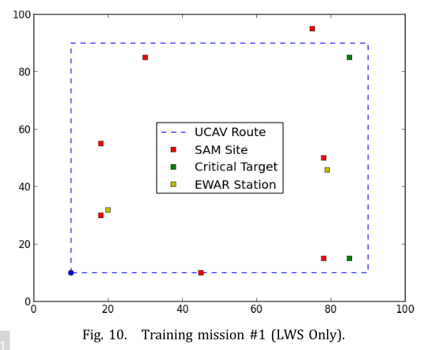

#### 5.1.2 任务2
与任务1相似，但是战斗空间大了一个数量级，时间多了，保证最大激光容量。
任务更困呐，SAM发射六枚导弹。当导弹轮廓不好，且没有SDM时，四个无人机的编队很可能会失败。
该任务训练平均分很低，但是学到的经验很宝贵。
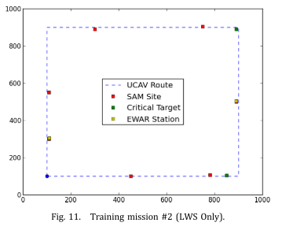

#### 5.1.3 任务3
编队SDM数量预先确定，必须打败不同的敌人。
必须打败五个敌人群，其中两个有EWAR，最后一个还有巡航机，学习对于SDM的保守或激进策略。

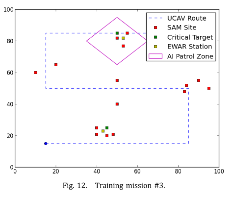

#### 5。1.4 任务4
主要关注每组敌人之间距离。
底部和中间重复SAM，因为可以有不同的状态、威胁、到下一个目标的时间等。
EWAR位置，这与训练任务中发射的红色导弹数量最多有关，两次发射红色导弹之间的平均时间最短。
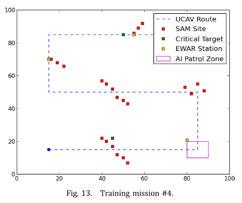

#### 5.1.5 任务5
与任务4差不多，但是导弹站分布更广。每组距离大为了保证LWS容量。
最低的路径对系统的压力最小，中间的路径包含AI区域，而上方的路径则完全无需通信即可处理。
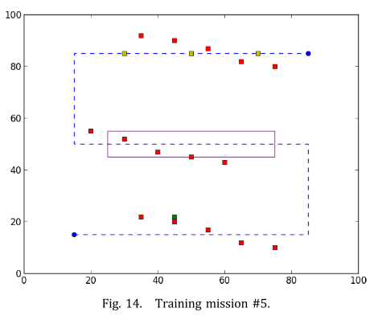

#### 5.1.6 任务6
配备SDM，最艰巨的任务；有EWAR、导弹多、时间短。 
底部是唯一可以用满容量LWS的。
该任务主要集中在优化GFT的无通信分支上。
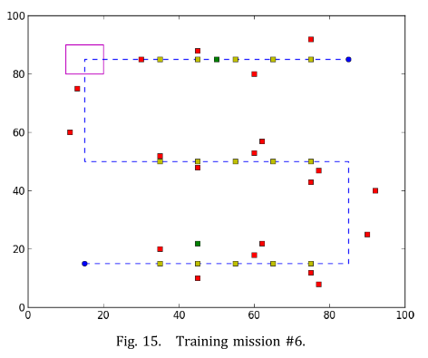

#### 5.1.7 训练设置
每一个任务训练60代，确定最少的初始SDM数量
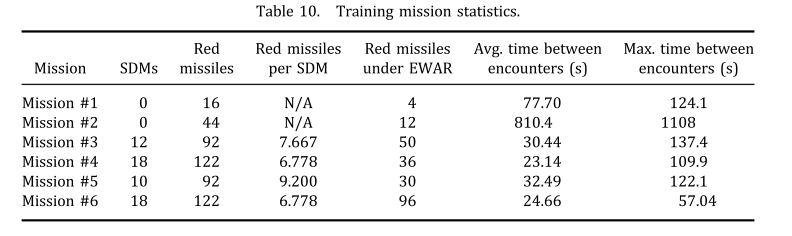

#### 5.1.8 训练结果
训练80代，每代5%的最优加入bank，运行30.47h，共得44个string。
为什么只有44代产生了符合bank要求的string：GA算法在局部最优解剧烈改变。
这44个string，每个都执行40次，取6个任务的平均总分数。
最好的是第32个串，在53代产生，在40次迭代中，只有少数几个字符串能够实现非常高的性能。 为了使分数更清晰，在训练过程中，第67代琴弦获得了最高的总分数，分数为2358.0。
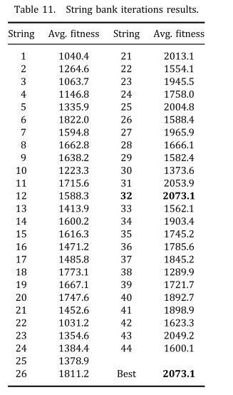

**任务2为了在失败中学习， 这个任务是对附加条件的惩罚，否则在其他五个训练任务中会得到更高的分数，但如果出现可怕的情况，绝对无法处理**

最好的串的表现
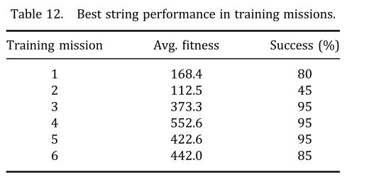
正如前面所讨论的，训练任务#2中的性能相当差，大多数运行都会导致失败。然而，所有使用SDMs的任务都以80%以上的要求完成。这种困难训练的有效性将在下列实地特派团中得到证明。

### 5.2 实时任务
12个实时任务，具有不同的参数。
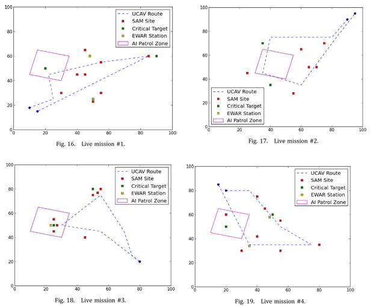
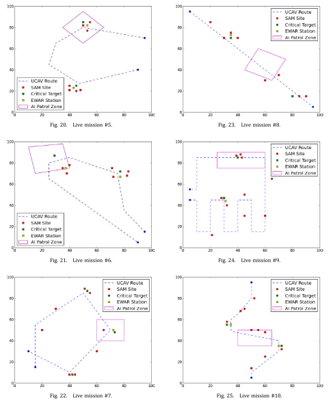
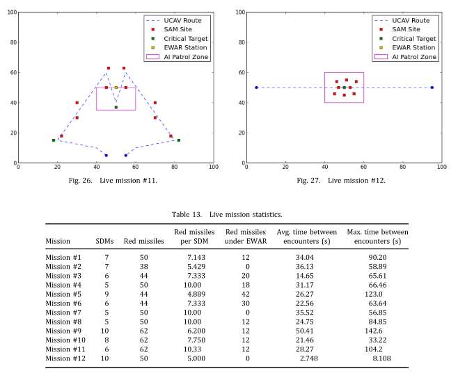

### 5.3 结果
- 每个任务超过100次迭代
- 再次重要的是要注意，所得的模糊树后训练是确定性的，并且性能上的差异是由于任务内部的不确定性和随机性造成的
- 训练后的FT控制器，完成平均长度的任务的post-training需要3.273秒
-  平均而言，对于单个UCAV而言，确定一枚导弹的最佳计数器仅需6.842 ms
- 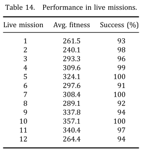


## 结论
- 计算性能好，只用448长的string，可用于复杂任务。
- 六个训练任务，每个关注GFT的一个部分，然后在12个实时任务中测试；
- 未来工作：蓝方无人战斗系统的导航控制，红方可用不同武器类型，增加蓝方编队数量、任意数量的无人战斗系统的规模。
- 由于不需要对输入数据进行筛选、映射或统计建模，以及这种方法的可扩展性，GFT适用于非常广泛的问题。
- 该技术能适应新的情况，对不确定性和随机性有很强的适应性。