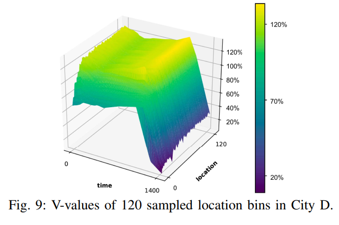

# 2. 派单-DRL-with-knowledge-transger

paper: [Deep Reinforcement Learning with Knowledge Transfer for Online Rides Order Dispatching](https://ieeexplore.ieee.org/document/8594886)

核心思想:

- 将派单问题建模为 MDP, 使用带动作搜索的 DQN 方法进行优化.
- 大规模调度问题需要支持大量不同供需关系的地位位置. 为了提升算法适应性和效率, 提出一种**相关特征渐进迁移**的迁移学习方法, 同时使用两种已有方法同时在时域和空间域进行迁移.
- 实验证明了方法的最优性; 同时发现带迁移学习的方法 (不同城市之间知识迁移或者同时城市内不同时间/空间的知识迁移) 比不带知识迁移的方法好.

# 1 Introduction

派单两方面问题:

- 提升派单效率. 以前方法关注派单的距离和接客时间成本[7], 或者通过组合优化方法提升匹配的准确率[8], 或者为了提升收入使用 RL 方法辅助决策巡航路线[10]. [10]中的 RL 方法利用历史轨迹信息, 可以提升巡航效率, 但是只考虑空车的位置状态, 而没考虑接客之后司机位置变化情况, 因此如果数据集只有空车巡航信息, 仍然限制了全局优化性能.
- 扩展性. 城市之间的扩展. 虽然不同城市应该用不同模型, 但是还是有一些共同知识可以共享, 比如高峰时段交通需求. 因此可以使用迁移学习迁移知识.

本文, **从单个司机视角建模**, 司机被分配到一系列出行请求, 目标为最大化整天收入. [20]通过学习和规划的方法已经验证了这种方法的有效性. [20]的缺陷有三方面: 1) 状态价值随不同的实时因素变化巨大, 比如供需关系, 但是这种上下文信息对于表格方法很难解决. 换句话说, 智能体必须学习历史数据之外的信息. 2) 不同城市的 MDPs 有很多公用的结构. 但是表格方法对每个 mdp 单独对待, 无法进行知识迁移. 3) 策略提升是一个单独的步骤, 至少需要在线执行一天. 为了收敛,必须进行重复进行 evaluation-improvement 的迭代, 需要好几周时间. 因此需要采用 off-policy 方法进行优化.

本文使用具有动作搜索能力的 DQN 方法. 关键是如何评估每一步司机的 Q 值. 使用 DQN 可以结合历史数据和多种辅助数据, 也可以跨多个城市加速学习. 通过迁移学习可以加速前期策略学习. 好处: 加速开始阶段学习, 收敛速度快, 收敛性能更高.

# 2 MDP

建模方法与[20]一样, 只不过包含更多的上下文信息. 智能体以司机视角定义. 一个 transition 可以是司机接单行程或者空车移动行程. 空车移动的奖励为 0.

- 状态: $$s:=(l,t)$$, 包括 GPS 坐标对和一天中时间(秒). 还包括一些静态的供应/需求/(l,t)附近订单完成情况等信息, 记为$$f$$. 此时状态 s 变为$$(l,t,f)$$. 此外, 时间还对周末和工作日进行区分.
- 动作: 将某个订单指派给该司机, 用行程终点和时间表示. 设当前状态为$$s_0 := (l_0, t_0, f_0)$$, 下一状态$$s_1 := (l_1, t_1, f_1)$$为在终点放下乘客的位置/时间和上下文信息. 此时, 动作即为$$a=(l_1,t_1)$$
- 奖励: r 为行程费用
- 一个 episode 为完整的一天, 从 0:00 到 23:59, 设置所有 transition 中过了午夜的 trip $$s_1$$为终止状态.
- 状态动作价值 Q: 期望累积回报, 与原来定义相同. **文中将时间离散化为 10 分钟一个时间步.**
- 策略:
- 状态价值 V:

# 3 DQN with action search

本文任务为连续动作空间, 所以将状态和动作都作为网络输入, 输出单一 Q 值.

由于本文形式化的 MDP 为连续动作空间, 所以本文使用一种动作搜索技术, 为每个 transition 定义一个离散的动作空间.

使用 double-DQN 算法. loss 如下

#### A 模型训练

建立城市规模的派单模拟器很困难,所以使用历史出行数据进行训练. 用现有的行为策略生成历史出行数据, 进行训练, 并用简单的合成数据进行增强.

每一次行程$$x$$定义了一个智能体状态的 transition $$(s_0, a,r,s_1)$$. 这些 transition 从数仓中检索得到(类似于从模拟器中得到), 并存进 replay buffer 中, 进行后续的训练.

#### B Action search

第 2 节中定义的 MDP 中, GPS 坐标和时间都是连续的, 导致 DQN 算法求 max 操作无法完成. 同时变量$$t$$和$$l$$具有相关性, 因为时刻差也反映了行程的持续时间. 因此随机采样方法也不适用.

因此本文构造一个近似的可行动作空间$$\tilde{A}(s)$$来计算. 该符号明确了动作空间在开始搜索的状态 s 上的依赖关系. 我们不搜索整个可行动作空间, 而是搜索 s 附近的历史行程.

**B 的意思是 s 能够落进的六角格区域**

使用六角格将空间离散化, 每个六角格用中心坐标表示. $$x_{s_0}, x_{s_1}$$为行程 transition x 中的$$s_0, s_1$$部分. 搜索空间越大, 计算需求越大. 本文将动作搜索空间可行动作数量设为一个可调节的参数, 然后进行 **无放回随机采样.** 在策略评估时, 使用司机全天的历史轨迹, 并使用同样的搜索处理方法,

#### C. Expanded action search

由于训练数据稀疏, 比如早晨偏远地区可能无数据, 导致上述动作搜索返回空集, 因此本部分在**时间和空间**上都进行 expanded action search.

第一个搜索方向为, 保持在最后一次送客的地点, 等一段时间. 相当于保持$$s_l$$分量, $$s_t$$分量变化, 直到达到以下任意状态($$s'$$为搜索到的状态):

第二次搜索为空间上的扩展, 即按层对六角格邻域进行搜索. 考虑到车从 s 开到邻域六角格的时间, 每一层 L 进行搜的时候按照一定时间间隔进行, 该间隔使用到达时间预估 (ETA) 方法进行计算.

邻域用$$B(s,L)$$表示. 当$$\tilde{A}(s,L)$$非空的时候就返回, 并停止增加 L 大小. 否则返回$$B(s, L_{max})$$. $$L_{max}$$即控制了动作空间的大小. 该过程可以看作司机不接客时的等待时间或者空车引导过程.

#### D. Terminal state values

终止状态的 Q 值接近 0. 本文在训练早期, 在 buffer 中添加一个含有$$s_1$$终止状态的 transitions. 缓解随机采样 minibatch 导致终止状态没有足够监督信号进行训练的问题.

#### E. Experience augmentation

原始训练数据通过给定历史策略生成的, 探索性不足. 尤其是司机在出行数据很少的地点, 动作搜索策略可能需要司机等待很久或者空车巡航很远. 因此如果使用原始出行数据, 在稀疏的状态下很难学习有效策略.

本文使用在动作搜索过程中得到的数据对训练数据进行扩充.

#### F. Evaluating $$Q^\pi$$

为了计算给定状态下司机行为的平均价值, 本文对 Q 值做平均. 把公式(2)中的"argmax"函数替换为"mean".

#### G. Deployment in multi-driver dispatching environment

在一个短的窗口期, 向一个司机集合分配订单, 最大化总的 Q 值.

matching 部分可以使用标准匹配算法, 比如 KM 算法. 之后使用 single-driver 的值函数计算 KM 算法二部图的边权.　此派单策略称为　**collectively greedy w.r.t. Q**

#### H. State values (V -values) in tabular form

在[20]中, 表格形式下的状态价值 V 用于计算相应的边权, $$x=(s,a,r,s')$$, 其中 $$s$$ 和 $$s'$$ 没有上下文信息.

本文可以直接使用该框架. 可以通过如下过程从学到的 Q 函数得到表格的 V 函数: 对于每一个时空 cell $$B(s)$$, 其中心为 s, $$V^*(B(s)):=max_{a\in \tilde{A}} Q^*(s,a)$$, 其中$$Q^*$$从算法 III-2 学到; $$V^\pi (B(s)) := mean_{a\in \tilde{A}}Q^\pi (s,a)$$, 其中 $$Q^\pi$$ 从 III-F 学到,

## 4 Multi-City transfer

一个模型适应所有城市, 或者每个城市使用单独的派单模型, 计算量都很大. 迁移之前模型的知识可以有效减少训练新城市模型的计算量. 另外, 由于 DL 非凸性质, 导致次优解, 如果训练时有一个比较好的初始点或者更好的梯度方向, 会有更高的收敛速度.

使用函数近似的方法, 比如 DQN, 方便使用迁移学习; 但是表格型的方法没有函数逼近, 学到的策略很独立, 无法使用知识迁移.

本文使用三种方法将知识迁移到目标城市: fine-tuning, 渐进网络(progressive network), 相关特征渐进迁移 (correlated-feature progressive transfer, CFPT). 共同思想都是利用训练好的源城市模型的参数权重.

#### Fine-tuning

正常用源网络参数初始化进行训练.

#### Progressive network

使用侧边连接的目标网络.

将 source 网络参数冻结.

#### CFPT-相关特征渐进迁移

由于状态空间的多样性, 不是状态中的所有元素都适合迁移知识, 因此为 source city 训练一个并行的渐进结构, 如图 4 所示, 其中连接结构与公式(6)相同.
网络输入分为两部分: s 代表元素直观上不适合进行迁移, f 表示适合迁移.
在训练的时候, source city 的所有权重都是可训练的, target city 的网络结构与 source 相同, 但是只重用图 4 中绿色块表示的渐进部分, 该部分直接使用 f 作为输入.
CFPT 的主要创新点为: 在 source city 训练阶段, 将网络分为并行的流, 下面的流(为了特征迁移)只考虑 f 作为输入. 同层的神经元数量是原始的一半, 将会大大减少总的训练参数.

本文将相关特征定义为$$f$$, 是时空位移向量和实时上下文信息的拼接向量. 如第二节所述, 时空位移向量通过$$(s_1-s_0)$$计算的三元组, 上下文信息是 5 元组, 包括实时空车数量 / 前一分钟内的实时订单数量等. 与 GPS 坐标相比, 上述相关特征与派单供需和完成率等的统计信息相关, 可以在不同城市间迁移.

注意, $$s=(s_0, s_1)$$已经包含了动作输入(行程目的地).

## 5 实验

使用滴滴快车数据, 2/3 训练集, 1/3 测试集. minibatch 可以看作 Q 函数中的样本点集. $$\gamma = 0.9$$. replay buffer =100000. 对状态向量进行标准化.

- 训练结果 使用 1000 个 episodes 的滑动窗口计算回报曲线, 总的训练周期是 40000 episodes.
- 测试结果, 在训练过程中设置 5 个测试点, 0%, 25%, 50%, 75%, 100%. 每个测试点, 对当前网络的 snapshot 使用 100 个随机初始化状态的 episodes 进行 5 次评估.

#### A. Single-agent evaluation environment

从过去的行程数据(测试集)构建了一个 Single-agent evaluation environment, 以便对从学习到的价值函数生成的策略进行直接和明确的评估。

- 假设司机放下一个乘客之后, 将会得到目的地附近的新的请求, 通过 III-C 中的搜索策略可以覆盖没有历史数据的区域. 下一次移动位置由给定 action search 输出的策略选择, 可以是载客行程或者等待/重定位. reward 为行程收入或者 0.
- 将该过程模拟多个 episodes (days), 计算平均的累积奖励.
- 画训练曲线: 按照训练速度, 使用学习的 Q 函数的贪婪策略得到奖励值, 归一化并画曲线.
- 图 5 说明, 使用上下文特征对训练有利. 后续使用都是用上下文特征.

#### B. Baselines DQN training

使用算法 III-2 作为 baseline 方法, 使用 III-F 中的策略评估方法评估.

- 其中 DQN 算法目标是最大化累积奖励;
- policy evaluation 仅仅为了学习评估第 5-A 中生成历史数据的当前策略
- 如图 7 所示, 算法 III-2 可以学会最优订单收入.

图 8 表明 average Q values 策略可以收敛.

计算了 III-H 中的表格型状态价值函数. 根据 time id 在图 9 中画了 120 个随机采样的局部 cells. 每个点表示了潜在的 0.9 折扣下的未来奖励. 可以看到学会了不同城市, 时序上的值函数趋势.

另外, 从图 6 中可以看出, 小城市(如 B)中 DQN 算法对订单的提升比大城市(如 D)小, 因为订单量大.

#### C. Transfer improvements

时序迁移, 前一个月作为源域数据, 后一个月作为目标;
空间迁移, A 作为源城市, B/C/D 作为目标城市.

知识迁移之后, 初始性能更好, 学习效率更好, 收敛性更好. 知识迁移可以更好地引导梯度方向.

## 6 结论

与动作枚举方法不同, 本文将连续动作空间作为状态输入的一部分, 并提出一种动作搜索方法将连续动作离散化.

本文方法从单个司机视角, 可以最优化时空调度问题. 并且知识可以进行时序或空间上的迁移.

之后可以使用 MARL 克服静态环境假设. 同时, 使用一个中心化策略学习全局值函数.
