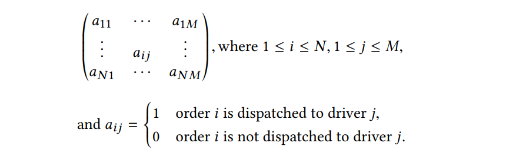
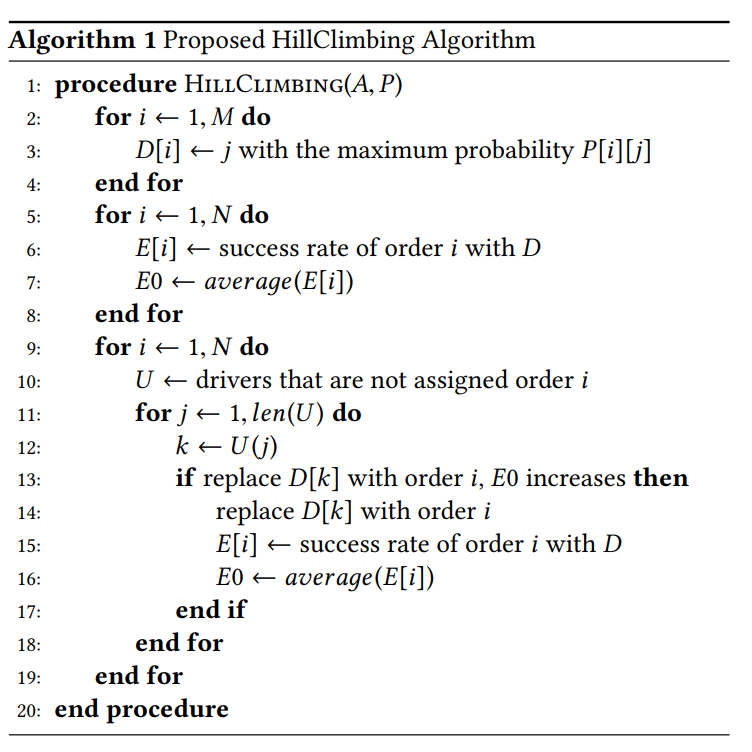
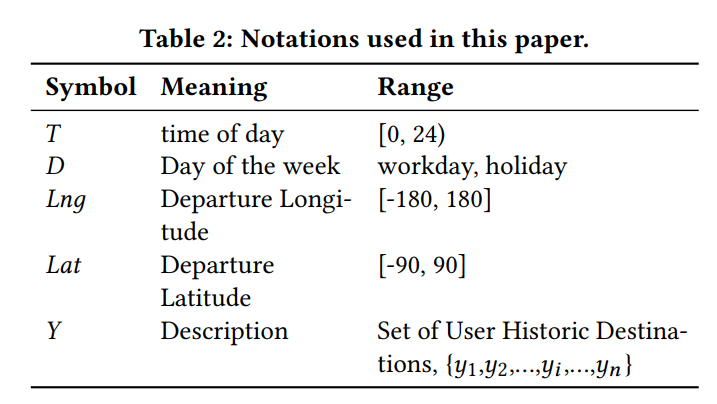
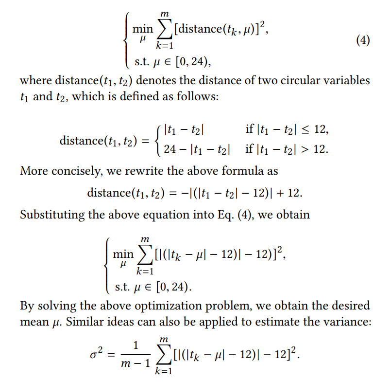
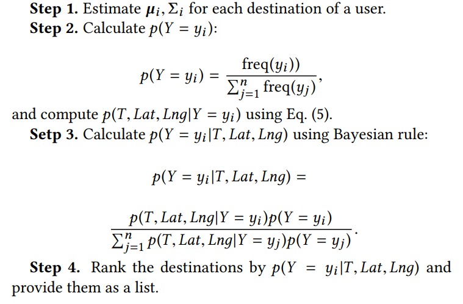

# 2. 派单-滴滴 KDD17

paper: [A Taxi Order Dispatch Model based On Combinatorial Optimization]()

传统派单系统按顺序将出租车分配给乘客, 最大化司机对单一订单的接受率. 但是会影响全局的订单成功率.
本文: 同时服务多个订单, 最大化全局订单的成功率. 为了进一步提升用户体验, 在用户打开软件时对目的地进行预测, 预测模型基于用户历史出行数据, 使用贝叶斯框架建模用户目的地的分布.

优势: 提升全局成功率, 减少用户等待时间和接客距离. 目的地预测算法将 top-3 准确率从 89%提升到 93%.

## 1. Introduction

之前派单工作关注寻找最近的司机或用时最短的送客路径. 这类方法按顺序把订单分配给最近的司机, 不考虑司机是否有更合适的订单. 因此无法保证全局的送客时间最短.

NTuCab 通过多智能体框架, 最小化全局的等待时间或接客距离. 该方法把每个智能体看作独立的计算单元, 每个单元处理 N 个司机/订单对, 每个订单只分配给一个司机, 除非该司机拒接该单.

上述方法的缺点是派单时间长, 成功率低. 滴滴这种大体量的派单系统, 总的订单成功率是重要指标.

本文提出一种组合优化模型处理上述问题. 将一个订单派给多个司机, 第一个接单的司机得到该订单; 目标是最大化接单成功率. 如果没有司机接单, 就进行下一次循环, 直到订单取消.

订单: (出发时间, 出发位置, 目的地). 一半以订单时间为出发时间. 另外对目的地进行预测可以提升用户体验.

文献[20]使用 MLP, 基于用户初始轨迹/司机 id/出行时间等信息, 进行预测. 有效果, 但是对用户初始轨迹依赖严重; 文献[4]利用司机出行数据训练 HMM 模型, 但是将时间划分为主观的片段, 如上午/中午/晚上等, 破坏了时间的连续性.

对于目的地预测, 需要在用户打开 app 是进行, 但是历史数据很难立刻获取, 且就算给出了确切目的地, 如果用户不熟悉, 也会自己手动输入. 因此, 本文预测的目的地候选集合为用户历史出行点. 另外用户使用频率分布很不均匀, 频繁的每天打开一次, 不频繁的一年不超过 10 次, 从稀疏数据进行预测也是一大挑战.
本文基于分析观察到的结论, 提出一种贝叶斯方法, 考虑出行经纬度/时间的三值高斯分布, 利用个人出行数据进行训练. 然后给出目的地 rank 列表.

## 2 派单系统

目标, 最大化全局订单的成功率 $$E_{SR}$$
订单分配矩阵, 设 N 个订单, M 个司机, 则分配矩阵为,

其中, 一个司机每一轮只能服务一个订单, 而一个订单能分给多个司机, 因此, 每一竖列和最大为 1, 即 $$\forall j, \sum_{i=1}^{N} a_{ij}\le 1$$

预估每个司机对订单的接受概率很重要, 即预估上面的矩阵. 因此使用两个模型, 一个用于预测单个司机对单个订单的接受概率, 第二个模型利用估计的概率解组合优化问题来最大化$$E_{SR}$$.

### 2.1 司机行为预估模型

司机行为为 0/1 二值, 服从 iid 假设.
$$p_{ij}$$表示订单$$o_i$$被司机$$d_j$$接受的概率. 影响因素包括: 价格/司机距离/方向等, 用向量$$x_{ij}$$表示. 我们估计给定 x 下 p 的概率, 形式化为二分类问题.

$$p_{ij}=p(y=1| x_{ij})$$

本文训练了 GBDT 和 LR 两个模型. 训练评估指标使用 ACC/AUC 等. 由于 LR 模型准确率高一些, 所以本文使用 LR 模型. 则

$$
p_{ij} = p(y=1|o_i,d_j) = \frac{1}{exp(-w^tx_{ij})}
$$

模型使用 SGD 训练. 预测模型考虑因素包括:

- Order-Driver related features: 接客距离, 订单广播给司机的数量, 订单位置在司机前方还是后方
- Order related features: 起点和终点的距离和 ETA, 终点类别(机场/医院/学校/商业街), 交通情况, 目的地的历史订单情况.
- Driver related features: 长期行为(历史接单率/活动区域/不同订单距离的表现), 短期兴趣(最近订单是否被接受等)
- 补充特征: 星期几, 时间附近订单数和司机数

### 2.2 组合优化模型

由于一个订单会被分给多个司机, 因此订单$$o_i$$的接受率如下:

$$
E_i = 1-\Pi_{j=1}^{M}(1-p_{ij})^{a_{ij}}
$$

由于每个司机最多只能接受一个订单, 因此总的优化问题如下:

$$
\begin{array}{ll}
\max_{a_{i j}} & E_{SR}=\frac{
    \sum_{i=1}^{N}\left[
        1-\prod_{j=1}^{M}(1-p_{i j})^{a_{i j}}
    \right]
}
{N} \\
\text { s.t. }  & \sum_{i=1}^{N} a_{i j} \leq 1, \forall j\\
      & a_{i j} \in\{0,1\}
\end{array}
$$

这是一个 NP-Hard 问题, 一般使用启发式方法求解, 比如爬山法/遗传算法/模拟退火算法等. 本文使用爬山法:

## 3 目的地预测模型

从观察中得到的几个结论:

1. 同一个用户在相似的时间倾向于去同一个目的地. 即, 出发时间是最重要的预测因素, 其次是出发地点. 日期模式(工作日/周末)可以将数据分为两组. 工作日主要是家和公司, 周末主要是商场或娱乐场所.
2. 同一个用户常去固定的目的地集合, 除非就医等偶然因素.
3. 订单位置为目的地预测提供了重要信息.
4. 其他信息, 如司机信息/交通状况/行驶速度等与目的地也有微弱联系.

基于此提出一种基于贝叶斯规则的模型.

### 3.1 模型描述

模型目标是建模某用户目的地的分布, 用到的术语如下:

用贝叶斯规则描述的条件概率如下:

$$
p\left(Y=y_{i} \mid X\right)=\frac{p\left(X \mid Y=y_{i}\right) p\left(Y=y_{i}\right)}{\sum_{j=1}^{n} p\left(X \mid Y=y_{j}\right) p\left(Y=y_{j}\right)}
$$

其中$$X=(T, Lng, Lat)$$. 使用用户历史数据估计 p:

$$
p(Y=y_i)=\frac{freq(y_i)}{\sum_{j=1}^{n}freq(y_j)}
$$

下一个问题就是估计出行时间和位置的联合概率: $$p(T,Lng,Lat|Y=y_i)$$. 下面一步步给出, 首先看关于时间的$$p(T|Y=y_i)$$

### 3.2 关于出行时间的条件概率分布

使用高斯分布拟合用户到某个目的地一天中不同时间的频率分布. 类似上图,

$$
T|Y=y_i \sim N(\mu_i, \sigma^2_i)
$$

因为时间是循环变量, 所以均值和方差不能用传统方法进行估计. 计算循环变量均值的方法是将变量转为单位向量, 然后计算单位向量的均值, 之后转换回原始表示. 设时间为$$t_1, t_2, ...,t_m$$, 则

$$
\mu=\frac{24}{2 \pi} \cdot \arctan \left[\frac{1}{m} \sum_{k=1}^{m} \sin \left(\frac{2 \pi}{24} \cdot t_{k}\right), \frac{1}{m} \sum_{k=1}^{m} \cos \left(\frac{2 \pi}{24} \cdot t_{k}\right)\right]
$$

但是该方法存在偏差, 且有些例子不能计算.因此本文提出一种新的方法计算任意循环变量的均值. 该方法由以下观察得到: ==均值到所有变量值的距离和最短==. 出行时间的均值可以通过求解如下二次规划问题得到:

### 3.3 出行时间/经度/维度, 联合条件概率求解

只用出行时间预测目的地就比较准了. 但是有些状况还是需要其他变量, 比如有些用户目的地的分布重合性很大, 就没法从时间给出合适的目的地. 因此需要经纬度等其他信息.

通过分析出行时间/经度/维度三种元素的散点图, 假定符合 3 维高斯分布.

$$
Lng, Lat, T|Y=y_i \sim N_3(\mu_i, \Sigma_i) \quad\quad\quad\quad ...(5)
$$

首先用统计检验方法 配合度检验(goodness of fit test)验证数据正态分布性. 由于三个值都是循环变量, 因此使用上述二次规划方法计算均值和协方差矩阵.

### 3.4 完整步骤

## 4 实验

### 4.1 派单系统

评估指标:
|指标|英文|中文|
|:-:|:-:|:-:|
|SR|Percentage of served calls (Success Rate)| 总体订单成功率|
|APT|Averaged pick up time|订单从接受到乘客上车的时间|
|ADT|Averaged dispatch time|平均接单时间|
|CR|Percentage of cancelled calls (Cancellation Rate)|订单取消率|
|FU|Average total number of calls served by each cab (Fleet Utilization)|平均每辆车服务订单次数(车队利用率)|

对比方法:

- 一种是将订单分配给一个最合适的司机[3,10]. 通过最短驾驶时间计算和 A\*最短路径方法, 提出一种基于学习的排序模型. 根据排序分数分配.
- 一种是一个订单给多个司机, 优化整体等待时间. [19]提出的一种基于多智能体的订单分配系统, 整体等待时间较少.

**其他部分不详述了**

## 5 结论

本文将派单问题形式化为一个组合优化问题, 其中重要的一环是使用 LR 模型预估订单接受率. 之后提出一种贝叶斯模型预测目的地.

下一步工作:

- 解决非凸问题导致的次优解. 计划找到一个凸的代理函数(convex surrogate), 进行快速求解.
- 优化目的地预测方法.
