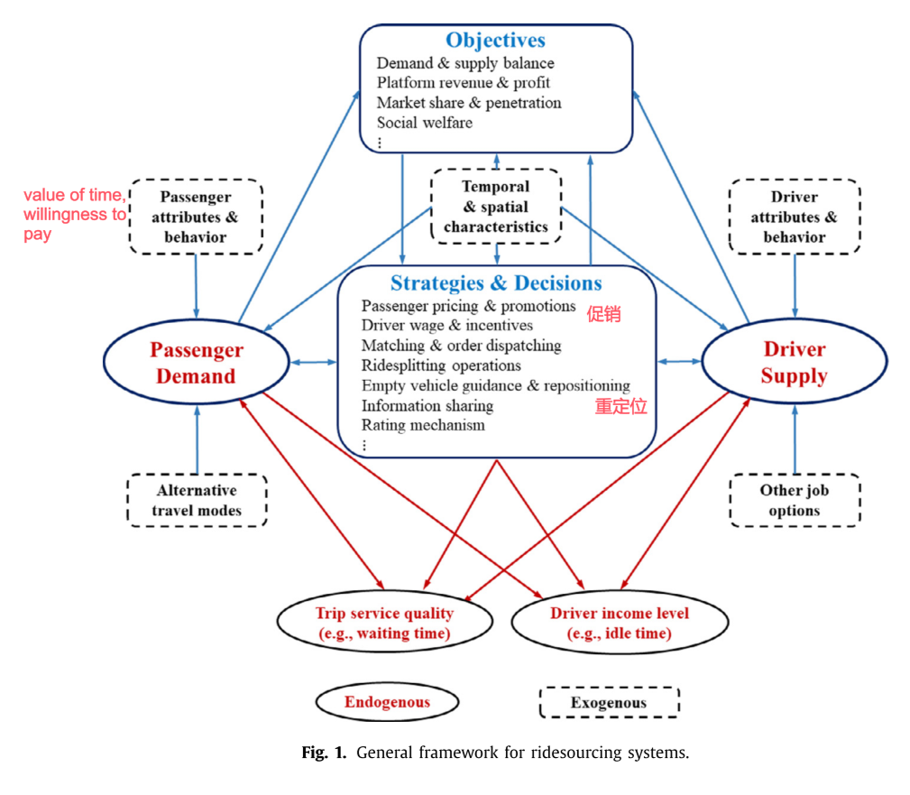

# 2. Ridesourcing systems: A framework and review

paper: [Ridesourcing systems: A framework and review](https://ink.library.smu.edu.sg/sis_research/4514/)

提出一种描述网约车服务系统的通用框架. 帮助理解内生和外生变量的关系. 思考角度:(1)需求和定价,(2)供应和激励, (3)平台运营, (4)竞争,影响和法规.

## Introduction

共享经济,指个体或者小团体可以作为买/卖方进行高效交互的在线平台,或者一种允许共享商品和服务的市场模式. 网约车公司被视为先驱.

之后介绍网约车公司运行模式. 司乘的供需关系, 匹配, 派单, 收费和佣金比例, 评价等.

网约车平台市场模式: 司乘双边市场. 双边市场为终端用户之间的互动提供了一个平台, 并通过向每一方适当收费来调整双方的关系. 数学形式为, 每一次交互过程向 buyer 和 seller 收取$$a^b$$和$$a^s$$的费用.

- 如果平台上实现的交易量$$V$$仅取决于总价水平$$a = a^b + a^s$$，即对买卖双方对总价$$a$$的再分配不敏感，则双方互动的市场是单边的。
- 而如果总价$$a$$不变, 交易量$$V$$随不同的 $$a^b$$和$$a^s$$变化, 则市场称为双边的.

在网约车平台, 供需受双边的价格($$a^b$$和$$-a^s$$)影响很大, 所以该市场是双边的. 此时的交易量$$V$$就是订单成交量. 该过程对运营策略影响很大, 一般根据平台表现(收入, 订单数量, 市场份额, 利润)或者社会福利(乘客福利, 司机收入等) 调整策略, 比如动态定价或者增量定价.

对比了传统出租车行业的特点. 雇员, 需要执照, 车费由监管机构定或者公司自己定.

而网约车, 监管少, 时间灵活, 乘客主叫. 引起争议的点: 无雇佣关系, 税收灰色区域, 监管不明确, 平台利益与公众利于冲突, 峰时定价高问题.

本文: 提出一种描述网约车服务系统的通用框架, 从四个方面总结网约车系统的重要问题和解决思路.

名词解释:

- ridesourcing, ridehailing, transportation network companies (TNC). 正常网约车, 本文重点关注.
- ridesharing, 顺风车
- ridesplitting, 拼车

## 2 A general framework

提出一个通用网约车描述框架, 总结了重要的研究问题和相关的方法.

首先讲运营目标. 为了实现这些目标需要指定灵活的运营策略.

讲了司机和乘客在供需两端的特征. 如需求端的乘客的等待时间, 时间价值, 支付意愿等; 供给端司机的油耗顾虑, 收入, 换工作意愿等. 为了捕获这些特征, 平台通常使用对空间进行网格化, 时间进行离散化, 之后预估网格内或时间间隔内的局部供需关系,指定运营策略.

之后讲了网约车系统中, 供需双方的冲突. 比如乘客想要车多,但会降低司机收入; 车少了司机收入高, 乘客体验差, 但是车会变多, 供给增加, 等等. 以及这些因素如何影响平台指定运营策略.

#### 需要研究的问题

需求侧:

1. 时空需求估计
2. 乘车模式选择
3. 静态或动态定价算法
4. 促销计划

供给端:

1. 短期或长期服务能力的司机供给模型.
2. 司机关于工资和激励的供给弹性
3. 其他司机行为
4. 动态或静态工资激励算法

平台方:

1. 接/送　时间预估(estimated time of arrival, ETA)
2. 司乘匹配和调度算法
3. 拼车相关的费用分担和人员分配
4. 空车引导和重定位
5. 信息共享和公开
6. 排序机制

城市交通系统管理部门:

1. 平台竞争，
2. 对其他交通服务的影响，
3. 社会和环境影响，
4. 相关的政府法规和政策。

上述问题设计宏/微观经济学,博弈论, 机器学习, 随机过程等学科.

## 3 Demand and pricing

目前一些研究关于网约车需求的结论：

- 受过高等教育的年轻人
- 长途商务旅行较多的乘客
- 交通相关手机应用使用频繁的用户
- 环保意识、技术包容性、寻求多样性更加开放的用户
- 社交和休闲旅游、工作旅行

### 3.1. 时空需求估计

智能手机之前就有很多工作关于交通 origindestination (OD) flow 预估。比如基于动力学、几何分布、最小二乘、准动态估计、线性分配矩阵逼近、扩展准动态估计、基于仿真的优化方法等。
但是 OD 估计不能直接用来预估需求。

时空需求分析对网约车设计和运营很重要。空间提供需求的冷热区域信息、时间给出高峰、非高峰的时间相关模式信息。
最忌使用机器学习方法的预测技术，使用土地利用信息、城市配置等宏观数据、乘客人口统计信息、实时天气信息、实时交通状况等进行预测。

- 一种短期需求的时空估计，假设需求是与乘车服务系统的交通、定价和天气条件相关的变量的函数。使用单一决策树、引导聚合决策树、随机森林、DNN 等逼近该函数
- the fusion convolutional long short-term memory network (FCL-Net)
- deep multi-view spatio-temporal network (DMVST-Net) framework. 该模型由三个视图组成：使用 LSTM 对未来需求值和近时间点之间的相关性进行建模的时间视图，使用 local CNN 对局部空间相关性建模的空间视图，以及共享相似时序模式的区域之间相关性的语义视图。
- deep supply-demand (DeepSD). 使用深度神经网络结构来预测未来几分钟内特定区域的供需差距.
- hexagon-based convolutional neural network (H-CNN). 将城市划分为规则的六边形格子，并提出了一种基于六边形的卷积神经网络（H-CNN）来预测乘车服务中的短期供需缺口。

未来主要研究短期需求/短期时空定价/长期定价策略等方面.

### 3.2. 乘车模式选择

乘客不仅要选择网约车平台,还要选择特定的服务类型. 比如豪华型/拼车/顺风车等. 也是一种预测问题.

### 3.3. 静态或动态定价算法

经济学中一些双边市场的定价策略. 一些名词:

- price, 价格, 乘客付的钱
- wage, 工资, 平台给司机的钱
- commission, 佣金, 平台抽取的差价.

将 price/wage/commission 三者的优化问题,称为定价问题. 定价问题具有很强的空间分割和时序模式.

- 排队模型(queueing model), 随着需求增加、容量减少或乘客对等待时间变得更加敏感，平台应使用较低的佣金比率。相反，当司机数量和乘客需求以大致相同的速度增长时，它应该增加佣金比例。
- ....
- 动态定价不一定静态定价提供更多的利润.
- 可以通过不同地区的价格抑制, 可能比奖金激励更有效地让司机离开车辆过多的区域, 或者缓解拥堵. 拼车定价的另一个重要特点是空间价格分割，即在不同区域设置不同的价格，以平衡空间维度的供需.
- 定价问题的另一个特点是需求与价格很相关. 相对于出租车, 消费者对价格变化更敏感.

### 3.4. 促销计划

常用的促销方式: 忠诚度奖励(用得越多越优惠)/ 推荐奖励/ 不良体验的赔偿/ 优惠票价/ 绑定套餐等

## 4 Supply and incentives

供给侧会影响交易量/服务水平/价格等.

### 4.1. 短期或长期服务能力的司机供给模型.

网约车平台一大优势是灵活性. 司机可以有全职工作, 也可以专职开网约车. 但这种灵活性也有问题, 比如农村地区车辆少.

网约车平台需要考虑司机每天是否工作, 如果工作,那何时工作以及工作时间长短, 都决定了供应量. 文献中的许多工作都集中在广泛的边际上，即司机参与平台的决定。

司机在拼车平台上的服务供给因短期和长期行为而异，这可能导致短期激励计划的设计与长期工资合同的设计存在根本差异。这是未来研究的一个重要领域。其他研究方向包括捕捉驾驶员在一天时间内和城市内空间的工作决策的模型，以及相应的时空服务供应模式。乘车平台上的综合决策模型和理论以及全职工作和兼职服务供应的调度也是有趣的研究课题。

### 4.2. 司机关于工资和激励的供给弹性

小时收入率（即工资率）等因素会影响司机参与的决定以及他们对工作时间的决定，因此评估小时收入率对服务供应的影响至关重要。目前对供给弹性的研究理论:

- 工作时间作为劳动力供应的衡量标准，并将所有司机的平均小时收入作为个人司机收入率的工具变量. 一些司机是非理性的, 在工资低于平时的情况下工作更长时间，而在支付更多费用时工作时间会更短. 收入目标行为（如果存在）往往会在某些小时收入率范围内产生负弹性，并破坏动态定价/工资或其他激励措施的作用。
- 使用工作时间作为劳动力供应的衡量标准，并将所有司机的平均小时收入作为个体司机收入率的工具变量. 发现司机是理性的决策者，通常在收入较高时工作时间更长，这提供了正弹性, 与上述结论相反.

一般来说，收入目标行为可能会破坏新兴共享经济或按需经济市场的好处，在这些市场中，任务通常是动态定价的。 在拼车系统的不同背景下，对短期和长期供应弹性的计量经济学模型、分析和估计很重要； 减轻服务供应弹性模型中的内生性偏差仍需要研究； 需要更多的随机对照试验。 此外，时间范围的影响——例如，每小时、每天和每月的司机决策——对收入目标和供应弹性的影响将是未来研究的有趣和具有挑战性的主题。

### 4.3. 其他司机行为

了解驾驶员行为对于改进拼车系统供应/服务方面的规划和运营非常重要.

- 空车引导/ 重定位/ 信息共享很重要.
- 平台竞争也会影响司机行为和收入
- 此外，许多研究从高度多样化的角度考察了驾驶员的行为. 绕道/偏见/拒载等司机行为.

### 4.4. 动态或静态工资激励算法

- 一些研究只是将工资和补偿集中在供应方面.
- 为了解决供需之间的时空失衡，平台通常有各种形式的时空激励计划。一种常用的时空激励是 Uber 的 Boost 和滴滴的 PanGu: 指定时间段/指定热点区域内的所有行程，成倍提升司机收入。
  - Boost 计划在整个城市的不同区域运行，而驾驶员可以获得多少 Boost 取决于他们开车的时间和地点。
  - 另一种常用的奖励计划是连续奖励或连续旅行奖励。当司机在指定时间内完成指定热点内的多次行程时，他们将获得连续奖励，金额取决于满足特定要求的行程次数。
- 在短短一周的时间内，乘客激励措施比类似的司机激励措施更有效。从长远来看，例如超过三个月，情况正好相反：司机激励比乘客激励更有效。

## 5 Platform operations

## 6 Competition, impacts, and regulations

## 7. Summary
