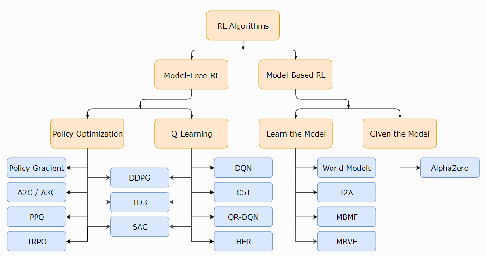

# Meta-RL

## 1 RL分类

|  |
| :------------------------------: |
|               fig                |

- [A2C / A3C](https://arxiv.org/abs/1602.01783) (Asynchronous Advantage Actor-Critic): Mnih et al, 2016
- [PPO](https://arxiv.org/abs/1707.06347) (Proximal Policy Optimization): Schulman et al, 2017 
- [TRPO](https://arxiv.org/abs/1502.05477) (Trust Region Policy Optimization): Schulman et al, 2015
- [DDPG](https://arxiv.org/abs/1509.02971) (Deep Deterministic Policy Gradient): Lillicrap et al, 2015
- [TD3](https://arxiv.org/abs/1802.09477) (Twin Delayed DDPG): Fujimoto et al, 2018
- [SAC](https://arxiv.org/abs/1801.01290) (Soft Actor-Critic): Haarnoja et al, 2018
- [DQN](https://www.cs.toronto.edu/~vmnih/docs/dqn.pdf) (Deep Q-Networks): Mnih et al, 2013
- [C51](https://arxiv.org/abs/1707.06887) (Categorical 51-Atom DQN): Bellemare et al, 2017
- [QR-DQN](https://arxiv.org/abs/1710.10044) (Quantile Regression DQN): Dabney et al, 2017
- [HER](https://arxiv.org/abs/1707.01495) (Hindsight Experience Replay): Andrychowicz et al, 2017
- [World Models.]() Ha and Schmidhuber, 2018
- [I2A](https://arxiv.org/abs/1707.06203) (Imagination-Augmented Agents): Weber et al, 2017 
- [MBMF](https://sites.google.com/view/mbmf) (Model-Based RL with Model-Free Fine-Tuning): Nagabandi et al, 2017 
- [MBVE](https://arxiv.org/abs/1803.00101) (Model-Based Value Expansion): Feinberg et al, 2018
- [AlphaZero](https://arxiv.org/abs/1712.01815): Silver et al, 2017 