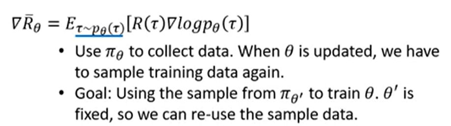

01. 连续动作空间为什么需要策略梯度方法??

在连续动作空间, **贪婪策略提升因为需要在每一步都需要全局最大值**, 所以很困难. 此时经常使用策略梯度方式进行改进, 沿Q值梯度的方向进行提升.

02. VPG,TRPO,PPO等算法使用on-policy, 也就是不适用老样本, 使得样本效率低, 但是这些算法的数学原理比较好, 直接优化策略性能目标函数. 所以更关注稳定性, 而不是样本效率. 他们一系列的改进都是为了提高样本效率. 
03. DDPG->TD3->SAC, 使用off-policy, 这些算法样本效率高, 但是不稳定.
04. 强化学习是什么? 

RL研究通过试错法对智能体进行训练, 通过奖励信号引导智能体, 使其可以重复执行有用的动作, 放弃无用的动作.

05. 为什么Q-learning不稳定? 

[这篇论文](http://web.mit.edu/jnt/www/Papers/J063-97-bvr-td.pdf)还有suttonRLbook11.3节讨论了, function approximation, bootstrapping, off-policy data, 这三者结合造成了值函数学习算法的不稳定性.

06. PPO为什么使用重要性采样? 为什么DQN就可以使用off-policy?

off-policy 在AC架构中不太适用, 因为AC使用off-policy时行动策略会对参数更新产生很大的影响, 如果行动策略对动作有偏向, TD更新时, 目标网络也会有偏向. 如图所示

|  |  |  |
|:---------------------------------------:|:---------------------------------------:|:---------------------------------------:|
|                  fig 3                  |                  fig 3                  |                  fig 3                  |

而重要性采样可以一定程度上缓解这个问题, 用$$P(a)/B(a)$$对TD-error进行加权, 可以缓解TD误差对权重的影响, 如图3.
而DQN可以, 因为更新Q值和策略无关, 从同一个动作出发到达不同状态, 其概率由环境模型决定, 与行动策略无关; 另外DQN的更新是有目标的, 不会让行动策略带跑, 但是PG算法更新时会不断远离原来的策略分布, 所以要把握好远离的次数和比例都得控制好.

07. 使用重要性采样求得的期望和原来的概率分布一样, 但是因为是抽样的, 所以方差会差很多.

|  |  |  |  |
|:---------------------------------------:|:---------------------------------------:|:---------------------------------------:|:---------------------------------------:|
|                  fig 3                  |                  fig 3                  |                  fig 3                  |                  fig 3                  |

所以P和Q不能相差太多.

08. off-policy的PG算法的目标函数推导过程

|  |
|:--------------------------------:|
|                fig               |

09. 策略迭代与值迭代的区别.   

10. 下一步整理, RL基本概念spinningup
11. 下一步即将整理: PG-PPO https://zhuanlan.zhihu.com/p/43114711
