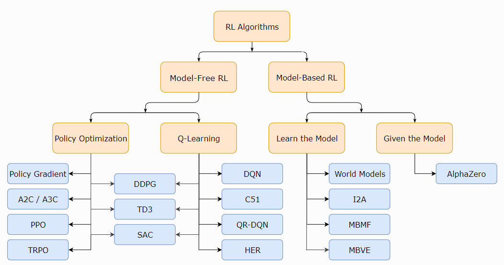

# RL

## 1. 经典概念

### 1.1 概念

- 广义策略迭代: 策略评估与策略改进交替进行;策略评估使用MC或者TD估计action-value函数$$Q^\pi(s,a)$$或者$$Q^\mu(s,a)$$. 策略改进基于(估计的)Q值改进策略.
- 基于模型方法的最典型例子是AlphaZero. 规划算法的样本效率比无模型方法高很多.但是如果学习环境模型特征, 引入的偏差会错误引导算法.
- RL 学习的对象包括, 策略\Q函数\V函数\环境模型
- model-free算法主要方法包括:
  - 策略优化,一般on-policy. 直接优化策略函数. A2C/ A3C(使用梯度上升更新性能函数), PPO(更新surrogate objective function)等. 直接优化性能函数, 更稳定.
  - Q-Learning, 基于贝尔曼最优方程, 一般使用off-policy. DQN, C51. 使用Q函数简介优化目标函数, 不稳定, 但是可以通过重用样本提高数据效率.
  - 两者之间的算法. DDPG(同时使用DPG和Q函数), SAC(DDPG变体, 使用随机策略，熵正则化等技巧.)
- model-based算法主要包括
  - Pure Planning. [MBMF](https://sites.google.com/view/mbmf) 算法;
  - Expert Iteration.  [ExIt](https://arxiv.org/abs/1705.08439) algorithm, [AlphaZero](https://arxiv.org/pdf/1712.01815.pdf)
  - 对model-free算法进行数据增强. [MBVE](https://arxiv.org/abs/1803.00101)使用虚构experiences增强真实experiences, [World Models](https://worldmodels.github.io/)使用纯粹虚拟经验进行训练.
  - Embedding Planning Loops into Policies. 规划算法作为策略的子程序, 然后使用标准model-free算法训练策略. 解决了模型bias带来的问题, 因为如果模型不好, 那就直接忽略.  [I2A](https://arxiv.org/abs/1707.06203)

### 1.2 RL关键问题

1. RL难点
   - 延迟奖励
   - 智能体动作影响之后的数据序列
2. 为什么PG要使用R的期望值作为性能函数?
   因为随机策略, 动作具有随机性; 环境也具有随机性, 使用某回合的总环境回报, 没有意义.
3. 

### 1.3 RL算法概念

1. AlphaGo= policy-based + value-based + model-based
  - policy-based, 学一个Acotr
  - value-based 学一个Critic
  - model-based MC方法, 

## 3 RL分类

|  |
| :------------------------------: |
|               fig                |

## 4. 经典算法

- [A2C / A3C](https://arxiv.org/abs/1602.01783) (Asynchronous Advantage Actor-Critic): Mnih et al, 2016
- [PPO](https://arxiv.org/abs/1707.06347) (Proximal Policy Optimization): Schulman et al, 2017 
- [TRPO](https://arxiv.org/abs/1502.05477) (Trust Region Policy Optimization): Schulman et al, 2015
- [DDPG](https://arxiv.org/abs/1509.02971) (Deep Deterministic Policy Gradient): Lillicrap et al, 2015
- [TD3](https://arxiv.org/abs/1802.09477) (Twin Delayed DDPG): Fujimoto et al, 2018
- [SAC](https://arxiv.org/abs/1801.01290) (Soft Actor-Critic): Haarnoja et al, 2018
- [DQN](https://www.cs.toronto.edu/~vmnih/docs/dqn.pdf) (Deep Q-Networks): Mnih et al, 2013
- [C51](https://arxiv.org/abs/1707.06887) (Categorical 51-Atom DQN): Bellemare et al, 2017
- [QR-DQN](https://arxiv.org/abs/1710.10044) (Quantile Regression DQN): Dabney et al, 2017
- [HER](https://arxiv.org/abs/1707.01495) (Hindsight Experience Replay): Andrychowicz et al, 2017
- [World Models.]() Ha and Schmidhuber, 2018
- [I2A](https://arxiv.org/abs/1707.06203) (Imagination-Augmented Agents): Weber et al, 2017 
- [MBMF](https://sites.google.com/view/mbmf) (Model-Based RL with Model-Free Fine-Tuning): Nagabandi et al, 2017 
- [MBVE](https://arxiv.org/abs/1803.00101) (Model-Based Value Expansion): Feinberg et al, 2018
- [AlphaZero](https://arxiv.org/abs/1712.01815): Silver et al, 2017 
- 

重点:
PPO+DQN*7+impala
alphago-zero三篇
deepmind-ftw()
GAE
SAC
MCTS
transformer
CNN
内在奖励(RND)+count-based
cs285
sutton

MAAC
G2ANet