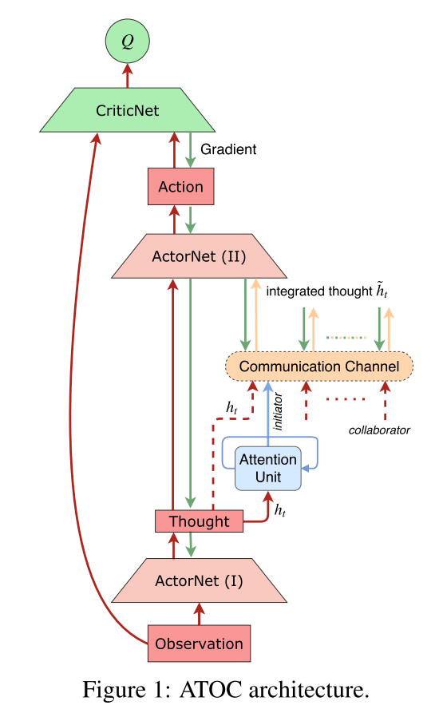
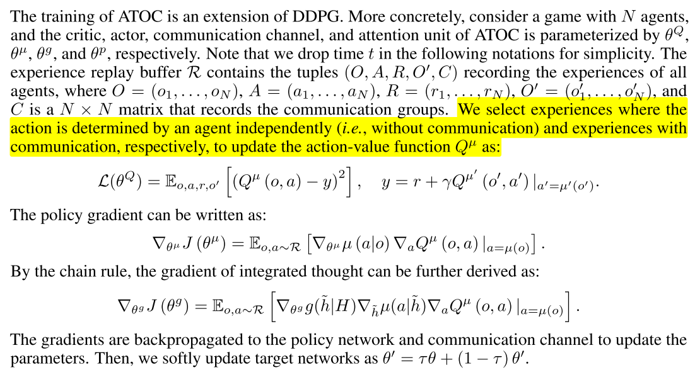
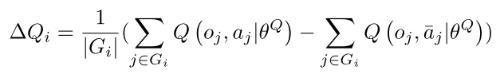
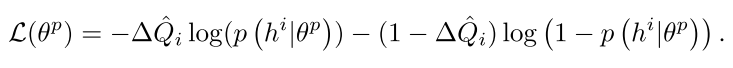

# 2.8 交流-ATOC

使用注意力机制的多智能体交流

论文:[Learning Attentional Communication for Multi-Agent Cooperation](http://papers.nips.cc/paper/7956-learning-attentional-communication-for-multi-agent-cooperation.pdf)

## 1. 总述

R(D)IAL、CommNet 以及 BiCNet,都是每一个时间步所有智能体之间都要进行通信,或者每个智能体与自己相邻的智能体进行通信,这在本文看来属于一个预定义的通信模式,不够灵活.本文的出发点正是基于此,希望提出一个算法,**能够让智能体在任何时刻,自己决定是否需要与其他智能体进行通信,以及与哪些智能体进行通信.**

本文为了达到上述目标,提出了一个基于注意力机制的通信模型 ATOC,该模型基于智能体的局部观察,可同时适用于协作环境(共享一个全局的回报函数或者拥有各自的回报函数)以及竞争环境(实质也是协作环境,因为算法只控制一方).其基本思想是,==通过其局部观察与动作(其实是策略网络的中间层输出)的编码,来决定其是否需要与其视野范围内的其他智能体进行通信,以及哪些智能体进行通信.对于决定进行通信的智能体,我们称之为发起者(initiator),这个发起者从其视野范围内选择协作者共同形成一个通信群组,这个通信群组在整个 episode 中动态变化并且只在需要的时候存在.本文采用一个双向的 LSTM 网络作为通信群组之间的通信信道(类似于 BiCNet),这个 LSTM 以通信群组中各个智能体的局部观察与动作的编码(之前提到的)作为输入,输出的 higher-level 的编码信息作为各智能体策略网络的额外输入,来指导协作策略的生成==.

ATOC 算法采用的是AC算法框架,DDPG 算法,遵循 CTDE 框架,同时考虑到算法在大规模多智能体环境下的可扩展性,所有智能体共享策略网络、注意力单元以及通信信道的参数(parameter sharing 好像已经是标准设置了).

相关算法:大多通过BP训练
- CommNet
- BiCNet,]基于连续行动的actor-critic模型,使用递归网络连接每个个体agent的策略和价值网络.
- Master-Slave
- MADDPG, COMA

背景:
- DQN 
- DDPG
- Recurrent Attention Model (RAM). 在每个时间步,代理智能体通过带宽受限的传感器获取并处理部分观察, 从过去的观察中提取的glimpse feature存储在内部状态中,该内部状态被编码到RNN的隐藏层中. 通过解码内部状态,智能体可以确定传感器的位置以及与环境交互的动作.

## 2 Method

### 2.1 模型

|  |
| :------------------------------: |
|              fig 1               |

组成:
- policy network, 输入, 局部观察, 输出thought: $$ h_t^i = \mu_I(o_t^i; \theta^\mu)$$
- Q-network, 
- attention unit, 每隔T个时间步, 注意力单元输入thought, 然后决定是否需要通信. 如果需要, 那么发起者(initiator)选择目标(collaborators)组成通信小组, 进行同行, **在这T个时间步之内, 这个小组是保持不变的.**
- communication channel. **是一个双向LSTM, 通过gate机制选择有用的信息,忘掉无用的信息**. 通信通道将通信组中的每个agent连接起来,将每个agent的thought作为输入,并输出集成的思想,引导agent产生协调的行动, 生成integrated thought $$\hat{h}_t^i $$ , 输出给策略网络生成动作, $$a_t^i = \mu_{II}(h_t^i, \hat{h}_t^i; \theta^\mu) $$

==这里注意力模块来决定自身是否要成为发起者,但是并不是每一个时间步都需要做这样一个判断==,而是每隔固定的 T 个时间步,这是因为协作策略需要持续一段时间才能看到效果.**注意力模块的训练过程是完全独立于整个强化算法的训练过程的,即注意力模块并不是通过端到端的方式来训练的**.具体来说,注意力模块是一个 RNN 网络,在每隔一个时间步(其实在环境中是 T 个时间步),其以上一步的隐状态以及这一步智能体局部观察以及动作的编码作为输入,输出端是一个二分类器,判断其是否要成为发起者.

### 2.2 训练
训练时DDPG扩展.首先参数化各个部分,N个智能体,
- critic, $$\theta^Q $$
- actor, $$\theta^\mu $$
- communication channel, $$\theta^g $$ 
- attention unit, $$\theta^p $$

训练损失如下:

<table>
    <tr>
         <th></th>
    </tr>
</table>

训练数据通过以下方式获得:对于每一个发起者及其通信群组,我们计算其通信群组中每一个智能体采用协作动作(即使用编码作为额外输入得到的动作)与不采用协作动作在 Q-value 上带来的差值的平均值:

<table>
    <tr>
         <th></th>
        <th> (2) </th>
    </tr>
</table>

然后我们将元组 $$(\Delta Q_i,h^i)$$ 存起来作为训练集,在一个 episode 结束之后,对训练集中的数据采用下述二分类交叉熵损失函数进行拟合:

<table>
    <tr>
         <th></th>
        <th> () </th>
    </tr>
</table>

## 总结

最后来说明以下为什么 ATOC 算法要选择视野范围之内的智能体建立通信群组,主要有以下两点原因:

- 邻近的智能体的局部观察更加相似,因而更容易互相理解
- 邻近的智能体之间更容易协作

一个发起者邻近的智能体可以分为以下三种:
- 其他发起者
- 被其他发起者选定的智能体
- 没有被其他发起者选定的智能体

每个发起者最多选择 m 个智能体,选择的优先级:没有被其他发起者选定的智能体 > 被其他发起者选定的智能体 > 其他发起者.当一个智能体同时被多个发起者选择,则会同时在所有的通信群组中起作用.具体来说,假定智能体 k 同时被发起者 p 和 q 顺序选中,则其首先会加入到发起者 p 的通信群组中,生成一个对应的编码:$$\{\hat{h}_t^p,..,\hat{h}_t^{k'} \}= g(h_t^p,...,h_t^k) $$,这相当于智能体 k 的编码被更新了一次；接着它再参与到发起者 q 的通信群组中,再次更新自己的编码,并且上一次更新后的编码也会影响群组中其余智能体的编码更新:$$\{\hat{h}_t^q,...,\hat{h}_t^{k''} \}=g(h_t^q,...,\hat{h}_t^{k'}) $$.这样,这种处于交界处的智能体就会起到一个信息桥梁的作用,使得局部的信息按照顺序逐步的传递到全局(**但是这种传递遵循某个特定的顺序**).

## 评价

与 BiCNet 相比,ATOC 有以下相似以及改进点:
- 为了进一步凸显不同智能体在特定任务中的不同定位,固定其在 LSTM 中的位置
- 将 RNN 通信信道改为 LSTM,从而过滤掉无关信息

ATOC 在竞争环境下的训练方式是与 baseline 对抗训练,而不是分别 self-play 最后再进行比较.

把智能体划分成小组进行通信, 然后在一个固定的时间步长里,小组保持通信, 还是没有达到它说的动态调整通信对象的目的, 还是预先定义的方法.

如何跳出全局视角, 完全从发送消息的智能体自己的视角考虑?