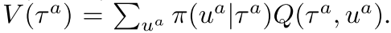
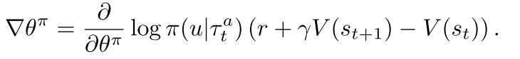
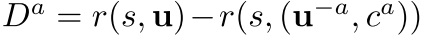
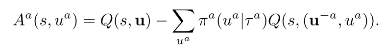
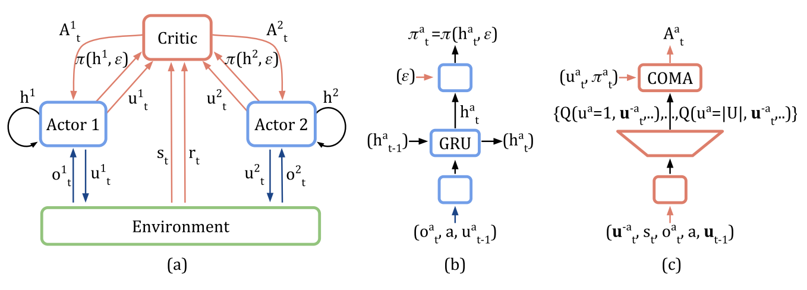
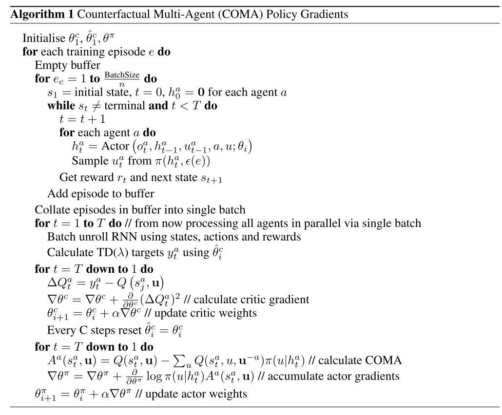

# 1.4 混合-COMA

paper: [Counterfactual Multi-Agent Policy Gradients](https://arxiv.org/abs/1705.08926)

核心: 

* centralised Critic: 使用联合动作和全局状态, 估计Q函数, 只在训练时用; 
* decentralised actors 优化策略; 
* counterfactual baseline解决多智能体信用分配问题, (让其他智能体执行默认动作构造一个奖励, 和全局奖励进行对比, 可以评估一个智能体动作的价值. 有一个困难是如何选择默认动作). **CMOA使用上述思想, 然后使用集中式critic计算advantage function与counterfactual baseline进行对比.** 其中反事实baseline通过固定其他智能体动作, 把单个智能体的动作边缘化. 因此COMA不用额外模拟, 而是基于集中式critic为每个智能体单独计算一个baseline.
* critic representation. 通过一次forward pass为给定智能体计算所有与其他智能体不同的动作的Q值, 高效计算counterfactual baseline. 

## 1. Methods

### 1.1 Independent Actor-Critic(IAC)

* 与IQL算法思想一样, 不过用AC代替Q-learning.
* 智能体共享参数. **输入各自观察和编号**, critic使用各自局部观察, 输出各自局部Q值, 不用全局信息.
* 考虑两个变体:
  1. 每个智能体critic估计$$V(\tau^a)$$,然后使用基于TD-error的梯度训练.
  2. 每个智能体critic估计$$Q(\tau^a, u^a)$$, 后面使用优势函数计算梯度:  ,其中  
* 无法解决信用分配问题.

### 1.2 Counterfactual Multi-Agent Policy Gradients

使用COMA算法解决集中式训练问题. 核心思想:1) centralisation of the critic, 2) use of a counterfactual baseline, and 3) use of a critic representation that allows efficient evaluation of the baseline. 

训练时critic使用全局状态和联合动作. Actor只基于自身观察训练. 智能体共享参数.

每个智能体Actor基于TD-error训练的梯度如下, 

(3)

上述公式无法解决信用分配问题, 因为TD-error使用的是全局奖励. 当其他智能体都在进行探索时, 单个智能体训练的梯度包含很多噪声.

本文使用 **counterfactual baseline**解决该问题. 

* 启发工作: **difference rewards**. 为每个智能体构造一个奖励函数  , 把全局奖励和把智能体a的动作使用一个default action $$c^a$$代替时的奖励作比较. 智能体a improve $$D^a$$的动作也可以improve 真实奖励$$r(a, u)$$, 因为 $$r(s, (u^{-a}, c^a))$$不依赖于智能体a的动作.
* difference rewards可以解决信用分配, 但是**每个**智能体都需要单独进行模拟估计$$r(s, (u^{-a}, c^a))$$. 另外$$c^a$$如何选择也不清楚.
* COMA使用全局状态s和联合动作u学习集中式critic, $$Q(s, u)$$. 对于每个智能体来说, 都可以计算advantage function, 用来当前动作$$u^a$$的Q值和边缘化$$u^a$$的counterfactual baseline进行比较.

(4)

上述优势函数不通过模拟执行, 而是使用centralised critic为每个智能体单独计算只有自己动作改变时的counterfactual baseline.

当网络很复杂时, 上述优势函数计算代价也很高, 输出节点也要$$|U|^n$$. COMA使用critic representation解决该问题.

* 如图1c所示, 其他智能体的动作$$u_t^{-a}$$也加入网络的输入, 然后输出每个智能体动作的Q值.
* 然后, 通过一次前向传播就可以为每个智能体计算counterfactual advantage.
* 另外, 输出只有$$|U|$$.

Figure 1: In (a), information flow between the decentralised actors, the environment and the centralised critic in COMA; red arrows and components are only required during centralised learning. In (b) and (c), architectures of the actor and critic. 

## 2. 实验

实验设置:

* 视野受限; 
* 所有智能体有相同全局奖励, 基于伤害和输赢设置奖励函数; 
* actor用GRU, critic用MLP; 

## 算法伪代码

