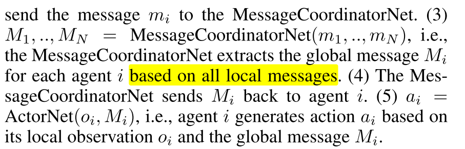
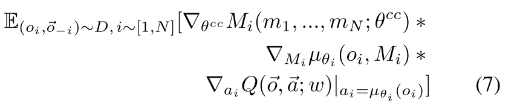
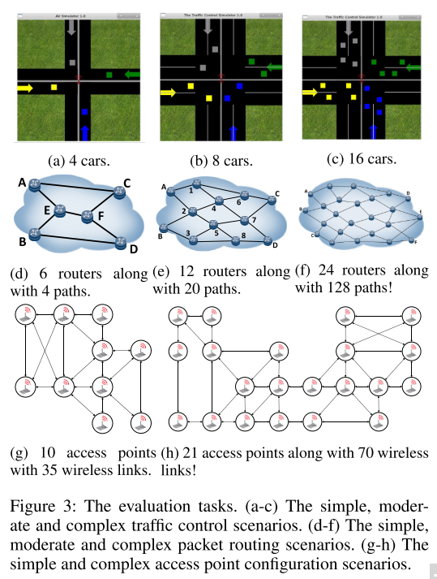
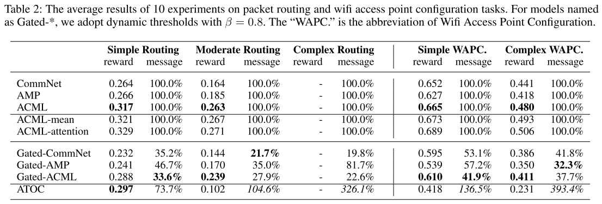
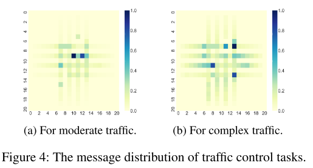

# 2.3 交流-GatedMLAC

在有限带宽情况下通过消息削减学习多智能体交流

论文: [Learning Agent Communication under Limited Bandwidth by Message Pruning](https://arxiv.org/pdf/1912.05304v1.pdf)

**Motivation**其他方法进行交流时往往持续不断地发送消息, 这很耗费带宽.

* 本文主要是引入了门控机制(gating mechanism)对消息进行剪枝, 进而用有限的通信带宽来传输最有利于智能体协作的消息.
* ==衡量"最有利于智能体协作"的标准是看Q-value是不是足够大, 或者说是不是大于一个阈值T==. 
* 并提出了移动平均和设置固定阈值T的两种方法.
* 目标: 削减消息的同时保证性能. 甚至能够提升性能.

## 1. Introduction

本文思路: 首先集成现有方法, 形成一个基础算法 Actor-Critic Message Learner (ACML), 该算法也是一直发送消息. 然后将其扩展为Gated-ACML算法. 训练时智能体尝试打开门限交流有用信息, 如果没用就不去开门. 训练好后门控机制就能很好的控制消息.

## 2. Related Work

相关算法:

* CommNet: 在Actor中嵌入一个集中式的消息通道, 处理其他所有智能体的消息(通过平均法).
* AMP: 这类算法加入attention机制选择特定的消息, 但是他们的策略网络使用所有智能体的消息生成一个控制命令, 所以所有智能体只能不断发送消息. 不灵活.

相近算法: IC3Net and ATOC: 使用门控机制生成一个二进制位, 控制是否通信. 不同点在于

* IC3Net and ATOC只适合同质智能体, 离散任务; Gated-ACML适合同质或异质的智能体, 连续任务.
* IC3Net: 目标是学习混合任务中**何时**进行大规模通信. 允许在一个step中有多个通信周期, 并为下一个通信周期生成门控值
* ATOC: 目标是结合智能体动态拓扑结构学习交流. 主要通过门控值生成动态的局部通信group(一个agent可以属于多个group)
* Gated-ACML: 学习有限带宽交流问题. 通过全局Q值和一个门限阈值, 确定消息是否有益, 并用该门控信号削减全局消息.

## 3. Background

**DEC-POMDP.** 本文将历史观测映射到一个动作, 即$$o_i$$是智能体的历史.

**RL**, 本文基于AC架构.

## 4. Method

### 4.1 ACML

|          |
| :--------------------------------------: |
| fig 1. ACML算法. 上图 $$M_i$$表示全局消息 |

上图中, 每个智能体包括一个ActorNet网络和一个MessageCoordinatorNet, 所有智能体共享CriticNet和MessageCoordinatorNet. 消息协调网络类似于CommNet, AMP 和ATOC的通信信道, CriticNet与MADDPG相同. 通过在整个agent团队中共享观察和行动的编码, 个体agent可以建立更大的全局感知, 推断其他agent的意图, 并在决策上进行合作.

该架构解决了MADDPG无通信的局部观察问题, 以及AMP和ATOC算法没有CriticNet的不稳定问题.

算法流程

|             框架流程             |
| :------------------------------: |
|  |
|  |

**训练**, 首先智能体基于观察和全局消息生成动作, 与环境交互, 环境反馈共享奖励 $$r$$. 然后使用经验数据训练.

|                                              |
| :--------------------------------------------------------------------------: |
| 其中, $$L(w), J(\theta_i), w, \theta_i, w^-, \theta^-_i $$意义与单智能体相同. |

对于交流信道的训练, 使用链式规则, 

|  |
| :------------------------------: |
|                                  |

由于ACML是端到端可微的, 因此可以使用基于上述方程的反向传播来联合优化通信消息和控制策略.

### 4.2 Gated-ACML

为了解决智能体持续不断发送消息, 带宽占用太大的问题. **采用一个门控机制来自适应地删除ActorNets之间不太有利的消息**, 这样智能体就可以用尽可能少的消息来维护性能.

|                     |
| :-------------------------------------------------: |
| fig 2. Gated-ACML. 在每个actorNet中加入一个门控网络 |

(1)每个智能体基于观察生成一个局部消息 $$m_i $$ 和概率 $$p $$. (2)门控网络生成控制信号, $$g=\{0, 1\} $$. (3)智能体基于 $$m_i \odot g $$将局部消息发送给MessageCoordinatorNet.

在实践中, 如果智能体在决策制定时间到来时没有收到消息, 它将自动填充零. 该设计得到了消息丢失技术的支持, 该技术表明, **用一定概率的零向量替换某些消息, 可以使大规模通信中常见的通信错误和消息冗余更有鲁棒性**.

#### 4.2.1 Training with Auxiliary Task

训练概率p. ==由于门控函数 $$g\leftarrow \mathbb{I}(p>0.5) $$不可微分, 所以端到端反向传播不可用(近似梯度, 系数正则化, 以及其他方法都不成功)==. 为了绕过对不可微指标函数的训练, 我们决定**直接对其输入p进行训练**. 采用辅助任务技术明确地为$$p$$提供训练信号.

本文目标是在保证性能的前提下对消息进行剪枝, 而Q值可以对性能(长期累积回报)进行评价. 本文设计如下辅助任务.

令p代表$$\Delta Q(o_i)=Q(<o_i, a_i^C>, <\vec{o}_{-i}, \vec{a}_{-i}^C>)-Q(<o_i, a_i^I>, <\vec{o}_{-i}, \vec{a}_{-i}^C>) $$比 $$T $$大的概率, 其中 $$ a_i^C$$ 是基于交流生成的动作, $$a_i^I$$是没有交流单独产生的, T是控制阈值. 因此辅助任务的标签就形式化为

| | |
| :------------------------------: | :------------------------------: |
|               (8)                |               (9)                |

* 公式(8)的意思是在训练时, 只有智能体i根据 $$ a_i^C, a_i^I$$计算 $$\Delta Q(o_i) $$改变行动, 其他智能体都持续发送消息(保持 $$\vec{a}_{-i}^C $$ 不变). 
* 为了使所有智能体都训练到, 对所有智能体轮询.
* 从最优化的视角来看, **本文方法类似于坐标下降**, 通过固定其他智能体坐标训练某一个智能体.
* 公式(9)的意思是, 当标签Y=1, 也就是说 $$a_i^C $$至少在Q值上比 $$a_i^I $$大T, 那么就鼓励交流. 也就是说交流的Q值比不交流的小的时候, 就不鼓励交流.

  

#### 4.2.2 关键实现

* 首先令 $$g=1$$(无剪枝), 基于公式(4-7)训练除了GatingNet的其他部分. 当模型训练好了, 就可以比较好逼近ActorNet和CriticNet.
* 然后, 对于特定 $$o_i $$, ActorNet可以根据g设为0或者1, 生成 $$ a_i^C, a_i^I$$.
* 再然后, 把 $$o_i, \vec{o}_{-i}, a_i^C, a_i^I, \vec{a}_{-i}^C $$ 输入给CriticNet, 估计Q值 $$Q(<o_i, a_i^C>, <\vec{o}_{-i}, \vec{a}_{-i}^C>)$$和$$Q(<o_i, a_i^I>, <\vec{o}_{-i}, \vec{a}_{-i}^C>) $$ 
* 对于阈值T, 使用固定T和动态T两种方法.
  + 对于固定T, 使用训练时最近的K个观察$$o_i$$计算$$\Delta Q(o_i)$$, 对其排序得 $$L_{\Delta Q(o_i)}$$. 
    - 令T等于序列索引分割的比例. 比如剪枝 $$T_m \% $$, 则 $$T=L_{\Delta Q(o_i)}[K\times T_m \%]  $$. 
    - 之所以不用值分割,是因为$$\Delta Q$$值分布不均匀. 
    - 固定T的好处是,剪枝掉的消息数接近固定的$$T_m \% $$, 而且对大的K比较友好．
  + 动态T, 使用指数移动平均技术(exponential moving average technique), 如下公式.
    - 
    - 其中 $$\beta \in [0.6,0.9] $$表现都很好. 
    - 动态T的好处是Y自适应,对于动态环境可以自适应改变T和Y.

### 4.3 将门控机制应用到以前方法

* 一方面, 我们可以将选通机制应用于诸如CommNet和AMP之类的先前方法, 以便最终的Gated-CommNet和Gated-AMP也可以应用于有限的带宽设置.
* 另一方面, 基本的Gated-ACML采用完全连接的MessageCoordinatorNet来处理接收到的消息, 因此我们可以使用更高级的网络(例如CommNet中的均值网络, AMP中的attention网络和BiCNet中的BiRNN网络).

## 5. 实验

### 5.1 实验环境

Traffic Control, 

  + 所有车通过路口, 不撞车. 
  + 观察是当前位置和路线序号, 
  + 动作是实数代表速度, 
  + 奖励与时间, 是否撞车, 通过路口有关

分组路由(Packet Routing).

  + 最大程度降低整个网络的最大链路利用率(Maximum Link Utilization in the whole network, MLU).
  +  动作是分配给每个可用路径的流速.
  +   奖励是1 −MLU, 因为我们要最小化MLU

WIFI接入点配置

  + 学习良好的电源配置策略以最大化接收信号强度指示器(RSSI), 较大的RSSI表示信号质量更好.
  + 观察结果包括射频, 带宽, 包丢失率, 频带数, 一个特定频带中的当前用户数, 十秒内的下载字节数, 上载坐标速度(Mbps), 下载协调速度, 延迟.
  + 动作是一个电源值, (10.0-30.0)
  + reward是RSSI, 目标是使累积RSSI最大化.

 
|  |
| :------------------------------: |
|              fig 3               |

### 5.2 结果

|  |
| :------------------------------: |
|  |
|  |

GatedACML甚至比ACML获得更多的回报. 由图4可以看出消息集中在路口附近, 加入门限机制可以删除远离路口的不重要的误导消息.

我们还修改了ATOC, 使其适用于连续作用和异构智能体. 结果显示在表1和2的最后一行. ATOC在流量控制任务中效果很好, 但在路由和wifi任务中表现不佳. 主要原因是ATOC根据智能体之间的距离进行分组. 同时ATOC发送的消息更多.

|  |
| :------------------------------: |
|               表3                |

## 6. 结论

* 门控机制, 固定/动态阈值, 解决有限带宽问题.
* 辅助任务训练, 解决不可微分问题.

## 7. 讨论

交流可以关注的点:

* 有限带宽
* 私有信息保护
* 局部共享

本文使用的门控信号是直接使用Q值, 交流的Q值比不交流的大T, 就鼓励交流, 否则就不交流. 那么这里的控制信号可以换成attention或者信息论???

三种门控机制的算法都不能处理复杂交通任务. 因为在这个任务中公式(9)不能提供有效的loss函数, 导致模型输出是随机的.
