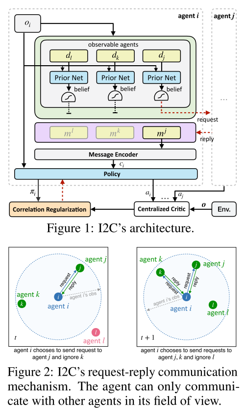

# 2.9 交流-I2C

个体推断式交流方法

论文[Learning Individually Inferred Communication for Multi-Agent Cooperation](https://arxiv.org/pdf/2006.06455.pdf)

## 总述

|  |
| :------------------------------: |
|              fig 1               |
