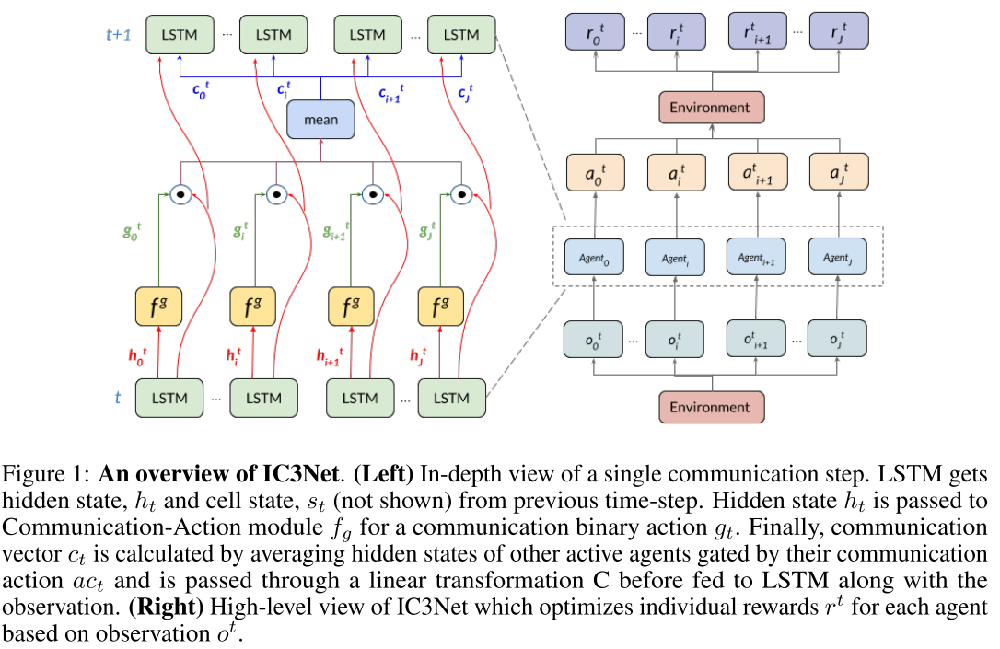
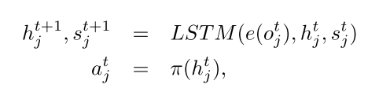
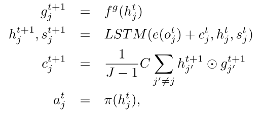

# 2.6 交流-IC3Net(2019)

在多智能体协作竞争任务中学习何时沟通

论文[Learning when to Communicate at Scale in Multiagent Cooperative and Competitive Tasks](https://arxiv.org/pdf/1812.09755.pdf)

学习何时交流
连续通信方式, 每个时间步多个通信周期, 可微, 易训练
个体受控持续交流网络(Individualized Controlled Continuous Communication Model, IC3Net)
使用门控机制控制持续通信, 并为每个智能体使用个体奖励, 同时解决信用分配问题.
混合环境

## 1. Introduction

* 为了解决信用分配问题, 每个智能体使用**个体奖励**; 
* 同时使用门控机制, 可以学会何时通信

相关工作, 

* IC3Net可以看作是CommNet的扩展. 存在信用分配问题, 而且每个智能体不能用不同的奖励函数进行训练.
* MADDPG, 智能体之间没有显示交流(每个actor有不同的策略), 而是使用不同的中心化critic, 通过访问所有智能体的动作, 提供交流信号.
* COMA, 使用中心化critic去中心化actor+额外的反事实奖励, 解决智能体信用分配.
* VAIN(Vertex Attention Interaction Networks), 使用注意力机制的交互网络使用监督设置来预测模型.

## 2. Model

|  |
| :------------------------------: |
|              fig 1               |

控制器: 某个时间步, 对于某一个智能体j来说, 策略的形式是, 

<table>

``` html
<tr>
     <th></th>
    <th> (1) </th>
</tr>
```

</table>

其中, $$o_j^t $$是观察, $$e(\cdot)$$是全连接网络编码的观察, $$h, s$$是LSTM的单步输出. 所有的智能体共享网络参数. 

IC3Net扩展了这个独立的控制器模型, 允许智能体通过一个离散的动作进行内部状态的通信, 

<table>

``` html
<tr>
     <th></th>
    <th> (2) </th>
</tr>
```

</table>

其中c是连续的通信向量; C是线性变化矩阵, 用于将门控的平均状态变换为一个通信张量; J是存活的智能体; f是一个简单网络, 在线性层上多一个softmax层输出2值动作. g作为门控信号, **控制智能体是否与其他人交流(自己视角下)**, 同时下一步的门控行为通过当前步骤计算.

## 总结与评价

* 目的: 学习何时通信, 解决信用分配问题, 适应混合环境
* 训练: 使用连续通信向量, 可以进行BP训练; 离散的门控信号, 使用一个softmax层变成可训的. 

评价

* 这儿的g作为门控信号, 可以控制智能体是否与其他人交流(自己视角下)
* 不适用commNet的大型网络, 使用多个小网络, 共享参数, 解决信用分配问题, 解决可扩展性, 稳定性高, 方差大???
