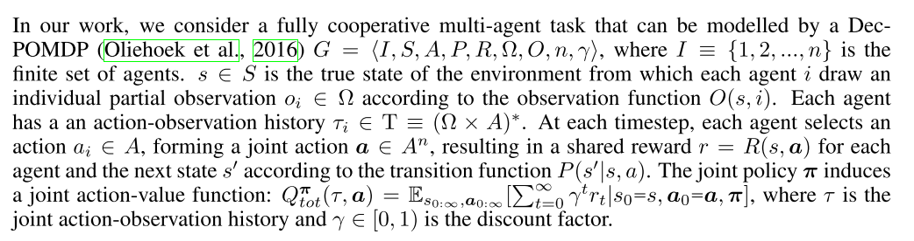
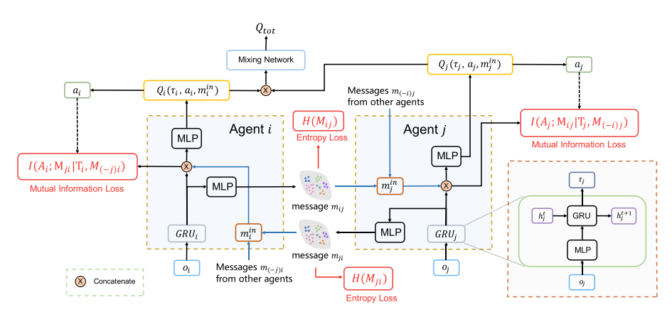
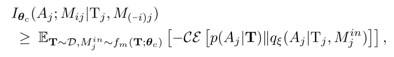
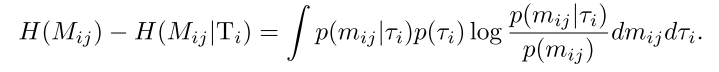
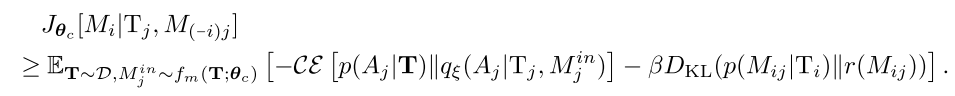
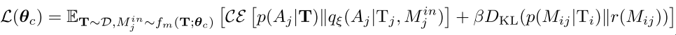
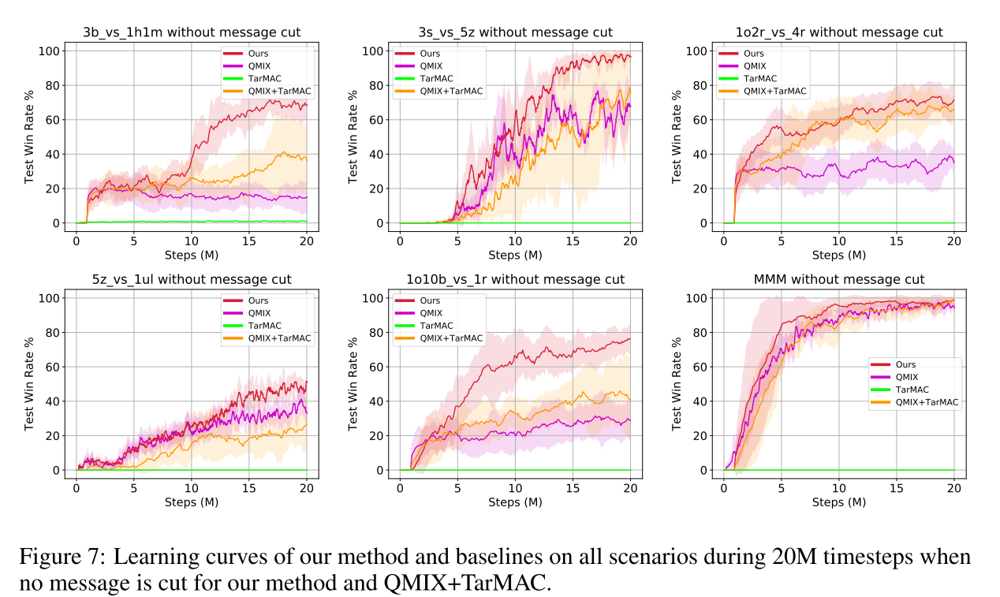
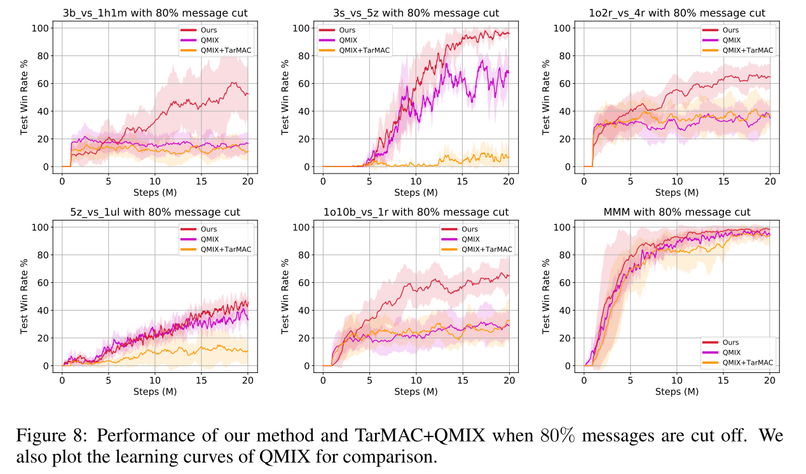

# 2.1 通过交流最小化学习近似可分解价值函数

论文: [Learning Nearly Decomposable Value Functions Via Communication Minimization](https://openreview.net/pdf?id=HJx-3grYDB)

**Motivation**: MARL面临困难: 可扩展性和非稳定性. 目前值函数分解方法在解决协作多智能体系统很有效, 但是现存方法过于关注完全去中心化值函数, 使其在交流场景中效率不高. 本文提出近似可分解值函数, 使智能体在大多数情况下自己行动, 但是偶尔给其他智能体发送消息提高协作效率. 该框架通过引入两个信息论的正则化项混合值函数分解学习和交流学习. 这些正则化项最大化去中心化Q函数和交流信息之间的互信息, 同时最小化智能体之间消息的信息熵. 该框架可以很简单和已有的值函数分解方法结合. 并可以在不牺牲性能的情况下切断80%的通信.

## 1. Introduction

协作智能体系统的应用: 自动车队管理、智能仓库、传感器网络等. 在解决这些问题的RL算法中CTDE范式因其可扩展性和解决非稳定问题的能力受到很大重视.

值函数分解方法解决该范式很有效. 该方法为每个智能体学习去中心化的Q函数, 并使用一个混合网络组合这些局部Q值, 形成一个全局动作价值. 相关方法包括VDN、QMIX、QTRAN等. 这些方法重点在学习基于局部观察的完全分解, 不关注其他智能体的信息, 导致协作效率不高. 并且在去中心化执行时, 自己的局部观察加上其他智能体的动作, 使得环境更加不确定, 导致合作失败.

本文提出**近似可分解值函数**, 使智能体在大多数情况下自己行动, 但是偶尔给其他智能体发送消息提高协作效率. 该框架通过引入两个信息论的正则化项混合值函数分解学习和交流消息.

* 消息参数化为随机嵌入空间; 
* 通过引入正则化项最大化去中心化Q函数和交流信息之间的互信息, 来把值分解函数学习和交流学习相结合.
* 通过引入额外正则化项最小化智能体之间消息的信息熵, 来最小化交流; 
* 这两个正则化项也保证了何时、如何、和谁交流的问题, 也解决了信息交流的表示能力(有效降低智能体Q值的不确定性)和简洁性(只发送有用的信息).
* 通过变分推断理论, 推导出一个可控的下界目标函数, 该目标可以使用已有的QMIX等值分解方法求解.

  

实验结果: 表现超过baseline, 并且可以截断80%的交流信息.

## 2 Background

|          **Dec-POMDP**           |
| :------------------------------: |
|  |

多智能体场景面临的困境:

* 如果使用中心化Q函数$$Q_{tot}$$在不适合智能体数量过多的情况; 
* 直接学习去中心化动作价值$$Q_i$$可以缓解可扩展性问题, 但是这种独立训练的方法忽视了智能体之间的交流. 

使用混合网络把$$Q_{tot}$$表示为局部信息上的去中心化$$Q_i$$的混合值, 很有效. 但这种方法过于关注值函数的完全分解, 它们可以通过先学习分布式的$$Q_i$$, 然后把他们混合成$$Q_{tot}$$降低问题的复杂度, 并且训练的主要复杂度集中在混合网络. 但是很多部分观察任务中, 混合网络不足以解决协作问题. 因为没有考虑到其他智能体对于环境不确定性带来的干扰.

## 3 Methodoloty

本部分主要集中在如何使用带交流的近似值函数分解方法, 解决完全分解方法带来的问题.

* 在中心化训练阶段, 假设学习算法可以访问所有智能体的独立观察-动作历史和全局状态信息; 
* 在去中心化执行阶段, 每个智能体基于自己的局部观察历史$$\tau_i$$和接收到的消息$$m_i^{in}$$学习各自的Q函数$$Q_i(\tau_i, a_i, m_i^{in})$$, 并以此指导自己行动.
* 信息交流也是中心化学习的.

| |
|:-: |
|   **图1**         |

==消息编码器生成一个嵌入式的分布, 抽样得到, 并与当前局部历史串联, 作为局部Q函数的输入. 本框架引入两个正则化项学习表示能力强并且形式简洁的消息, 两个损失函数分别是熵损失和互信息损失==

本文框架如图1所示. 每个智能体Q网络的输入是自己的局部观察历史和其他智能体的消息. 为了学习到近似可分解的框架, 使用两个正则化项来最小化交流信息. 因此对交流进行了如下假设:

* 表示性强: 某智能体发送的消息可以有效减少自身行动给环境带来的不确定性; 
* 简洁性: 智能体发送的消息应该越简洁(短)越好.

本文方法灵感来源于变分推断理论, 该理论可以从数据中学习结构, 同时本文提出了一个关于消息的隐空间, 称为"消息嵌入"空间. 消息编码为该隐空间中具有对角协方差矩阵的多元高斯分布. 编码器$$f_m(m_i|\tau_i; \mathbf{\theta}_c)$$限制在局部历史学习, 并由其他智能体共享. 在每个时间步, 该编码器对每一个智能体$$i$$输出一个消息分布$$M_i$$, 其中$$m_i^t$$从中重采样得到. 同时本文使用点对点通信, $$m_i^t=<m^t_{i1}, m^t_{i2}, ..., m^t_{in}>$$, 其中$$m_{ij}$$表示智能体$$i$$到$$j$$的消息, 由$$M_{ij}$$抽样得到.

另一个问题是**如何限制消息发送长度**, 使智能体单独确定应该发送消息中的哪些bits. 智能体$$j$$的消息输入$$m_j^{in}$$应该是截断的消息, 而不是全量的消息; 然后该消息输入Q函数, $$Q_j(\tau_j, a_j, m_j^{in})$$; 最后所有的局部Q函数输入给混合网络.

本框架除了消息嵌入, 其他部分都是使用下游TD损失来端到端训练的:

$$
\mathcal{L}{(\theta)}=\mathcal{L}_{TD}(\theta)+\mathcal{L}_c(\mathbf{\theta}_c)
$$ 

其中$$\mathcal{L}_{TD}=[r+\gamma max_{a'}Q_{tot}(s', \mathbf{a}'; \theta^-) - Q_{tot}(s, \mathbf{a}; \theta]^2$$, $$\mathcal{L}_c(\mathbf{\theta}_c)$$是消息嵌入的正则化项.

### 3.1 最小化通信目标和变分界限

**加入隐变量有利于消息表示性**, 但是并不意味着可以降低不确定性. 本文使用最大化$$M_{ij}$$之间的互信息, 最优化动作智能体j的策略$$A_j$$, $$I_{\mathbf{\theta}_c}(A_j; M_{ij}|T_j, M_{(-i)j})$$. 但是, 如果只用这一个目标, 编码器能保证在给定不同历史(即隐空间不同区域的表示)下的消息时学会沟通, 但是无法阻断没用的消息. 解决该问题的方法是加入消息的entropy.

最后, 智能体$$i$$消息的目标函数变为:

|                       |       |
| :-------------------: | :---: |
| $$J_{\mathbf{\theta}_c}[M_i T_j, M_{(-i)j}]=\sum_{j=1}^n I_{\mathbf{\theta}_c}(A_j; M_{ij} T_j, M_{(-i)j})-\beta H_{\mathbf{\theta}_c}(M_{ij})$$ |  (2)  |

其中, $$\beta$$是关于表示性和简洁性的缩放因子, $$M_{ij}$$是智能体i到智能体j的消息分布.

由于互信息和熵计算困难, 通过变分逼近, 引入互信息的下界, 

(3)

其中, $$T_j$$是智能体j的局部观察历史, $$\mathbf{T}=<T_1, T_2, ..., T_n>$$是从经验缓冲池$$\mathcal{D}$$抽样的联合历史; $$q_{\xi}(A_j|T_j, M_j^{in})$$是变分后验估计值; $$\mathcal{c\varepsilon}$$是交叉熵. 通过智能体共享$$\xi$$来加速训练.

下面讨论如何最小化$$\beta H(M_{ij})$$. 直接最小化高斯分布的熵会造成方差坍缩到零. 本文将协方差矩阵设为单位矩阵, 并使用最小化$$H(M_{ij})-H(M_{ij}|T_i)$$替代, 其中$$T_i$$是智能体i历史的随机变量. 这么做与最小化$$\beta H(M_{ij})$$等价, 因为$$H(M_{ij}|T_i)$$是多元高斯随机变量, 其熵是一个常数($$log(det(2\pi e\Sigma))/2$$, 其中$$\Sigma$$是单位矩阵). 然后我们有

(4)

用处理互信息同样的方法——引入一个变分推断分布$$r(m_{ij})$$逼近$$p(m_ij)$$, 我们有:

(5)

上式对任何分布$$r(M_{ij})$$都有界. 同时为了有效截断消息, 我们使用单位高斯分布$$\mathcal{N}(0, \mathbf{I})$$. 将公式(3)和公式(5)组合起来, 我们就得到了公式(2)的可解的变分下界:

(6)

通过最优化该下界, 就可以得到一个表示性和简洁性都很好的消息嵌入. 特别的, 我们最小化如下函数:

(7)

上式, 第一项损失称为expressiveness loss, 为了保证减少带给其他智能体的Q函数的不确定性; 第二项称为succinctness loss, 为了保证消息近似单位高斯分布. 同时, 因为消息嵌入的协方差矩阵是单位矩阵, 这实际上把消息的均值限制在隐空间的原点. 上述两个损失函数, 限制了无用消息分布靠近原点, 重要消息在其他空间位置.

注意, 公式(7)中的损失用来更新消息编码的参数. 同时, 所有部分(个体Q函数、消息编码器、混合网络)在训练时和QMIX一样, 使用端到端的TD损失训练. 因此, 消息编码器$$f_m(M_i|T_i; \mathbf{\theta}_c)$$通过两个梯度进行更新: 公式(6)中的随机梯度和TD中的相关梯度.

### 3.2 消息截断

本文的目标函数可以用来截断那些对减少不确定性贡献不大的消息, 即在空间中靠近原点的消息. 通过根据均值对消息分布进行排序, 并倒序截断. 注意, 因为使用的协方差矩阵是单位阵, 一条消息中的bits是相互独立的. 因此可以消息是可以变长的.

这样就可以选择何时(如果全部截断就保持沉默)发送多少消息(bits长度可变).

## 4 Related Works

 混合环境、递归推理, 多智能体策略梯度相关算法, 解决信用分配问题:

* COMA
* MADDPG
* PR2

基于值函数的MARL算法, 值函数分解方法:

* VDN
* QMIX
* QTRAN

多智能体交流, 主要是学习可微分的信道

* 学习去中心化交流协议, 解决什么时候、和谁交流的问题. Sukhbaatar et al. (2016); Hoshen (2017); Jiang & Lu (2018); Singh et al. (2019); Das et al. (2019)
* 多智能体上下文中的自然语言问题. Foerster et al. (2016); Das et al. (2017); Lazaridou et al. (2017); Mordatch & Abbeel (2018)
* IC3Net, 在混合环境中学习门控机制控制智能体与队友交流.
* 在有限的交流信道下协作行动. Zhang & Lesser (2013); Kim et al. (2019)
* Social influence和InfoBot惩罚那些对其他智能体策略贡献很小的消息.

与本文最相关的是TarMAC算法. 使用attention机制区分输入消息的重要性. 本文使用变分推断决定消息内容.

环境使用StarCraft unit micromanagement

## 5 Experimental Result

本节实验解决如下问题:

1. 完全值分解方法是否普遍存在错误引导问题？
2. 任务需要学习最小化的消息吗？
3. 学习消息分布能否减少其他智能体Q函数的不确定性？
4. 本文方法与attention机制的交流方法有什么不同？
5. $$\beta$$是如何影响交流协议的？

### 5.1 基线和消融

* 用QMIX代表完全值分解方法; 
* 对比本文方法和TarMAC方法的attention机制的区别; 
* 把TarMAC和QMIX结合作为强baseline.

### 5.2 示例

使用三个任务证明不同的方面:

* 传感器网络: 完全值分解方法得到的解是次优的, 本文方法可以学到最有的交流策略. 同时展示不同$$\beta$$的大小如何影响算法学习到的消息嵌入形式. 在$$\beta$$很大(=1.0)时, 所有的消息都在截断值以下(不交流); 当$$\beta$$太小($$10^{-5}$$)时, 算法主要关注于减少不确定性, 而不是压缩消息, 所以智能体2和3都给1发送消息.
* 走廊任务: Dec-POMDP任务中, 完全值分解方法在多步场景中会存在错误引导.
* 独立搜索任务. 说明本文方法在智能体相互独立的场景中, 可以学习不通信.

### 5.3 最大化值函数分解

 在多智能体场景中广泛存在错误引导问题. 同时增加任务难度:

* ==把视线范围从9降到2==; 
* 增加困难的地图, 地形复杂或者单元位置随机.

共使用6个场景, 3b vs 1h1m, 3s vs 5z, 1o2r vs 4r, 5z vs 1ul, MMM, and 1o10b vs 1r.

#### 5.3.1 性能对比

所有星际2场景使用同样的超参数, 消息长度$$m_{ij}=3$$, $$\beta=10^{-3}$$, 训练时每100k步测试48个episode. 图7展示的是没有进行信息截断的算法性能对比.

|  |
| :-: |
| 图2                   |

本文框架表现很好, 也证明了**错误引导问题广泛存在**于完全分解方法中, 尤其当环境的随机性很强的时候, 例如1o2r vs 4r, 3b vs 1h1m, and 1o10b vs 1r. 尤其本文框架比注意力机制表现好, 这两种方法都用了TD-error, 但是本文方法好, 说明本文的消息嵌入机制很有效, 尤其是表示性约束. TarMAC表现不好, ==因为其不能解决全局奖励问题==.

#### 5.3.2 消息截断

本文重点在关注==近似可分解的结构--智能体只需要与少数几个智能体交流就可以, 而不是所有的智能体==. 因此尝试根据消息分布的均值, 将消息截断80%, 结果如图8所示.

|   |
| :-: |
| 图3                                                         |

==为了对比, 将QMIX+TarMAC的权重变小80%, 发现其性能降低明显. 说明本文框架比attention交流机制性能更强.==

## 6. 结论

1. 提出一种CTDE范式下的多智能体交流协作框架，将值分解方法和交流学习方法结合，高效学习近似可分解值函数；
2. 引入两种正则化项尽量减少全体沟通，同时最大化信息的协调；
3. 实验结果展示，本文方法性能很好，并且在截断消息80%的情况下也能达到很好的效果。

## 7. 评论

这个方法的实验部分, 把视野变成2, 相当于把智能体变成了瞎子, 然后肯定有交流的比没有交流的表现好.

没有很好地分析他加入正则化项的效果, 分析不足. 消融实验也不好.

TarMAC为什么完全没有效果.

消息截断的问题, 为什么要截断消息. 其他方法权重减少80%?
