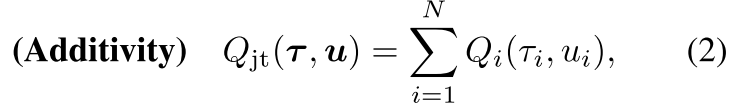
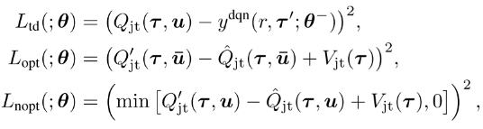
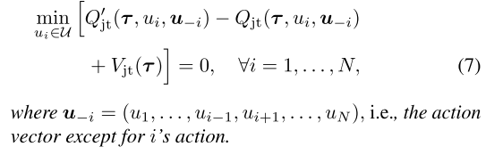
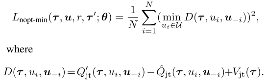
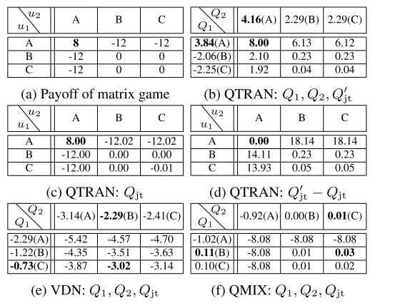
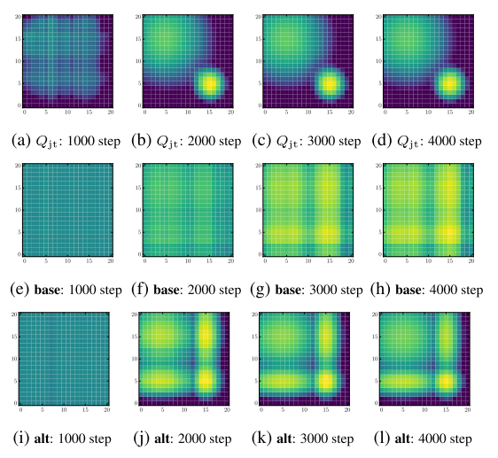
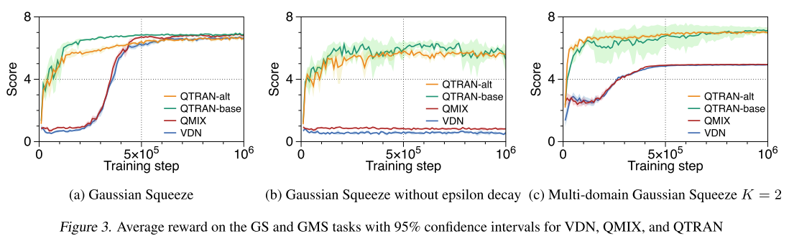
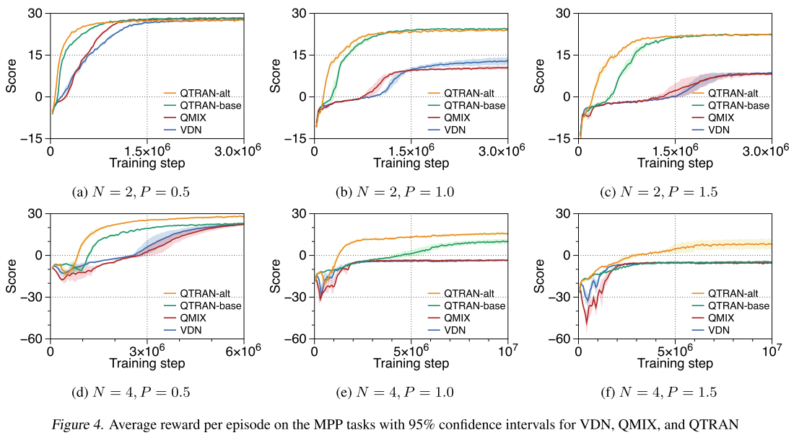
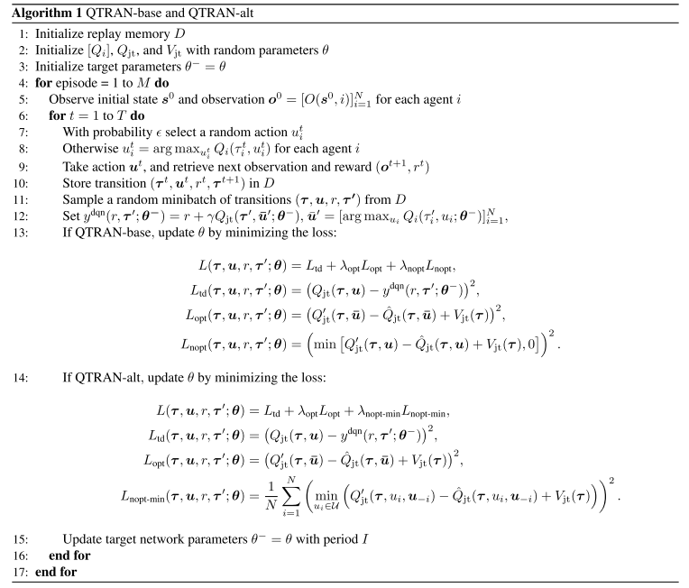

# 4 QTRAN

QTRAN: 基于Transformation机制的协作多智能体强化学习值分解方法

论文:[Learning to Factorize with Transformation for Cooperative Multi-Agent Reinforcement learning](http://proceedings.mlr.press/v97/son19a/son19a.pdf)

## 1 概述

**定义: IGM (Individual-Global-Max)**

**算法演变:**

* 去中心化方法, 可扩展性好, 但是存在不稳定问题; 
* 中心化方法: 可以解决非稳定问题, 但是随智能体增加, 复杂性爆炸; 
* MADDPG: 学习在连续动作空间的分布式策略; 
* COMA: Actors用联合critic估计反事实baseline解决信用(贡献)分配问题; 
* 值分解方法: 解决联合Q值随着智能体数量增加, 复杂性爆炸增加的问题, 
  + VDN: 加性约束, 
  + 
  + QMIX: 单调性约束.
  + 

**本文目标**:

可分解任务定义为, 联合Q值取得最优动作也是个体Q值得最优动作. 使用加性限制和单调性限制有点过度限制了, 限制了智能体的种类; 

本文把原始联合Q值函数$$Q_{jt}$$转换为新的$$Q_{jt}'$$, 使其与$$Q_{jt}$$具有相同的最优动作, 并解除加性/单调性约束.

**本文贡献**:

* 通过学习一个状态值函数(**用来更正部分观察带来得偏差**), 把原始联合动作值函数转化为新的易分解形式, 且最优动作保持相同; 
* QTRAN算法: 联合动作值网络、个体动作值网络、状态网络, 定义每个网络的loss函数; 
* QTRAN变体: QTRAN-base和QTRAN-alt
  + 不同点: 如何构造非最优动作的转换Q函数
  + 收敛速度和稳定性
* 在三个环境测试算法.

## 2 算法原理

### 2.1 因子函数$$[Q_i]$$的充分条件

定义$$\bar{\mu}_i=argmax_{\mu_i}Q_i(\tau_i, \mu_i)$$表示最优动作, $$\bar{\mathbf{u}}=[\bar{\mu}_i]_{i=1}^{N}$$; 令$$\mathbf{Q}=[Q_i]\in \mathbb{R}^N$$, 即$$Q_i, i = 1, ..., N$$的列向量.

**定理1** 给出$$[Q_i]$$满足**IGM**的条件.

| 一个可分的联合Q值函数$$Q_{jt}(\mathbf{t}, \mathbf{u})$$, 可以被$$[Q_i(\tau_i, \mu_i)]$$分解, 当 |
| :---------------------------------------------------------------------------------------------- |
|                                                                 |

<!-- 给定联合观察$$\mathbf{t}$$, 考虑任意可因式分解函数$$Q_{jt}(\mathbf{t}, \mathbf{u})$$. 通过**定义1**我们可以找到个体Q函数$$[Q_i(\tau_i, \mu_i)]$$分解$$Q_{jt}$$.**定义1**说明了$$[Q_imathbf]$$满足**IGM**的条件. -->

注意, (4)中的条件在仿射变换的情况下是必要的. 也就是说, 存在一个仿射变换$$\phi(\mathbf{Q}) = A\cdot \mathbf{Q}+B$$(其中$$A=[a_{ii}] \in \mathbb{R}_+^{N\times N}$$是$$a_{ii}>0$$的对称对角矩阵, $$B=[b_i]\in \mathbb{R}^N$$), 使得当$$Q_{jt}$$可以被$$[Q_i]$$分解时, 把$$Q_i$$替换成$$a_{ii}Q_i+b_i$$时, 则(4)成立. 这是因为对于所有的i, $$b_i$$都抵消掉, $$a_{ii}$$仅仅作为$$\sum_{i=1}^N Q_i$$的缩放因子, 因为**IGM**是不变的.

**变换分解:**首先定义加性的**变换联合Q值函数**, 

通过加性结构, $$[Q_i]$$满足$$Q'_{jt}$$ 的IGM, 那么它就是$$Q'_{jt}$$的分解个体Q值函数. 因为$$argmax_{\mathbf{u}}Q_{jt}(\mathbf{t}, \mathbf{u})= argmax_{\mathbf{u}}Q'_{jt}(\mathbf{t}, \mathbf{u})$$, 找到$$[Q_i]$$满足(4)就是$$Q'_{jt}(\mathbf{t}, \mathbf{u})$$的分解.

函数$$V_{jt}(\mathbf{t})$$用来修正中心化联合Q函数$$Q_{jt}$$和$$[Q_i]$$的和的偏差. **偏差是智能体部分观察带来的**. 如果加入了全局观察, $$V_{jt}$$可以设为0.

### 2.2 算法

|                 |
| :---------------------------------------------: |
| Figure 1. QTRAN-base and QTRAN-alt Architecture |

QTRAN包含三个独立的估计器: 每个智能体i的独立Q值网络, 联合Q值网络(可以分解为$$Q_i$$), 状态价值网络

在**Individual action-value network**中, 每个智能体i的Q值加和得$$Q'_{jt}$$; 

**联合Q网络**: 逼近$$Q_{jt}$$, 输入为选择的动作, 输出为该动作得Q值.

* 首先使用所有个体Q网络采样的动作向量来更新联合Q网络. 因为联合动作空间$$\mathcal{U}^N$$, 找到最优联合动作复杂度很高, 而每个个体的最优动作取argmax就行, 是线性的.
* 第二, 联合Q网络共享个体网络低层的参数, 联合Q网络把个体网络隐层特征加和整合$$\sum_i h_{Q, i}(\tau_i, u_i)$$, 其来自于$$h_i(\tau_i, u_i)=[h_{Q, i}(\tau_i, u_i), h_{V, i}(\tau_i)]$$.(**使用此参数共享样本效率高, 可进行可扩展的训练, 但会牺牲表达能力.**)

**状态值网络**: 计算标量状态价值, 类似与dueling网络的$$V(s)$$.

* 用来在计算argmax时匹配$$Q_{jt}$$和$$Q'_{jt}+V_{jt}$$. 没有V, 部分观察可能限制$$Q'_{jt}$$的表达复杂性; 
* 给定$$\mathbf{t}$$, 状态值独立于选择的动作, 因此对动作选择没有贡献, 所以使用公式(4)代替.
* 输入也是个体网络隐特征的组合$$\sum_i h_{V, i}(\tau_i)$$

### 2.3 损失函数 QTRAN-base

目标:

* 训练联合Q值$$Q_{jt}$$估计真实动作值; 
* 变体值函数$$Q'_{jt}$$应该追踪到联合Q值$$Q_{jt}$$, 使其最优值相等.
* 使用目标网络和replay buffer

  

其中

* $$r$$是在观察$$\tau$$执行动作$$u$$转移到$$\tau '$$的奖励.
* $$L_{td}$$学习$$Q_{jt}$$, 通过最小化TD误差估计真实Q值; 
* $$L_{opt}$$和$$L_{nopt}$$为了在把$$Q_{jt}$$分解为$$[Q_i]$$时满足条件(4).
* $$L_{nopt}$$用来在每一步检查样例中选择的动作是否满足(4b), $$L_{opt}$$检查最优局部动作是否满足(4a).
* 根据网络对样本中动作满足(4a)或(4b)的程度定义损失, 实现(4); 但是验证(4a)需要太多样本, **因为最优动作很少, 需要大量采样**.
* 因为目标是学习$$Q'_{jt}$$和$$V_{jt}$$分解给定的$$Q_{jt}$$, 本文在学习$$L_{opt}$$和$$L_{nopt}$$时通过固定$$Q_{jt}$$稳定学习.
  + 
  + 

### 2.4 QTRAN-alt

使用一种反事实方法, 前述定理1通过(4a)强化IGM, 通过(4b)确定个体Q值$$[Q_i]$$和状态值$$V_{jt}$$如何跟踪$$Q_{jt}$$, 控制构造函数的稳定性.**(4b)过于稀疏导致不能构造正确的分解形式**, 也就是说, (4b)对于非最优动作施加了坏的影响, 反过来影响稳定性和收敛速度. 关键在于如何在非最优动作处应强化什么条件.

**定理2**

| 定理1及其必要条件通过替换(4b)为(7)成立: |
| :--------------------------------------- |
|          |

条件(7)在遵循定理1的同时令至少一个动作为0, 条件比(4b)更强.(4b)要求对任意$$\tau$$, $$Q_{jt}(\mathbf{t, u})-V_{jt}(\mathbf{t}) \le Q'_{jt}(\mathbf{t, u}) \le Q'_{jt}(\mathbf{t}, \bar{\mathbf{u}}) $$, 此时可能存在$$Q'_{jt}(\mathbf{t}, {\mathbf{u}})$$和$$Q'_{jt}(\mathbf{t}, \bar{\mathbf{u}})$$相近, 但是$$Q_{jt}(\mathbf{t, u})$$比$$Q_{jt}(\mathbf{t}, \mathbf{\bar{u}})$$小很多. 带来不稳定.

条件(7)限制了上述问题, 加宽了$$Q_{jt}(\mathbf{t, u})$$和$$Q_{jt}(\mathbf{t}, \mathbf{\bar{u}})$$之间的gap.

QTRAN-alt网络只用一次前向, 就可以计算所有i的$$Q_{jt}(\mathbf{t, \cdot}, \mathbf{u}_{-i})$$和$$Q'_{jt}(\mathbf{t, \cdot}, \mathbf{u}_{-i})$$.

因此, 每个智能体都有一个反事实联合网络, 给定其他智能体的动作, 其对于每个可能动作的输出为$$Q_{jt}(\mathbf{t, \cdot}, \mathbf{u}_{-i})$$. 从其他智能体得到$$h_{v, i}(\tau_i)$$和合并隐特征$$\sum_{j \ne i} h_{Q, j}(\tau_j, u_j) $$.

最后, 对于所有智能体, $$Q'_{jt}(\mathbf{t}, \cdot, \mathbf{u}_{-i}) = Q_i(\tau_i, \cdot) + \sum_{j \ne i}Q_j(\tau_j, u_j) $$. 通过损失函数用$$L_{nopt-min}$$代替$$L_{nopt}$$实现:

  

### 2.5 矩阵游戏说明VDN和QMIX无法达到联合最优

该游戏是合作MARL问题, 且不满足加性或者单调性约束, QTRAN成功学习联合Q值, VDN和QMIX不能.

|    |
| :--------------------------------: |
| 表1, 在矩阵游戏中重构联合Q值的结果 |

在有21个动作的矩阵游戏中测试QTRAN-base和QTRAN-alt.

|                |
| :--------------------------------------------: |
| 图2, (a-d)表示$$Q_{jt}$$, (e-l)表示$$Q'_{jt}$$ |

表明两个算法都学会了最优动作, alt算法在非最优点估计更准确.

## 3 实验

### 3.1 多域高斯压缩Multi-domain Gaussian Squeeze (MGS)

GS是简单非线性多智能体资源分配问题, 多个同质智能体分配资源同时避免拥塞. 本文使用MGS:

* 有10个智能体
* 每个智能体i执行动作$$u_i$$, 控制资源利用等级(0-9); 每个智能体都有自己的单元级的资源数量, $$s_i\in [0, 0.2]$$, 作为环境先验; 
* 联合动作$$\mathbf{u}$$决定整体资源使用$$x(\mathbf{u}=\sum_i s_i\times u_i)$$
* 假设有$$K$$个域需要分配资源, 目标是最大化联合奖励:$$G(\mathbf{u}) = \sum_{k=1}^K xe^{-(x-\mu_k)^2 / \sigma_k^2}$$, $$\mu_k, \sigma_k$$是域参数. 单域GS只有一个局部最大值, MGS有多个.
* 另外, MGS有一个新的次优"陷阱"策略, 更容易到达, 但是只有最优回报的一半. 当K>1时用来测试算法很有效.

* (a) QTRAN更快, 学习到最优策略. VDN和QMIX的结构性限制, 妨碍学习的准确率, 由于错误的$$\epsilon0decay$$策略收敛到偏差样本的局部最优点(该点在K=1, 即GS时是全局最优). 为了验证上述假设, 使用完全探索验证.
* (b) QTRAN几乎是相同的策略, 但是VDN和QMIX恶化严重; 
* (c) VDN和QMIX学会的是次优策略

### 3.2 改进捕食者-猎物游戏Modified predator-prey (MPP)

经典格子游戏, 修改了一些设定:

* 进入视线范围视为捕获, 且只有多个智能体同时捕获猎物才有正向奖励, 要求更高级的合作. 当两个及以上抓住猎物, 奖励1, 当只有一个猎手捕获猎物时, 惩罚-P.
* 注意惩罚P决定了单调程度. P越高, 任务单调性越低
* 猎物随机再生, 游戏固定进行100步, 在6个场景中测试; N=2, 4, P=0.5, 1.0, 1.5; 当N=4时有2个猎物, 否则有1个.

## 4 附录

### 4.1 算法伪代码

