# 3. Qatten 算法

Qatten: 协作多智能体强化学习通用框架

论文:[A General Framework for Cooperative Multiagent Reinforcement Learning](https://arxiv.org/pdf/2002.03939.pdf)

(腾讯量子实验使、华为诺亚方舟实验室)

多智能体协作任务的代表工作是价值分解方法, 将全局共享多智能体Q值$$Q_{tot}$$分解为私有Q值$$Q^i$$, 来指导智能体行动.

* VDN: 采用加性形式, 
* QMIX: 采用基于隐式混合方法的单调假设

  
以前算法对于$$Q_{tot}$$和$$Q^i$$假设较多, 且没有理论背景, 并且在$$Q^i$$转换到$$Q_{tot}$$时, 没有清晰的描述智能体级别影响.

本文, 

* 从理论上用$$Q^i$$推导出$$Q_{tot}$$的通用形式
* 基于此, 用多头注意力形式逼近$$Q_{tot}$$
* 用智能体级别的注意力机制重新表示$$Q_{tot}$$
* 最大化去中心化策略算法容易处理
* 在星际benchmark上表现好, 超过state-of-the-art算法
* 未来进行注意力分析很有价值.

## 1. 前言

协作MARL, 学习协作策略最大化累积全局奖励.

* **中心化方法**: 把任务当成单智能体学习任务, 此时用已有的RL技术学习最优的联合策略, 基于智能体的联合观察和共同回报. 但是通常效果不好, 因为联合动作空间巨大, 还有通信限制局部动作观察历史也需要去中心化策略.
* **去中心化方法**: 智能体基于全局奖励同时学习(独立智能体)方法最简单, 表现不好, 主要原因全局奖励信号不稳定使得智能体不能区分环境随机性和其他智能体的探索行为.
* **中心化训练去中心化执行(CTDE)**, 基于联合动作和状态信息学习一个完全中心化值函数, 然后用这个值函数指导最优的去中心化策略.
  + COMA, COMA的中心化critic在从联合状态-动作空间评估全局Q值很难, 尤其当智能体数量不多, 不能给出正确多智能体baseline的时候.
  + Value Decomposition Network (VDN), 把$$Q_{tot}$$表示为单独Q值(只依赖于独立观察和动作)的和, 去中心化策略基于各自的$$Q^i$$贪婪地选择动作. 但是他假设了全局Q值和局部Q值地加性关系、忽略额外状态信息.
  + QMIX用来克服VDN的缺陷, 使用一个网络估计联合动作值, 表示为每个智能体基于局部观察的Q值的非线性组合; 另外, QMIX强调$$Q_{tot}$$在$$Q^i$$上是单调的, 让最大化off-policy的联合动作值容易. 但是QMIX使用隐含混合$$Q^i$$, 但是混合过程是黑箱. 另外把$$Q^i$$组成$$Q_{tot}$$时使用权重直接从全局特征产生, 而不是准确建模个体级别上对整个系统的影响.
  + QTRAN, 继承加性假设同时避免VDN和QMIX的表示限制, 可以保证最优去中心化. 但是计算复杂度高, 作者必须放松条件, 使用两个惩罚因子, 使算法偏离正确值.
* 本文提出Qatten算法. 基于Q-value混合网络的多头注意力, 逼近全局Q值.
  + 从理论上推导协作智能体$$Q^i$$对$$Q_{toit}$$的分解形式; 
  + 把$$Q^i$$转换为$$Q_{tot}$$时, 在多头注意力结构里用键值memory操作显示地测量每个个体对全局系统的重要性

## 2. 背景

介绍马尔可夫游戏和注意力机制

### 多智能体马尔可夫游戏, N个智能体

$$
\begin{aligned}
  & S, \\
  & A^1, ..., A^N, \\
  & S\times A^1\times ...\times A^N \rightarrow P(S), \\
  & R^i: S\times A^1\times ...\times A^N \rightarrow \mathbb{R}, \\
  & o^i: Z(S, i)\rightarrow O^i, \\
  & \pi^i: O^i\rightarrow P(A^i)
\end{aligned}
$$

目标:$$J^i(\pi^i)=\mathbb{E}_{a^1\sim \pi^1, ..., a^N\sim \pi^N, s\sim T}\left[ \sum_{t=0}^{\infty} \gamma^t r^i_t (s_t, a_t^1, ..., a_t^N) \right]$$.

当奖励$$(R^1=, ..., =R^N=R)$$, 就变成完全合作任务: 某个智能体最感兴趣的动作也是其他智能体最感兴趣的动作.

本文考虑完全合作的部分可观察马尔可夫游戏, 智能体局部观察使用智能体i的**动作-观察**$$\tau^i$$表示. 智能体局部策略或Q函数加入RNN.

对于VDN和QMIX, 多智能体值分解的一个重要概念时去中心化, 也叫Individual-Global-Max (IGM), $$\exists Q$$, 使得

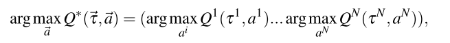

### 注意力机制

MAAC算法使用自注意力机制, 通过选择对其他智能体信息付出的注意力大小, 学习每个智能体的critic; 

TarMAC算法允许通过发送者-接收者软注意机制和多轮协作推理, 在智能体之间进行有针对性的连续通信.

注意力函数可以描述为一个查询和键值对集合到输出结果的映射, 查询($$V_Q$$)、键$$(V_K^i)$$、值、结果都是向量. 结果作为值的加权和, 分配给每个值的权重通过查询和相应键的兼容函数计算.

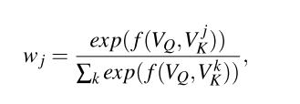

其中$$f(V_Q, V_K^i)$$由用户定义, 衡量相应值的重要性, 常用缩放的点积函数.

在实践中, 多头注意力可以让模型关注不同表示子空间的信息.

## 3. 全局Q值和个体Q值理论分析

阐述协作MARL的局部行为的确切形式, 推导$$Q^i$$到$$Q_{tot}$$的非线性组合形式理论关系.

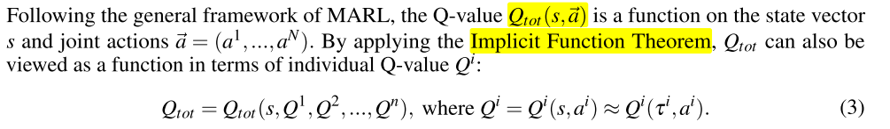

为不失一般性, 假设没有与整体无关的"independent"智能体, 因为独立智能体i不应看作整体的一部分, 否则可以把它看作独立的部分单独优化自己的策略. **即个体变化会对整体产生影响**. 即$$\frac{\partial Q_{tot}}{\partial Q^i}$$不恒等于0

$$\begin{aligned}
\frac{\partial Q_{tot}}{\partial Q^i} \ne 0  
\end{aligned}
$$

本文简单假设状态$$s$$固定, 研究$$Q^i$$到$$Q_{tot}$$在动作空间中接近最大点$$\mathop{a}\limits^{\rightarrow}$$的局部行动. 因为在最优点$${\mathop{a}\limits^{\rightarrow}}_o$$梯度消失, 则

$$
\begin{aligned}
  \frac{\partial Q_{tot}}{\partial a^i} = \frac{\partial Q_{tot}}{\partial Q^i}\frac{\partial Q^i}{\partial a^i} = 0
\end{aligned}
$$

所以, 

$$
\begin{aligned}
  \frac{\partial Q^i}{\partial a^i}(a_o)=0
\end{aligned}
$$

所以$$Q^i(a^i)$$的局部扩展形式为

$$
\begin{aligned}
  Q^i(a^i)=\alpha_i + \beta_i(a^i-a_o^i)^2+o((a^i-a_o^i)^2).
\end{aligned}
$$

其中$$\alpha_i, \beta_i$$是常数. 之后就有$$Q_{tot}$$和$$Q^i$$的非线性依赖(靠近最大点$${\mathop{a}\limits^{\rightarrow}}_o$$附近).

**定理1:**

| 假设动作空间连续且没有独立智能体, 存在常数$$c(s), \lambda_i(s)$$(依赖于状态s), 使得$$Q_{tot}$$的局部展开成如下形式                          |
| :--------------------: |
| 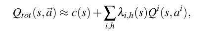                                                                                                            |
| 其中, $$\lambda_{i, h}$$是一个所有$$h$$阶偏导$$\frac{\partial^h Q_{tot}}{\partial Q^{i_1}...\partial Q^{i_h}}$$的线性函数, 并基于h指数衰减. |

公式中$$\lambda_{i, h}$$是所有h阶偏导的函数, 对应于所有的$$Q^{i_1}... Q^{i_h}$$(例如$$\lambda_{i, 2}$$对应二阶非线性组合$$Q^i Q^j$$).

当使用定理1设计多智能体值分解网络时, 采用注意力机制作为一般的函数逼近器, 逼近系数$$\lambda_{i, h}(s)$$(有一个正则化因子). Transformer的通用逼近理论证明.

## 4. 实现: Q-value Attention network (Qatten)

Qatten框架的细节; 智能体的循环Q网络表示个体的值函数, 基于注意力的值混合网络建模智能体级别的影响, 除了$$Q^i$$还在注意力网络里加入其他全局信息(包括$$s, {\mathop{u^i}\limits^{\rightarrow}}$$)

| 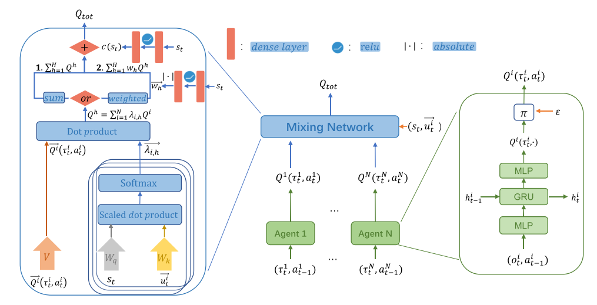 |
| :------------------------------: |
|      图1. Qatten网络结构.       |

右: 智能体i的循环深度Q网络, 输入action-observation记录$$\tau^i$$(上一个隐藏状态$$h_{t-1}^i$$, 当前局部观察$$o_t^i$$, 上一个动作$$a_{t-1}^i$$).

左: 混合网络, 把$${\mathop{Q^i}\limits^{\rightarrow}}(\tau^i_t, a^i_t)$$和$$s_t, {\mathop{u_t^i}\limits^{\rightarrow}}$$混合.s是全局状态, $$u^i$$是智能体i的特征(比如位置)

由公式(7), 

$$
\begin{aligned}
  Q_{tot}\approx c(s) + \sum\limits_{h=1}^H \sum\limits_{i=1}^N\lambda_{i, h}(s)Q^i. 
\end{aligned}
$$

对于每一个h, 可以使用可微键值记忆模型(differentiable key-value memory model)实现内部加权和操作, 逼近系数并建立个体到整体的关系. 该模型有指数级函数逼近能力. **这与MAAC算法不同, MAAC使用自注意力机制, 通过选择为从其他智能体获得的信息付出多少注意力, 为每一个智能体学习critic**.

本文不对每对智能体使用自注意力, 但是使用这种机制帮助整体系统建模每个个体的影响. 特别地, 我们把全局状态的嵌入向量$$e_s(s)$$和个体特征嵌入向量$$e_i(u^i)$$之间传递相似度值传给softmax, 

$$\begin{aligned}
  \lambda_{i, h} \propto exp(e^T_i W_{k, h}^T W_{q, h}e_s), 
\end{aligned}$$

其中, 

* $$W_{q, h}$$把$$e_s$$转换为全局查询, $$W_{k, h}$$把$$e_i$$转换为个体关键字.
* $$e_s$$和$$e_i$$可以通过对$$s$$和$$u^i$$的1或2层嵌入转换得到.
* 对于外层求和, 使用多注意力实现不同阶偏导的逼近. 通过把不同头的Q值$$Q^h$$加和, 得到

$$
\begin{aligned}
  Q_{tot}\approx c(s) + \sum\limits_{h=1}^H Q^h, \  \  where, \  Q^h = \sum\limits_{i=1}^N \lambda_{i, h} Q^i. 
\end{aligned}
$$

==**H是多头的数量.$$c(s)$$项可以通过把全局状态作为输入, 用DNN学习**==.

Qatten自然保持单调, 并且在$$Q_{tot}$$和$$Q^i$$之间具有IGM性质, 

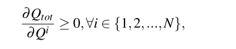

因此, **Qatten使得在off-policy学习最大化联合动作值容易, 并且保证在中心化和去中心化策略上收敛.**

**Weighted Head Q-value**: 以上描述中, 直接把不同头的Q值贡献求和. 为了放松自注意力机制的权重边界限制, 以及提升Qatten的表示能力, 本文为不同头的Q值设计权重$$w_h$$. 为了保障单调, 本文从一个两层前馈网络$$f^{NN}$$中, 用绝对激活函数回收这些头的Q值权重, 该网络基于全局状态s调整头Q值.

$$
\begin{aligned}
  Q_{tot}\approx c(s) + \sum\limits_{h=1}^H w_h \sum\limits_{i=1}^N \lambda_{i, h} Q^i
\end{aligned}
$$

其中, $$w_h=|f^{NN}(s)|_h$$. 加权Q值放松了注意力带来的$$Q_{tot}$$的上下界, 注意公式(12)仍然满足公式(7)的形式.

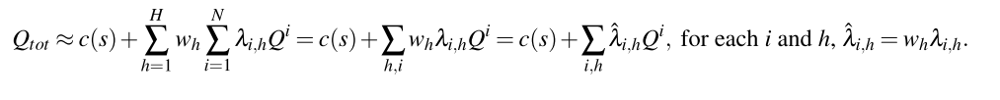

## 5. 实验

### 5.1 设置

* 环境: StarCraft Multi-Agent Challenge (SMAC) environment
* 对手: 电脑AI, 5局平均数
* baseline: COMA、QMIX、QTRAN
* 训练和评估进程, 测试回合数、训练超参数等, 与QMIX相同.
* 对于注意力部分, 查询(全局状态s)和关键字(个体特获赠$$u^i$$)的embedding dim=32, 头数为4
* 地图, easy , hard, super hard
  + 

### 5.2 验证

容易场景:

* Qatten都表现很好
  + 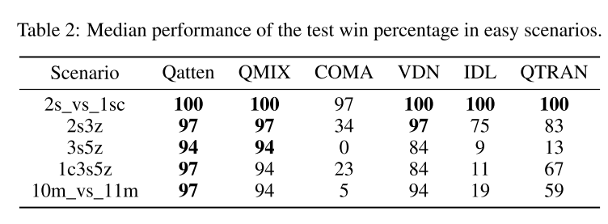
* COMA表现不好, **由于on-policy学习抽样低效, 和不稳定的baseline**, 因为其critic结构简单.
* IDL有一些也表现不好, 因为直接使用全局回报更新策略, 带来了不稳定性, 并且随着智能体数量增多更严重; 
* QTRAN表现也不好, 因为实际放松限制, 妨碍更新的准确性.

困难和很困难场景场景:
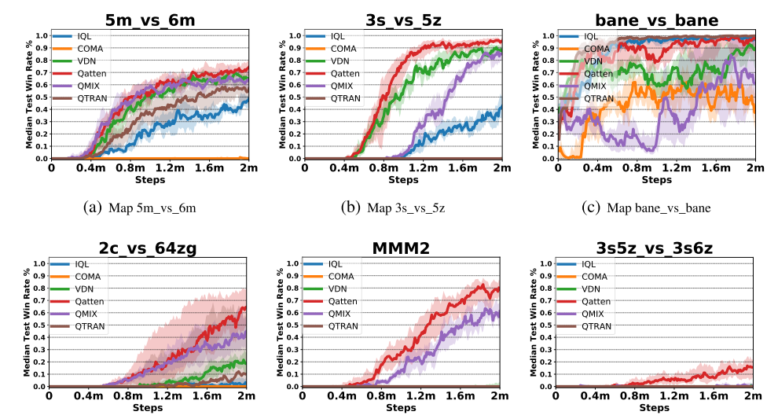

图2:(a-d)困难场景, (e-f)超困难场景. Qatten表现很好, 比如(c)中有24个智能体, 全局Q值严重依赖于４个爆虫, 因此Qatten需要集中在４个爆虫上, 而QMIX不容易发现全局和局部的关系. 

在超困难场景里, 用带权头Q值增强算法. 在(e)中Qatten学会控制医疗运输机(Medivac, 人族)吸收伤害然后撤退, 远超QMIX; 在(f)中, 其他的都失败了, Qatten在2百万步之后成功约16%

### 5.3 消融实验(在3个场景中)

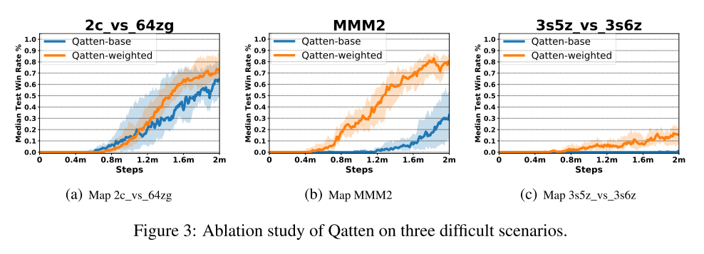

研究带权头的效果, 在困呐场景中, 带权头Q值函数表现更好. 显示了该机制通过$$w_h$$调整头权重, 灵活调整注意力边界, 可以抓住$$Q_{tot}$$和$$Q^i$$之间更复杂的关系.

另外, 在MMM2场景中, $$u^i$$使用$$(u^i, Q^i)$$代替. 通过注意力的softmx激活, 可以加强$$Q_{tot}$$和$$Q^i$$的非线性关系.

### 5.4 注意力分析

在星际平台测试, 给出混合权重分析.

可视化战斗中每一步的注意力权重$$(\lambda_{i, h})$$.

* (a), 获胜的最重要技巧是避免被杀死并集中火力杀死敌人.
  + 图中可以看到盟友的权重相似, 这意味着Qatten觉得$$Q_{tot}$$几乎等分. 这是因为每个盟友在该场景中都扮演相似的角色.
  + 这也可以解释, 当每个$$Q^i$$的权重大致相等时, VDN可能会略胜QMIX.
  + Qatten一个主要趋势是, 唯一活着的单位(智能体0)在回合的后续步骤中获得最高的权重.
  + 通过注意机制把$$Q^i$$的权重差异调整得很小, Qatten的性能要优于VDN, 后者假设智能体在整个战斗中各个Q值的权重相等且保持不变.
* 权重差异在(c))上更加明显. VDN和QMIX都失败, 而Qatten能够在智能体级别近似$$Q_{tot}$$和$$Q^i$$之间的复杂关系, 以更好地感知每个智能体的角色.
  +  例如, 在战斗开始时, 由于存在两种类型的智能体, 因此根据其类型特征, 一种智能体在某个注意里头下会比另一种得到更多的注意力.

|                    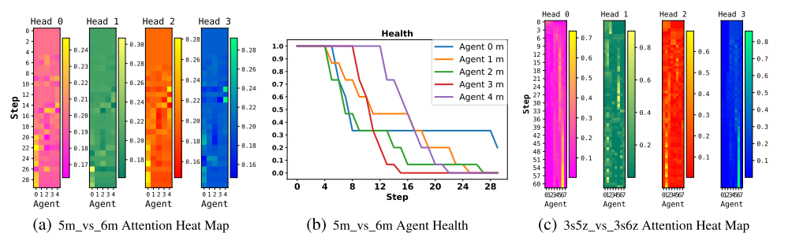                     |
| :---------------------------------------------------------------------: |
| 图4: 注意力权重分析. 热图垂直方向是步数增加方向, 水平方向代表智能体id. |

## 6. 结论

* 提出Q值注意力网络, 解决多智能体Q值分解问题.
* 先是理论分析分解形式, 然后使用多头注意力建立混合网络, 阐述在把个体Q值转换为整体Q值时, 个体在智能体级别对整个系统的影响.
* 在星际环境实验, 显示算法在所有地图表现最好; 进行注意力分析, 对注意力权重给出直观解释.

未来工作:

* 在不同任务上, **令Qatten结合明确的探索机制**; 
* 加入注意力方面的最新进展, 来改进Qatten算法, 使其可以适应包含数百个智能体的大规模游戏

## 7. 附录

### 状态和观察

局部观察:

* 每个时间步, 智能体得到局部观察, 包括地图一个半径为可视域的圆形区域, 设为9; 
* 智能体只能看见视线内的队友, 因此智能体无法判断看不见的队友是死亡还是离得远, 都设为0.
* 智能体观察的特征向量包括距离、相对x、相对y、生命值、防护、单元类型.
* 若智能体同质, 单元类型特征被省略; 所有神族单元有防护值, 可以抵消伤害并可恢复.
* 智能体可观察周围地形特征, 固定半径内的8个点值指示高度和是否可步行.

全局状态: 队友和敌人联合特征的组合.

* 状态向量包括: 所有智能体相对于地图中心的坐标, 及其观察的特征.
* 保存队友的能量/冷却值, 表示攻击/治疗之间的最小延迟; 
* 所有向量用最大值正则化.
* 在Qatten中, 智能体i的个体特征包括自己的位置(相对于地图中心的坐标)、生命值、冷却值、防护、类型特征, 是全局状态的一部分.

  

### 动作空间

* 离散动作集合:move[direction], attack[enemy id], stop and no-op; 
* 死亡智能体只能不行动, 而活着的智能体则不能.
* 智能体移动方向为四个中的两个: 北, 南, 东或西.
* 为了确保任务的去中心化, 智能体仅限于对射击范围内的敌人使用attack[enemy id]. 这也限制了单元使用内置的attack-move宏操作.
* 射击范围设为6. 视线范围比射击范围大, 保证智能体在开始射击前利用移动命令.
* 禁用自动回击.
* 作为治疗者单位, Medivacs(医疗队)使用heal[agent_id]动作而不是Attack[enemy_id].

### 奖励

* 每个时间步长, 智能体联合奖励等于对敌方单元的总伤害.
* 智能体杀死每个对手后可获得10点奖励, 杀死所有对手后可赢得200点奖励以.
* 奖励按比例缩放, 以使每种场景下可获得的最大累积奖励约为20.

### 训练配置

* GPU Nvidia RTX 2080, CPU AMD Ryzen Threadripper 2920X
* 训练时间:8小时至18小时.
* 总训练步数约为200万, 我们每训练1万步就对模型进行一次测试.
* 经验缓冲池:5000回合数据, 抽样32回合数据做批处理.
* 我们使用$$\epsilon - greedy$$策略进行探索. 起始探索率设置为1, 结束探索率设置为0.05. 探索率在最初的5万步线性衰减.
* 我们保留环境参数的默认配置.

### 混合网络超参数

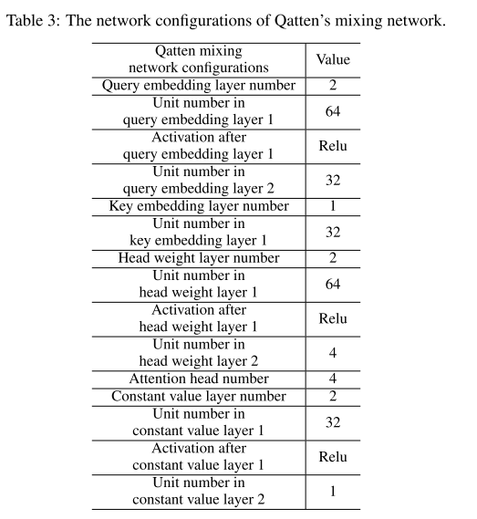
