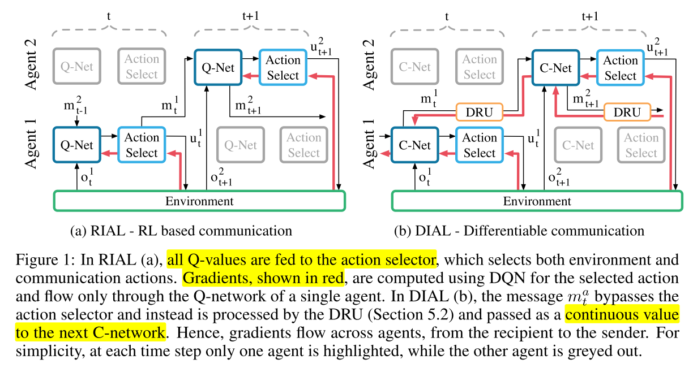
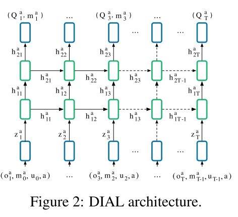
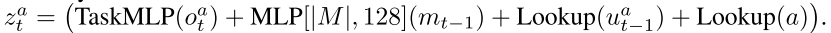
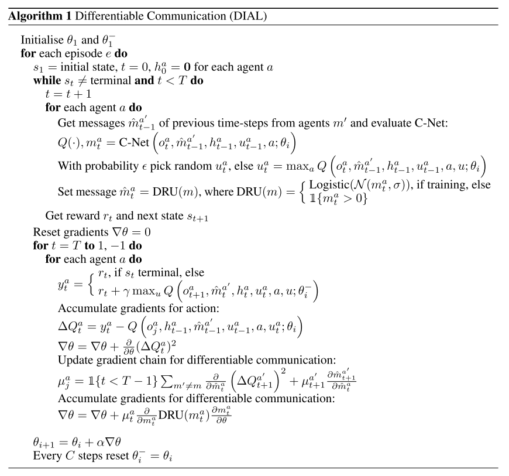

# 2.7 交流-RIAL_DIAL

深度MARL交流问题

论文[Learning to Communicate with Deep Multi-Agent Reinforcement Learning](https://arxiv.org/pdf/1605.06676.pdf)

**核心内容**

* 在完全合作Dec-POMDP, 提出两种端到端训练算法, 使用CTDE架构, (通信带宽有限).
  + Reinforced Inter-Agent Learning (RIAL), 使用DRQN训练, 
  + Differentiable Inter-Agent Learning (DIAL), 通过信道BP误差训练; 
* centralised learning在学习的过程中communictation没有被限制; 而执行的时候, 信道带宽有限.

## 总述

算法思想

* RIAL, 使用DRQN训练
  + 在一个agent中是端到端可训练的(agents之间没有gradient传递); 
  + 变体1, independent Q-learning, 每个智能体使用单独网络, 把其他智能体看作环境一部分, 没有交流
  + 变体2, 所有智能体, 使用同一网络共享参数; 
* DIAL
  + 动机, 集中学习提供了更多的机会来提升学习, 而不仅仅是参数共享.
  + 在集中式训练时, 在多个agent之间传递实值消息, 从而将通信操作视为智能体之间的瓶颈连接.
  + 多个智能体之间是端到端可训练的
  + 在去中心化执行过程中, 实值信息被离散化并映射到任务所允许的离散通信动作集.

相关工作

* Independent DQN, 每个agent 同时学习他们自己的Q function, 存在收敛性问题.
* Deep Recurrent Q-Networks
* 我们考虑离散的通信渠道. 我们方法的关键组成部分之一是去中心化执行过程中的信号二值化. 这与最近的研究有关, 即使用二进制权重将神经网络拟合到具有内存和计算限制的低功耗设备中.

**setting**

由于协议是从动作观察历史到消息序列的映射, 因此协议的空间非常高. 在这个领域自动发现有效的协议仍然是一个难以捉摸的挑战. 特别是, 由于需要智能体来协调消息的发送和解释, 探索这种协议空间的难度增加了.

## 2. 模型

|  |
| :------------------------------: |
|              fig 1               |

### 2.1 RIAL 

核心: 将DRQN和independent Q-learning结合, 每个智能体的Q网络为 $$Q^a(o_t^a, m_{t-1}^{a'}, h_{t-1}^a, u^a) $$, 为了避免网络需要 $$|U||M| $$个输出, 将网络分成$$Q_u^a$$和$$Q_m^a$$两个部分, 分别表示环境动作和交流动作的Q值.  这样输出只需要$$U+M$$.
训练, 

* $$Q_u^a$$和$$Q_m^a$$都是用DQN训练, 非集中式训练
* 在训练时关**闭经验池**, 避免不稳定性.
* **共享网络参数**, 学习参数为$$Q_u(o_t^a, m_{t-1}^{a'}, h_{t-1}^a, u_{t-1}^a, m_{t-1}^{a}, a , u^a_t) $$和$$Q_m(\cdot)$$, 其中$$m_{t-1}^{a'}$$是其他智能体的消息.

### 2.2 DIAL

上一个算法仍然存在问题, 就是无法给agent反馈, 也就是类似于人的交流. 例如, 在面对面的交流中, 听者会向说话者发送快速的非语言队列, 以表明他们的理解程度和兴趣. RIAL缺乏这种反馈机制.

我们提出了**可微内智能体学习(DIAL)方法**.==最重要的是集中学习和Q-networks的结合使之成为可能, 不仅可以共享参数, 还可以通过信道将梯度从一个智能体推到另一个智能体==. 因此, 虽然在每个智能体中RIAL是端到端可训的, 但DIAL是端到端跨智能体的. 让梯度从一个智能体流向另一个智能体可以给他们更丰富的反馈, 通过尝试和错误减少所需的学习量, 并发现有效协议.

DIAL工作原理如下:**在集中学习过程中, 通信动作被一个智能体网络的输出和另一个智能体网络的输入之间的直接连接所取代. 因此, 当任务限制通信到离散消息时, 在学习过程中, 智能体可以自由地彼此发送值消息. 由于这些消息的功能与任何其他网络激活一样, 梯度可以沿着通道返回, 从而允许跨智能体端到端反向传播.**

C-Net输出Q值和消息m, 消息是实数, 绕过动作选择器, 通过discretise/regularise unit(DRU)直接输出给其他智能体的C-Net, 

* DRU在中心化训练时将消息 regularises, $$DRU (m_t^a)=Logistic(\mathcal{N}(m_t^a, \sigma)) $$, $$\sigma$$是加入信道噪声的标准差.
* 在去中心化执行阶段, 将消息离散化, $$DRU (m_t^a)=\mathbb{I}\{m_t^a >0\}$$ 

### 训练网络架构与伪代码

|  |
| :------------------------------: |
|              fig 2               |

状态嵌入由输入元素累加产生的, 

<table>
  <tr>

``` html
 <th></th>
<th> (1) </th>
```

  </tr>
</table>

|  |
| :------------------------------: |
|              伪代码              |

## 总结和评论

RL中的通信分类:

  + 预定义或学习的通信协议
  + 规划或学习方法
  + 演进或强化学习
  + 合作或竞争环境.

  
