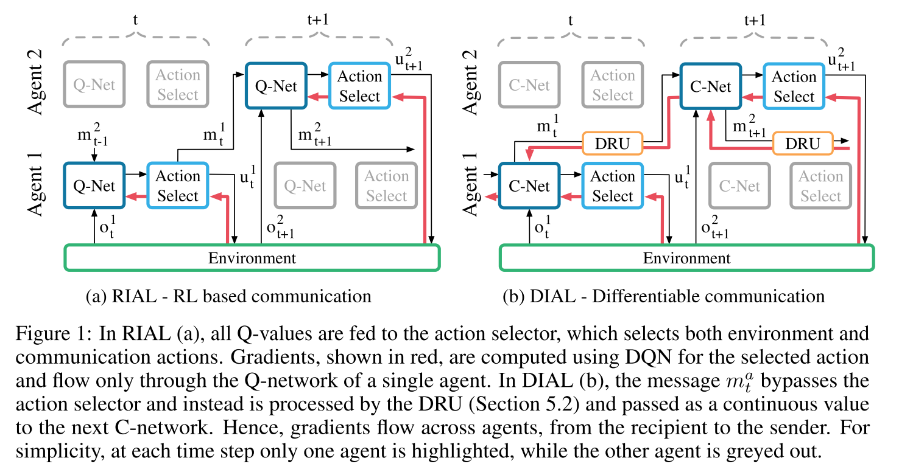

# 2.7 交流-RIAL_DIAL

深度MARL交流问题

论文[Learning to Communicate with Deep Multi-Agent Reinforcement Learning](https://arxiv.org/pdf/1605.06676.pdf)

**核心内容**

- 在完全合作Dec-POMDP, 提出两种端到端训练算法, 使用CTDE架构, (通信带宽有限).
  - Reinforced Inter-Agent Learning (RIAL), 使用DRQN训练,
  - Differentiable Inter-Agent Learning (DIAL), 通过信道BP误差训练;
- centralised learning在学习的过程中communictation没有被限制; 而执行的时候, 信道带宽有限.

## 总述

算法思想

- RIAL, 使用DRQN训练
  - 在一个agent中是端到端可训练的(agents之间没有gradient传递);
  - 变体1, independent Q-learning, 每个智能体使用单独网络,把其他智能体看作环境一部分, 没有交流
  - 变体2, 所有智能体,使用同一网络共享参数;
- DIAL
  - 动机,集中学习提供了更多的机会来提升学习，而不仅仅是参数共享.
  - 在集中式训练时,在多个agent之间传递实值消息,从而将通信操作视为代理之间的瓶颈连接.
  - 多个智能体之间是端到端可训练的
  - 在去中心化执行过程中, 实值信息被离散化并映射到任务所允许的离散通信动作集.

相关工作

- Independent DQN, 每个agent 同时学习他们自己的Q function, 存在收敛性问题.
- Deep Recurrent Q-Networks
- 我们考虑离散的通信渠道. 我们方法的关键组成部分之一是分散执行过程中的信号二值化.这与最近的研究有关,即使用二进制权重将神经网络拟合到具有内存和计算限制的低功耗设备中.

**setting**

由于协议是从动作观察历史到消息序列的映射，因此协议的空间非常高。在这个领域自动发现有效的协议仍然是一个难以捉摸的挑战。特别是，由于需要代理来协调消息的发送和解释，探索这种协议空间的难度增加了。

## 2. 模型

|  |
| :------------------------------: |
|              fig 1               |

### 2.1 RIAL 

核心: 将DRQN和independent Q-learning结合

### 2.2 DIAL

## 总结和评论

RL中的通信分类:
  - 预定义或学习的通信协议
  - 规划或学习方法
  - 演进或强化学习
  - 合作或竞争环境。
- 