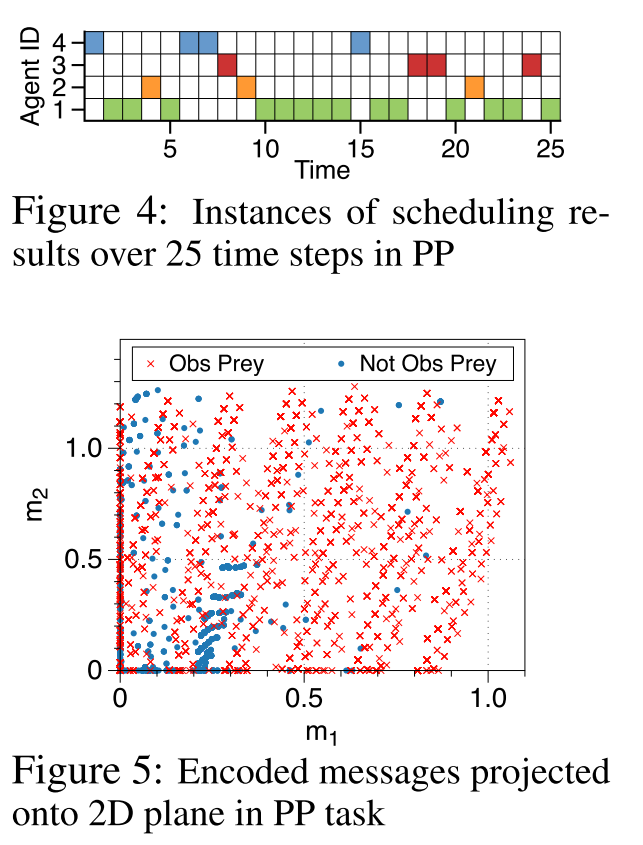

# 7 交流-SchedNet

多智能体强化学习中的交流调度

paper:[Learning to Schedule Communication in Multi-agent Reinforcement Learning](https://arxiv.org/pdf/1902.01554.pdf)

**Motivation**：
- 加速协调的思想：多智能体之间通过分布式的方式沟通, 并以group的形式整体行动；
- 场景：1. 通信带宽有限；2. 智能体共享通信介质, 限制同时使用介质的智能体数量. 
- 通信调度：SchedNet, 学习如何调度自身、如何编码消息、如何基于接收到的消息选择动作. 
- SchedNet基于每个智能体的观察信息学习其重要度, 决定哪个智能体有资格广播消息. 
- 测试任务：协作交流导航、捕食者-猎物. 

## 1.Introduction
本文考虑多智能体交流协作场景. 有两个限制：(1)有限的带宽意味着智能体必须简洁的信息交换:简洁而有意义,(2)共享介质意味着潜在的竞争者必须适当仲裁为合适的避碰,需要某种形式的通信调度,通常称为MAC(介质访问控制)的无线通信领域. 在强调编码/解码和调度问题耦合性质的同时, 我们将注意力集中在上述基于通信信道的问题上, 并相应地构建神经网络. 

**贡献**： 提出SchedNet, 其基本原理是集中训练和分布式执行. 在分布式执行期间, 允许智能体通过无线信道进行通信, 在无线信道中, 消息被广播到其通信范围内的所有智能体. 无线通信广播需要媒介访问控制(MAC)协议. Wi-Fi中的CSMA (Collision Sense Multiple Access)就是这样一种MAC协议.  ==我们认为自己是同类工作中的第一解决了共享媒介争用问题:哪些节点被授予访问共享媒体的权限. == 直观地说, 应该选择具有更重要观测值的节点, 为此我们采用了一种简单而强大的机制, 称为**基于权重的调度器(WSA)**, 旨在协调训练中的简单性与真实MAC协议(如802.11 Wi-Fi)的完整性. 我们针对两个应用程序评估了SchedNet:协作通信和导航以及捕食者/猎物, 并证明了SchedNet优于其他基线机制. 
**相关工作**：只有DIAL明确地解决了带宽相关的问题. 在DIAL中, 训练环境的通信通道具有有限的带宽, 因此, 敦促被训练的智能体建立更节省资源的通信协议. 最近, Jiang＆Lu(2018)提出了一种注意力交流模型, 该模型允许一些要求其他人提供更多信息的特工收集来自相邻特工的观察结果.  但是, 他们没有明确考虑由于共享介质上的通信而导致的有限通信带宽和/或调度所施加的约束. 

## 2.Background

**RL**
**Actor-critic Method**
**Centralized Critic and Distributed Actor (CCDA)**

## 3.Method

### 3.1 交流环境

环境限制：限制带宽、竞争媒介

**基于权重的调度**. WSA (weighted -based Scheduling algorithm). 调度方案有以下两种考虑：
- Top(k)
- Softmax(k)

我们的目标是训练agent, 让每个agent每次采取一个动作时, 只有$$K_{sched}$$ 个agent可以在有限的$$L_{band}$$范围内广播他们的消息,  ==目标是通过合作获得最高的累计奖励. 每个智能体策略应该确定由其调度权重、编码的通信消息和动作. ==

### 3.2结构

我们提出了一个新的具有预定通信的deep MARL框架, 称为SchedNet, 其总体架构如图1所示. SchedNet由以下三个组件组成:(i) actor网络, (ii) scheduler和(iii)评论家网络. 本节仅介绍体系结构, 其详细信息将在后面的部分中介绍. 

|  |
| :------------------------------: |
|               图1                |

**NN**: actor网络是n个智能体网络的集合, 其中每个智能体$$i$$的个体actor网络由以下三个网络组成：消息编码器, 动作选择器和权重生成器, 由以下指定：

|  |
| :------------------------------: |
|                                  |

**耦合性：actor和Scheduler**. 编码器, 权重生成器和调度器是用于处理有限带宽和共享媒体访问约束的模块. 他们的共同目标是学习基于状态的单个智能体观察的“重要性”, 用于生成压缩消息的编码器以及基于每个智能体权重生成器生成的权重用作外部调度机制基础的调度器. 这三个模块一起工作, 可以巧妙地响应时变状态. 训练了动作选择器以解码传入的消息, 并因此采取良好的动作以最大化奖励. 在每个时间步长, 日程表配置文件c取决于每个座席的观察, 因此传入消息m来自不同的座席组合. 由于智能体可以是异类的, 并且它们具有自己的编码器, 所以操作选择器必须能够理解来自不同发送者的传入消息. 但是, 权重生成器的策略发生了变化, 传入消息的分布也发生了变化, 这又受到预定义的WSA的影响. 因此, 动作选择器应适应此更改的计划. 这也依次影响编码器. 编码器和操作选择器的更新再次触发调度器的更新. 因此, 权重生成器, 消息编码器和操作选择器强烈依赖于对特定WSA的依赖, 并且我们会与一位普通评论家同时训练这三个网络. 

**调度逻辑**：调度配置文件c由WSA模块确定, 该模块在数学上是从所有智能体权重$$w$$(由$$f^i_{wg}$$生成)到$$c$$的映射.  如上所述, 这些映射的典型示例是$$Top(k)$$和$$Softmax(k)$$.  每个智能体的调度器都根据所采用的WSA算法进行了适当的训练. 

### 3.3训练

在分布式执行的集中式训练中, 对于给定的WSA, 我们包含图1中的所有组件和模块以搜索$$\theta_{as},\theta_{wg},\theta_{enc}$$; 而在执行中, 通过基于权重的调度器, 每个智能体$$i$$都运行某种共享的且良好建模的媒介访问机制, 因此只需要三个特定于智能体的参数$$\theta^i_{as},\theta^i_{wg},\theta^i_{enc}$$

#### 3.3.1集中式训练

|  |
| :------------------------------: |
|                                  |

**Centralized critic**: ==**由于WSA不可微分**，因此很难通过一次反向传播来更新两个部分, 训练时Actor分为两个部分：(i)消息编码器和动作选择器，(ii)权重生成器。== 

- 为了更新Actor，我们使用由$$\theta_c$$参数化的集中Critic来估计动作选择器和消息编码器的状态值函数$$V_{\theta_c}(s)$$，以及权重生成器的动作值函数$$Q_{\theta_c}^{\pi}(s,w)$$。 
- Critic只在训练时使用,并且**使用包含所有局部观察的全局状态**$$s$$ 
- actor中的所有网络都基于TD梯度进行梯度训练。 
- 为了共享$$V_{\theta_c}(s)$$和$$Q_{\theta_c}^{\pi}(s，w)$$之间的共同特征并执行有效的训练，我们在两个函数之间的神经网络的较低层中使用了共享参数，如图2所示。

**Weight generators**: 

我们使用单个神经网络$$\mu_{\theta_{wg}}(o)$$, 把所有智能体的WG的集合从$$o$$到$$w$$。 注意$$w_i$$是一个连续值，我们应用DDPG算法，其中WG集合的整个策略梯度由下式给出：

|  |
| :------------------------------: |
|                                  |

**Message encoders and action selectors**: 

进行编码和动作选择, 同样是一种聚合网络$$\pi_{\theta_\mu}(\mu|o,c) $$. 使用$$\theta_\mu = \{ \theta_{enc},\theta_{as} \}$$参数化, 通过Actor-Critic策略梯度进行训练.

|  |
| :------------------------------: |
|                                  |

#### 3.3.2分布式执行

在执行中，每个智能体$$i$$应该能够以分布式方式确定调度权重$$w_i$$，编码消息$$m_i$$和动作选择$$\mu_i$$。 此过程基于自身的观察，以及由其自己的动作选择器，消息编码器和权重生成器使($$\theta^i_{as},\theta^i_{enc},\theta^i_{wg}$$)生成的权重。 在每个智能体确定其调度权重之后，WSA会调度$$K_ {sched}$$个智能体，这会导致将已调度智能体的编码消息广播到所有智能体。 最后，每个智能体程序最终都使用收到的消息来选择一个动作。 随着时间的流逝，在不同的观察结果下，该过程将顺序重复进行。

## 4.实验

### 4.1捕食者-猎物

|  |
| :------------------------------: |
|               图3                |

## 4.2 协作交流导航

|  |
| :------------------------------: |
|                                  |