# 2.2 交流-SchedNet

多智能体强化学习中的交流调度

paper:[Learning to Schedule Communication in Multi-agent Reinforcement Learning](https://arxiv.org/pdf/1902.01554.pdf)

**Motivation**:

* 加速协调的思想: 多智能体之间通过分布式的方式沟通, 并以group的形式整体行动; 
* 场景:1. 通信带宽有限; 2. 智能体共享通信介质, 限制同时使用介质的智能体数量. 
* 通信调度: SchedNet, 学习如何调度自身、如何编码消息、如何基于接收到的消息选择动作. 
* SchedNet基于每个智能体的观察信息学习其重要度, 决定哪个智能体有资格广播消息. 
* 测试任务: 协作交流导航、捕食者-猎物. 

## 1. Introduction

本文考虑多智能体交流协作场景. 有两个限制:(1)有限的带宽意味着智能体必须简洁的信息交换: 简洁而有意义, (2)共享介质意味着潜在的竞争者必须适当仲裁为合适的避碰, 需要某种形式的通信调度, 通常称为MAC(介质访问控制)的无线通信领域. 在强调编码/解码和调度问题耦合性质的同时, 我们将注意力集中在上述基于通信信道的问题上, 并相应地构建神经网络. 

**贡献**: 提出SchedNet, 其基本原理是集中训练和分布式执行. 在分布式执行期间, 允许智能体通过无线信道进行通信, 在无线信道中, 消息被广播到其通信范围内的所有智能体. 无线通信广播需要媒介访问控制(MAC)协议. Wi-Fi中的CSMA (Collision Sense Multiple Access)就是这样一种MAC协议. ==我们认为自己是同类工作中的第一解决了共享媒介争用问题: 哪些节点被授予访问共享媒体的权限.== 直观地说, 应该选择具有更重要观测值的节点, 为此我们采用了一种简单而强大的机制, 称为**基于权重的调度器(WSA)**, 旨在协调训练中的简单性与真实MAC协议(如802.11 Wi-Fi)的完整性. 我们针对两个应用程序评估了SchedNet: 协作通信和导航以及捕食者/猎物, 并证明了SchedNet优于其他基线机制. 
**相关工作**: 只有DIAL明确地解决了带宽相关的问题. 在DIAL中, 训练环境的通信通道具有有限的带宽, 因此, 敦促被训练的智能体建立更节省资源的通信协议. 最近, Jiang＆Lu(2018)提出了一种注意力交流模型, 该模型允许一些智能体要求其他人提供更多信息, 收集来自相邻智能体的观察结果. 但是, 他们没有明确考虑由于共享介质上的通信而导致的有限通信带宽和/或调度所施加的约束. 

## 2. Background

* **RL**
* **Actor-critic Method**
* **Centralized Critic and Distributed Actor (CCDA)**

## 3. Method

### 3.1 交流环境

环境限制: 限制带宽、竞争媒介. 每个时间步只有有限数量的智能体能够发送消息, 每个时间步聚合消息大小为$$L_{band}$$, 限制智能体数量$$K_{sched}$$.

**基于权重的调度**. WSA (weighted -based Scheduling algorithm). 智能体确定自己的权重, 然后使用预置规则调度. 方案有以下两种考虑:

* Top(k), 根据权重选最大的k个; 
* Softmax(k), 使用每个智能体的softmax值$$\sigma_i(w)=\frac{e^{w_i}}{\sum_{j=1}^n e^{w_j}}$$, 根据概率分布$$[ \sigma_i(w)]_{i=1}^n$$随机选择k个.

==分布式执行机制是研究重点==.

我们的目标是训练agent, 让每个agent每次采取一个动作时, 只有$$K_{sched}$$ 个agent可以在有限的$$L_{band}$$范围内广播他们的消息, ==目标是通过合作获得最高的累计奖励. 每个智能体策略应该确定由其调度权重、编码的通信消息和动作== .

### 3.2结构

我们提出了一个新的具有调度通信能力的deep MARL框架, 称为**SchedNet**, 其总体架构如图1所示. SchedNet由以下三个组件组成:(i) actor网络, (ii) scheduler和(iii)Critic网络. 本节仅介绍体系结构, 其详细信息将在后面的部分中介绍. 

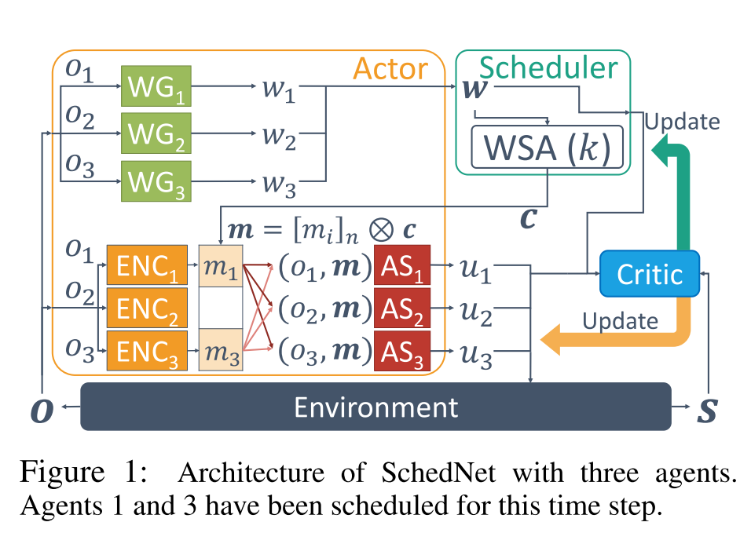

**NN**: actor网络是n个智能体网络的集合, 其中每个智能体$$i$$的个体actor网络由以下三个网络组成: 消息编码器, 动作选择器和权重生成器, 由以下指定:

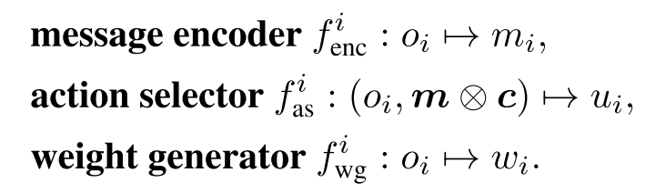

其中, $$m_i $$表示消息编码, $$c_i\in \{0, 1\} $$代表调度信息, 用于调度所有智能体发送消息, 例如, $$m=[010, 111, 101], c=[110], m\otimes c=010111 $$. 

**耦合性:actor和Scheduler**. 编码器, 权重生成器和调度器是用于处理有限带宽和共享媒体访问约束的模块. 他们的共同目标是学习每个智能体观察基于状态的"重要性". 
(编码器生成压缩消息, 权重生成器生成每个智能体观察的权重, 调度器基于权重作外部调度机制, 动作选择器解码传入的消息, 并选择动作以最大化奖励.) 每个时间步 $$m, c $$进行不同组合. 

由于智能体可以是异类的, 并且它们具有自己的编码器, 所以动作选择器必须能够理解来自不同发送者的传入消息. 但是, 权重生成器的策略发生了变化, 传入消息的分布也发生了变化, 这又受到预定义的WSA的影响. 因此, 动作选择器应适应此调度变化. 这也反过来影响编码器. 编码器和动作选择器的更新再次触发调度器的更新. 因此, 权重生成器, 消息编码器和操作选择器强烈依赖于特定WSA, **这里用一个critic网络同时训练这三个网络**. 

**调度逻辑**: 调度配置文件c由WSA模块确定, 该模块在数学上是从所有智能体权重$$w$$(由$$f^i_{wg}$$生成)到$$c$$的映射. 如上所述, 这些映射的典型示例是$$Top(k)$$和$$Softmax(k)$$. 每个智能体的调度器都根据所采用的WSA算法进行了适当的训练. 

### 3.3训练

在分布式执行的集中式训练中, 对于给定的WSA, 我们包含图1中的所有组件和模块以搜索$$\theta_{as}, \theta_{wg}, \theta_{enc}$$; 而在执行中, 通过基于权重的调度器, 每个智能体$$i$$都运行某种共享的且良好建模的媒介访问机制, 因此只需要三个特定于智能体的参数$$\theta^i_{as}, \theta^i_{wg}, \theta^i_{enc}$$

#### 3.3.1集中式训练

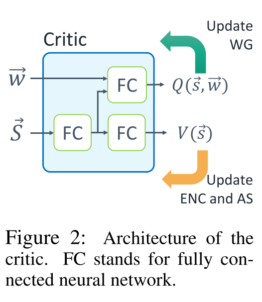

**Centralized critic**: ==**由于WSA不可微分**, 因此很难通过一次反向传播来更新两个部分, 训练时Actor分为两个部分:(i)消息编码器和动作选择器, (ii)权重生成器.== 

* 为了更新Actor, 我们使用由$$\theta_c$$参数化的集中Critic来估计动作选择器和消息编码器的状态值函数$$V_{\theta_c}(s)$$, 以及权重生成器的动作值函数$$Q_{\theta_c}^{\pi}(s, w)$$. 
* Critic只在训练时使用, 并且**使用包含所有局部观察的全局状态**$$s$$ 
* actor中的所有网络都基于TD梯度进行梯度训练. 
* 为了共享$$V_{\theta_c}(s)$$和$$Q_{\theta_c}^{\pi}(s, w)$$之间的共同特征并执行有效的训练, 我们在两个函数之间的神经网络的较低层中使用了共享参数, 如图2所示.

**Weight generators**: 

我们使用单个神经网络$$\mu_{\theta_{wg}}(o)$$, 把所有智能体的WG的集合从$$o$$到$$w$$. 注意$$w_i$$是一个连续值, ==我们应用DDPG算法, 其中WG集合的整个策略梯度由下式给出==:

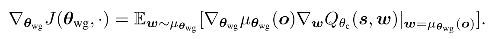

为了在所有调度配置文件集中获得足够的经验, 我们对策略梯度进行采样Q_, $$\mathcal{C}=\{c|\sum_{c_i} \le  k\} $$. $$Q_{\theta_c}(s, w) $$的值使用集中化critic估计.

**Message encoders and action selectors**: 

进行编码和动作选择, 同样是一种聚合网络$$\pi_{\theta_\mu}(\mu|o, c) $$. 使用$$\theta_\mu = \{ \theta_{enc}, \theta_{as} \}$$参数化, 通过Actor-Critic策略梯度进行训练.

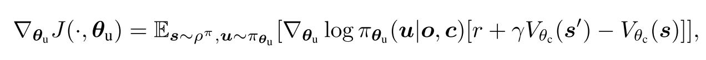

其中, $$\theta_{\mu} $$使用梯度上升训练. 

#### 3.3.2分布式执行

在执行中, 每个智能体$$i$$应该能够以分布式方式确定调度权重$$w_i$$, 编码消息$$m_i$$和动作选择$$\mu_i$$. 此过程基于自身的观察, 以及由其自己的动作选择器, 消息编码器和权重生成器(参数分别为$$\theta^i_{as}, \theta^i_{enc}, \theta^i_{wg}$$)生成的权重. 在每个智能体确定其调度权重之后, WSA会调度$$K_ {sched}$$个智能体, ==这会将已调度智能体的编码消息**广播**到所有智能体==. 最后, 每个智能体程序最终都使用收到的消息来选择一个动作. 随着时间的流逝, 在不同的观察结果下, 该过程将顺序重复进行.

## 4. 实验

**环境**

* 捕食者-猎物(Predator and Prey, PP)
* 协作导航(Cooperative Communication and Navigation, CCN)
* 发送消息智能体数量k, 带宽l
* baseline: DIAL, DIAL(k)(k个智能体使用轮询方法调度, 智能体重用未调度智能体的过时消息来决定要采取的动作), IDQN, COMA.
* 消融实验, 查看调度器的作用: 1. 轮询(round robin, RR), 智能体按顺序轮流通信; 2. 全通信(full communication, FC), 所有智能体都发送消息. 
* 消融实验, 查看WSA的效果.1. Sched-Softmax(1). 2. Sched-Top(1).

### 4.1捕食者-猎物

4个智能体, 拥有不同的视野, 智能体1是5x5范围, 智能体2, 3, 4视野范围是3x3. 捉到猎物获得奖励, 所以性能矩阵为抓到猎物的时间步.

局部观察: 自己位置, 相对于猎物的位置(如果能观察到). 结果如图3所示.

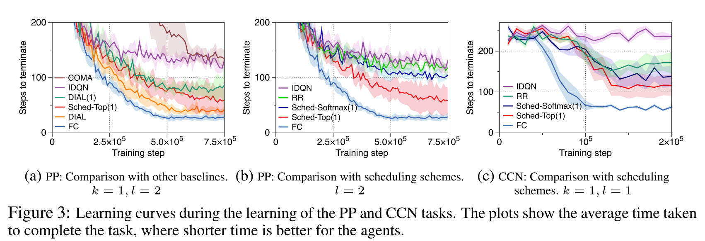

* **PP结果(3a)**:
  + FC. 由于智能体可以使用全部状态信息, 性能最好.
  + SchedNet表现比IDQN和COMA好. 发送消息确实可以让智能体学会快点找到猎物. 
  + DIAL算法表现好, 但是它不是为了适应共享通信介质的环境. 在使用IDAL(1)算法时, 表现就不好. 因为没有使用调度信息, 消息可能误导.
* **智能调度(3b)**:
  + Sched-Softmax(1)比IDQN和RR好.
  + Sched-Top(1)最好说明确定性选择最好.
* **Weight-based Scheduling**
  + SchedNet已经学会了用更深层的观察来调度智能体, 并实现了PP场景中基于重要性分配调度优先级的基本原理.
  + 如图4, 智能体1视野大, 所以更频繁地调用. 四个智能体调度数分别问(14, 3, 4, 4), 权重分别为(0.74, 0.27, 0.26, 0.26). ==说明调度其学会了给观察力强的智能体更大的权重, 更频繁调用它.==
* **消息编码**, 通信内容, 如图5所示, 是在SchedNetTop(1)下, 调度智能体消息产生的2D投影
  + 当智能体观察不到投影时(蓝点), 大多数消息在途中左下部分. 
  + 当智能体观察到猎物时(红x), 消息方差很大.
  + 这是因为, 智能体应该发送更有信息量的消息.

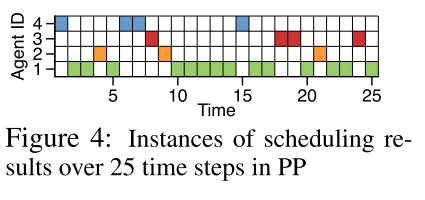

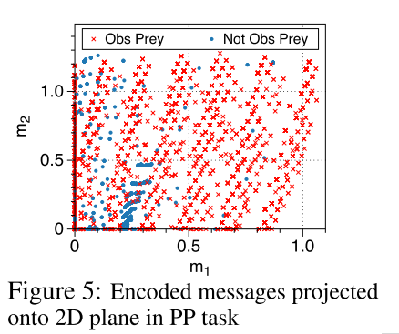

### 4.2 协作交流导航

在此任务中, 每个智能体到达各自目标, 并且都到达各自目的地时, 获得联合奖励. 每个智能体看不到自身周围情况, 但是都知道其他智能体的情况. 

为了引入异质性, 任务开始时每个智能体目标距离不同. 性能指标是完成CCN任务所花费的时间.

* **CCN结果(3c)**
  + IDQN 时间最长
  + FC时间最短
  + RR表现一般, 比IDQN好, 因为每个智能体都至少有发送消息的机会.
* **CCN调度**, 如图6
  + 由于智能体2到目标距离更远, 所以智能体1更加频繁被调用. 以驱动2到达目的地(7 vs 18). 
  + 这表明SchedNet通过调度灵活地适应了智能体的异质性.
  + 这与从PP环境中获得的结果一致: 更重要的智能体被调度的次数越多.

## 5 结论

* 实现调度网络
* 使用集中式训练分布式执行架构. 集中式Critic提供Q和V, 分布式Actor包含消息编码, 动作选择和权重生成模块.
* 智能, 分布式交流调度可以增强算法表现.

## 6 问题与评价

* 图5所示的消息是什么意思???
* 可以考虑调度+消息约简(attention).
* 工作量不大. 而且提出的核心调度没什么意义. 就是权重生成那块选了一个.
* 但是权重生成的方案可以参考. 还是使用外部Q值. 可以考虑师兄的内部奖励.
* baseline也没什么意义. 效果比FC和DIAL差. 在图3(b)(c)里没放DIAL(1)是SchedNet-Softmax(1)表现不如它好应该.

- 

## 6 附录

### 6.1 伪代码

伪代码, 其中使用简化, $$f^i_{as}(o^i, c)= f^i_{as}(o^i, f^i_{enc}(o^i)\otimes c) $$ 

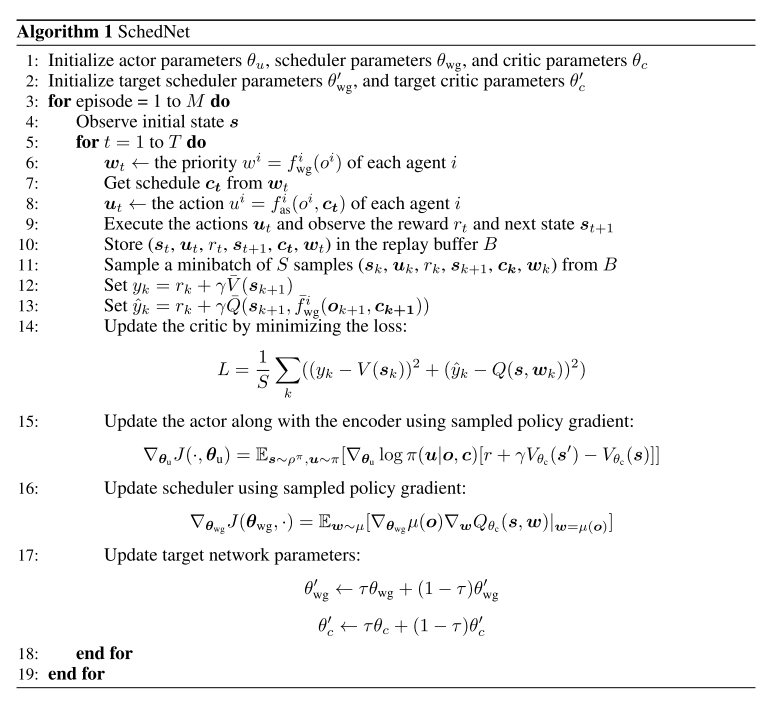

### 6.2 环境细节

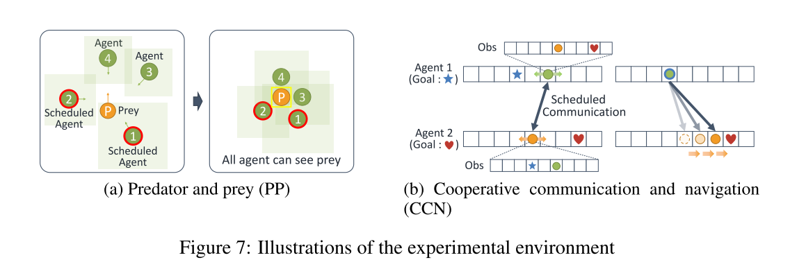

### 7.3 实验细节

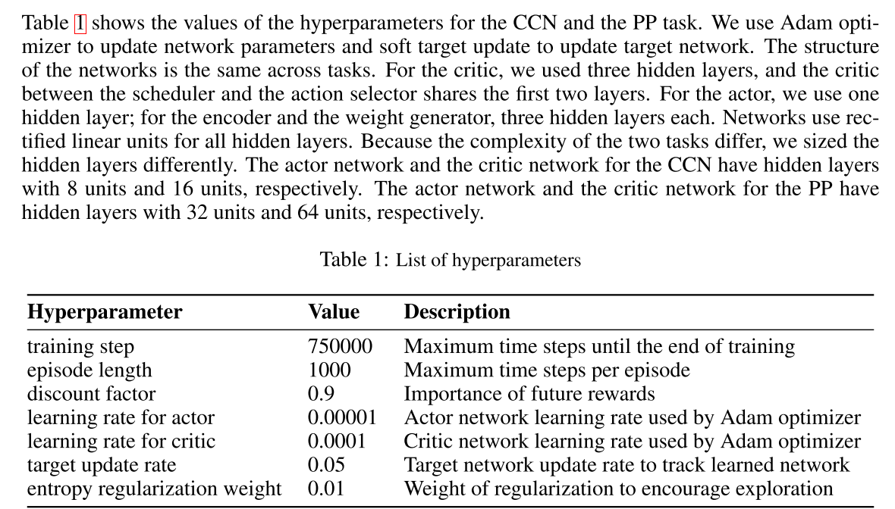

