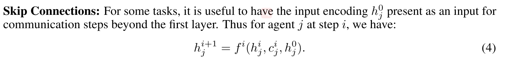

# 2.5 交流-commNet

通过反向传播学习多智能体交流

论文:[Learning Multiagent Communication with Backpropagation](https://arxiv.org/pdf/1605.07736.pdf)

* 学习连续通信的信道, 反向传播训练.
* 使用简单的平均方法, 把消息发送给所有智能体.

## 1. Introduction

本文提出的智能体之间学习通信的模型. 每个智能体由一个DNN控制, 这个网络接入了一个communication channel获得一个连续向量. 通过这个channel, 智能体收到了其他智能体传递的综合信息.

**因为communication是连续的, 因此模型可以通过反向传播训练得到.**

我们的模型是一个大的前向神经网络, 将每个智能体的输入映射到动作, 每个智能体占领单元的一个子集. 在层与层之间有一个特别的连通性结构(1)实例化代理之间的广播通信通道.(2)反向传播智能体状态.

## 2 Communication Model

网络的输入是将各个智能体观测的信息concate起来: $$s=s_1, ..., s_j $$ 
输出是各个智能体会做出的动作: $$a=a_1, ..., a_j $$ 

### 2.1 Controller Structure

|  |
| :------------------------------: |
|              fig 1               |

整体来看, 整个模型架构由一个个灰色块$$f^i $$组成. 每一层中的灰色块由智能体的个数决定, 并且同一层的灰色块的参数一样.

* 随着智能体数量的改变, $$T$$是可以动态变化.

模型的第一层是将状态进行编码$$h_j^0 =r(s_j)$$, 这一层不需要计算communication信息.
模型的输出层是一层神经网络$$q(j_j^K) $$, 跟着softmax操作, 来产生离散动作的概率分布.

### 2.2 Local Connectivity

上面的框架的另一个方案是, 允许智能体与在自己通信范围内的其他智能体通信. 用$$N(j)$$表示位于智能体j通信范围内的智能体集合. 那么通信消息式子变为:

<table>
<tr>
<th></th>
<th> (3) </th>
</tr>
</table>

随着智能体移动, $$N(j)$$一直发生变化. 在这种情况下, 我们的模型就变成了一个动态图. 这使得我们的模型挺像GGSNN.

### 2.3 Skip Connections

### 2.4 Temporal Recurrence

我们也尝试RNN网络. 这个实现是通过将上式中的communication step $$i$$用时间步$$t$$替代. 然后对于所有的时间步$$t$$, 用相同的模块$$f^t$$. 如果$$f^t$$是单层网络, 那么我们获得平坦的RNN, 可以互相communicate.

## 3. 实验

### 3.1 Baselines

* **Independent controller**. 训练一个大的shared parameter的网络, 但是不包括任何的通信. 这个模型的好处是智能体可以自由加入或者离开队伍, 但是很难将智能体学会合作.
* **Fully-connected**. 整个模型是多层全连接网络, 输出是多个softmax heads. 这个模型运行智能体之间互相通信, 但是这个模型不够灵活, 也就是说智能体的数目必须固定.
* **Discrete communication** . 另一种通信的方式是discrete symbols, 这些symbols的含义在训练的过程中学习到. 这样的话模型包含了discrete operations并且不可微了, 在这种情况使用强化学习来训练.

### 3.2 Simple Demonstration with a Lever Pulling Task

一共有m 个杆子, N个智能体. 在每个回合, m个智能体从N个智能体中随机取出, 然后他们要选择拉动的杆子. 他们的目标是尽可能的拉动不同的杆子, 他们的奖励正比于拉动的不同杆子的数量.

|  |
| :------------------------------: |
|              fig 2               |

### 3.3 Multi-turn Games

1. Traffic Junction
    - 控制车辆通过交通枢纽，使得流量最大，但是不会发生碰撞。
2. Combat Task
    - 多个智能体对打其他的多个敌方机器人。

## 4. 评论

如何使用更深的网络???
跳连结构

* 不适合混合环境
* 全局reward平均, 无法解决信用分配问题.
