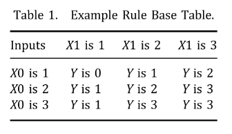
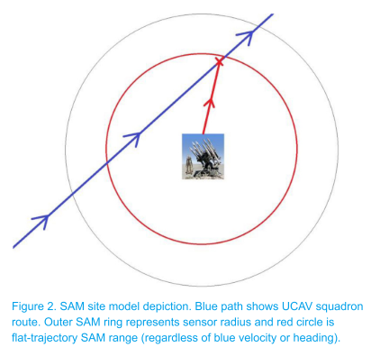
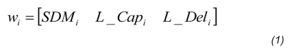
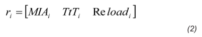
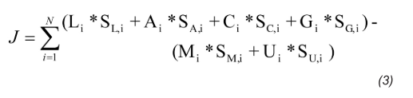
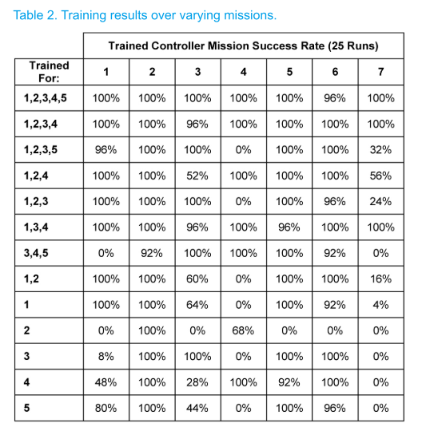

# 2.遗传模糊树训练

基于遗传级联模糊方法的自动战斗机智能控制器学习。
相关：[1.遗传模糊树](./gft.md)

论文[Learning of Intelligent Controllers for Autonomous Unmanned Combat Aerial Vehicles by Genetic Cascading Fuzzy Methods](https://www.researchgate.net/publication/266261330_Learning_of_Intelligent_Controllers_for_Autonomous_Unmanned_Combat_Aerial_Vehicles_by_Genetic_Cascading_Fuzzy_Methods)


目标： 期待无人战斗机（UCAV）操作的自主性水平提高，显然，任务、飞行和地面控制将利用新兴的智能系统范式（IS）。 即，具有在不确定情况下学习、适应、表现出鲁棒性的能力，可以“实时理解”实时收集的数据，并在面对与训练场景截然不同的场景时进行推断。

LETHA的这篇介绍性论文将集中讨论：**控制武器系统**。

---

## Introduction

- LETHA：学习增强战术处理算法。使用遗传算法为多个模糊逻辑系统创建规则库并优化隶属度函数，系统的输入和输出与其他新数据一起传给其它系统。
- HADES：仿真系统。UCAV沿预设路线行进。

主体：
- UCAV：作战无人机，装备先进传感器、自卫导弹（SDM）、激光武器系统（LWS）。一个小队4架。
- SDM：发射后不管，可以打击导弹、拦截机
- LWS：只打导弹，与距离关系很大；燃烧时间也与导弹形状有关，（比如IR导弹，正面摧毁很容易，侧面很难）
- SAM，地对空导弹基站，红方

设置：
- UCAV装备空对地导弹，不受AI控制，到达目标上空即认为摧毁目标。每个UCAV面对SAM基站威胁和关键目标，都要摧毁。
- - 在不同于训练场景的任务场景中测试了所得控制器的**蒙特卡洛模拟**，以确定在新环境中的训练效果以及深度学习的存在。
- 训练后，结果是一组完全确定的模糊逻辑控制器。

## 相关背景
### 遗传模糊系统
编码方法：
匹兹堡方法的编码类型：假设FIS的一些任意规则库：
```
If X0 is 1 and X1 is 1, Y is 0 . 
If X0 is 1 and X1 is 2, Y is 1 . 
If X0 is 1 and X1 is 3, Y is 2 . 
If X0 is 2 and X1 is 1, Y is 1 . 
If X0 is 2 and X1 is 2, Y is 2 . 
If X0 is 2 and X1 is 3, Y is 3 . 
If X0 is 3 and X1 is 1, Y is 1 . 
If X0 is 3 and X1 is 2, Y is 3 . 
If X0 is 3 and X1 is 3, Y is 3
``` 



现在逐行获取单元格的值，将获得字符串012123133。一个字符串表示整个规则库和MF参数。因此在**每一代都可以创建和评估多个控制器**，这是匹兹堡方法的特点。

调整隶属度函数过程类似，其中字符串中的数字对应于每个端点的某些变化。 在LETHA中，值5表示端点无偏移。 较小的值（最小值为0）表示负偏移，而正值表示最大为9。 该过程受到限制，从而不允许无效重叠，并且至少一个隶属函数覆盖了整个标准化输入范围。


### 级联模糊系统

当此处假设一个系统的输出和另一个系统的输入之间没有耦合。随着耦合的增加，性能也可能会下降。用性能换时间

### 遗传模糊系统

结合以上两种方法，一个string不同部分表示多个模糊逻辑控制器，每个部分都有相应的**两个子部分**。

使用遗传级联模糊系统，快速、好训练、可能导致精度损失，但是对于复杂问题高效、鲁棒、性能好。

## 方法
### 1模拟环境

HADES，内部，四个矩阵追踪蓝红方何时会互相攻击，以及若不反击每一种进攻性武器何时会击中他们的目标。

唯一未知的行动是蓝队对抗红方导弹的行动过程，因为这是控制器的输出。

假设每个UCAV可以自动检测红方导弹，经过一定延迟，可知导弹到达时间、LWS攻击的导弹外形。

SAM可以确定直到往哪个方向发射可以在有效范围内打击蓝方，所以一旦发射，可以认为导弹在轨道上，UCAV必须在交点前打击所有SAM。



表示：
- 等式（1）向量b是特定UCAV的主要状态，矩阵B是整个机组的状态。
- 
- 当前剩余的SDM、当前LWS容量，当前LWS延迟，位置为xi和yi。 LWS延迟-指定LWS必须完成其当前或计划的行动的时间，以及何时准备向另一枚红色导弹发射。 SDM弹药因每次任务而异，在所有任务中，LWS的最大容量设置为10秒发射时间，每秒补给速度为0.15秒。
- 
- 等式（4）是红方，当前空中导弹数量、导弹到达最近蓝方目标的时间，实体再次发射的剩余时间、位置坐标，除了AI，其他的都不变。
- 注意对于红方拦截机,reload时间无限,因为它发射所有导弹.
  
目标函数
- 
  ```
    L-被激光摧毁的红方导弹数量
    A-摧毁的红方拦截机的数量
    C-摧毁的红方关键目标数量
    G-摧毁的红方地面威胁的数量
    M-发射的SDM数量
    U-蓝方UCAV损失的数量
    S-上面每个对应的点值
  ```
- 在目前的任务中，$S_U$暂时具有重要意义，因为没有损失是可以接受的。 但是，将此值设置为无穷大会抑制训练。 所有这些价值都是在训练之前任意决定的，并且应该反映出任务目标。
- 最后假设,中队立即直到敌方导弹或设施是否被摧毁(90%的概率反击失败,中队不知道这个概率),一旦导弹被摧毁,就从地图上移除.

### 2.LETHA

有三个FISs;一个置信度的FIS，一个单独武器的FIS和整个中队武器的FIS。所有的FISs都利用三角隶属函数、归一化模糊输入和质心去模糊化方法来确定精确输出。

#### 置信水平FIS

- 输入：两个，任务剩余时间、已知剩余威胁数，
- 每一个分解成3个隶属度函数，每种组合产生一个if-then规则
- 输出：3种，决定行为保守、正常、勇敢；
- 该FIS有必要，为了防止在不必节约资源的时候节约

#### individual weapon FIS

- 输入： 公式（1），SDMs剩余，LWS容量，LWS延迟，以及导弹的轮廓；导弹距离也是LWS容量和延迟落入何种隶属函数的决定因素。
- 输出：这个FIS的结果是UCAV是否会选择发射SDM，立即发射激光，稍微发射激光，适当延迟发射激光，最大延迟发射激光

#### whole squadron weapons FIS

- 输入：独立武器选择FIS的输出，整个W矩阵（迭代所有UCAV）；
- 输出：哪个UCAV行动，哪个UCAV延迟；
- 该过程对所有无人机迭代，直到每个导弹都被覆盖到

### 3.string 结构

string长度75，
前36个是独立武器选择，
```
0 - Use SDM
1 - Use immediate lase
2 - Use slight delay lase
3 - Use moderate delay lase
4 - Use max delay lase
```
接下来18个对应整个中队：
```
0 - Bid to act
1 - Bid to delay
```
接下来9个表示置信等级FIS
```
0 - Be cowardly
1 - Be normal
2 - Be brave
```
最后12个影响隶属度函数的端点
```
5 - No shift
<5 - Negative shift
>5 - Positive shift
```
### 4.进化过程

- 从种群中随机选择一定数量string，最好的用于繁殖，
- 没有精英策略，每一代繁殖完只保留新一代，
- 繁殖时发生交叉、反转、变异，**是在string的不同部分发生的**。
- 因为歼敌概率不是100%，所以有的可能幸运，为了弥补这一点，使用bank策略；某一代结束，当某个string的适应度在当前全局最优的某个范围内，就记录到bank里。（仍然从种群里移除）
- 训练结束，使用蒙特卡洛模拟测试bank里的string。每个string运行25次

整体过程如下
```
1.  Initialize mission and simulation parameters 
2.  LETHA creates generation of strings 
  a.  If first generation, all are randomly made 
3.  HADES runs for every string, for every mission 
  a.  Cascading fuzzy controller created 
  b.  Handles every event until mission is over (See next section)
4.  Fitness values returned to LETHA 
  a.  Qualifying strings are sent to bank 
5.  Last GA generation? 
  a.  If no, go back to 2 
6.  HADES iterations for string bank 
7.  Optimal string is output as controller
```

处理事件的过程如下
```
1.  Related parameters imported 
2.  Red entity fires upon squad 
3.  UCAVs determine time of impact 
4.  Confidence FIS determined how many counters 
5.  Individual weapons systems FIS assigns actions to each UCAV to each threat
6.  Squad weapons systems FIS takes info and determines who should act or delay
  a.  Maximum missiles countered per iteration = number of UCAVs in squad
7.  All theoretical red missiles covered? 
  a.  If no, go back to 5 
8.  Output control, update state and time matrices, continue simulation until next event
```

## 结果

完成了针对不同任务的多次训练，并在每个任务中运行了25次控制器。在90%的杀伤概率存在的情况下，考虑到任务的难度和一连串武器故障导致失败的能力，92%或更高的任务成功率被认为是最优的，而不考虑最优控制。结果如表2所示。

使用Intel 2.4 GHz i7四核处理器、16gb内存和固态硬盘的笔记本电脑可以进行计时。利用并行处理，一次任务的训练时间为7.09分钟。运行一个控制器完成一个任务大约需要1.0秒，处理对小队的SAM射击平均需要62毫秒，存储的控制器的大小是75字节(字符串的长度)。



## 结论

- 提出了一个遗传级联模糊系统LETHA，以及相应的仿真环境HADES。 
- 尽管存在巨大的样本空间，但仍能够开发出适应不同情况、对不确定性具有弹性并显示深度学习的智能控制器。
- 蒙特卡洛研究表明，在不同的训练集下，LETHA的有效性是不同的。遗传级联模糊系统可以将遗传算法和模糊逻辑两者的优势有效地应用于这种复杂情况