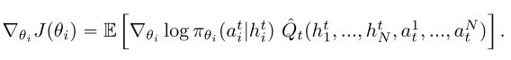
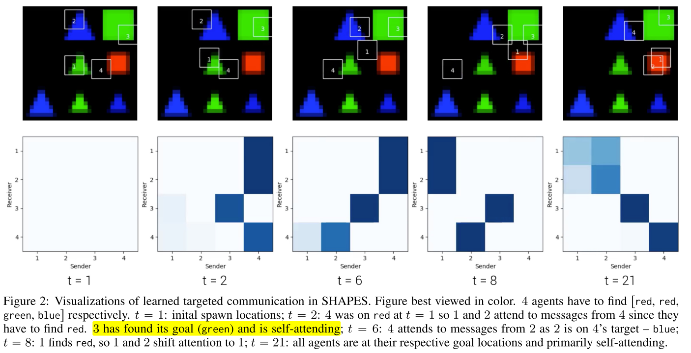

# 2.4 交流-tarMAC

TarMAC: 有目标的多智能体交流

论文: [TarMAC: Targeted Multi-Agent Communication](https://arxiv.org/pdf/1810.11187.pdf)

中心思想:

* 解决发送什么消息和发送给谁的问题. 该目标行为通过下游特定任务奖励单独学习, 而不用交流监督.
* 采用多轮通信的方法, 智能体在行动前进行多轮通信.
* agent学习的目标沟通策略是可解释的和直观的.

## 1. Introduction

定向交流可能比广播方法有效. 使智能体在复杂环境中使用更灵活的沟通策略.

该方法通过一个简单的基于**签名的软注意机制**来操作的: 发送方广播消息和一个密钥, 该密钥用来指示要发送给的智能体的属性. 接收方使用该密钥衡量消息的相关性. 这种交流机制使用任务奖励进行端到端训练, 在没有attention监督的情况下, 隐式学习.

该框架中软注意力机制提供的归纳偏差, 保证智能体能够:

* 交流智能体特定任务目标
* 自适应队伍规模
* 可通过预测的注意力概率解释, 哪个智能体对谁交流什么.

只使用定向通信效果不好, 在一个时间步进行多轮通信, 涉及到在内存中持久存储, 并通过高带宽信道交换大量信息. 所以使用集中式训练分布式执行的AC框架.

本文工作:

* 我们首先对TarMAC及其无attention消融进行基准测试, 使用协同导航任务. 表明智能体可以学习跨任务困难的直观注意力行为.
* 在5.2节, 在traffic junction环境评估TarMAC. 表明, 在团队规模变化的情况下, agent能够自适应地关注"active" agents.
* 5.3节, 在House3D中通过协作的第一人称目标导航任务展示其在3D环境中的效果.
* 在5.4节表明, TarMAC可以与IC3Net结合使用, 从而适用混合竞争环境. 并显着改善了性能和抽样复杂性.

## 2. Related Work

* **MARL**
* **Centralized Training & Decentralized Execution**.
* **Emergent Communication Protocols**. 本文工作与最近完全端到端的方式学习通信协议的工作有关, 从感知输入(例如像素)到通信符号(离散或连续)到动作(例如在环境中导航). 我们的工作是在学习连续通信协议的范式中进行操作, 以便解决下游任务, 同时也在分散的执行环境中进行行动并使用注意性通信机制. **与我们的工作相反, 他们用注意力来决定何时进行沟通, 而不是与谁进行沟通.**

|        表1, 相关算法对比         |
| :------------------------------: |
|  |

**技术背景**

* Dec-POMDPs
* Actor-Critic Algorithms
* Multi-Agent Actor-Critic

## 3. TarMAC 

|  |
| :------------------------------: |
|            图1 TarMAC            |

### 3.1 Policies and Decentralized Execution.

总体而言, 本文中的每个 agent 每轮不仅要选择一个action还要选一个message. 这个message 类似于公网一样被broadcast .

具体到单个的agent, policy网络选用了GRU, 编码整个message-action-observation history. 输入是上一步agent的observation和全局的message. 有两个头, 一个输出根据当前的h给出下一step的动作概率, 另一个输出下一回合传输的message.

训练时所有智能体共用策略网络.

### 3.2 Centralized Critic.

Critic每回合拿到GRU的state和各个agent的action, 并给出Q. 使用TD更新, 

<table>
<tr>
<th></th>
<th> (0) </th>
</tr>
</table>

关于为什么不用individual critic, ==**文章中说是variance, 我感觉其实就是会涉及credit assignment.**==

### 3.3 Targeted, Multi-Round Communication.

复杂任务需要定向通信和多轮通信. 使用基于签名的软注意力机制.

**Message**: 包含两部分, 一个signature和一个value.signature有点像一个公钥, 和specific的recipient的私钥相乘后应该会给出比较大的值, 而与其他agent的私钥相乘则会很小.

上述乘积, 用于做value的权重.

<table>
<tr>
<th></th>
<th> (1) </th>
</tr>
</table>

对于接收端, 每个智能体(j)为其隐状态 $$h_j^{t+1} $$ 预测一个query向量 $$q_j^{t+1}\in \mathbb{R}^{d_k} $$, 用于计算与所有智能体消息签字的点积值. 然后该值使用 $$1/\sqrt{d_k} $$缩放, 使用一个softmax函数就得到了每个输入消息的注意力权重$$\alpha_{ji}$$. 用其计算时间步t+1时的输入消息, $$c_j^{t+1} $$ .

<table>
<tr>
<th></th>
<th> (2) </th>
</tr>
</table>

<table>
<tr>
<th></th>
<th> (3) </th>
</tr>
</table>

直觉上, 当发送方和接收方分别预测相似的签名和查询向量时, 注意权值较高. 公式(2)中包含$$\alpha_{ii}$$, 类似与自注意力机制, 实验发现它可以改进性能. 尤其是协作导航任务, 当智能体发现目标时, 它只需要在目标上不动, 其他智能体接受它的消息, 但不必反馈给它消息.

公式中的目标机制是隐式的, 即智能体隐式编码属性, 而不针对特定的接受者. 例如在自动驾驶网络中, 特定的消息可能是"有车在由西向东的路上"(隐式编码), 而不是对于特定的"car 2"(显式处理). 

**multi-round communication**, 第一回合通信, 首先使用聚合消息向量$${c}_j^t $$和内部状态$${h}_j^t $$预测下一个内部状态$${h'}_j^t $$

<table>
<tr>
<th></th>
<th> (4) </th>
</tr>
</table>

然后, 重新执行公式(1-4), 用新的隐状态$${h'}_j^t $$更新signature, query, value, 直到得到最终聚合消息 $$c_j^{t+1} $$作为下一个时间步的输入.  通信的轮数是超参数.

此外还提出了multi-stage的通信, 没有详细说明, **类似tcp**.

**整个框架可微分, 消息向量通过反向传播学习.**
 

## 4. 实验

### 4.1 SHAPES

|  |
| :------------------------------: |
|  |
|         fig 2 , table 2          |

由于注意概率是发送者签名和接收者查询向量的函数, 所以通信是有针对性的. 因此, 不仅仅是接收方决定每条消息听多少. 发送方还发送签名, 这些签名会影响向每个接收方发送的每条消息的多少

### 4.2 Traffic Junction

* **Quantitative Results**

|  |
| :------------------------------: |
|             table 3              |

* **Message size vs. multi-round communication**

|  |
| :------------------------------: |
|              fig  3              |

|  |
| :------------------------------: |
|              fig 4               |

### 4.3. House3D

|  |
| :------------------------------: |
|  |
|          fig 5, table 4          |

### 4.4 混合和竞争环境

|  |
| :------------------------------: |
|          fig 6, table 5          |

## 评价

* investigating combinations of TarMAC with recent advances in spatial memory, planning networks, etc

知乎:

* 这一篇的attention本质上是在用本轮自己的observation和之前轮所有agents的observation做的. 这不仅仅是没有马尔科夫性的问题了, 这个算法**根本没有显式地考虑其他agent当前轮的observation**, 而笔者所学过的绝大多数RL算法都是基于当前轮observation的.
* 当然了, 可以argue上一轮的action和下一轮的observation是强相关的, 所以相当于间接考虑了当前轮, 这么说有点牵强.
