# 1.1 LIIR

学习个体的固有奖励

论文: [LIIR: Learning Individual Intrinsic Reward in
Multi-Agent Reinforcement Learning](http://papers.nips.cc/paper/8691-liir-learning-individual-intrinsic-reward-in-multi-agent-reinforcement-learning.pdf)

以前方法:
- 设计奖励函数形式的方法;
- 使用集中式Critic解决信用分配问题.

**本文: 内在视角下的奖励. 结合上述两种方法, 通过最大化集中式critic, 让每个智能体学习参数化的个体固有奖励函数.**
- 不是像QMIX等算法那样专注于设计Q值函数. 而是每一步每个智能体都学习自己内在奖励.
- 为了达到这个目的, 每个智能体还要计算一个单独的proxy critic引导策略网络更新.
- 同时, 参数化固有奖励函数, 其输出固有奖励, 朝最大化期望累计团队奖励(集中critic)的方向更新, 其目标函数与原始MARL问题一样.
- 该方法对于值函数没有过多的假设 , 而是使用明确的即时奖励分配信用.

环境:SC2

## 总述

传统MARL是在团队视角下最大化奖励函数. 通过一个中央控制器根据全局状态进行控制, 多智能体主要解决通信方案问题.

**本文焦点**: 当没有通信时, 智能体只根据自己局部观察进行预测, 如何通过全局奖励, 让多智能体动作具有多样性.

**困难**:
- 没有中央控制器, 单个智能体根据局部观察学习合作策略很难;
- 通常MARL任务中只有团队奖励, 信用(贡献)分配困难.

**目标**: 在只有团队奖励的环境中, 把内在奖励函数引入MARL中, 用来区别每个智能体的贡献. 
- 为每个智能体学习一个参数化内在奖励函数, 其每一步输出是内在奖励, 用于让智能体产生多样化的行为;
-  有了内在奖励，为每个agent定义了一个不同的proxy期望折现回报, 它是环境的真实团队奖励和学习到的内在奖励的组合.
-  使用AC方法, 每个智能体的策略网络在相应proxy critic指导下更新;
-  内在奖励函数的参数使用最大化标准累计折扣团队奖励更新.
-  最终, 整个过程的目标函数与原始的MARL一样.

单个智能体目标的解决问题嵌套在外部最大化标准的多智能体奖励的任务中.

从最优化的视角看, 该模型是二次(两层)优化方法. 外层优化任务最大化标准多智能体回报, 内部优化个体proxy目标. **策略网络的参数和固有奖励网络的参数, 分别作为内部和外部最优化问题的参数.**

研究结果表明，学习的内在奖励函数能够产生不同的奖励信号，agent也能够以协作的方式进行多样化的行为。

## 2. 相关工作

每个智能体应该基于自己的局部观察学习策略, 难点在于解决信用分配问题.
- centralized critic and decentralized policy
- COMA, VDN, QMIX

内在奖励问题, 一些工作对于内在奖励的定义:
- 两个连续状态之差的平方. [Feature control as intrinsic motivation for hierarchical reinforcement learning]()
- 使用好奇心指标作为内在奖励. [Curiosity-driven exploration by self-supervised prediction.]()
- 内在奖励的学习与策略更新相结合. [Optimal rewards for cooperative agents.]()
- 参数化内在奖励函数，并交替更新策略参数和内在奖励参数. [On learning intrinsic rewards for policy gradient methods.]()

**CLDE**
| 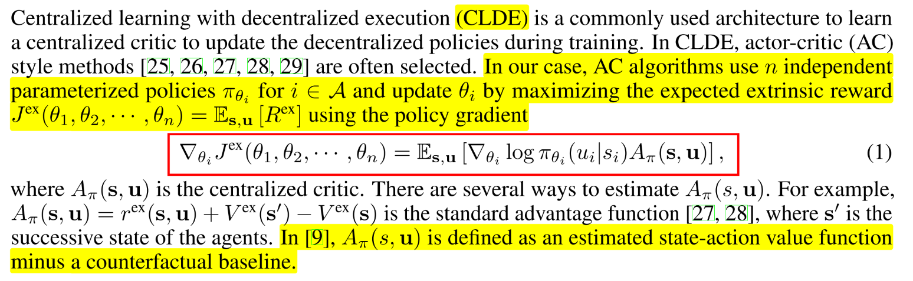 |
| :------------------------------: |
|               fig                |

**如何参数化内在奖励**-$$r_{\eta}^{in}$$:  内在奖励可以归结为环境的外在奖励, 并作为奖励信号用于更新策略. 内在奖励参数$$\eta$$朝最大化外部奖励$$J^{ex}$$期望的方向更新; ==更新方法是找到通过更新$$\eta$$而改变策略参数, 进而使得外在值函数的改变量.== 
这是一种元RL方法, 内在奖励函数作为meta-learner, 学习提升智能体目标. 

## 3. Method

### 3.1 目标函数

| 首先定义每个智能体的proxy奖励 | 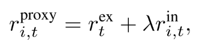 |
| :---------------------------: | :------------------------------: |
|      每个智能体折扣奖励       | 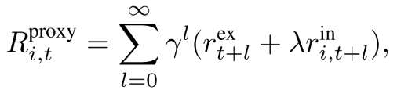 |
|     由折扣奖励得到值函数      | 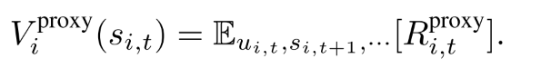 |

proxy值函数没有物理意义, 只是用来更新个体智能体的策略网络参数.
由此, 得到目标函数:

<table>
    <tr>
        <th>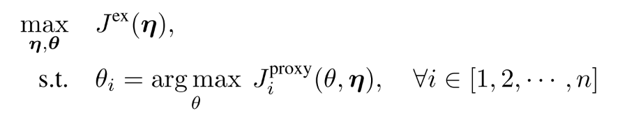</th>
        <th> (5) </th>
    </tr>
    <tr><th>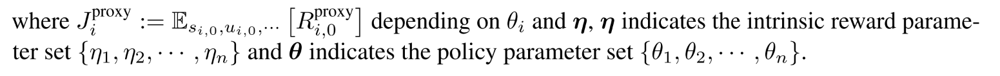</th></tr>
</table>

隐含者两层优化, 内层优化内在期望回报, 外层最大化外在回报. 

在每一次迭代中, 策略参数针对内部proxy任务进行更新, 同时, 内在奖励参数更新来最大化外在期望回报.

## 3.2 算法框架

| 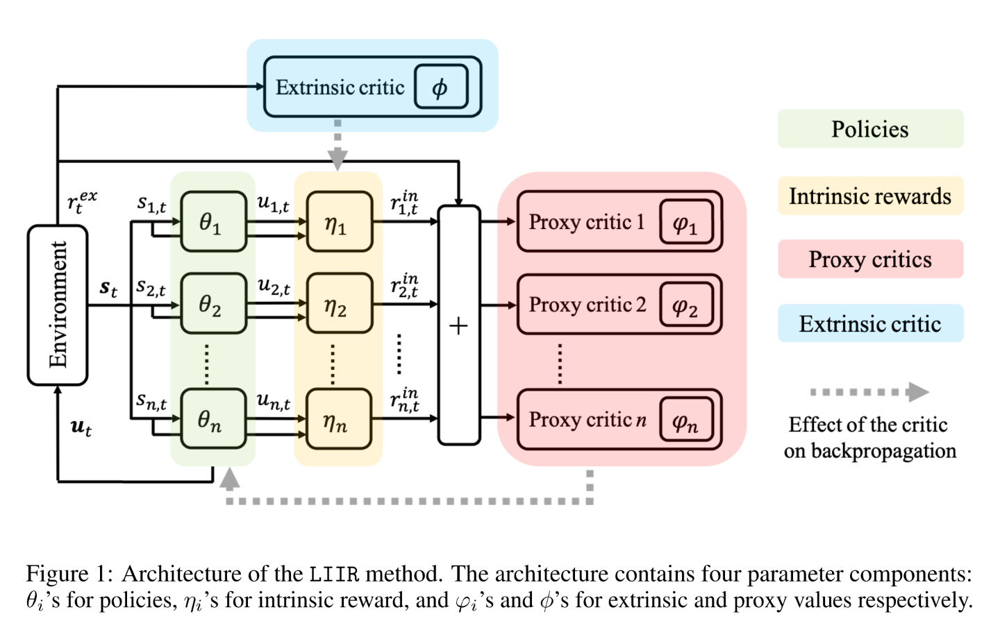 |
| :------------------------------: |
|              fig 1               |

在每一部迭代中:

1. 策略参数使用proxy critic进行策略梯度更新, 
   
    <table>
    <tr>
    <th>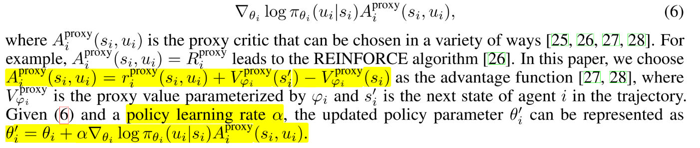</th>
    <th> (6) </th>
    </tr>
    </table>
    
    其中$$A_i^{proxy}$$是proxy critic, 可以有多种定义方法. 
2. 给定更新后的策略网络参数$$\theta'_i$$, 使用链式法则, 可以得到$$\eta$$基于$$J^{ex}$$的更新过程.
     
     <table>
         <tr>
              <th>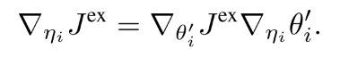</th>
             <th> (7) </th>
         </tr>
     </table>

     公式(7)的意思是, 形式化$$\eta_i$$改变的影响, 通过其对策略参数更新的影响, 进而施加在$$J^{ex}$$上的影响,这一步是meta-gradient学习. 计算元梯度$$\nabla_{\eta_i}J^{ex}$$需要策略参数$$\theta'_i$$生成的新样本, 这可以通过重要性采样来重用$$\theta_i$$生成的样本.
3. $$\nabla_{\theta'_i}J^{ex}$$可以通过随机梯度进行估计.
    
    <table>
        <tr>
             <th>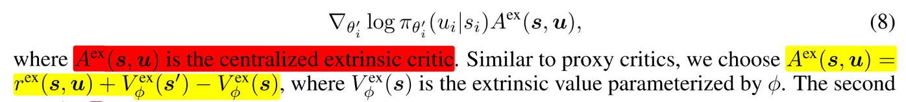</th>
            <th> (8) </th>
        </tr>
    </table>
    
4. 公式(7)第二项可以由下式导出
    
    <table>
        <tr>
             <th>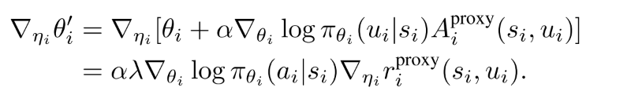</th>
            <th> (9) </th>
        </tr>
    </table>

算法伪代码

|  |
| :------------------------------: |
|              fig 2               |

## 4 实验

### 4.1 baselines

- independent Q-learning (IQL) : IQL trains decentralized Q-functions for each agent. Since the observation and action spaces of the agents are the same within a specific environmental setting, a policy will be shared across all the agents;
- independent actor-critic (IAC) [9]: IAC is similar to IQL except that it adopts the actor-critic method;
- Central-V [9]: the method learns a centralized critic with decentralized policies. Similarly, all agents share the same policy network;
- COMA [9]: the method learns a centralized critic that is the state-action value minus a counterfactual baseline;
- QMIX [10]: the method learns decentralized Q-function for each agent with the assumption that the centralized Q-value is monotonically increasing with the individual Q-values. In the implementations, the agents share the same Q-function;
- LIIR: the proposed method. In the experiments, the agents share the same policy, intrinsic reward function and proxy critic. Since each agent has its own partial observation, sharing policy parameters does not imply that they act the same.

## 5 总结与评价

内在奖励的定义形式, 
是否需要代理critic, 以及如何优化定义形式.

## 6. 重点参考:

- 单智能体最优内在奖励问题. 
  - [Intrinsically motivated reinforcement learning: An evolutionary perspective.]()
  - [Reward design via online gradient ascent. ]()
  - [Deep learning for reward design to improve monte carlo tree search in atari games.]()
  - [On learning intrinsic rewards for policy gradient methods.]()