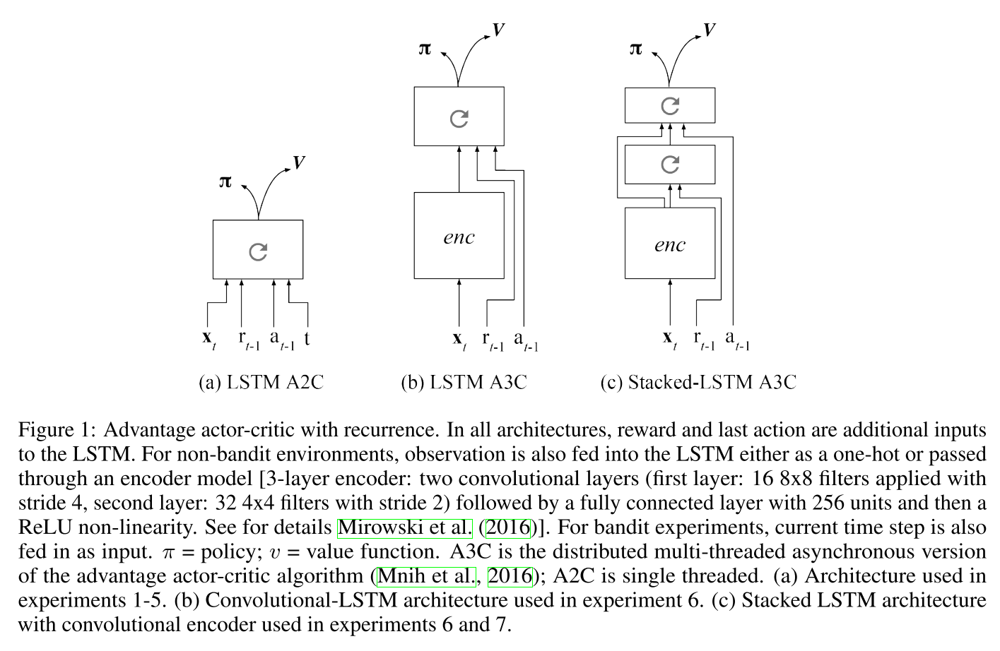

# 1.2 learning to reinforcement learn

paper: [Learning to Reinforcement Learn](https://arxiv.org/pdf/1611.05763v1.pdf)

**核心思想:**提出元强化学习, 解决RL任务迁移问题, 提高数据利用效率. 

==**简单的说就是将上一个step的reward，action等信息也输入当前的RNN中进行决策（这里由于是recurrent的关系，可以认为是把之前的所有历史轨迹trajectory（state,action,reward）都输入到神经网络中），这样通过训练神经网络可以使得其自动学习去判断task层面的信息（也就是meta层面的信息），从而加快新task的训练过程。这也就是从RL到Meta RL最基本的变化。**==
**同时基于episode训练, 每个新的episode训练不同的task, 并重新初始化参数.**

以前工作证明, RNN可以在**完全监督**条件下支持meta-Learning. ==What emerges is a system that is trained using one RL algorithm, but whose recurrent dynamics implement a second, quite separate RL procedure.This second, learned RL algorithm can differ from the original one in arbitrary ways.== 因为该算法是学习到的, 所以它可以在训练域中更好地利用结构信息

目前RL与人类相比两个最大的问题:
- 需要大量数据进行训练.
- 只使用于特定任务, 而人类可以适应变化的任务.

**关键思想是使用标准的RL方法训练RNN网络, 使其自己生成RL程序. 可以提高适应性和样本效率.**

## 1. Method

### 1.1 RNN实现的Meta-Learning

灵活,data-efficient的学习方法需要好的先验偏差(prior biases). 该偏差可以从两种方法得到:
- 设计到学习系统中, 例如卷积网络;
- 也可以通过学习得到. 例如元学习.

meta-learning标准设置: 学习智能体需要面对多个各不相同的任务, 这些任务可以共享一些潜在的规则集合. Mete-Learning定义为: **智能体在每个新任务中, 平均比之前任务更快地提升自身表现的一种效应.**
在架构层面上, meta learning包括两个层次的学习系统: 
- 底层系统用来适应新任务, 学习较快;
- 上层系统学习较慢, 是跨任务学习, 主要用来调优和改进低层的系统.

==meta learning有很多方法, 本文使用Hochreiter提出的方法, 其使用标准BP在一系列相关联的任务中训练RNN. 其关键是, 在一个任务的每一步,网络接收一个辅助输入, 来指示前一个步骤的目标输出.(例如一个回归任务, 在每一步, 网络把x作为输入, 并期望输出相应的y, 但是网络在前一步同时接收一个公开的target y作为输入.) 在这个场景中, 每个训练的episode使用一个不同的函数来生成数据, 但如果所有的函数都是从同一个参数族中提取的, 那么系统就会逐渐调整到这个一致的结构，在episode中越来越快地收敛到精确的输出.==

上述方法中一个有趣的方面是, 每个新任务的学习基础过程完全源自RNN的动力学意义, 而不是用于调整网络权重的反向传播过程(the process that underlies learning within each new task inheres entirely in the dynamics of the recurrent network, rather than in the backpropagation procedure used to tune that network’s weights).在经过一段初始训练后, 即使权重保持不变, 网络也能提高它在新任务上的表现. 
该方法的第二个重要方面是，RNN的学习过程适合于训练网络的任务族的结构，嵌入的偏差使其在处理来自该任务族的任务时能够有效地学习.(A second important aspect of the approach is that the learning procedure implemented in the recurrent network is fit to the structure that spans the family of tasks on which the network is trained, embedding biases that allow it to learn efficiently when dealing with tasks from that family.)

### 1.2 deep meta RL 

上述算法都是使用明确target 信息的监督学习. 本文meta-RL算法中, 训练的一系列任务是一些相互关联的RL问题, 例如一系列只有参数不同的bandit问题. agent把前一步输出的行动作为输入, 更重要的是, 接收到该动作所产生的奖励. 相同的奖励信息也并行喂给deep RL程序, 其用来调整RNN权重.

在监督学习中, 当学习好了之后, RNN的动力学方程可以实现一个学习算法, 该方法与用来训练权重的动力学方法完全无关. 也就是说, 当经过足够的训练之后, 即使权重不变, 网络在每个任务上也能学习. 
然而, 这里递归网络实现的过程本身就是一个成熟的强化学习算法, 它是探索-利用的折衷, 并基于奖励改进agent的策略. 
关键的一点是, 学习的RL程序可以与用来训练权重的算法明显不同. 也就是说, ==策略更新过程(包括该过程的学习率等参数)与调整网络权重的过程可以非常不同, 并且学习到的RL程序可以实现自己的探索方法.== ==学习到的RL程序可以拟合多任务张成的环境, 所以使其可以快速适应新任务.==

### 1.3 Formalism

令$$\mathcal{D}$$表示(先验的)MDP分布. 本文目的是要展示meta-RL可以学习到基于先验的RL算法, 也就是说它能够在从$$\mathcal{D}$$或其微调的分布中提取的MDPs上表现良好. 
一个包含RNN的结构良好的智能体, 通过在一系列MDP环境(task)上进行交互式的回合制(episode)训练. 
- 在新episode的开始阶段, **抽样**得到一个新的MDP任务$$m\sim \mathcal{D}$$和一个当前任务的初始状态, 同时智能体内部状态(其循环单元的激活模块)被重置.  
- 然后, 智能体执行固定离散步长的动作选择阶段. 在当前episode的每个时间步$$t$$, 智能体在MDP环境 $$m $$中根据历史$$\mathcal{H}_t = \{x_0, a_0, r_0, ..., x_{t-1}, a_{t-1}, r_{t-1}, x_t \} $$数据执行动作 $$a_t\in A $$
- 网络权重使用最大化所有episode的所有时间步的观察**奖励和**进行训练.

训练步骤之后, 固定智能体策略(权重固定, 但由于输入和循环层的隐藏状态，激活值会变化). 并且在一个从分布$$\mathcal{D}$$及其微调的分布中抽样的MDP集合中进行估计.(**测试模型泛化能力**). 智能体内部状态在评估阶段每个新的episode都重置. 由于智能体学习到的策略是基于历史经验的, 当在新的MDP环境中, 可以调整策略优化任务奖励. 

## 2 实验

关注点:
- **meta-RL是否可以学会和成熟RL算法一样的自适应的探索-利用的均衡**.
- **meta-RL是否可以通过利用任务结构来提高学习效率.**
- **实验目的是用通用的方法验证meta-RL方法.**

实验设置:
- 四个关注bandit任务, 两个关注MDP问题.
- 智能体结构:LSTM+soft-max输出离散动作.
- 环境设置与之前文章一样, 训练和测试使用固定长度的episode, 每个episode包含一个从预定义的任务分布中随机抽样的任务, LSTM隐状态在每个episode都重新初始化. 每一步的输出包含当前步的reward标量和one-hot动作.
- **所有算法使用Advantage AC框架. 把上一步的reward,动作, 时间步都作为输入.**

在bandit任务中:
- 使用抽样的任务进行**训练和测试**.
- 定义了一个**期望累积遗憾(regret)值**, $$R_R(b)=\sum_{t=1}^T \mu^*(b)-\mu_{a_t}(b) $$

|  |
| :------------------------------: |
|              fig 1               |

## 3 总结与评价

Deep meta-RL 包含三个主要部分:
  1. 使用RL算法训练RNN
  2. 包含一系列相关任务的训练集
  3. 网络输入包含前一步的选择的动作和奖励信息.

网络可以学到适应不同任务的结构.从这个意义上说, 学习算法建立了域适应的偏差, 这使得它比一般算法效率更高.

还证明了使用无模型RL算法训练的系统可以模仿基于模型的控制动作. 也就是说网络选择行为的方法反映出一些基于模型或这树搜索的性质.

本文认为deep meta-RL产生了一种学习型RL算法，该算法利用了任务结构的不变性. 结果，当面对千差万别但仍然结构化的环境时, meta-RL似乎会生成RL过程, 该过程占据了无模型RL与基于模型RL之间的灰色区域。

元学习可有调整标量超参数，例如learning rate 或者 softmax inverse temperature.