# 3. 游戏AI-AlphaGoMaster

paper: [Mastering the game of Go with deep neural networks and tree search](https://www.nature.com/articles/nature16961)

核心观点: 

1. 完全信息博弈存在最优值函数. 该最优值函数可以通过假设双方为完美对手, 然后通过树搜索方法计算. 其复杂度为指数级.
2. 存在降低树搜索复杂度的方法: 1)通过状态估计减少搜索深度; 2)通过行动策略抽样减少搜索的宽度. alphaGo也是从这两方面想办法, 使用了MCTS算法.
3. MCTS算法思想: 通过MC展开计算状态值. 经过模拟对战, 树越来越大,估计值也越来越准, 在搜索时选择动作的策略也可以通过选择价值高的动作得到提升.最终策略和值函数都会收敛到最优.
4. MCTS方法本质是两次近似. 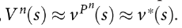.先用MC模拟近似模拟策略的值, 然后用模拟策略近似minimax optimal actions.
5. alphaGo使用value network和policy network减少MCTS树的宽度和深度. 
6. 策略网络本质是一个policy-gradient reinforcement learning方法.

## 1. 整体结构

算法整体结构如图1. 包含四个部分: Rollout policy; 
SL policy network; RL policy network; Value network

|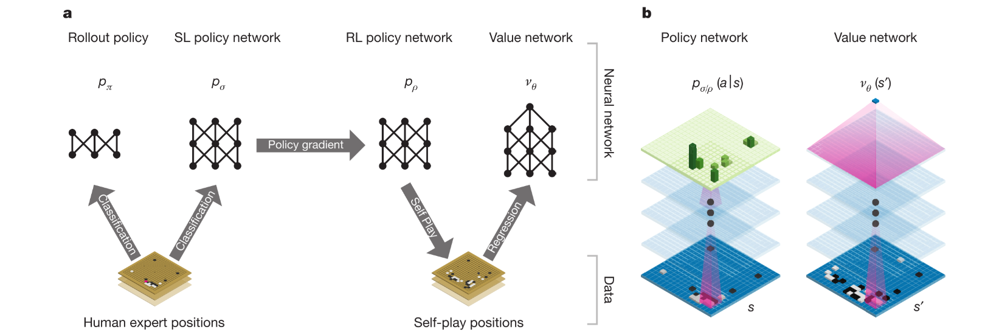|
|:-:|
|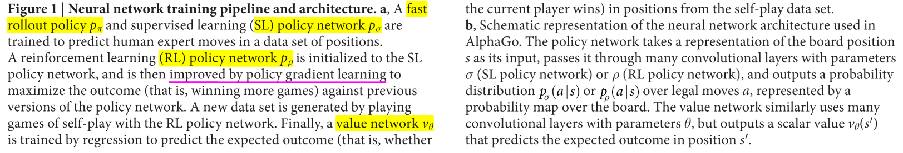|

具体过程为:

1. 首先基于监督学习方法用人类走子数据训练一个SL policy network. 该部分用于提供即时反馈和梯度.
2. 同时, 训练快速走子策略(Rollout policy), 在MC展开的时候可以快速抽样动作.
3. 然后, 用自博弈训练RL policy network. 该部分为了让策略网络学会赢得游戏, 而非学习预测下一步动作(进一步提升SL策略).
4. 最后, value network用于预测游戏的胜者.

## 2. 具体介绍

### 2.1 SL policy network

SL policy network使用随机梯度上升训练, 数据是3000万个状态动作对$$(s, a)$$, 输入有抽象特征或者原始棋局, 网络为13*(Conv_Relu)+softmax. 

预测准确率为(57.0% using all input features, and 55.7% using only raw board position and move history as inputs). 之前算法最好为44.4%. **预测准确率的提升对alphaGo胜率表现很重要.** 决策时间3ms.

大型网络太慢, 所以用small pattern features的linear softmax训练了一个更快但准确率低的rollout policy. 

准确率24.2%, 决策时间$$2\mu s$$

### 2.2 RL policy network

RL 策略网络结构与SL相同, 并用SL网络参数初始化, 使用策略梯度算法优化. 对手策略从之前迭代随机抽取, 防止过拟合当前策略. 奖励函数在最终状态前全是0, 结果$$z_t=\pm 1$$表示最终奖励. 网络使用随机梯度上升最大化期望结果输出.

该策略不用搜索过程对战Pachi, 胜率为85%. SL policy胜率只有11%.

### 2.3 RL value network

这里首先假设完美对手博弈, 存在最优值函数. 这里使用函数逼近, 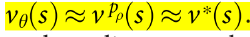. 用MSE损失训练.

直接用outcome作为标签训练数据容易过拟合. 相邻时间步之间的数据相关性很强, 这里用self-play生成不同的训练数据

### 2.4 Searching with policy and value networks

|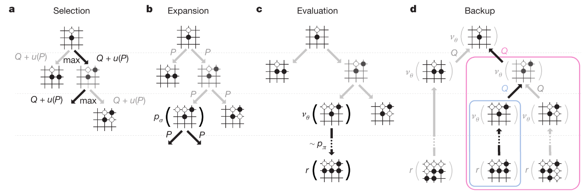|
|:-:|
|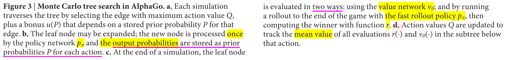|

MCTS 过程如图3所示. 节点代表状态, 边代表动作. 边保存$$Q(s, a), N(s, a), P(s, a)$$, 分别表示动作值, 访问次数, 先验概率.

* 动作选择, 公式如下, **其中bonus随访问次数衰减, 鼓励探索**.

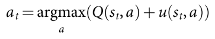

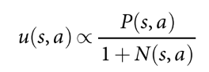

* 扩展. 在叶子节点, 使用SL policy处理一次, 得到所有合法动作的概率分布作为先验概率$$P$$.
* 评估. 使用两种方法评估: 值网络$$v_\theta(s_L)$$; 快速走子得到的结果$$z_L$$. 这两个值组合成状态值.

(2)

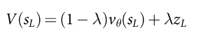

* 回溯. 更新遍历过的动作值和访问次数. 其中i表示第i次模拟.

(3)

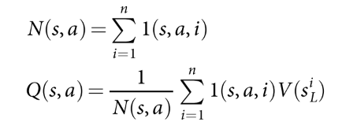

搜索过程结束则从根节点选择最常访问的子节点执行.

另外SL策略比RL策略表现好, 但是RL策略导出的RL值函数表现比SL值函数好.

硬件环境: 40线程, 48CPUs, 8GPUs.

alphaGo与樊辉比赛时, 决策过程如下图所示.

|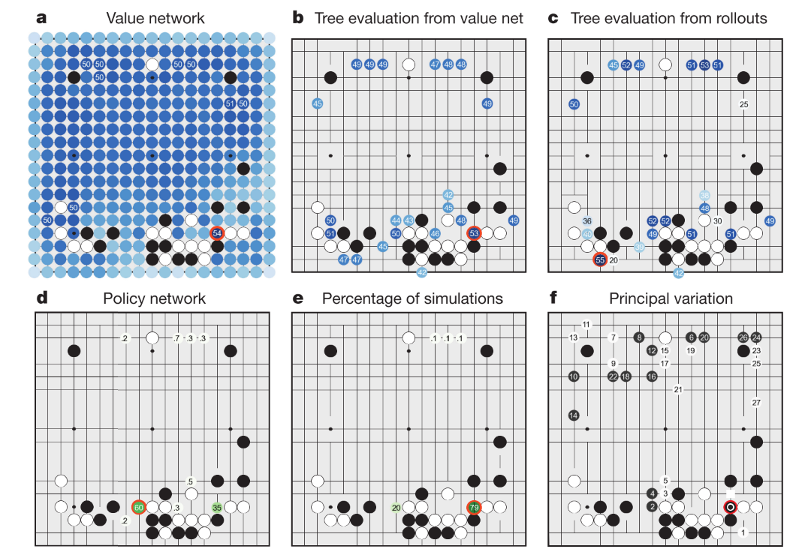|
|:-:|
|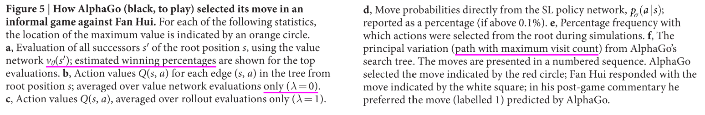|

## 3. 实现细节(这部分略看可以, 前边重点)

### 3.1 问题设置

1. 定义为二人零和博弈问题. 确定性状态转移方程, 中间步骤0奖励. 零和博弈在双方为完美对手时存在唯一最优值函数.
2. 之前工作: minimax搜索, alpha-beta 剪枝算法等,在围棋问题不好用. UCT算法鼓励探索.

### 3.2 搜索算法

搜索树节点包含状态$$s$$和边$$(s, a)$$; 边包括统计信息  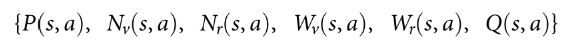.

|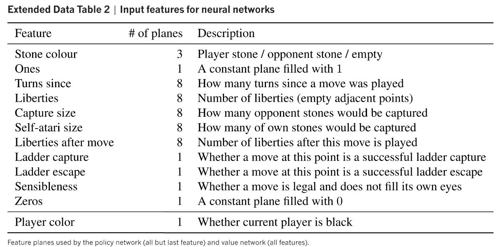|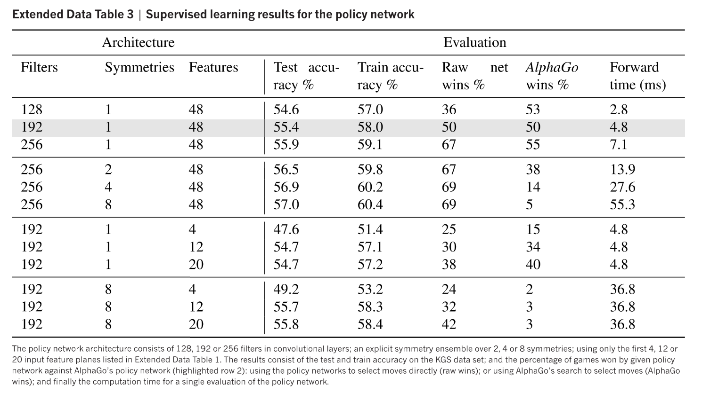|
|:-:|:-:|
|表1Input features for neural networks | 表2 Supervised learning results for the policy network|
