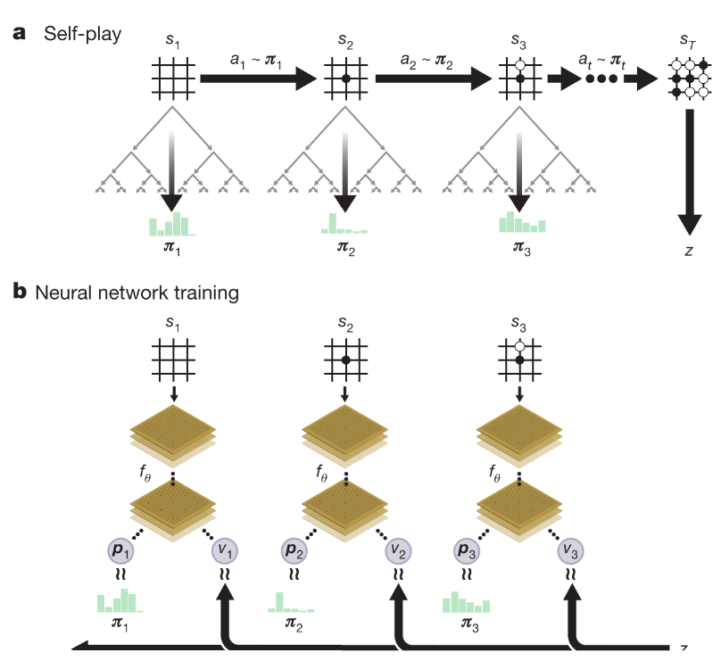
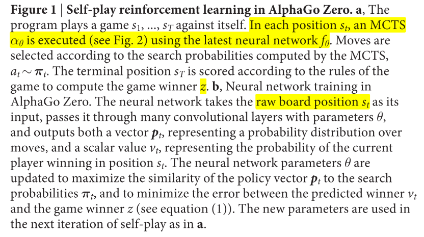
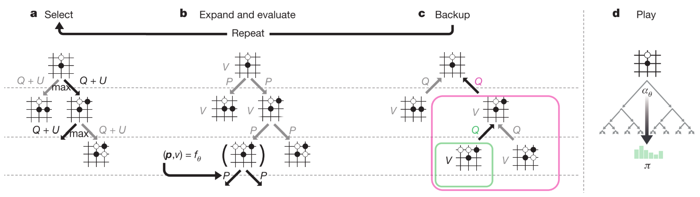
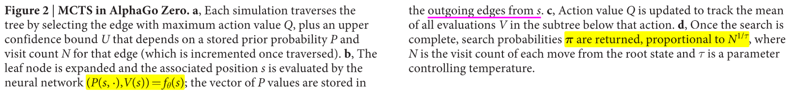
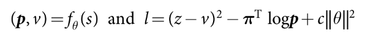

# 3. 游戏AI-AlphaGoZero

paper:[Mastering the game of Go without human knowledge](https://www.gwern.net/docs/rl/2017-silver.pdf)

核心: 与AlphaGo的不同:

* 不使用人类专家数据和领域知识, 只用self-play学习. 
* 只使用棋盘作为输入, 
* 改用单网络多头输出.
* 用简单的树搜索, 没有MCrollouts过程. 在训练的循环内部使用前向搜索, 快速提升新能.

## 1. Reinforcement learning in AlphaGo Zero

使用单网络(ResNet+RElu+BN), 输入原始棋盘s, 输出动作概率和值(p, v).

训练时是一个**策略迭代过程**. 在每一个状态$$s$$, 执行MCTS过程. MCTS输出动作概率分布(这个分布比网络输出的好, 因此MCTS可以看作一个高效的**策略提升**操作). self-play加搜索(使用MCTS的策略选择动作, 游戏结果$$z$$作为值的抽样), 可以看作一个**策略估计**操作. 通过在训练NN时把输出与搜索概率分布和游戏结果做匹配, 可以做到: 

* 策略改进: MCTS根据神经网络策略p, 执行搜索过程, 然后将(更强大的)搜索策略投影回神经网络的函数空间. 
* 策略评估应用于(更强大的)搜索策略: self-play的结果也被投射回神经网络的函数空间.

**整体训练思想的核心**是NN参数更新使得动作概率和值函数(p, v)更加接近提升后的搜索概率和自博弈结果; 然后新的参数用来在self-play下一次迭代中增强搜索策略. 如图1所示.

||
|:-:|
||
|a. 每个状态s, 使用最新网络参数执行MCTS(见图2), 根据得到的动作概率选择动作执行, 最终分出胜负z. b. NN使用原始棋盘预测动作概率和值函数. 网络参数更新使用最大化输出概率和搜索概率的相似度/最小化值函数与对弈结果的MSE. 然后用更新的参数进入下一轮循环的(a)过程 |

**MCTS过程**使用神经网络引导. 

* 每条边存储了$$P(s, a), N(s, a), Q(s, a)$$分别代表先验概率, 访问次数, 动作价值.
* select: 每次搜索从根节点开始, 选择UCB最大的动作, 直到叶子节点.
* Expand and evaluate: 使用NN计算一次动作先验概率和评估值函数.
* Backup: 更新遍历过的每个边的$$N(s, a), Q(s, a)=1/N(s, a)\sum_{s'|s, a\rightarrow s'}V(s')$$

||
|:-:|
|  |

**网络训练:** 

1. 随机初始化网络参数$$\theta_0$$, 之后每一次迭代$$i\ge 1$$都通过自博弈生成自博弈游戏.
2. 在每个时间步, 使用前一次迭代的神经网络参数$$f_{\theta_{i-1}}$$执行MCTS搜索 $$\pi_t=\alpha_{\theta_{i-1}}(s_t)$$.从中抽样动作执行.
3. 如此迭代直到终止状态得到奖励, $$r_T\in \{-1,+1\}$$,终止状态包括分出胜负, 搜索的值函数小于某个阈值(提前认输), 或者达到最大步长.
4. 每个时间步存储训练数据, $$(s_t, \pi_t, z_t)$$, 其中$$z_t=\pm r_T$$.
5. 最后, 网络从上一次迭代生成的所有时间步的数据$$(s,\pi,z)$$抽样进行训练. loss函数为MSE+cross-entropy

(1)

## 2. Empirical analysis of AlphaGo Zero training

训练: 490万盘自博弈, 其中每个MCTS执行1600次模拟(相当于每一步决策0.4s), 网络有20个resNet块, 使用70万个2048(32x64)的minibatchs, 优化器stochastic gradient descent with momentum

4个TPU训练了3天(AlphaGo Lee用了48个TPU训练了几个月)
100-0打败AlphaGo Lee等

版本进化:

1. AlphaGo Fan. 176 GPUs  
2. AlphaGo Lee. 神经网络大得多, 256个卷积核\* 12层. 48个TPU
3. AlphaGo Master. 与AlphaZero的神经网络架构, RL算法和MCTS算法相同, 但是使用了手工函数和监督数据.
4. AlphaGo Zero.无人类监督数据, 4个TPU单机训练.

证明从纯强化学习开始训练是可行的
