# 3. 游戏AI-星际-AlphaStar1

paper:[Grandmaster level in StarCraft II using multi-agent reinforcement learning](https://www.gwern.net/docs/rl/2019-vinyals.pdf)

监督学习+环境设计+联盟训练+RL

**星际的挑战**: 

游戏层面:

* 群体博弈 -> League Learning
* 不完全信息 -> LSTM
* 长期规划/回报稀疏 -> off-policy -> TD($$\lambda$$), clipped importance sampling (V-trace), self-imitation algorithm (UPGO).
* 实时控制(APM有限值)-> Monitoring layer + action delay; 
* 超大状态空间 -> self-attention & scatter connection
* 超大动作空间 -> auto-regressive policy, pointer network

**算法层面**

* **自博弈循环**, (A打败B, B打败C, C打败A). ->PFSP(prioritized fictitious self-playprioritized fictitious self-play), 得到好的对手.
* 自博弈偏移, 纯自博弈学习到的策略可能不能有效对抗人类策略. -> 加入人类数据设计的伪奖励; 

整个控制过程如图1所示

|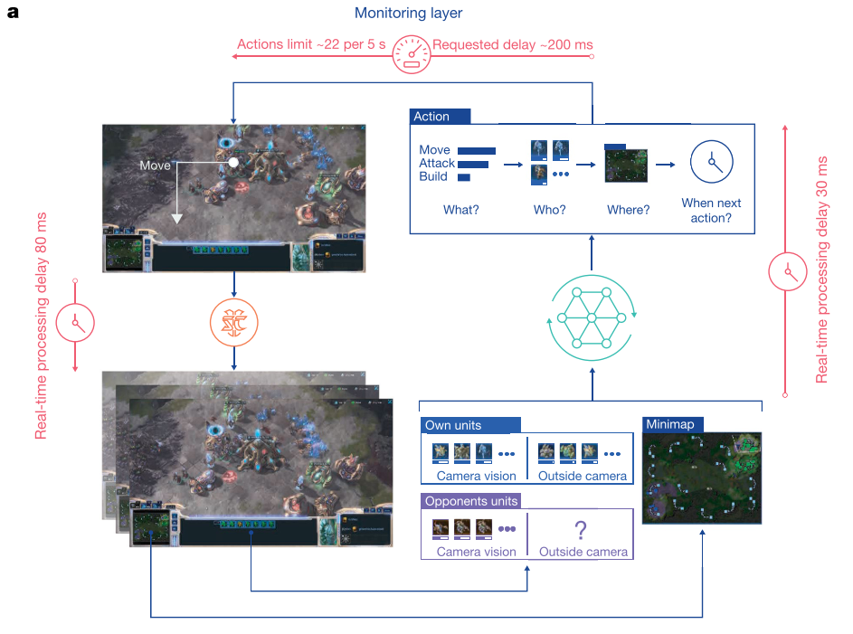|
|:-:|
|fig 1. AlphaStar控制过程 |

## 1. 网络结构

|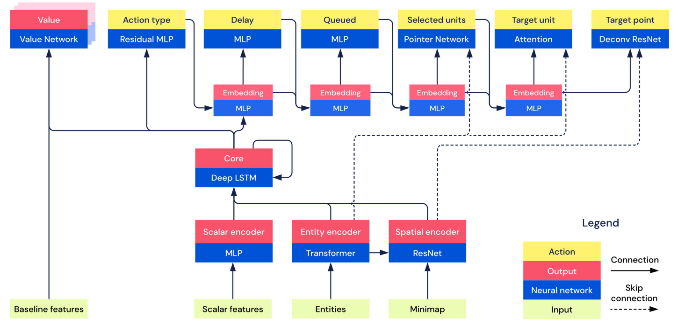|
|:-:|
|fig 2. Overview of the architecture of AlphaStar. |

1. AC架构
2. 输入: 
   - 实体向量: N个⻓长度为K的向量
   - 地图信息: 20个176乘200的矩阵
   - 玩家数据
   - 游戏统计
3. 值网络: $$V_\theta(s_t,z)$$.
   1. 输入: LSTM输出的历史观测信息, z称为statistic vector. 从代码来看应该是从不同人类玩家历史数据中抽取出来的建造顺序, 以及单位、建筑、升级的顺序等信息.
   2. 从结果分析可以看出, 加入观测的对手信息效果提升明显.
   3. Baseline feature意思应该是对手信息.

4. 策略网络: 只输入小地图, 不看主屏幕.

   1. 在所有用到了entities list的地方, 利用该序列和句子序列的相似, 用NLP模型提取特征.
   2. 标量, 向量, 图像等不同的信息使用不同方法处理.

5. 动作属性(**分层**):

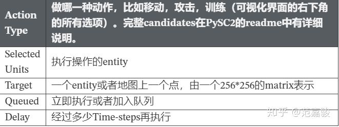

1. scatter connections: 这部分用于combine不同类型的特征e.g., images, lists, and sets. 但是该部分的结构细节在论文中似乎没有被提及

2. auto-regressive policy: 处理结构化动作采样的问题，将一个state要做的一个N维动作决策，转化为N个1维的动作序列进行处理（e.g., 先选择单位，再选择该单位的目标位置）.控制输出:

   1. 选择action type(what)
   2. 通过MLP确定delay(when)
   3. 使用MLP确定是否要加入队列. 因为APM有限制, 有一些动作不能被立即执行, 要加入Quene等待以后的时间执行.
   4. ==**选择(Which), 使用Pointer Network, 直接获取entities作为input, output一个pointer直接指向input的一个元素**==. 
   5. 选择目标位置或目标实体, 对于entity和location信息分别用NLP方法和CV方法处理.
 

> Pointer Network的特点是, 当我们明确知道数据的输出 一定会/大概率 出现在输入的序列中时, 这个网络可以很好地针对性处理.
> Attention和pointer类似.
> 传统的带有注意力机制的seq2seq模型先使用encoder部分对输入序列进行编码, 然后对编码后的向量做attention, 最后使用decoder部分对attention后的向量进行解码从而得到预测结果. 
> 但是作为Pointer Networks, 得到预测结果的方式便是输出一个概率分布, 也即所谓的指针.
>  
> 也就是说传统带有注意力机制的seq2seq模型输出的是针对输出词汇表的一个概率分布, 而Pointer Networks输出的则是针对输入文本序列的概率分布.
> 因为candidates是inputs的子集, 选择pointer Network更加高效.

## 2. 训练

**先进行基于人类数据的监督学习, 然后使用联盟方法训练强化学习**.

### 2.1 监督学习

监督学习目标: **学习人类对单位的操作以及建筑建造的操作.** 其中建筑建造的单元和顺序需要单独列出来训练, 因为很多情况下, 一些操作必须要有一些建筑作为前提.

AlphaStar根据**小地图数据 $$o_t$$ 和建造操作数据$$z_t$$行学习, 并且以人类的操作$$a_t$$ 作为标签进行训练, 得到合适的输出 $$\pi_t^{SL}$$ 的神经网络**.

通过阅读伪代码, 我们还了解到一些新的细节.

1. AlphaStar先使用较高水平的人类数据(MMR>3500)+高学习率($$lr=10^{-3}$$)快速学习; 然后用极高水平人类数据(MMR>6200)+较低的学习率($$lr=10^{-5}$$)进行微调.

2. 监督训练时，使用交叉熵损失MLE和L2规则损失共同作为损失函数进行训练. 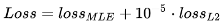 

3. 对于$$z_t$$ , 其会选择性的学习. 首先, 读取人类游戏回放数据, 并且读取建筑单元build unit和建筑顺序build order数据, 存入z列表; 之后, **有一定概率舍弃一些建筑单元和顺序的数据**.

> 在伪代码中, 其读取建筑数据$$Bo$$(建筑顺序)和 $$Bu$$ (建筑单元), 然后又初始化两个等长度的随机$$True-False$$数组 $$Bool_{Bo}$$和 $$Bool_{Bu}$$  , 然后分别将 $$Bool_{Bu}$$ 与 $$Bu$$ 相乘, $$Bool_{Bo}$$与 $$Bo$$ 相乘, 作为最后输出的建造数据 $$z$$.

|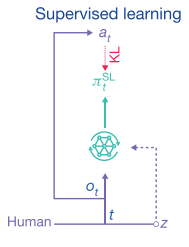|
|:-:|
|fig 4. 监督学习过程 |

### 2.2 RL 训练

|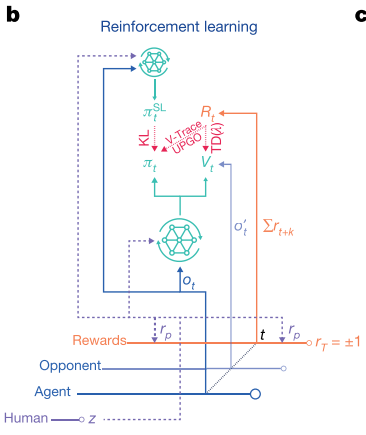|
|:-:|
|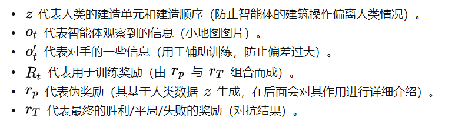|

难点
1. 训练的模型不不是采样的模型(off-policy), 
2. 动作空间⾼高度复杂, 
3. 拟合价值函数很难

做法:
1. Actor-critic结构，主要基于IMPALA，利用V-trace来训策略略⽹网络，并提出UPGO技术帮助训练
   - V-Trace限制重要性采样系数.
   - UPGO则使⽤用Hard的形式 直接将未来乐观的step的信息纳⼊入Advantage.
   - GAE和UPGO都关⼼心如何将多步以后未来的信息纳⼊入现在的 Advantage估计中. GAE使⽤用Soft的形式通过$$\lambda$$项控制未来信息和现 在信息的平衡(即偏差和⽅方差的平衡). 
2. 利用TD($$\lambda$$)来训价值⽹网络，并同时输⼊入对⼿数据 
3. **模仿学习**: 额外引⼊入Supervised Learning Loss和⼈人类统计量z
4. 多智能体/自学习/League的⼤规模应⽤

训练流程如下: AlphaStar会将自身观察的数据信息 $$o_t$$ 输入AC框架下的神经网络(**为了降低方差, 其也会将对手的信息 $$o_t'$$ 输入网络**), 输出策略和值函数.

* 对于策略, 使用V-Trace和UPGO的方式更新.
* 值函数使用基于$$R_t$$的$$TD(\lambda)$$算法更新.

### 2.3 联盟学习(群强化学习)

整个训练过程如图4所示

|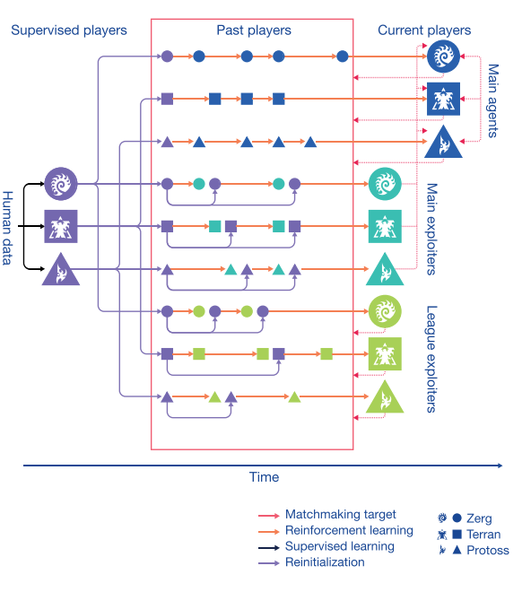|
|:-:|
|fig 6. 联盟学习训练过程 |

主要包括四类智能体:

1. **Main Agent**.

   - 意义: 核心智能体, 输出为AlphaStar, 同时克服追逐循环的问题.
   - 对手: 全部Past Players, Main Exploiters, Main Agent
   - 定期存储自身参数为一个player并加入到​Past Players中, 
   - 用prioritized fictitious self-play(PFSP)方式匹配对手. 优先找比自己强一点水平差不多的对手对战(胜率高).

2. **Main Exploiters**.

   - 意义: 用于寻找主智能体的弱点.
   - 定期存储自身参数为一个player并加入到Past Players中.
   - **参数还原**: 每存储一次自身参数, 就会把自己还原为监督学习的参数.
   - 对手: Main Agents, Main Agents的Past Players.

3. **League Exploiters**.

   - 意义: **用于寻找整个群体的弱点**, 它要打败联盟中所有对手.
   - 定期存储自身参数为一个player并加入到Past Players中.
   - 每存储一次自身参数, 就有25%概率将自己还原为监督学习的参数.
   - 对手: 全部Past Players

4. **Past Players**.

   - 意义: 用于存储智能体的历史参数

## 3. 技术细节

|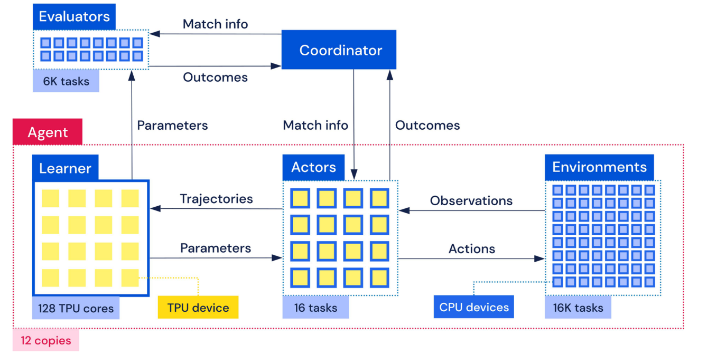|
|:-:|
|fig 6. 联盟训练示意图 |

### 3.1 KL三散度

KL散度可以衡量两个分布的差异, 具有非负性, 所以我们可以通过在数值上尽量减小KL散度的方式来使理论分布去逼近真实的分布. 在AlphaStar中, 理论分布是指通过神经网络输出的分布, 真实分布是指人类的策略分布.

### 3.2 $$TD(\lambda)$$

(1)

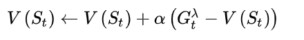

其中, 

(2)

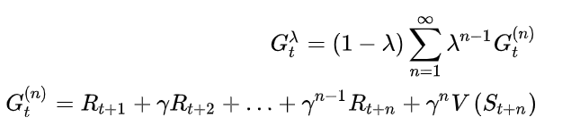     

### 3.3 伪奖励

图中的立即回报(Rewards)经过求和等操作后变成累积回报, 然后经TD(λ)方法去更新值函数. 实际上这里的立即回报不仅仅是真实的奖励, 而且包括伪奖励(Pseudo Rewards)

**根据累计统计量z和当前的游戏进行过程的累计统计量z的差异来计算pseudo-rewards, 具体包括:1) 建造顺序计算编辑距离(edit distance); 2) 累计数据计算汉明距离(Hamming distance)**.

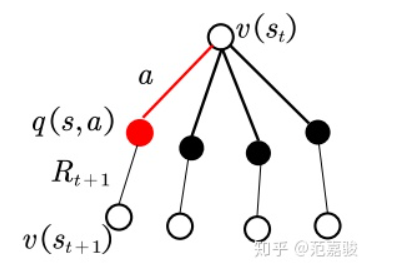

如图所示, 智能体在状态St下选择了动作a(红色的那条线), 到达了后继状态St+1并获得回报Rt+1. 

实际上从状态St可以转到**四个不同的后继状态**, 但是在一次试验中智能体只能转到这后继四个状态中的一个, 所以只能利用一个后继状态St+1和回报Rt+1去更新当前状态St. 从利用状态和回报的角度来看, **上述的只利用真实回报的更新方式似乎有些浪费, 没有充分利用上下文信息**. 从AlphaStar的角度来看, **缺少伪奖励的设置可能会使得智能体的神经网络参数偏离人类的大方向, 并且过早地收敛**. 如果可以通过某种方法, 使得智能体在一次实验中同时得到这四个后继状态的反馈, 岂不是能大大增加对状态和回报的利用效率? 这就是设置伪奖励的出发点: 在更新值函数v(St)时, 不仅利用真实的奖励, 同时为其他几个没有经过的状态设置伪奖励, 让真实奖励和伪奖励一起去更新值函数. **伪奖励的设置一般会稍大于真实的奖励, 从而鼓励探索, 避免过早的收敛**. 至于伪奖励的细节, 请参阅Pseudo-reward Algorithms for Contextual Bandits with Linear Payoffff Functions这篇论文.

### 3.4 V-trace & IMPALA

智能体利用累积回报去更新策略π和值函数v的框架是IMPALA框架. 什么是IMPALA呢? IMPALA**目的是解决高度并行的大规模学习问题**, 是A3C框架的一个改进版. 基本思想是:**把策略多跑几遍, 导数多求几次, 求平均值**. IMPALA使用收集经验的体系结构, 并将收集到的经验进一步传递给计算梯度的中央Learner, 从而形成一个完全独立的行为和学习模型. 同时, 这种简单的架构, 也使学习者能够加速使用显卡. 

AC中, 由于在 AC 架构中实际产生数据, 探索环境的乃是"实干家". 我们在分配计算资源时偏向它, 多雇佣实干家(多分配一些相应的策略执行进程), 同时生成多条执行轨迹, 并通过一个中心学习者从这些多线历史中估算策略参数的导数, 结果会更准确, 这些实干家相当于中心学习者的分身. MPALA中, 所有分身实干家都只是"傀儡执行者", 既不需要优化策略参数, 也不需要计算导数, 只是负责执行生来所继承的策略, **把经验数据忠实地记载下来, 传回中心学习算法**. 如图:

|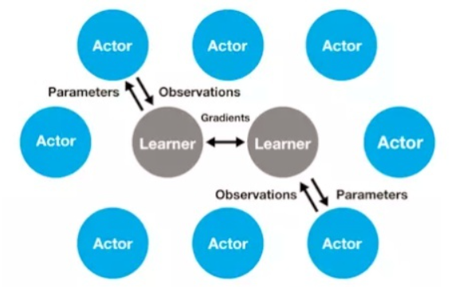|
|:-:|
|fig IMPALA分布式架构|

在学习过程中Actor和Learner的策略并不完全相同, 如何解决这种Off-policy的问题呢? 别急, 论文中的V-trace方法就是用来解决这个问题的, **即减小行为动作产生的时间与Learner估计渐变时间之间的误差**.

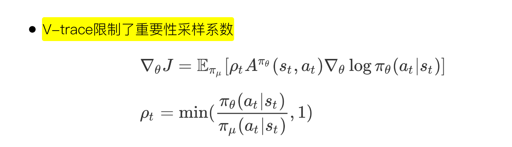

个人觉得V-trace的主要特点是里面两个类似于重要性因子的选取, **其中一个决定收敛到什么样的值函数, 另外一个决定收敛的速度. 另外, 为了防止过早收敛**, V-trace方法里在Actor的梯度公式中加了一个熵作为惩罚, 

(3)

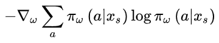

### 3.5 UPGO(upgoing policy upgrade)

处理稀疏奖赏的问题, 这是一个类似Self-imitation Learning思想的技术. 首先 self-imitation learning (SIL)的思路, 是为了更充分利用采集到的具有高奖赏的轨迹, 以达到稀疏奖赏下提高学习效率的效果. 具体而言, SIL会把单条轨迹的MC 采样的return值和 estimated value 进行比较, **若该Return 是大于estimated value 的return, 则直接用该MC return进行 value function和策略的更新, 而不是经过TD的方法进行逐步的更新value, 再用更新的Value去调整策略, 以达到更强的信号去模仿该轨迹的效果**.

UPGO做的是基本一样的, 只是操作粒度从整个trajectory的维度, 变成了在每一个timestep的维度. 具体而言, 他在回溯计算timestep的reward的时候, 如果 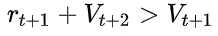, 即reward起到了相对于当前策略更优性能, 则 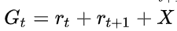, 否则 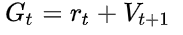.   $$X$$取决于t+2 时间步的性能, 可能是 MC return, 也可能是 estimated value 

UPGO是策略更新的一种方法, 在该方法中, 策略更新的方向为

(4)

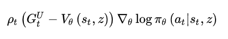

其中

(5)

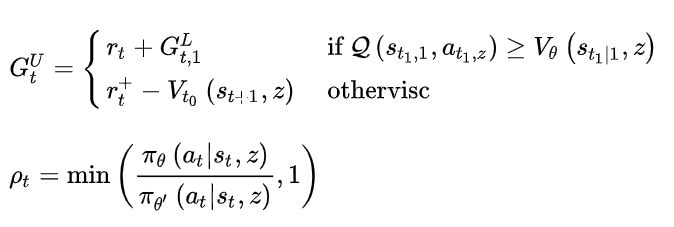

分析这个回报G的分段函数形式, 不难看出, **只有当行为动作值函数优于当前的值函数时才去更新它**, 否则就还是使用原来的值函数, 通过这样的方法来保证**回报的选取是一致朝着更好的方向的**, 并且反向传播时不会太容易衰减掉.

## 总结

1. 总的来说, AlphaStar虽然取得了很好的效果, 但是这个一定程度上是因为**充分的利用了专家知识的缘故**. 一方面告诉我们: 你在做的项目的模型效果不好? 有时候可能只是我们还没挖掘出专家数据的全部潜力; 一方面也说明: RL目前的学习手段依然要直接学习到复杂策略, 还有一定难度; 

2. 对于训练一个鲁棒的策略, 使用**种群式的训练和对抗训练, 都是值得采用的思路**. 其实这两种方法在其他方向都有很多的工作. 我们经常对模型进行对抗攻击, 来找到模型的漏洞; 也会利用对抗的方式构造新的样本, 利用对抗样本进行模型微调, 产生更鲁棒的模型. 我们也经常利用多样化的环境训练模型(比如Multi-task learning, Domain Randomization等), 避免我们的模型过拟合于当前的环境或当前的数据集而缺乏泛化能力.

3. 一些关键性的算法trick的采用, 有效提升了整体性能, 有些时候, 我们距离那个看似难以达成的目标, 只差一个"combination"
