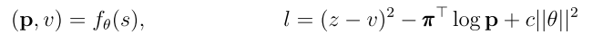
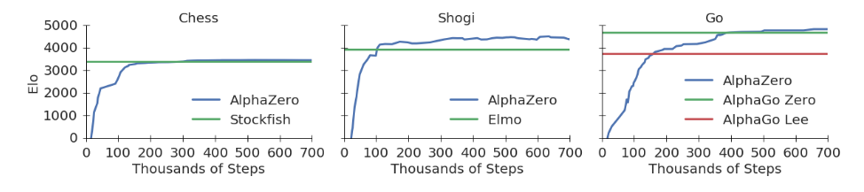
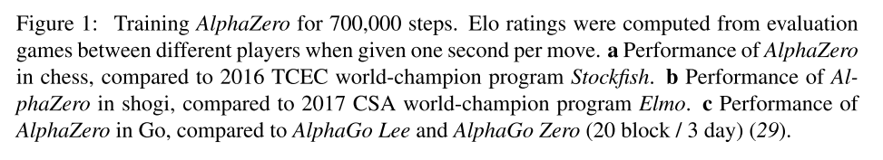

# 3. 游戏AI-AlphaZero

paper:[Mastering Chess and Shogi by Self-Play with a General Reinforcement Learning Algorithm](https://arxiv.org/pdf/1712.01815.pdf)

核心: 实现棋类通用的程序. 在国际象棋, 将棋, 围棋都取得了很好的成绩.

AlphaZero和AlphaGo Zero相似, 只做了基础改动.

相同点:

1. 原始棋局输入, 多头网络, MCTS, 自博弈
2. 终止状态. 游戏结束, 超过最大步长, 
3. loss函数

(1)

不同点:

1. 游戏结果考虑平局, z = {−1, 0, +1};
2. AlphaZero不做数据增强, 在MCTS搜索时, 不做盘面旋转等操作.
3. 在AlphaGo Zero中self-play使用之前迭代中最好的对手.AlphaZero维护一个不断更新的单一网络，而不是等迭代完再选.省去了评估和选择最优对手的步骤.
4. AlphaGo Zero通过贝叶斯优化其搜索的超参数.AlphaZero所有游戏重用相同的超参数. 例外是先验策略中的探索噪声,其与游戏合法移动次数成比例.

AlphaZero程序用很短的时间就击败了目前包括国际
象棋、围棋、将棋在内的相关领域的顶级算法. 结果如图1所示.

||
|:-:|
||
