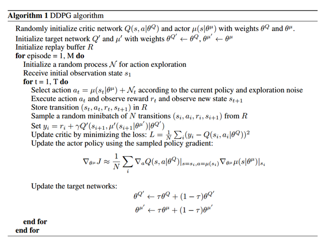

# 0.2 强化学习-DDPG

paper: [Continuous Control with Deep Reinforcement Learning](https://arxiv.org/pdf/1509.02971.pdf)

核心:

* DQN+DPG的无模型off-policy算法, 解决连续控制问题; 
* 对不同的输入特征加入了batch-normalization层.
* 通过完整访问动力学方程及其导数, 效果可以和planning算法媲美; 
* 用像素输入进行端到端学习.
* fully-observed 环境. 

DQN:

* 只适用于离散低维动作空间, 因为需要找到使Q值最大的动作, 在连续动作空间, 每一步都需要一个迭代求最优值的过程.
* 维度诅咒: 动作数量随自由度指数增长; 
* 从经验池抽样, off-policy训练, 解决数据iid限制; target Q网络给出一致性的目标.
* Q-learning倾向于过高估计

  

## 1. 背景

贝尔曼方程:

(2)

当使用确定性策略时, 

(3)

Q-learning, 使用贪婪策略   

(4, 5)

## 2 算法

DPG算法使用AC架构, Actor使用确定性策略把状态映射到动作, critic使用Q-learning相同的贝尔曼方程计算Q值. 然后对初始分布的期望回报使用链式法则, 更新参数, 

(6)

下面说如何用DQN对其进行改进:

* 首先使用经验缓冲池机制, 达到数据独立同分布要求; 
* **使用target网络, 但是目标网络的参数使用sotf更新,  , 这种方法使得目标网络参数更新放缓, 提高稳定性.** 
* actor和critic都使用了目标网络, 这会减慢学习速度, 但是明显提升稳定性.
* 对状态输入, $$\mu$$和$$Q$$网络的所有层都使用BN层．使用低维特征向量作为输入时, 不同部分有不同的物理意义, 本文使用batch normalization. **BN层可以减少训练时的协方差偏移.** 
* 使用随机噪声进行探索. off-policy可以把探索和学习过程分开, 本文在actor策略中加入噪声进行抽样  
* 伪代码如下

|  |
| :------------------------------: |
|              fig 1               |

## 3. Result

### 3.1 实现细节

* 同时使用低维状态信息(如关节角度和位置), 和高维图片; 
* action repeats. 每个时间步都重复执行一个动作3次. 这样每一次环境返回9个feature map(3张rgb图像); 
* 每一帧都被下采样为64*64, 8位RGB值转换为[0, 1]的浮点值.
* 使用Adam学习网络参数, Actor和critic的学习率分别是$$10^{-4}$$和$$10^{-3}$$; 
* 对于Q, 使用$$10^{-2}$$的L2权重衰减, 折扣因子$$\gamma=0.99$$; 
* 软目标网络, 使用$$\tau=0.001$$; 
* 神经网络的所有隐藏层使用非线性整流器. Actor的最终输出层是一个tanh层, 用于限制动作; 
* 低维输入问题:2个隐层, 分别300, 400神经元(约130000个参数); 直到Q的第二个隐藏层才开始包含动作; 
* 像素输入问题, 3个conv(32filter, 无pooling), +200FC层(约430000个参数).
* Actor和critic网络最后一层的$$w$$和$$b$$都是从均匀分布初始化的, 低维情况和像素情况分别是   . 这是为了保证策略和值估计的初始输出接近0. 其他层从均匀分布   中初始化, 其中f是相应层的扇入(fan-in输入端数).
* 全连接层输出动作.
* 低维 Minibatch size=64, 像素minibatch=16; 
* Replay buffer=10**6
* 对于探索噪声, 使用时间相关的噪声, 以便在具有动量的物理环境中很好地探索. 我们使用Ornstein-Uhlenbeck过程, $$\theta=0.15, \delta=0.2$$. 

### 3.2 环境细节

#### 3.2.1 赛车模拟(TORCS)环境

对于Torcs环境, 我们使用回报函数是: 在每个步骤中, 沿轨道方向的汽车加速度有正的奖励, 对于碰撞惩罚为-1. 如果在500帧之后没有沿着轨道前进, 则回合结束.

#### 3.2.2 MuJoCo 环境

该任务每一步都有环境奖励信息, 每一步都包含动作耗费. 

* 有静态目标的任务(例如摆锤摆动), 基于到目标状态的距离提供平滑奖励函数, 在目标某个范围内有正向奖励.
* 对于抓取和操纵任务, 回报函数有两个组件: 一个鼓励向有效载荷移动, 另一个鼓励有效载荷向目标移动.
* 运动任务, 奖励前进, 惩罚跳跃这种冲击动作, 通过高度和角度的阈值确定跌倒进行提前终止.

## 相关工作(翻译)

原始DPG使用title-coding和线性函数逼近评估了玩具问题的算法. 它证明off-policy DPG在数据的效率上比随机AC更有优势(无论在线还是离线). 它还解决了章鱼臂碰触目标这一更难的问题. 然而, 这篇论文没有说明如何把算法扩展到大型、高维观测空间的方法.

以前人们认为像前述的这些标准的策略搜索方法扩展到困难问题很脆弱. 人们认为标准的策略搜索方法很难实现, 因为它要同时考虑复杂的环境动态特性和复杂的策略. 以前的AC方法或者策略优化方法很难扩展到困难问题(Deisenroth et al., 2013), 因为它处理的是序列化学习更新而不稳定, 并且学习速度太慢而无法实用.

最近, 无模型策略搜索证明这或许并不像原来认为的那样困难. Wawrzynski (2009); Wawrzy ´ nski & Tanwani (2013)使用replay buffer在AC框架中训练了一个随机策略. 与我们同时, Balduzzi & Ghifary (2015)使用一个"偏差"网络扩展DPG来明确学习$$\partial Q / \partial a$$, 然而他们只在两个低维领域进行训练. Heess et al. (2015)引入SVG(0), 还使用一个Q-critic, 但是只学习了一个随机策略. DPG可以看作SVG(0)的确定性限制. 我们在这里描述的扩展DPG的技术也可以通过再参量化方法适用于随机策略.

另一种置信域策略优化方法(TRPO), 直接构建随机神经网络, 而不是把问题分解为控制相和监督相. 它通过精心选择策略参数的更新, 约束更新以防止新策略偏离现有策略太远, 产生总汇报的单调提升. 这种方法不需要学习action-value函数, 并且(可能因此)数据效率不高.
为了解决AC方法的这一挑战, 最近的引导性策略搜索(GPS)算法(e.g., (Levine et al., 2015)), 把问题分解问容易解决的三个相: 首先, 它沿着一条或多条轨迹, 用完全状态观测产生一个动力学的局部线性逼近器; 然后使用最优控制, 沿着这些轨迹找到局部线性最优策略; 最后, 使用监督学习训练一个复杂的、非线性策略(例如DNN), 产生优化轨迹从状态到动作的映射.

这种方法有很多优点, 包括数据效率、可以使用视觉数据应用到一系列真实场景的机器控制任务中. 在这些任务中, GPS使用与我们类似的卷积策略网络, 但有两个明显的例外:1．它使用专门的softmax将每一个feature map的视觉特征的维度降低为单个(x, y)坐标; 2. 策略在网络第一个全连接层处直接接收机器结构的低维状态信息. 两者都可能提高算法的能力和数据效率, 并且可以在DDPG框架内轻松利用.

PILCO (Deisenroth & Rasmussen, 2011)使用高斯过程来学习动力学的非参数概率模型. 使用这种学习模型, PILCO使用一些控制问题, 可计算解析策略梯度, 并实现很好的数据效率. 然而, 由于高计算需求, PILCO"对于高维问题"是不切实际的(Wahlstrom et al. 2015). 似乎深度函数逼近器是将强化学习扩展到大型高维域的最有前景的方法.

Wahlstrom et al. (2015)使用深度动态模型网络和模型预测控制来解决像素输入的摆锤摆动任务. 他们训练了一个可微分的前向模型, 并将目标状态编码到学习的隐空间中. 他们对学习模型使用模型预测控制来找到目标策略. 但是, 此方法仅能在具有可用于该算法的目标状态的领域应用.
最近, 使用压缩权重参数的进化方法 (Koutn´ık et al., 2014a), 或者无监督学习(Koutn´ık et al., 2014b)已经从像素学习Torcs的竞争策略, 以减少进化权重的维数. 目前尚不清楚这些方法对其他问题的普遍性.
