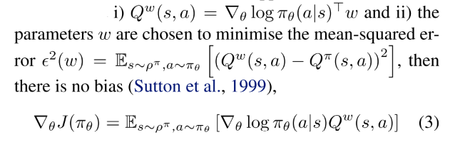

# 0.1 强化学习-DPG

paper:[Deterministic Policy Gradient Algorithms](https://hal.inria.fr/file/index/docid/938992/filename/dpg-icml2014.pdf)

核心:

* 对于连续动作空间的RL问题, 提出确定性策略梯度算法. 将其表示成action-value function的期望的梯度, 比随即策略梯度算法效率更高.
* 同时为了保证足够的探索, 提出off-policy的AC算法框架, 从探索行行为策略中学习确定性的目标策略.

## 1 总述

策略梯度算法的基本想法是, 使用一个参数化概率分布表示策略, 并使用它来选择动作, $$\pi_\theta(a|s)=\mathbb{P}[a|s; \theta]$$. PG算法通过抽样**随机策略**, 朝增大累积概率的方向调整策略参数.

**那么确定性策略梯度是否可以采用和随机策略相同的方法, 沿着策略梯度的方向更新参数呢?** 本文证明确定性策略梯度存在, 并且当策略方差趋向于0 时, 确定性策略梯度是随机策略梯度的特例.

DPG只探索策略空间, 需要的样本量比随机策略少很多. 但是为了对状态和动作空间进行完全探索, 往往需要随机策略. 本文使用**off-policy算法**. 基本思想是: **使用随机行动策略选择动作, 使用确定性目标策略进行学习**, 使用off-policy AC框架, 先逼近action-value函数, 然后更新策略网络参数.

## 2. 背景知识

### 2.1 基础

* MDP定义; 
* 性能函数: $$J(\pi) = \mathbb{E}[r_1^\gamma | \pi] $$
* 将带折扣的状态分布表示成 $$\rho^\pi(s') := \int_\mathcal{S}\sum_{t=1}^\infty \gamma^{t-1} p_1(s)p(s\rightarrow s', t, \pi) ds $$, 可以把性能函数表示为

(1)

### 2.2 随机策略梯度(连续动作空间)

基本思想, 沿着性能函数梯度的方向更新策略参数.

(2)

上式很简单, 尽管状态分布取决于策略参数, 但是策略梯度与状态分布的梯度无关. 重点是如何估计动作值函数Q.

### 2.3 随机AC 算法

actor对公式(2)使用随机梯度上升, 更新随机策略$$\pi_\theta(s)$$的参数$$\theta$$. 使用参数$$w$$参数化值函数$$Q^w(s, a)$$来近似真实Q值. critic使用策略评估算法(TD等)估计$$Q^w \approx Q^\pi$$.

使用$$Q^w(s, a)$$会引入误差, 但是如果其满足:

* 条件i的意思是, compatible的函数逼近器在随机策略的"特征"中是线性的; 
* 条件ii要求, 参数是根据这些特征估计$$Q^\pi$$的线性回归问题的解. 实际问题中该限制可以放松, 保证TD等算法可以更有效地进行策略评估. 当条件i和ii都满足, 整个算法等价于不使用critic.

### 2.4 off-policy AC(offPAC)

用off-policy 评估策略梯度, $$\beta(a|s) \ne \pi_\theta(a|s)$$, 性能函数改为:

(3)

对其进行微分得:

(4, 5)

offPAC 使用off-policy $$\beta(a|s)$$生成trajectory. critic用off-policy TD估计状态值函数$$V^v(s)\approx V^\pi(s)$$.actor使用公式(5)off-policy 随机梯度上升更新策略参数$$\theta$$. actor和critic都使用重要性采样, 采样率为$$\frac{\pi_\theta}{\beta_\theta}$$(因为使用策略$$\pi$$选择动作.)

## 3 确定性策略梯度

### 3.1 action-value gradients

model-free RL大多基于**广义策略迭代**: 交替进行策略评估与策略改进. 策略评估使用MC或者TD估计action-value函数$$Q^\pi(s, a)$$或者$$Q^\mu(s, a)$$. 策略改进基于(估计的)Q值改进策略. 最常用的是贪婪利益最大化(soft maximisation), $$\mu^{k+1}(s) = argmax_a Q ^{\mu^k}(s, a)$$. 

在连续动作空间, **贪婪策略提升因为需要在每一步都需要全局最大值**, 所以很困难. 此时, 经常沿Q值梯度的方向进行提升. 在访问到的每一个状态s, 策略参数$$\theta^{k+1}$$沿梯度$$\triangledown_\theta Q^{\mu^k}(s, \mu_\theta(s))$$更新. 每个状态表示不同的策略改进方向, 可以通过状态分布$$\rho^\mu(s)$$的平均得到期望值.

(6)

<table>
<tr>
<th></th>
<th> (6) </th>
</tr>
</table>

由链式法则, 上式右边可分解为动作值函数的关于动作的梯度, 和策略关于其参数的梯度的乘积的形式. 

(7)

==约定$$\triangledown_\theta \mu_\theta(s)$$为Jacobian matrix, 其列表示策略空间(参数$$\theta$$)中第d个动作维度的导数$$\triangledown_\theta [\mu_\theta(s)]_d$$.== 然而策略改变时, 会访问到不同的状态, 状态分布也会改变. 因此若不考虑状态分布的改变, 策略提升是否有效不能保证. 

### DPG理论

首先, 定义确定性策略$$\mu_\theta$$; 性能函数 $$J(\mu_\theta) = \mathbb{E}[r_1^\gamma | \mu]$$; 概率分布$$p(s\rightarrow s', t, \mu)$$; 类似于随机情况时的折扣状态分布$$\rho^\mu (s)$$. 性能目标函数的期望形式如下: 

(9)

确定性证明:

### 3.3 SPG的极限情况

本部分证明DPG是随机策略梯度的极限情况.

首先通过确定性策略$$\mu_\theta$$和一个方差参数$$\sigma$$参数化随机策略$$\pi_{\mu_\theta, \sigma}$$, 使得当$$\sigma=0$$时随机策略等于确定性策略$$\pi_{\mu_\theta, 0} \equiv \mu_\theta $$. 然后只需要证明当$$\sigma \rightarrow 0$$时随机策略收敛到确定性梯度.

**这个结论很重要, 因为这说明随机策略梯度算法也适用于确定性策略梯度**. compatible function approximation, natural gradients, AC, episodic/batch methods. 

## 4 确定性AC算法

把DPG算法导出on-policy和off-policy的AC算法. on-policy使用Sarsa critic, off-policy使用Q-learning critic. 这些简单情况存在收敛性问题, 一方面因为逼近器误差, 另一方面因为off-policy的不稳定性. 然后提出更原则性方法, 其使用相容函数逼近(compatible function approximation) 和梯度TD学习(gradient temporal-difference learning).

### 4.1 On-Policy Deterministic Actor-Critic

DPG存在探索性问题, 可能收敛到次优解. 但是如果环境有足够的噪声, 也能保证探索性.

该算法中, Actor基于公式(9)的随机梯度上升法调整确定性策略的参数$$\theta$$, 并使用一个可微的action-value函数代替真实值函数. 这里critic使用SARSA算法估计动作值函数$$Q^w(s, a) \approx Q^\mu(s, a)$$. 

### 4.2. Off-Policy Deterministic Actor-Critic

首先, 通过在行动策略的状态分布上取均值, 修改性能函数为目标策略的值函数形式. 

(14)

(15)

基于Q-learning的off-policy deterministic actorcritic(OPDAC)算法.

(16-18)

在随机off-policy AC算法中, 对actor和critic都使用重要性采样. **在DPG-AC中, 因为DPG消除了在行动上的积分, 所有actor可以不用重要性采样, 同时使用Q-learning算法, 可以避免对critic使用重要性采样.**

### 4.3. Compatible Function Approximation

**通常把近似$$Q^w$$带入DPG可能没有沿着真是梯度的方向(也可能根本不是上升的方向).** 本部分寻找一类相容函数(compatible function)逼近器$$Q^w(s, a)$$使得真实梯度保持不变. 也就是说, 寻找一个critic $$Q^w(s, a)$$使得$$\triangledown_a Q^w (s, a)$$可以替代梯度$$\triangledown_a Q^\mu (s, a)$$, 而不影响确定性梯度. 

下面的理论可以同时应用到on-policy $$\mathbb{E}[\cdot ]=\mathbb{E}_{s\sim \rho^\mu}[\cdot] $$和off-policy $$\mathbb{E}[\cdot ]=\mathbb{E}_{s\sim \rho^\beta}[\cdot] $$

对于任意确定性策略$$\mu_\theta(s)$$, 存在一个compatible function approximator, , 其中 $$V^v(s) $$可以是任意与动作a无关的可微函数, 例如状态特征 $$\phi(s) $$ 和参数 $$v $$ 的线性组合, . 

**一般上式中第一项用于估计advantage $$A^w(s, a) $$, 第二项$$V^v(s) $$为价值函数.** 

advatage函数可以看作线性逼近器,  , 其中, 特征表示为. 注意, 如果由m维动作和n个策略参数, 那么 $$\triangledown _\theta \mu_\theta(s) $$是 $$n\times m $$的Jacobian 矩阵. 所以特征向量和参数向量$$w$$都是$$n\times 1$$的. 该形式的函数逼近器满足Theorem 3的条件1.

当动作空间很大时, 线性逼近器效果不好, 动作值会发散到无穷. 但把它作为local critic也有用. 实践中, 它表示偏离当前策略的local advantage,  其中, $$\delta $$表示对确定性策略的小偏差. 因此, 线性函数逼近器足以选择actor应该调整其策略参数的方向.

为了满足条件2, 需要找到最小化真实梯度和$$Q^w$$梯度之间MSE的 $$w $$. 该问题可以看作"feature" $$\phi(s, a)$$和"target" $$\triangledown_a Q^\mu (s, a)|_{a=\mu_\theta(s)}$$线性回归问题. 即, 策略特征用于在s预测真实梯度$$\triangledown_a Q^\mu (s, a)$$. 但是对真是梯度进行无偏采样很难. 实践中, 使用线性逼近器   满足条件1, 同时通过标准策略估计方法(例如SARSA或Q-learning或off-PAC)学习 $$w $$, 而不用满足条件2. 最后, 策略估计问题将会找到一个$$Q^w \approx Q^\mu$$, 同时近似满足条件  . 

提出COPDAC(compatible off-policy deterministic actor-critic)算法. critic是一个线性函数逼近器, 用于从特征   估计action-value. 这一部分可以使用off-policy(Q-learning or gradient Qlearning)从行动策略中抽样学习. 然后actor沿critic动作值梯度的方向更新自己的参数. COPDAC-Q算法:

==**off-policy Q-learning 使用线性函数逼近器容易发散**==. 近期基于gradient TD学习的方法是真正的梯度上升算法并且保证收敛. 该方法基本思想是通过随机梯度上升最小化Bellman误差均方投影(mean-squared projected Bellman error, MSPBE). 本文还在critic中加入了gradient TD learning. critic使用gradient Q-learning, 在适当的步长($$\alpha_\theta, \alpha_w, \alpha_\mu$$)下保证critic更新比actor快, 那么critic将会收敛到最小化MSPBE的参数. 下面是COPDAC-GQ:

通过把公式(20)或公式(24)替换为   可以把natural policy gradient扩展到DPG.

## 5. 实验

测试了Continuous Bandit, Continuous Reinforcement Learning, Octopus Arm环境, 复现时看一下其实现细节.

## 讨论

DPG算法好处:

* 随机策略梯度算法在状态空间和动作空间探索, 确定性策略梯度算法只在状态空间探索, 需要的样本量少很多.
* 计算性能: 每次更新的计算量在动作维数和策略参数数量上是线性的.

action-value的梯度可以提供有用的信号. NFQCA也用到了这个信号, 但是它的critic network和actor network是incompatible. 
