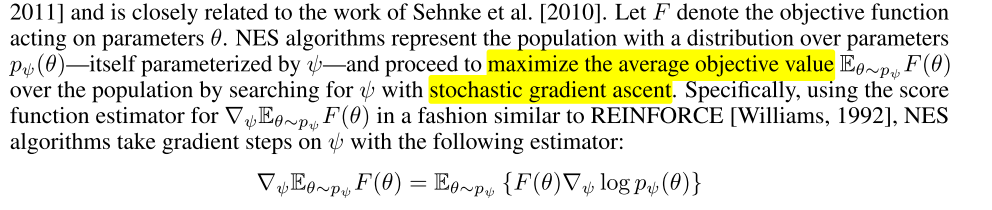
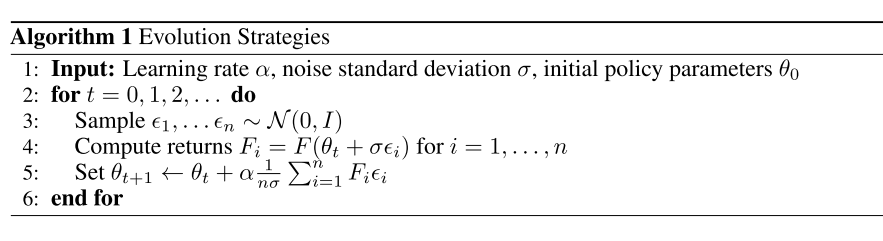
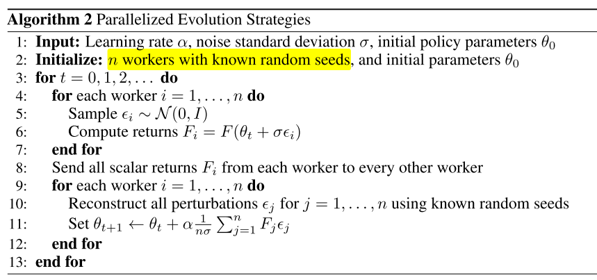
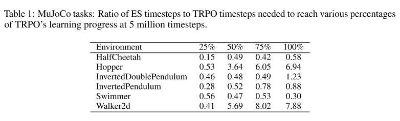
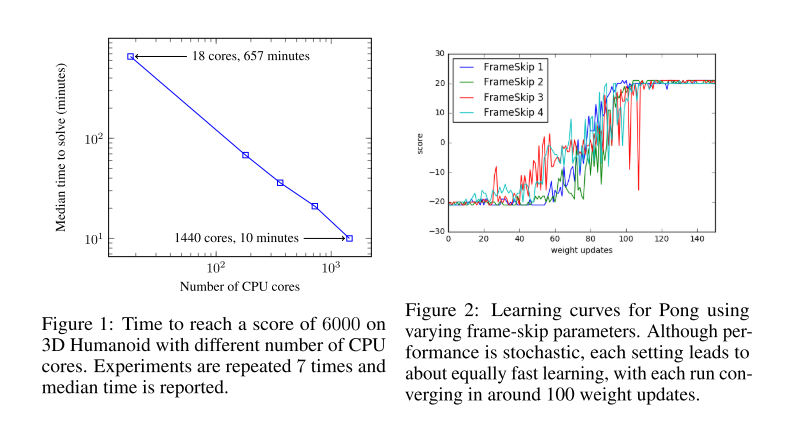

# 2.进化策略

论文：[Evolution Strategies as a Scalable Alternative to Reinforcement Learning](https://arxiv.org/pdf/1703.03864.pdf)

中文：进化策略算法

## Evolution Strategies as a Scalable Alternative to Reinforcement Learning（进化策略）

ES算法：
- 黑箱、优化算法、MDP-based RL的替代。
- 可以根据CPU数量很容易扩展：使用基于普通随机数的通信策略，ES算法只需要通信标量，就能实现数千路并行计算；
- 可以在10分钟内训练好3D人形运动
- 优势：不受动作频率和延迟奖励的影响；可以解决长期依赖；不需要时间折扣或值函数逼近。

## 1 前言

目前解决复杂、非确定性环境RL问题，使用MDP范式和值函数概念；

一个替代方案是使用黑箱优化器：直接策略搜索、神经进化；

ES可以可靠地训练DNN、扩展性
- 使用虚拟批正则化（virtual batch normalization）或其他重参数化方式，可以提高ES可靠性
- ES具有很高的并行性:通过基于普通随机数的通信策略，即使使用超过1000个worker，也能在运行时实现线性加速。特别是，利用1440名workers，我们能够在10分钟内解决MuJoCo 3D类人任务。
- ES的数据效率很高：是A3C的3倍，TRPO的10倍
- ES表现出比TRPO等策略梯度方法更好的探索行为：在MuJoCo人形任务上，ES能够学习各种各样的步态；
- ES鲁棒。

黑盒优化方法具有几个极具吸引力的属性：对奖励分布不敏感（稀疏或密集）、不需要BP、对任意长时间线容忍好。 但是，与诸如Q学习和策略梯度之类的技术相比，它们在解决硬RL问题上被认为效率较低。 

## 2 ES 

ES是一种启发式搜索方法。在每次迭代（“代”）时，一组参数向量（“基因型”）会受到干扰（“变异”），并评估它们的目标函数值（“适应性”）。高得分的参数向量用于生成下一代，知道迭代到最优。此类算法的不同之处在于它们如何表示群体、突变和重组。

代表：协方差矩阵适应进化策略（CMA-ES），其用全协方差多元高斯表示总体。

$$
\nabla_{\psi} \mathbb{E}_{\theta \sim p_\psi} F(\theta)=\mathbb{E}_{\theta \sim p_\psi}\{F(\theta)\nabla_\psi log_{p_\psi}(\theta)\}
$$

对于$$p_\psi$$是因式高斯分解的特殊情况，所得的梯度估计器也称为同时扰动随机逼近，参数探索策略梯度或零阶梯度估计。

本文关注RL，所以$$F(\cdot)$$是环境随机回报，$$\theta$$是确定或随机粗略$$\pi_\theta$$的参数。RL集中在解决缺少进入权限、环境或策略衍生物的存在性上，这种非平滑性可以通过ES解决。

实例化种群分布$$p\psi$$为各向同性多元高斯，其均值$$\psi$$，固定方差$$\sigma^2I$$，使得我们可以用一个均值参数向量$$\theta$$直接表示$$\mathbb{E}_{\theta\sim p_\psi}$$：$$\mathbb{E}_{\theta\sim p_\psi}F(\theta)=\mathbb{E}_{\epsilon\sim N(0,I)} F(\theta + \sigma \epsilon)$$

随机目标可以看作是原始目标$$F$$的高斯模糊形式，没有环境引入的不平滑性或策略采取的潜在离散操作。 

使用随机梯度上升优化 $$\theta$$ ，

$$
\nabla_{\theta} \mathbb{E}_{\epsilon \sim N(0, I)} F(\theta+\sigma \epsilon)=\frac{1}{\sigma} \mathbb{E}_{\epsilon \sim N(0, I)}\{F(\theta+\sigma \epsilon) \epsilon\}
$$

上式可以由抽样优化，算法两阶段：
1. 随机扰乱策略的参数，在环境中执行（一个回合）估计参数；
2. 将这些回合的结果整合，计算随机梯度估计，更新参数
   

$$
\text { Sample } \epsilon_{1}, \ldots \epsilon_{n} \sim \mathcal{N}(0, I)
$$

$$
\text { Compute returns } F_{i}=F\left(\theta_{t}+\sigma \epsilon_{i}\right) \text { for } i=1, \ldots, n
$$

$$
{Set} \theta_{t+1} \leftarrow \theta_{t}+\alpha \frac{1}{n \sigma} \sum_{i=1}^{n} F_{i} \epsilon_{i}
$$

### 2.1 并行化ES

- 每次运行一个回合，环境回报只有标量，worker交流少，并行化好。
- 所有worker同步随机种子作为扰动项，只需交流一个标量是否进行参数更新，**因此带宽极低，而PG方法需要通信整个参数**。
- 不用值函数逼近器。
  

在实践中，每个worker在训练开始时实例化一大的高斯噪声，然后通过在每次迭代中添加这些噪声变量的随机索引子集来扰动其参数来实现采样。

在非常极端的情况下，每个工人只会扰动参数向量的一个坐标，这意味着我们将使用纯有限差分。

- 为减少方差，使用对偶抽样（镜像抽样）：总是估计一对扰动：$$\epsilon, -\epsilon$$
- 使用fitness shaping： 在每个参数更新前，对return使用等秩转换，消除离群个体的影响；
- 使用权重延迟：防止参数相对于扰动增长太大。

其他
- $$\sigma$$ 当作超参数，而不使用自适应
- 直接在参数空间最优化。

### 2.2 网络参数化的影响

诸如Q学习和PG之类的RL算法通过对随机策略中的动作进行采样来探索，**而ES从策略参数的采样实例中获取学习信号**。 因此，**ES的探索是由参数摄动驱动的**。 为了使ES能够改善参数θ，总体中的某些成员必须获得比其他成员更好的回报：即至关重要的是，高斯摄动向量$$\epsilon$$偶尔会导致新的$$\epsilon+\sigma\epsilon$$获得更好的回报。

对于Atari环境，我们发现DeepMind的卷积架构上的高斯参数扰动并不总是能够导致足够的探索：对于某些环境，随机扰动的参数倾向于对始终采取一种特定动作的策略进行编码，而与输入的状态无关。但是，**我们发现通过使用策略规范中的虚拟批处理规范化，可以使大多数游戏的策略梯度方法的性能匹配**。虚拟批归一化正好等同于批归一化，在训练开始时选择用于计算归一化统计量的小批量，并将其固定。参数化的这种变化使策略在训练的早期（策略权重是随机的）对输入图像中很小的变化更加敏感，从而确保了策略采取足够多的动作来收集偶尔的奖励。对于大多数应用程序，虚拟批处理规范化的缺点是培训成本更高。但是，对于我们的应用程序而言，用于计算归一化统计量的最小批量比典型情节中采取的步骤数小得多，这意味着开销可以忽略不计。

对于MuJoCo任务，我们将标准多层感知器映射到连续动作，从而在几乎所有环境中均取得了良好的性能。 但是，我们发现对于某些环境，我们可以通过离散化操作来鼓励更多的探索。 这迫使动作相对于输入观察值和参数扰动是不平滑的，从而鼓励了在部署过程中表现出各种各样的行为。

## 3 参数空间的平滑与动作空间的平滑

RL困难在于没有策略的梯度信息，该梯度可能因为环境或策略非平滑而不存在，或者只在高方差估计的时候可以计算，因为环境只能抽样进入。

假设我们需要解决一般决策问题，，给在一系列动作序列$$a = {a_1, ..., a_T}$$执行之后定回报函数$$R(a)$$，动作可以由确定性或随机策略$$a_t = \pi(s;\theta)$$4决定。我们的优化目标是

$$
F(\theta)=R(\mathbf{a}(\theta))
$$

由于动作可以离散、策略确定性，所以$$F(\theta)$$对于$$\theta$$是非平滑的。更重要的是，由于我们没有显式访问决策问题的底层状态转换函数，因此无法使用类似BP的算法计算梯度。也就是说，没有直接的基于梯度的方法计算$$\theta$$。

为了使问题平滑和具有计算梯度的方式，我们需要加入噪声。策略梯度法通过对相应分布的动作中进行采样，**在动作空间中加入噪声**。例如，假设动作离散、策略$$\pi(s;\theta)$$选择最好动作之前计算每个动作的得分，此时我们考虑抽样动作我们将从每个时间段的动作的 **分类分布** 中采样一个动作$$a(\epsilon,\theta)$$（此处$$\epsilon$$为噪声源），并对每个动作的得分应用softmax。

此时目标函数为$$F_{P G}(\theta)=\mathbb{E}_{\epsilon} R(\mathbf{a}(\epsilon, \theta))$$。梯度为，

$$
\nabla_{\theta} F_{P G}(\theta)=\mathbb{E}_{\epsilon}\left\{R(\mathbf{a}(\epsilon, \theta)) \nabla_{\theta} \log p(\mathbf{a}(\epsilon, \theta) ; \theta)\right\}
$$

以上使PG方法。ES方法从另一个视角解决：**通过在参数空间加入噪声**。ES扰动参数$$\mathop{\theta}\limits^\sim=\theta+\xi$$，其中$$\xi$$来自于多元高斯分布。然后选择动作$$a_t=\mathbf{a}(\xi,\theta)=\pi(s;\mathop{\theta}\limits^\sim)$$。可以解释为将高斯模糊添加到原始目标，从而获得平滑，可微分的损失$$F_{ES}(\theta)=\mathbb{E}_{\xi} R(\mathbf{a}(\xi, \theta))$$，梯度为

$$
\nabla_{\theta} F_{E S}(\theta)=\mathbb{E}_{\xi}\left\{R(\mathbf{a}(\xi, \theta)) \nabla_{\theta} \log p(\tilde{\theta}(\xi, \theta) ; \theta)\right\}
$$

因此，用于平滑决策问题的两种方法非常相似，并且可以通过向参数和操作中添加噪声来使其变得更加平滑。

### 3.1 什么时候ES比PG好？

给定这两种平滑决策问题的方法，我们应该使用哪种方法？ 答案很大程度上取决于决策问题的结构以及哪种类型的蒙特卡洛估计器用于估计梯度$$\nabla_\theta F_{PG}(\theta)$$和$$\nabla_\theta F_{ES}(\theta)$$。 

假设收益与个体行动之间的相关性很低（对于任何RL难题来说都是如此）。 假设我们使用简单的蒙特卡洛（REINFORCE）近似这些梯度，并获得了良好的收益基线，我们有

$$
\begin{aligned}
 {Var}\left[\nabla_{\theta} F_{P G}(\theta)\right] \approx {Var}[R(\mathbf{a})] {Var}\left[\nabla_{\theta} \log p(\mathbf{a} ; \theta)\right]\\
 {Var}\left[\nabla_{\theta} F_{E S}(\theta)\right] \approx {Var}[R(\mathbf{a})] {Var}\left[\nabla_{\theta} \log p(\tilde{\theta} ; \theta)\right]
\end{aligned}
$$

如果两种方法执行的探索量相似，则两个表达式的$Var[R(a)]$都将相似。因此，差异将在第二项中。

这里我们有$$\nabla_{\theta} \log p(\mathbf{a} ; \theta)=\sum_{t=1}^T \nabla_{\theta} \log p(a_t; \theta)$$，是T个不相关项的总和， **因此策略梯度估计量的方差将几乎随T线性增长** 。
ES的相应项$$\nabla_{\theta} \log p(\tilde{\theta} ; \theta)$$独立于T。

因此，ES在有很多时间步的长回合里比PG具有优势与。实际上，在PG中，步数T的有效数量由于折扣奖励而减少。 

如果动作的影响是短暂的，能大大减少梯度估计中的方差，这对于Atari游戏等应用的成功至关重要。 

**但是，如果动作具有长效作用，这种折现将使我们的梯度估计值产生偏差。** 

减少T有效值的另一种策略是使用**值函数逼近**。 这也很有效，但再次冒着使我们的梯度估计产生偏差的风险。 

**因此，如果有效的时间步长T长，动作具有长效作用，并且如果没有好的价值函数估计可用，则进化策略是一个有吸引力的选择。**

### 3.2 问题维度

ES的梯度估计可以解释为高维空间中随机有限差分的一种方法。基于事实$$\mathbb{E}_{\epsilon \sim N(0, I)}\{F(\theta+\sigma \epsilon)\}=0$$，我们有

$$
\nabla_{\theta} \eta(\theta)=\mathbb{E}_{\epsilon \sim N(0, I)}\{F(\theta+\sigma \epsilon) \epsilon / \sigma\}=\mathbb{E}_{\epsilon \sim N(0, I)}\{(F(\theta+\sigma \epsilon)-F(\theta)) \epsilon / \sigma\}
$$

现在很明显，ES可以看作是在随机选择的方向上计算有限差分导数估计，尤其是当$$\sigma$$变小时。 ES与有限差分的相似性表明，该方法将无法随参数$$\theta$$的大小进行缩放。 理论分析确实表明，对于一般的非平滑优化问题，所需的优化步骤数与尺寸成线性比例关系。 但是，这并不意味着使用ES进行优化时，较大的神经网络将比较小的神经网络更差：**重要的是优化问题的难度或内在维度**。

要看到我们模型的维数可以与优化问题的有效维数完全分开，请考虑一个回归问题，其中我们用线性模型$$\hat{y}=x\cdot w$$近似单变量y：如果将特征数量加倍，并且通过将x与自身连接起来（即使用特征$$x'=(x,x)$$）来建立模型中的参数，该问题不会变得更加困难。只要将噪声的标准偏差以及学习率除以2，ES算法在应用于此高维问题时将做完全相同的事情。

在实践中，将大型网络与ES配合使用时，我们会观察到更好的结果。 例如，我们尝试了在A3C中使用较大的网络和较小的网络来学习Atari 2600游戏，平均而言，使用较大的网络可以获得更好的结果。 我们假设这是由于相同的效果，使得相同的效果使大型神经网络的基于标准梯度的优化比小型神经网络更容易：大型网络的局部最小值较小。

### 3.3 不计算梯度的好处

- 并行化
- 长动作序列
- 延迟奖励
- 分布式环境中实现ES的通信开销要低
- ES可以处理最大程度的稀疏和延迟的奖励
- 黑盒，不用计算梯度，每回合计算量减少2/3，内存更少
- 避免梯度爆炸。 通过在参数空间中对成本函数进行平滑处理，我们减少了导致以下问题的病理曲率：足够平滑的有界成本函数不会出现爆炸梯度。、
- 适合用于深度学习的低精度硬件。
- 通过在参数空间而不是动作空间中进行扰动，黑盒优化器自然不会改变我们的代理在环境中起作用的频率。另一方面，
- 对于基于MDP的强化学习算法，跳帧是成功完成优化的关键参数这在使用黑盒优化时并不必要。

## 4. 实验
### 4.1 MuJoCo

我们GYM的连续机器人控制问题的基准上对ES进行了评估，而对TRPO高度优化实施进行了评估，该策略旨在有效地优化神经网络策略。我们测试了两个经典问题，例如平衡倒立摆，以及最近文献中发现的更困难的问题，例如学习2D跳跃和步行步态。该环境由MuJoCo模拟。

我们使用ES和TRPO来训练具有相同体系结构的策略：具有两个由tanh非线性分开的64单位隐藏层的多层感知器。我们发现，ES偶尔会受益于离散动作，因为连续动作相对于参数扰动可能过于平滑，并可能阻碍探索（请参阅第2.2节）。对于跳跃和游泳任务，我们将ES的动作离散到每个动作组件的10个bin中。

我们发现，经过**500万步**的环境互动，ES可以解决这些任务，直到TRPO达到最终性能。为了获得此结果，我们对6个随机种子运行了ES，并将平均学习曲线与TRPO的类似计算曲线进行了比较。表1列出了学习过程中确切的样本复杂度折衷，补充表3列出了详细的结果。通常，与TRPO相比，我们能够在硬环境（Hopper和Walker2d）上以不到10倍的复杂度解决环境问题。在简单的环境中，我们的样品复杂度是TRPO的三倍。

### 4.2 Atari
我们在OpenAI Gym提供的51个Atari 2600游戏上运行了算法2中描述的进化策略的并行实现。我们使用与Mnih等人相同的预处理和前馈CNN架构。所有的游戏都训练了**10亿帧**，这与A3C发布的1天结果所需要的神经网络计算量大致相同，**A3C使用了3.2亿帧**。区别是由于ES不执行反向传播，也不使用值函数。通过并行计算

### 4.3 并行化
ES的通信带宽要求较低，因此特别适合并行化（第2.1节）。我们实现了算法2的分布式版本，以研究ES如何随工作人员数量扩展。我们的分布式实施不依赖特殊的网络设置，并已在公共云计算服务Amazon EC2上进行了测试。

我们选择了来自OpenAI Gym的3D人形机器人行走任务作为缩放实验的测试问题，因为它是最先进的RL技术可解决的最具挑战性的连续控制问题之一，需要大约一天的时间来学习现代硬件。在一部18核机器上用ES解决3D人形生物大约需要11个小时，与RL相当。

但是，当分布在**80台计算机和1,440个CPU内核上时，ES可以在10分钟内解决3D人形生物**，从而将实验周转时间减少了两个数量级。图1显示，对于此任务，ES能够实现CPU内核数量的线性加速。

### 4.4 时间分辨率不变性
RL中的惯例是让智能体以比运行环境的模拟器中更低的频率来决定其动作。 在许多RL算法中，此**动作频率或跳帧**是至关重要的参数。 如果跳帧设置得太高，代理将无法在足够好的时间范围内做出决策以在环境中良好运行。 

另一方面，如果将跳帧设置得太低，则情节的有效时间长度会增加太多，这会降低优化性能，如3.1节所述。

ES的优点是，其梯度估计值与情节的长度不变，这使其对动作频率的鲁棒性更高。 我们通过使用{1、2、3、4}中的跳帧参数运行Atari游戏Pong进行演示。 如图2所示，每种设置的学习曲线确实看起来非常相似。

## 5 结论

我们已经探索了进化策略，一类黑盒优化算法，作为流行的基于MDP的RL技术（例如Q学习和策略梯度）的替代方法。

在Atari和MuJoCo上进行的实验表明，这是一个可行的选项，具有一些吸引人的功能：
- 它对动作频率和延迟的奖励不变
- 不需要时间折扣或价值函数逼近。
- ES是高度可并行化的，这使我们可以通过扩展到更多并行工作器来**弥补数据效率的下降**。

在未来的工作中，我们计划将进化策略应用于那些不太适合基于MDP的强化学习的问题：
- 时间跨度长，奖励结构复杂的问题。
- 我们对meta-learning, or learning-to-learn特别感兴趣。 
- Duan给出了RL设置中元学习的概念证明：使用黑盒优化，我们希望能够扩展这些结果。
- 我们还计划检查将ES与快速低精度神经网络实现相结合，以充分利用ES的无梯度性质。