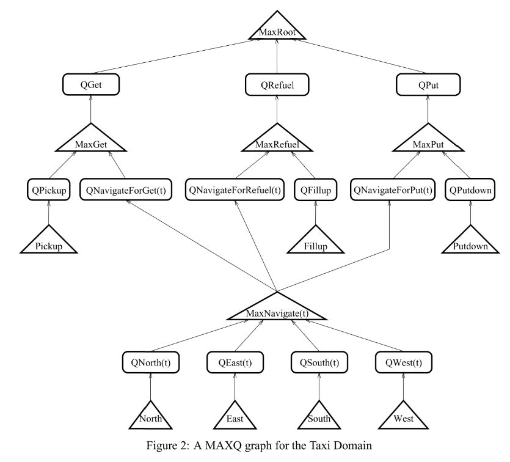

# 2.1 分层强化学习-MAXQ

paper[The MAXQ Method for Hierarchical Reinforcement Learning](http://axon.cs.byu.edu/Dan/778/papers/Hierarchical%20Reinforcement%20Learning/Dietterich1.pdf)

## 1. 核心思想

分层RL好处：
- 提高探索效率： 
- 加速学习效率： 参数少，并且子任务可以忽略不相关的状态特征
- 在新问题上可以学的更快： 可以重用学到的子任务；

为了达到上述目标，目前有三个方面的探索：
- Dean and Lin (1995), 层次化分解, 主要是为了加速计算最优策略.
- Parr and Russell (1998). 设计了一个程序上的包含可能策略的抽象分层; 他们的方法通过有效地使层次结构扁平化，计算出受这些基本约束的最优策略。我们称这种方法为**分级最优**的，因为它的策略在相应的层是最优的.
- Singh (1992)等, 也是程序设计上的分层. 分层定义每个子任务时都有各自的目标状态或终止条件. 每层的子任务对应于自己的MDP, 目标是得到每个子任务的局部最优.我们称其为 **"递归最优"**.  

本文主要基于MAXQ算法介绍第三种方法. 传统Hitton的Feudal Q learning方法存在一个问题：在下层结构中， 学习的任务是非MDP， 所以很难学到有效策略. 而MAXQ方法中, 
- 每一级任务都是MDP的, 并且可以用标准RL方法解决. 
- 在很多case中, 状态的抽象不影响学到的策略的最优性.
- MAXQ支持策略的非层次化执行, 所以在最优策略违反层次化结构时也能work.

**如何解决分层结构中的子任务信用分配问题**？

## 2. MAXQ算法

任务: 出租车问题.
动作空间(7):North ,South, East, West, Pickup, Putdown, Fillup
状态空间: 8750

MAXQ graph: MAX节点和Q节点。叶子的MAX节点代表动作空间; 中间的MAX节点代表子任务. 注意导航子任务被其他任务共享.Q节点代表完成任务相应的一个动作.

**Max节点和Q节点之间的区别确保子任务可以被共享和重用**.
- MAX节点学习上下文无关的任务期望总回报, 例如MaxNavigate(t) 会估计到五个目标点的期望回报.
- 每个Q节点学习上下文相关的子任务回报, 例如, QNavigateForGet(t)学习的是导航到位置t, 然后完成get任务的累积回报; QNavigateForPut(t)学习的是到达位置t,然后完成Put任务的累积回报.
- Q节点会问MaxNavigate(t)到达位置t的cost, 并使用该信息计算Q值.
- 同时, MaxNavigate计算的Q值上下文无关, 并可以被三个父亲节点共享.

|  |
| :------------------------------: |
|              fig 2               |
