# 3. 游戏AI-MuZero

paper:[Mastering Atari, Go, Chess and Shogi by Planning with a Learned Model](https://arxiv.org/abs/1911.08265v2)

**核心**: ==把树搜索与model-based算法结合. 核心思想是model预测与planning直接相关的量(reward, action-selection policy, value function), 而不是真的去预测状态==. 

模型输入一个观测, 将其transform为隐状态, 然后把上一个隐状态和假设的下一步动作作为输入进行**循环迭代更新**. 其中每一步都输出预测的policy (e.g. the move to play), value function (e.g. the predicted winner), and immediate reward (e.g. the points scored by playing a move). 模型使用end-to-end训练, 目标是准确估计这三个量, 让搜索产生的策略估计和值估计与与观察到的奖励相匹配.

对隐状态没有直接限制和语义假设, 不用重构观测, 减少了模型的输入和输出的数据量. 只要可以很好地表示当前和未来value和policy就可以.

## 1. 相关工作

* 基于前向搜索的planning算法依赖于环境动力学知识. 
* model-free算法比较成功, 它直接与环境交互进行迭代. 但在围棋这种需要前向思考的问题中, 表现不好.
* model-based算法先学习环境模型, 然后基于该模型进行planning. 包括状态转移模型和reward模型两部分. 一般算法包括表示学习, 模型学习, planning三块.
* Value equivalent models, 端到端预测值函数地model-based方法. 基于value equivalence假设. 从一个状态出发, 经过抽象MDP的trajectory和真实轨迹的trajectory的环境奖励等价. 这种模型只预测值, 不关注动作. 这样抽象的MDP的**状态转移就不必是真实的环境模型**, 而是可以看作NN的一个隐藏层. 用TD等方法训练, 让期望累积回报与环境真实期望值相匹配.
* Value equivalent models后来扩展到optimising value (with actions). **TreeQN**算法学习抽象MDP模型i, 使得在模型(树结构的神经网络)上进行树搜索逼近最优值函数. Value iteration networks学习local MDP模型, 使得模型(CNN)的值迭代过程逼近最优值函数. Value prediction networks基于真实动作学习MDP, 展开的MDP累积奖励(限制在简单前向搜索过程的真实动作序列)与真实环境奖励匹配. 该算法与MUZero相似, 但是没有policy预测过程.

## 2. MuZero Algorithm

|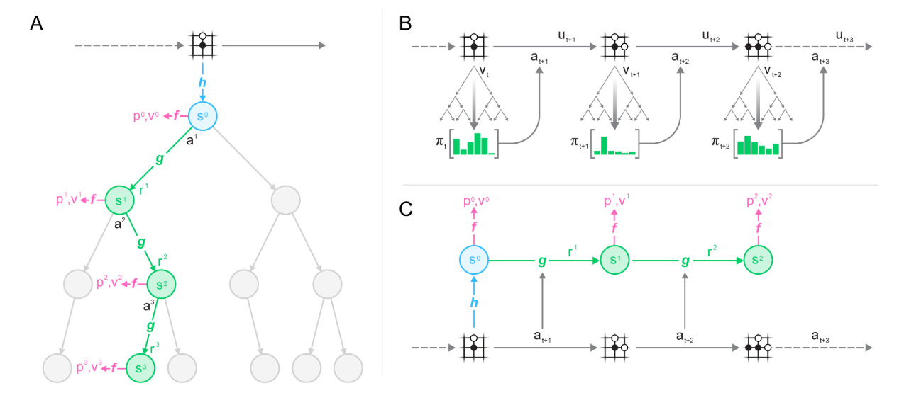|
|:-:|
|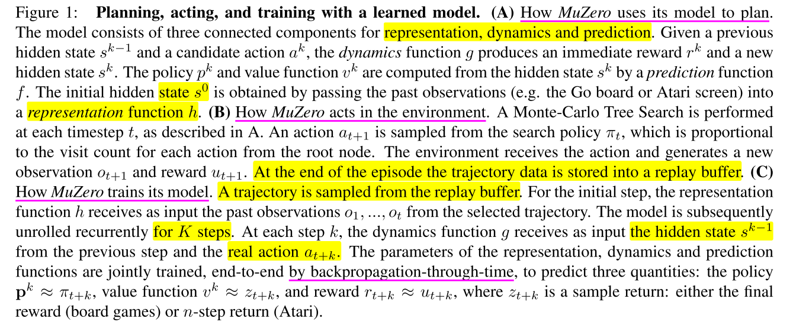 |

### 2.1. 模型训练

**在每个时间步$$t$$, MDP 展开$$K$$步, 与从MCTS actor trajectory中抽样的序列进行对齐**. 其中对于Atari游戏使用prioritized replay抽样, 并调整loss的重要性采样率; 对于棋盘类游戏, 使用均匀采样.

同时对于抽样得到的每一个观察$$o_t$$都有一个对应的MCTS策略$$\pi_t$$, 估计值$$v_t$$, 环境奖励$$u_t$$. 在展开的每一步都有相应的loss, 加起来组成MuZero的loss.

每一步模型$$\mu_\theta$$基于以前观察$$o_1, ..., o_t$$和未来真实动作$$a_{t+1}, ..., a_{t+k}$$, 预测三个值: 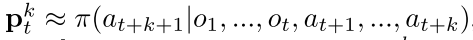 , 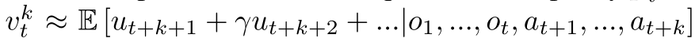 和立即回报 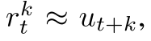 其中$$\mu$$也是真实奖励.

每个时间步t, 模型本分成三个部分: a representation function, a dynamics function, a prediction function. 动态方程 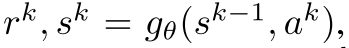 反应MDP结构信息. 策略和值函数基于内部状态$$s^k$$进行预测, 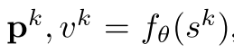 与Alpha Zero相似. 初始状态$$s^0$$用表示函数h抽象.

### 2.2 树搜索过程

有了上述模型, 就可以进行前向搜索了. 最简单的方法就是生成k个动作序列最大化值函数. 为了提高模型泛化性能, 使用MCTS加入planning. 在进行MCTS时可以利用模型的policy, value and reward estimates. 之后基于MCTS生成的策略$$\pi_t, v_t$$执行动作.

### 2.3 loss

训练模型时, 使用真实K步的动作和奖励进行逼近. 

* 与AlphaZero相似, the improved policy targets are generated by an MCTS search; **首要目标**是减少$$p_t^k$$和 $$\pi_{t+k}$$之间的误差; 值函数也是通过模拟游戏得到的.
* 与AlphaZeor不同的是, 本文允许对未来搜索值的n步bootstrapping, 得到长时的折扣奖励 $$z_t=u_{t+1} +\gamma u_{t+2}+...+ \gamma^{n-1} u_{t+n}+ \gamma^n v_{t+n} $$. 最终结果为 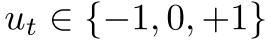. 
* **第二个目标是**最小化预测价值$$v_t^k$$和 目标价值$$z_{t+k}$$的误差.
* **第三个目标**是最小化预测奖励和真实奖励之间的误差/

最后, 总的loss如下

(1)

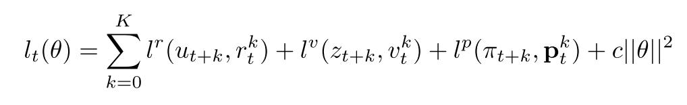

同时, 为了在不同的展开步骤中让梯度大小大致相似, 在两个单独的位置缩放梯度:

* 对每个头的loss乘一个$$\frac{1}{K}$$, 其中K是展开步的大小. 可以保证梯度大小量级差不多.
* 在动态方程开始的梯度乘$$\frac{1}{2}$$, 保证动态方程的总梯度保持常数.

同时, 对隐状态也缩放到[0, 1], 保证和动作拼接时不会有太大影响. 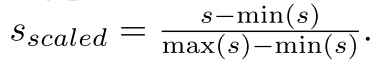 

### 2.4 函数汇总

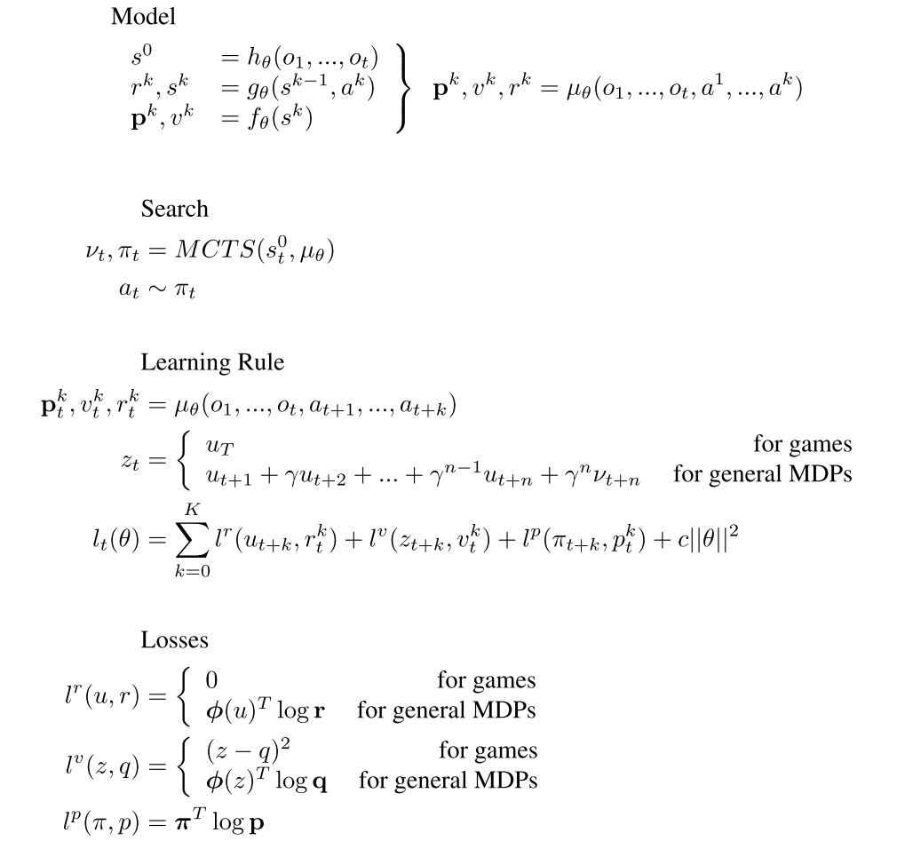

Figure S2. Equations summarising the MuZero algorithm. Here, $$\phi(x)$$ refers to the representation of a real number x through a linear combination of its adjacent integers, as described in the Network Architecture section.

## 3. 实验和分析

### 3.1 实验设置

1. K=5.
2. 棋盘类游戏 100万个2048的minibatch; Atari100万个1024的minibatch
3. 注意, 对于棋盘类游戏, bootstrap到游戏结束, 等于预测最终结果; 对于Atari, n=10.
4. MC模拟: 棋盘类800步, Atari50步.
5. 3种网络都使用ResNet, 输入相应的隐状态和动作拼接的plane.所有网络都用256个隐层.
6. MCTS过程, 节点都是隐状态及其统计信息. **并且保存了state transition and reward table**. 

   - 在selection阶段, 基于隐状态表和reward表选择动作; 为了解决有些环境的即时奖励是unbounded的, 使用normalized Q值计算UCB.
   - 在Expansion阶段, 用动态方程从叶子生成新节点添加到搜索树里. 搜索算法每次模拟只使用一次动态方程和预测函数, 所以计算复杂度和AlphaZero一样.
   - Backup步骤, 计算累积折扣奖励(bootstrapping from the value function). 然后更新Q和N.

7. 棋盘类游戏: 模型训练使用16个TPU, selfplay使用1000TPU; Atari: 训练8 TPUs,32 TPUs用来selfplay.

### 3.2. MuZero与AlphaZero对比

* AlphaZero的planning包括两个方面: 1)模拟对局根据规则更新状态, 执行树搜索; 用神经网络预测叶子节点的策略和值函数. 
* AlphaZero在三个地方使用了规则: 1) 树搜索的状态转移; 2) 树节点的可用动作; 3) 搜索树的终止状态. MuZero中, 所有这些都被一个隐式模型所取代.
  + State transitions. AlphaZero通过真实模拟对局进行状态转移; MuZero在搜索时使用动态模型. 通过该模型, 搜索树的每个节点都被表示为隐状态, 该隐状态通过前一个隐状态和动作得到当前状态 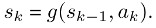 
  + Actions available. AlphaZero用合法动作mask网络产生的策略. MuZero只在根节点mask合法动作, 在后续搜素时不加mask信息. 因为网络可以学习不去拟合从未发生过的动作.
  + Terminal nodes. AlphaZero在终止状态时用真实值代替网络预测值. MuZero始终用网络预测值, 此时树搜索可以proceed past终止节点, 只不过对这种节点都预测相同的值. 在训练时通过把终止状态视为吸收状态absorbing states来实现.
* MuZero应用范围更广, 可以用于即时奖励不为0的环境. AlphaZero只用于终止状态有$$\pm 1$$奖励的环境.

## 相关论文

[TreeQN and ATreec: Differentiable tree planning for deep reinforcement learning.](https://arxiv.org/abs/1710.11417)
[Value prediction network.](https://arxiv.org/abs/1707.03497)
[Value iteration networks.](https://arxiv.org/abs/1602.02867#:~:text=Value%20Iteration%20Networks.%20We%20introduce%20the%20value%20iteration, planning-based%20reasoning%2C%20such%20as%20policies%20for%20reinforcement%20learning.)
