

# 0.3 强化学习-PPO

paper:[Proximal Policy Optimization Algorithms](https://arxiv.org/abs/1707.06347)

核心:

1. on-policy策略梯度算法, 使用重要性采样解决从行动策略进行采样的问题, 但是与off-policy算法不同, 这里的行动策略是老策略$$\theta_{old}$$, 所以还是相当于on-policy算法.
2. TRPO算法的改进版, 把$$\beta KL(\theta, \theta')$$添加进目标函数里, 一阶优化算法, 更容易实现, 样本复杂度也更高, (而TRPO作为最优化算法的约束项, 而且不使用策略梯度).
3. 交替执行从策略中采样数据和代理("surrogate")目标函数优化过程, 优化时进行minibatch的多epochs更新. 而标准PG算法每抽样一次数据进行一次梯度更新.
4. 该算法的样本复杂度(越复杂越好), 算法复杂度(越简单越好), 挂钟时间(越短越好) 具有很好的平衡. 
5. cliped的目标函数代表了策略得下界, 使用TD(n)计算优势函数$$A$$.

## 1. 背景

### 1.1. PG

策略梯度算法一般是把策略梯度喂进随机梯度上升算法里, 常用梯度估计器为

<table>
<tr>
<th>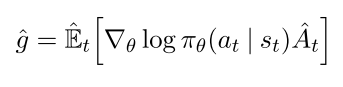</th>
<th> (1) </th>
</tr>
</table>

其中$$\pi_\theta$$为随机策略, $$\hat{A}_t$$为优势函数. 计算该梯度, 一般要构造目标函数为

<table>
<tr>
<th>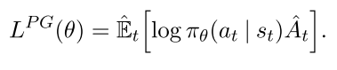</th>
<th> (2) </th>
</tr>
</table>

该函数不适合用同一个trajectory做多步优化, 往往效果很差.

### 1.2. Trust Region Methods

TRPO算法的优化过程改为一个到约束最优化过程, 其约束限制策略更新的幅度, 

<table>
<tr>
<th>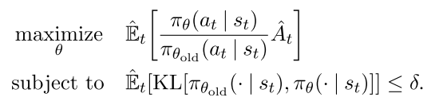</th>
<th> (3, 4) </th>
</tr>
</table>

其中, $$\theta_{old} $$是更新前的策略参数向量. 对目标进行线性逼近, 对约束进行二次逼近, 该问题可用共轭梯度算法有效地近似求解. 

PPO算法把约束项作为惩罚项, 将上述问题变为无约束问题, 

<table>
<tr>
<th>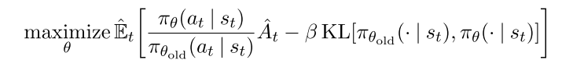</th>
<th> (5) </th>
</tr>
</table>

其中 $$\beta $$需要自适应修改, 优势函数需要增加一些约束.

## 2. PPO

### 2.1 Clipped Surrogate Objective (PPO2)

令$$r_t(\theta)=\frac{\pi_\theta(a_t|s_t)}{\pi_{\theta_{old}}(a_t|s_t)}$$, 因此$$r(\theta_{old})=1$$, TRPO最大化目标函数:

<table>
<tr>
<th>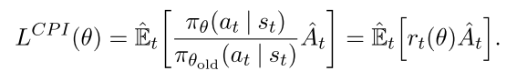</th>
<th> (6) </th>
</tr>
</table>

上标CPI表示保守策略迭代(conservative policy iteration [KL02]). 如果不加约束直接优化上述L会造成策略更新太大, 因此要考虑如何惩罚策略更新幅度, 让它不太远离1. 构造如下目标函数, 

<table>
<tr>
<th>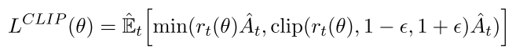</th>
<th> (7) </th>
</tr>
</table>

加clip的意思是

| 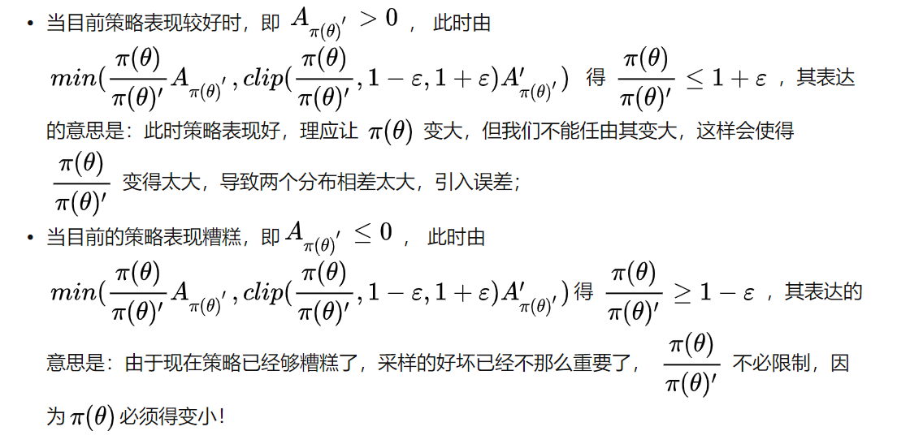 |
| :------------------------------: |
|              fig 1               |

|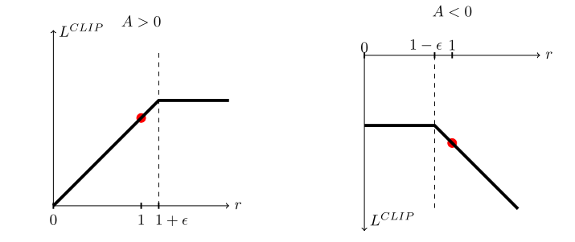|
|:-:|
|fig |

### 2.2. Adaptive KL Penalty Coefficient (PPo1)

另一种解决思路是自适应惩罚因子$$\beta$$, 该算法在每次策略更新中执行下面两步:

* 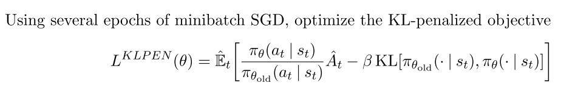 
* 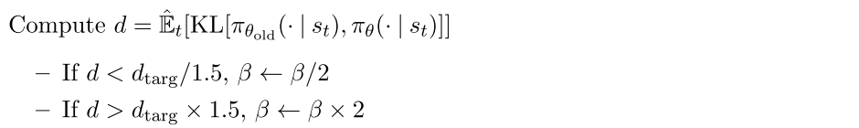 

更新后的$$\beta$$用于下一次策略更新. 

### 2.3. 多步更新计算A

有很多方法计算方差减少的优势函数(variance-reduced advantage-function estimators).

广义优势函数如下:

<table>
<tr>
<th>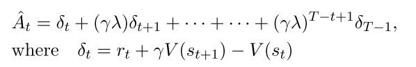</th>
<th> (11, 12) </th>
</tr>
</table>

本文使用广义优势函数的截断版本, 令$$\lambda=1$$, 得, 

<table>
<tr>
<th>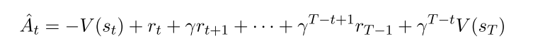</th>
<th> (10) </th>
</tr>
</table>

### 2.4 PPO算法伪代码

通过构造$$L^{CLIP}$$或者$$L^{KLPEN}$$的损失函数可以直接用自动微分进行多步SGD优化.

整体损失函数为

<table>
<tr>
<th>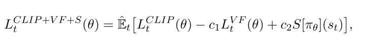</th>
<th> (9) </th>
</tr>
</table>

其中, $$c_1, c_2$$是系数, $$S$$表示an entropy bonus, $$L_t^{VF} $$表示均方误差损失, $$(V_\theta(s_t) - V_t^{targ})^2$$, 一般$$ V_t^{targ}  \leftrightarrow \hat{R_t}$$

PPO算法使用固定长度trajectory片段, 每次迭代中, 每N个并行Actor收集T个时间步得数据, 然后使用这NT个数据构造代理目标损失函数, 并使用K个epochs的minibatch-SGD优化该损失函数, 通常Adam算法表现比较好.

| 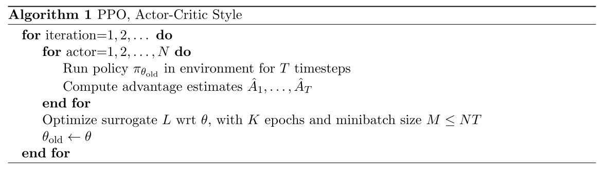 |
| :------------------------------: |
|             fig   2              |

## 3. 实验

### 3.1 实验设置

1. 测试的损失函数

   -  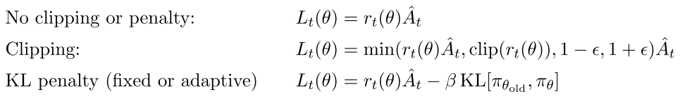 

2. 对于KL散度版本, 可以使用固定或自适应的$$\beta$$, 并使用target KL value  $$d_{targ}$$. 作者测试了log空间中的版本,但是表现并没有变好.
3. 在7个环境中测试算法, 每个训练100万步, 超参数$$\epsilon, \beta, d_{targ}$$使用了搜索, 其他的超参数是指定的.
4. 策略表示: 使用2x64的FC层+tanh激活, 输出高斯分布均值, 其标准差可变;
5. **策略函数和值函数不共享参数**, 所以参数$$c_1$$无关, 也不使用entropy bonus项;
6. 每个算法都在7个环境中测试, 使用最后100 episodes的平均总回报作为比较, 

| 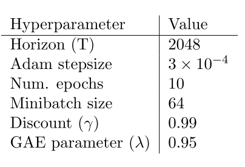 |
| :-----: |
| Table 3: PPO hyperparameters used for the Mujoco 1 million timestep benchmark |
| 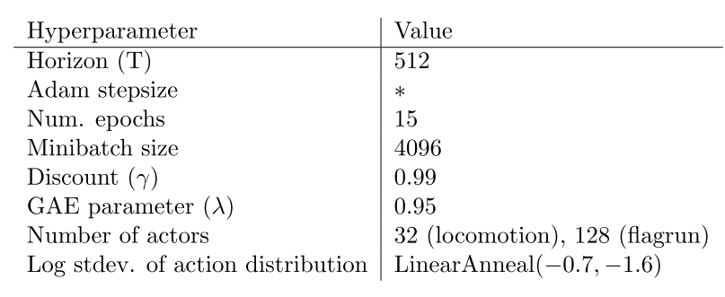|
|Table 4: PPO hyperparameters used for the Roboschool experiments. Adam stepsize was adjusted based on the target value of the KL divergence. | 
|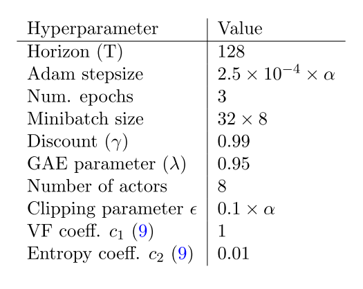|
|Table 5: PPO hyperparameters used in Atari experiments. α is linearly annealed from 1 to 0 over the course of learning. |

## 讨论

目前RL提高点:

* 扩展性(大型模型以及并行化)
* 数据效率
* 鲁棒性(不用调超参数也可适用于多个任务).

目前主流算法缺点:

* DQN, 可解释性差, 不适应连续控制任务
* VPG, 数据效率低, 鲁棒性差
* TRPO, 算法太复杂, 不适用于存在噪声(dropout)或者参数共享(策略与值函数共享参数, 或任务与辅助任务共享参数)的结构.

PPO简单有效的方法. 
