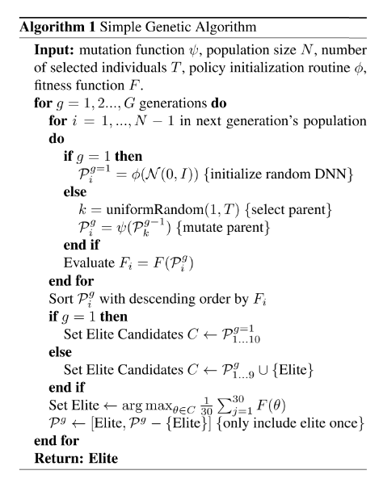

# 1.深度神经进化

深度神经进化：遗传算法是一种训练RL神经网络的有效替代方法

论文：[Deep Neuroevolution: Genetic Algorithms are a Competitive Alternative for Training Deep Neural Networks for Reinforcement Learning](https://arxiv.org/pdf/1712.06567.pdf)

## 1 前言

### 1. 介绍
目前DRL将DNN与RL结合，有一系列成功的任务，
- 像素游戏(Atari)、控制任务(MuJoCo)、推荐系统；
  
DRL 有一系列成功的算法，
- Q-learning系列、策略梯度（PG）系列、进化策略（ES）算法；

上述算法成功都使用基于梯度的训练方法，
- DQN中用bp、PG中随机梯度上升和bp、ES中随机梯度上升。

**是否可以使用非梯度方法训练？比如遗传算法（GA）。**

Q-learning系列：DQN…，
- 原理：用DNN逼近最优Q函数，生成策略，给定状态选择动作使得Q值最大化；
- 训练：使用BP算法训练Q函数逼近器。

策略梯度系列： A3C,TRPO,PPO …
- 原理：直接学习DNN策略网络的参数，输出每个状态的动作概率分布；
- 训练：从当前策略随机抽样动作，然后通过随机梯度上升强化动作。

ES算法
- 学习参数的均值，在参数空间近似回报函数的梯度；
- 并行化训练提升效率。

### 2. 遗传算法（GA）：非梯度最优化方法

Individual，个体：
- genome：染色体，此处为权重向量；
- evaluation :评估函数，此处为DNN，输出动作；
- fitness：适应度函数，此处使用回合中累积回报。

Population，种群
- individuals ：所有个体列表
- best ：记录最优个体。

遗传算子
- 选择、交叉、变异
- 精英保留策略，把父代最好的个体直接copy到下一代。

## 2 背景
- RL：如何不用监督方法实现累积回报（折扣or总和）最大化
- DRL：使用DNN的RL，基于梯度的方法。都使用随机梯度下降/上升优化参数。
  - Q-Learning方法：DQN。
    - 使用DNN逼近最优Q函数，生成策略，给定状态选择动作使得最大化Q值。
    - 使用BP算法训练Q函数逼近器。
  - Policy Gradient方法： A3C，TRPO，PPO。
    - 直接学习DNN策略的参数，输出每个状态的动作概率分布。
    - 从当前策略随机抽样动作，然后通过随机梯度上升强化动作表现。
  - evolution 策略： ES。
    - 学习参数的均值（而不是方差），在困难RL中表现与DQN和A3C差不多，但由于并行化很好训练更快。
    - 不解析地计算梯度，但是在参数空间近似回报函数的梯度。
- 基于非梯度的方法：GA等。
  - 基于GA的算法表现很好。

## 3 方法
### 1. GA
- 使用简单GA算法作为基线。
- 种群：P，N个个体
- 个体：基因型，参数向量$$\theta$$,
- 适应度：每一代由每个个体$$\theta_i$$，计算适应度$$F(\theta_i)$$。

过程：
  - 选择：使用截断选择，选择top T的个体作为父母，产生下一代。
  - 变异繁殖（重复N-1次）：均匀随机选择父代，对父代群体参数，加入随机高斯噪声。$$\theta'=theta+\sigma\epsilon, \epsilon\sim\mathcal{N}(0,I)$$
  - 精英保留策略：保留最好的个体，参数完全复制给下一代的第N个个体。为了更好地选择精英，对top 10的个体额外训练30回合，选择最好的。
  - 没有交叉过程。
  

超参数
  

参数向量
  - 经典方法存储每个个体的参数向量。性能很差。
  - 压缩存储，distributed deep GA.
    - 通过将每个参数向量表示为一个初始化种子，加上产生一系列突变的随机种子的列表，可以重构参数向量。
    - 这一创新对于有效实现分布式深度遗传算法至关重要。
    - 
    - $$\theta^n$$是$$\theta^{n-1}$$的后代；
    - $$\mathcal{\psi}(\theta^{n-1},\tau_n)$$是确定性变异函数；
    - $$\tau$$是$$\theta^n$$的随机种子列表的编码；
    - $$\theta^0=\phi(\tau_0)$$，其中$$\phi$$是确定性初始化函数；
    - $$\varepsilon(\tau_n)\sim\mathcal{N}(0,I)$$是确定性高斯伪随机数生成器，随机种子$$\tau_n$$，生成长度为$$|\theta|$$的向量；
    - 本例中，$$\varepsilon(\tau_n)$$是一个可以用28bit索引的大型预计算表。
- 参数压缩编码技术
  - 压缩编码技术的原理是，种子需要足够长，可以为每一个父代到子代产生一个唯一的突变向量。
  - 如果给定父代$$\theta^{n-1}$$最多产生$$x$$个后代，那么公式（1）的$$\tau_n$$最小$$log_2(x)-bit$$个数字。
  - $$\tau_0$$比较特殊，第0代N个$$\theta$$，每个都需要一个唯一种子，因此要编码为$$log_2(N)$$-bits。
  - 为了可以到达搜索空间的所有点，种子长度至少为$$log_2(|\theta|)$$-bits。用一个函数$$\mathcal{H}(\theta,\tau)$$把给定$$(\theta,\tau_n)$$对映射为新的种子。
    - 
  - 注意有两个种子的概念，编码是一系列小的$$\tau$$种子，但是每个新的种子$$\tau$$是从父代$$\theta$$和前一代种子生成的。

  
压缩编码技术线性增长，性能很好。
  - Atari几十代，400万以上参数的神经网络能够在几千字节(10000倍的压缩)内被压缩表示；
  - 压缩率取决于代数，但实际上总是很大的:所有Atari最终网络的压缩率是8000 - 50000倍
  - 不通用，因为它不能压缩任意网络，而只适用于由遗传算法进化而来的网络。

提到ES因为其并行性能。deep GA更好。
  - Atari，用GPU加速用大约4小时完成，
  - 对于720个分布式cpu，大约需要1小时的训练；
  - ES通过加权平均大量伪后代计算如何更新参数向量。
  - 随机遗传算法参数的扰动在没有虚拟批处理标准化的情况下产生足够多样化的策略，从而避免了这些额外的通过网络的转发。

### 2.Novelty Search

可以把之前开发的进化算法直接应用到新的算法里。比如NS，它是为基于奖励的优化机制收敛于局部最优的欺骗性的领域设计的。

NS避免局部最优解：
- 在进化时忽略回报函数，奖励那些执行了以前从未执行过的行为的智能体。
- 该方案经常比利用奖励信号的方法表现好。
- 本文测试在Image Hard Maze中，DNN+NS的性能。

GA-NS.
- NS需要：一个行为特征（BC）描述一个策略$BC(\pi)$的行为，
- 一个行为距离函数，计算两个策略的距离, $dist(BC(\pi_i),BC(\pi_j))$
- 每一代结束，种群中的成员有一个概率$p$（这里时0.01），把它的BC值存档。
- 一个策略的新奇度定义为到存档或种群中的$k$（这里是25）个最近的邻居的平均距离。新奇个体是基于他们到当前或以前看到过的个体的行为距离来确定的。否则GA正常进行，用novelty代替适应度。

## 4实验

测试经典像素挑战、连续控制任务、还有Image Hard Maze（有清晰的局部最优，测试如何避免欺诈）。
画图时选的最好的。

### 1.Atari
与经典RL算法和ES对比。13个Atari游戏
- 为了与ES对比，我们保持GA运行过程中智能体的游戏帧数量不变(在10亿帧)，导致每一次运行单独GA代数不同、有些游戏不同质量的策略需要更多的帧（比如智能体生命更长）。
- 训练时使用一个回合进行估计，可能多条命，适应度为回报求和。
- 以下与DQN相同：
  - 数据预处理
  - 网络结构；4M参数
    - 3 conv,32,64,64,
    - 8 × 8, 4 × 4, 3 × 3 ,
    - 步长 4, 2, and 1/ 
    - fc 512/
  - 每一回合开始的随机环境，30个随机动作和初始化的无操作；

公平比较：评估不均衡
- 算法在计算、时钟速度和样本效率之间实现了不同的权衡
- 在可能的情况下，我们将我们的结果与其他随机开始算法的结果进行比较。
  - 对于DQN和ES来说是这样的，
  - 但是对于A3C来说不是这样的，因为我们必须包含人类启动的结果。

**测试了给定更多计算资源时的表现（GA 6B），大多数游戏仍未收敛，留下了讨论空间。**

GA在许多游戏中表现也较差，这延续了深RL的主题，即不同系列的算法在不同领域中表现不同。关键的结论是他们都趋向于大致相似的表现。

在许多游戏中，GA只需要一个或几十代就能找到比DQN更好的解决方案!

有时候第一代表现就很好，说明高质量的策略里随机初始很近，那么GA比随机策略好吗？
- 为了回答这个问题，我们评估了许多由遗传算法的初始化功能，并报告最好的分数随机生成的策略。
- 我们给出了与遗传算法大致相同的帧数和计算量的随机搜索，并比较了它们的性能。
- 有趣的是，随机搜索产生的这些策略中有一些并不是琐碎的、退化的策略。
  - 该策略在不到1小时的随机搜索中获得了非常高的3620分，而DQN在经过7-10天的优化后平均得到797分。
  - 人们可能会认为，随机搜索找到了一个幸运的开环序列，这些动作过度适合于特定的随机环境。
  - 值得注意的是，我们发现这个策略实际上也可以推广到其他初始条件，在200个不同的测试环境(每个环境最多有30个随机的初始无操作，这是一个标准测试过程)中值为3,170 (95% bootstrap中值置信区间为2,580 - 3,170)
  - 这些结果进一步表明，有时最好的搜索策略不是遵循梯度，而是在一个局部邻域进行密集搜索，选择找到的最佳点。

### 2. Image Hard Maze
该实验旨在证明在DNN尺度下使用GA的好处，即为改进GA而开发的算法可以立即应用于改善DNN训练。

Image Hard Maze给出了在强化学习中存在的局部最优解(即欺骗)问题。在这个游戏中，当直线飞行时，机器人越接近目标就会得到更多的奖励。

这个问题具有欺骗性，因为贪婪地接近目标会导致代理永久地陷入地图的欺骗性陷阱(图1，左)。没有进行充分探索的优化算法会遭受这样的命运。NS解决了这个问题，因为它忽略了奖励，鼓励代理人去新的地方。

这里使用鸟瞰图像素（84x84）输入，完全可观察环境。神经网络必须学会处理这些像素输入并采取行动。

基于遗传算法的新颖性搜索(GA-NS)能够通过寻找目标来解决问题

**我们的结果证实，我们能够使用探索方法，如新奇搜索来解决这类欺骗，甚至在高维问题，如那些涉及直接从像素学习**
通过杂交新奇搜索与ES创建NS-ES，并表明它也可以帮助深度神经网络避免欺骗挑战RL基准领域。

### 3. Humanoid Locomotion
GA还能够解决具有挑战性的类人运动连续控制基准问题
虽然GA确实能制造出行走良好的机器人，但它要花费约15倍的时间来完成比ES稍差的任务，这令人惊讶，因为GAs之前在机器人移动任务上表现良好

它需要比ES多得多的计算量(ES需要大约100代才能使性能的中值超过6,000阈值)。

## 5 讨论
在被认为需要至少一定程度的梯度估计的域中，GA和RS的令人惊讶的成功表明，高维搜索空间的某些迄今未被充分认识的方面。
- 在某些情况下，在原点周围区域进行密集采样足以找到比通过最新的基于梯度的方法找到的更好的解决方案。
- 遗传算法的结果进一步表明，在良好解决方案周围的区域进行采样通常足以找到更好的解决方案。 
- 该结果反过来又意味着质量不断提高的解决方案分布异常密集，并且您无需遵循梯度即可找到它们。

另一个非互斥的假设是，由于时间扩展的探索，GA（和ES）的性能得到了提高，这意味着它们可以一致地进行探索，因为情节中的所有动作都是同一组突变参数的函数，从而改善了探索。 这有助于进行探索，其原因有两个：（1）代理每次访问相同状态时都会执行相同的操作（或在操作中具有相同的分布），这使得更容易了解该状态下的策略是否有利；以及（ 2）代理也更有可能在各个州之间具有关联的动作（例如，总是上升），因为对其内部表示的更改会类似地影响在许多州采取的动作。

有时跟踪梯度实际上要比在参数空间中进行局部采样来获得更好的解决方案更糟糕。GA可能胜过基于梯度的方法的原因是，如果存在局部最优，因为它可以在参数空间中跳过它们，而梯度方法则不能
- 一个未知的问题是，GA风格的局部无梯度搜索在搜索过程的早期是否更好，但是稍后切换到基于梯度的搜索可以使GA取得进一步的进展，而这将是不可能的，或者在计算上过于昂贵。
- 另一个未知的问题是，如何将GA方法与用于深度RL的现代算法（例如Q学习，策略梯度或演化策略）同时进行混合。

相对于用于训练强化学习问题的深度神经网络的竞争算法，我们仍然对GA的最终前景知之甚少。 此外，这里我们使用了非常简单的GA，但是发明了许多技术来改善GA性能，
- 包括交叉，间接编码和鼓励质量多样性等。 
- 此外，已经发明了许多技术，它们可以通过反向传播显着改善DNN的训练，例如残差网络，SELU或RELU激活功能，LSTM或GRU，正则化，辍学和退火学习速率计划。 
- 我们假设许多这些技术还将改善大型DNN的神经进化。

其中一些增强功能可能会改善类人动物运动中的GA性能。 例如，事实证明，间接编码允许基因组参数影响最终神经网络中的多个权重（类似于卷积的束缚权重，但具有更大的灵活性），它可以在进化机器人步态时显着提高性能和数据效率 。 这些结果是通过HyperNEAT算法发现的，该算法具有一种间接编码，该编码抽象化了发育生物学的力量，并且对于我们正在研究的Humanoid Locomotion和Atari是一个特别有希望的方向。 了解Deep GA倾向于在哪些领域上表现良好或较差，并理解其原因，将变得更加有趣。 而且，GA可以在其他不可微的领域提供帮助，例如架构搜索和训练有限精度（例如二进制）的神经网络。

## 6. Conclusion

用GA训练DNN

压缩编码技术，参数量少。速度快，在单机GPU4小时、720cpus 1小时

GA在Atari表现和其他算法差不多

随机的好处

与其他改进算法结合，GA-NS，可以直接用于优化DNN

但是在人形运动控制任务表现不好

还有哪些旧算法应该被重新使用
