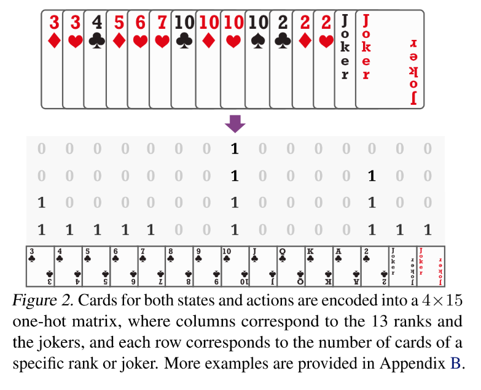
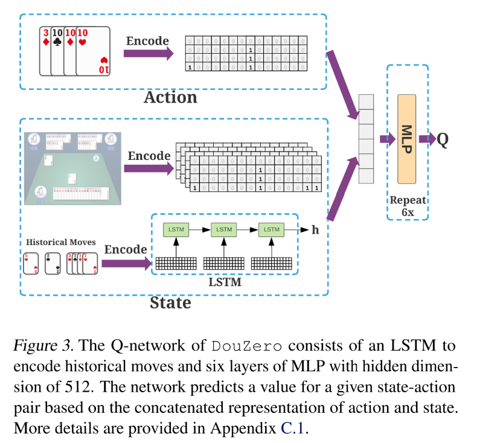
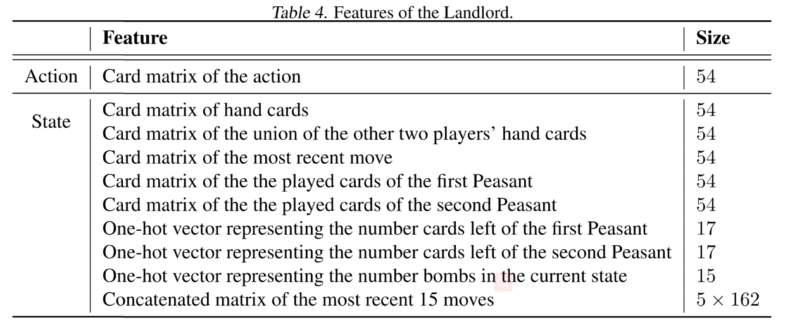
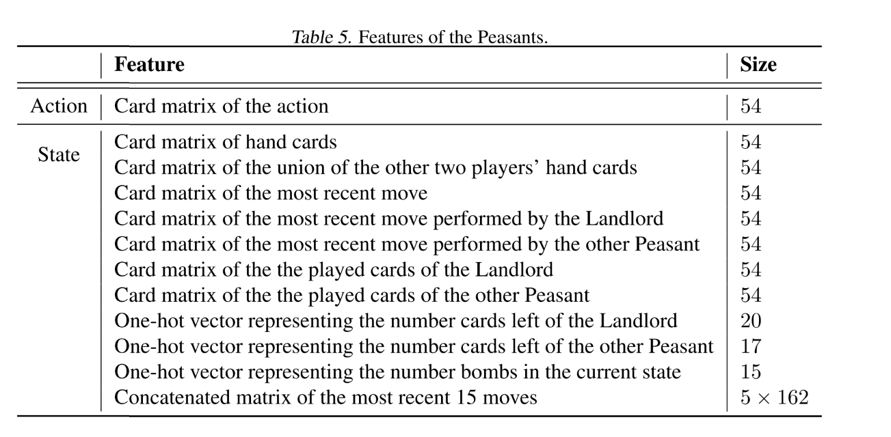
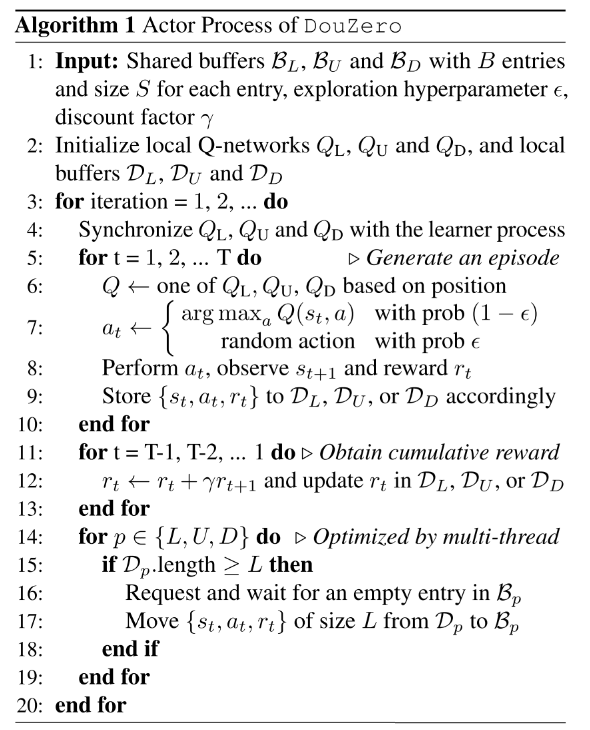
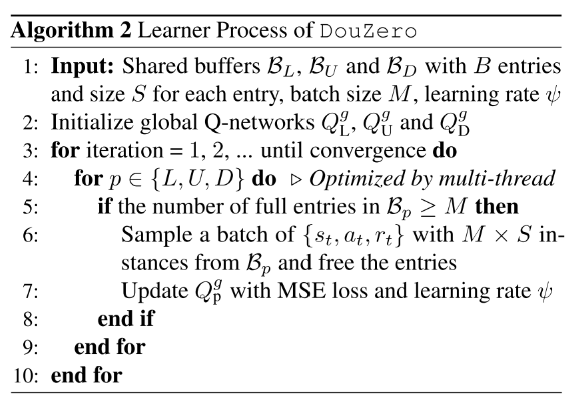
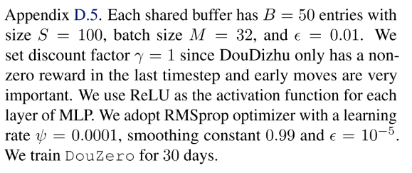
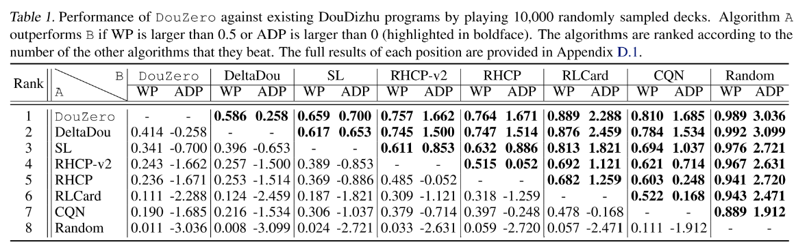
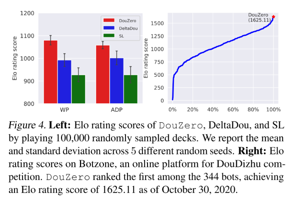
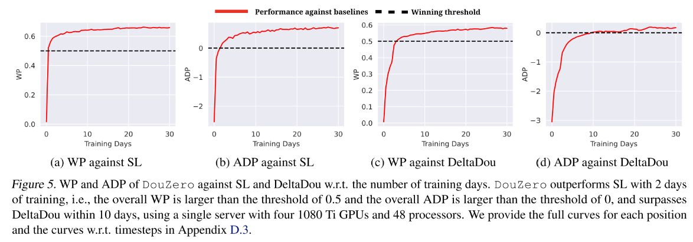

# 3. 游戏 AI-斗地主-DouZero

**主要关注它实验是怎么做的.**

斗地主困难: 竞争, 协作, 非完美信息, 巨大的状态空间, 动作空间巨大(27472), 合法动作集合变化剧烈，

本文基于 MC 方法, 结合 DNN, 动作编码, 基于采样的方法并行化 actors 进行训练, 单机 4 个 GPU 下训练 10 天, 超过 DeltaDou.

已有算法：

- [Counterfactual Regret Minimization (CFR)]()不适合这种三人棋牌游戏。
- DQN 算法不能用, 因为其在巨大动作空间中, 由于过估计问题导致很难学习.
- A3C 等策略梯度算法, 输出一般与动作数量相同维度, 不能利用斗地主的动作特征, 所以不能想 DQN 那样处理没见过的动作.
- [Combination Q-Network (CQN)]() 把动作分解为拆牌选择和最终动作选择两部分. 但是分解依赖人类先验, 而且很慢.
- DeltaDou 第一次达到人类水平, 通过贝叶斯方法推断隐藏信息+MCTS, 并且根据其他玩家的网络抽样他们的动作. 为了抽象动作空间, DeltaDou 基于启发式规则预训练一个 kicker 网络, 但是 kicker 网络在算法里分量太重, 当它选了一个坏的动作将拆掉其他牌型,并直接导致输掉游戏. 另外, 算法计算代价也很大.

## 3 Deep Monte-Carlo (DMC)

每次访问型 MC 方法可以通过神经网络逼近 avg-return 来学习一个 Q-table Q(s,a). 因为高方差, MC 方法一直被认为是低效的, 但是很适合斗地主游戏. 首先斗地主是 episodic 的回合制游戏, 其次很容易并行化生成大量样本来缓解高方差问题.

使用动作特征作为输入对于策略学习很重要, 因为把动作编码之后输入给网络, 对于相同牌型的策略泛化和推断很重要, 比如如果网络学到了`3KKK`是一个好的牌型, 那么也很容易学到`3jjj`是一个好的牌型. 基于 PG 的算法很难学到这一点.

同时,因为每一回合合法动作不多, 所以无需迭代所有动作. 虽然 AC 也可以这样(把 Q 网络当作 critic), 但是还是要受到巨大动作空间影响.

与 DQN 相比,DMC 有几个优点:

- DQN 中过估计偏差很难控制, 在大的动作空间中更加明显. DQN 在斗地主中经常发散. DMC 没有这个问题.
- 斗地主具有长 horizons 并且奖励稀疏, 导致 DQN 学习很慢. 而 MC 方法不受对局长度影响.
- 斗地主巨大的动作空间和剧烈变化的合法动作对 DQN 性能影响巨大. DQN 更新需要在所有动作上求 max, 计算成本高; 另外, 不同状态的合法动作差别巨大, 使得批量学习很不方便.

## 4 DouZero System

### 4.1. Card Representation and Neural Architecture

状态包括手牌, 对手手牌(即场上剩余的牌), 最近的对手出牌, 剩余牌的数量, 炸弹数量.使用 LSTM 网络编码历史动作.

- 把牌型编码成 4\*15 的 card matrix, 然后 flatten 成向量,并去掉最后六维, 因为大小王最多各只有一张, 最后的 card 编码为 1\*54 的向量.
- 同时用 17 或 20 的 one-hot 向量分别表示对手手牌数量.
- 用 15 维向量表示当前状态下炸弹数量.
- 历史动作, 使用最近的 15 个动作, 并把每 3 个拼到一起, 即历史动作为 5\*162 的矩阵.然后将其 feed 进 LSTM, 用最后一个隐状态表示其编码. 如果历史不足 15 个, 那就使用 0 矩阵表示缺失的动作.
-

最后把状态动作 concatenate 到一起, 过一个 512 单元的 MLP, 输出 Q 值.

### 4.2 并行化 Actor

使用多 actor 单 learner 模式, learner 有 3 个玩家的全局 Q 网络, 使用 MSE 训练. 每个 actor 有 3 个局部 Q 网络, 周期性同步 learner.
Actor 计算每个(s,a)对的累积奖励. actor 和 learner 使用三个 buffer 通信. 每个 buffer 被分为多个实体, 每个实体包括多个 data instances.

## 5 实验

### 5.1 实验设置

为了减少验证的方差, 采用比赛的方法, 每对对手同一副牌交换角色打两次,

baselines:

- DeltaDou, CQN, SL(226230 场游戏, 49990075 个样本), Rule-Based Programs

metrics: 使用两种目标训练.

- WP (Winning Percentage, 胜率): A 赢的次数除以总游戏数. 用最后的+/-1 作为奖励, 训练出的 AI 对于出炸更激进.
- ADP (Average Difference in Points, 平均得分差): 每局游戏 A 和 B 的平均得分差. 基础点是 1, 每一个炸加倍. 直接以 ADP 作为奖励, 训练出的 AI 对出炸更保守.

主要对比强度前三的算法, DeltaDou, SL, DouZero, 最后用 10 万局对局展示算法结果.

### 5.2 基本对抗比赛结果

 
  

### 5.3 其他主要分析

1. 加入使用监督学习训练的 bid 网络, DouZero 也是最强的.

2. 训练过程分析:

   - 不同的 actor 数量, 45 最好

3. 算法和 SARSA 表现差不多, AC 算法表现很差. TD 学习没有明显的好处, 可能是因为稀疏奖励的原因.
4. DouZero 前期表现像人, 后期与人类数据越来越不像.
5. DouZero 与其他算法推理时间的对比.
6. 农民可以学会合作.

## 6 讨论和结论

1. CFR 算法在德扑里很成功, 它好像是建模成零和博弈游戏了, 而且斗地主博弈树很宽, 所以斗地主里还没有有效的解决方案.
2. RL+Search 是最近比较成功的思路, DeltaDou 就是采用这种思路.
3. 本文是一种纯 RL 的算法.
4. **这是 on-policy 算法, 不能直接用 off-policy???**
