# 3.5 游戏 AI-绝悟-SOLO-AAAI

paper: [Mastering Complex Control in MOBA Games with Deep Reinforcement Learning](https://arxiv.org/abs/1912.09729)

核心: MOBA 游戏的动作空间和状态空间都巨大, 绝悟从系统和算法层面进行解决.

* 系统层面: 通过低耦合性和高可扩展性架构进行**高效探索.**
* 算法层面: 结合控制依赖解耦, 动作掩码, 目标 attention, dual-clip PPO 等算法(control dependency decoupling, action mask, target attention, and dualclip PPO, ), 使用 AC 架构进行高效训练.

## 1. 前言

### 1.1 任务复杂度

MOBA 1v1 是 RTS(real-time strategy)游戏, 复杂度比围棋高几个量级, 

* 复杂性不止来自于动作空间和状态空间, 
* 在策略上还要学会规划, 攻击, 防御, 技能控制, 欺骗对手等.
* 另外还有野怪防御塔等实体, 让选择目标变得很困难.
* 另外游戏里有很多不同的英雄, 算法框架必须足够健壮可以适应多种英雄.
* 最后可用的 1v1 监督数据也很少.

|  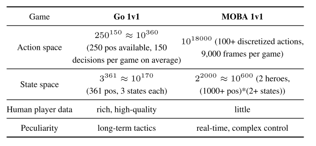  |
| :--------------------------------: |
| Table 1: Comparing Go and MOBA 1v1 |

### 1.2 算法框架

网络整体解读:

* 使用多模态输入, 解耦控制动作相互关系, 探索剪枝机制, 攻击 attention 机制.
* 在系统层面, 可扩展性的 off-policy 训练架构.
* 算法层面使用 AC 架构建模 MOBA 控制动作.
* 多网络采用 multi-label PPO 的目标函数进行优化, 加上控制依赖解耦, 目标选择的 attention 机制, 提高探索的动作掩码(action mask)机制, 用 LSTM 学习技能组合, 改进版 dual-clip PPO 算法保证收敛性.

本文使用 2 个智能体的多智能体 MDP 设定(two-agent world for multi-agent Markov games). 本文使用竞争环境设定.

目标函数也是$$\mathbb{E}[\sum_{t=0}^T \gamma^tr(s_t, a_t)] $$

## 2 系统设计

首先, 复杂游戏中使用**随机梯度方差很大, 要使用大 batch 的数据加速训练**. 所以本文使用松耦合, 可扩展性架构并行化使用数据. 系统分为四部分: RL lerner, AI server, 调度模块(Dispatch Module), 记忆池(Memory Pool).

|  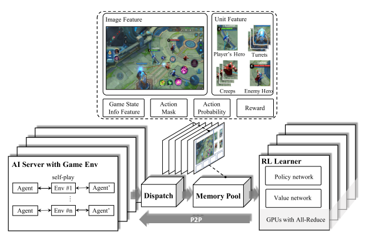   |
| :---------------------------------: |
| fig 1 Overview of our System Design |

* AI Server. 算法与环境交互模块, 通过镜像策略使用 self-play 生成 episodes. 对手策略抽样类似于[Emergent complexity via multi-agent competition](). 智能体基于游戏状态特征抽取, 使用 Boltzman exploration(即基于 softmax 分布的抽样)预测英雄动作. 采样后动作被执行, 之后游戏核心返回相应的奖励值和下一个状态. **一个 AI server 使用一个 CPU 核, 为节省 IO 成本, 游戏模型推断也在 CPU 上执行**. 为了高效生成 episodes, 还建立了 CPU 版的快速推断库 FeatherCNN.
* Dispatch Module. 每个调度模块绑定同一个机器的多个 AI servers. 从 AIserver 收集数据样本(reward, feature, action probabilities). 将其压缩打包发送给记忆池.
* Memory Pool. 基于内存的高效循环队列. 支持不同长度的样本, 和基于生成时间的数据采样.
* RL lerner, 分布式训练环境. 多个 Lerner 并行从相同数量的记忆池获得大批量数据, 通过 ring allreduce 算法对 RL 学习器中的梯度进行平均. 为了降低 IO 成本, lerner 与 pool 共享内存, 而不是使用 socket 通信(提速 2-3 倍). RL 训练模型以 peer-to-peer 方式快速同步到 AI 服务器.

基于该框架参数优化与实验生成进行分离.

## 3. 算法设计

基于 AC 框架, 融合多种算法, 

* target attention 用于选择目标
* LSTM 网络, 学习技能组合, 产生搞能即时伤害; 
* 控制依赖解耦, 形成 multi-label PPO 目标函数; 
* action-mask, 基于游戏知识进行剪枝, 引导探索; 
* dual-clipped PPO 算法, 保证收敛.

| 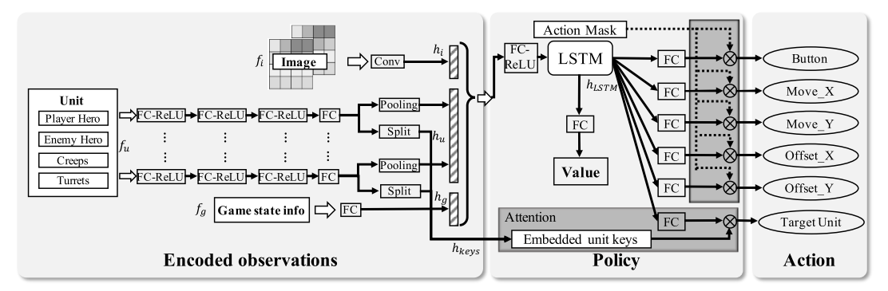 |
| :------------------------------: |
| 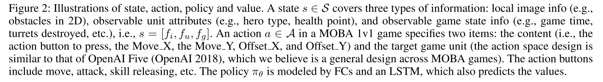 |

### 3.1. 框架解释

1. **状态编码部分**, 图像特征($$f_i \times conv \rightarrow h_i$$), 向量特征($$f_u\times [FC/ReLu] \rightarrow h_u$$), 可观察的游戏状态信息($$f_g \times [FC/ReLu] \rightarrow h_g$$).

   - 之后$$f_u$$被分成两个部分: 实体表示和 attention 的 key(the representation of the unit and the attention keys of our target.)
   - 处理不同数量的实体, 同一类型的实体被 max-pooling 到一个**固定长度的特征向量**.

2. **LSTM 部分**, 把$$h_i, h_u, h_g$$拼接到一起, 表示游戏 state 观察. 输入到一个 LSTM, 考虑进时间信息, 得到最终表示$$h_{HTML}$$.再输入到一个 FC 层, 预测动作$$a$$.
3. **target attention 机制**, 用于预测动作$$a$$的目标$$t$$, 该部分把$$h_{HTML}$$经过 FC 的输出作为 query, 拼接后的实体信息作为 key, $$h_{keys}$$, 计算公式为

   $$
   p(t|a)=Softmax(FC(h_{LSTM})\cdot h_{keys}^T)
   $$

   其中 p 表示所有实体的 attention 分布, 其维度为实体数量.

### 3.2. 目标函数和策略设计

#### 动作解耦

多标签策略网络中, 很难明确一个动作的不同标签之间的相互关系, 例如技能方向(Offset_X, Offset_Y)和技能类型(Button)之间的关系. 因此把一个动作的每个标签解耦独立.

* 首先看 PPO 目标函数, 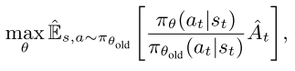, 
* 其中, $$\hat{\mathbb{E}}_t [\cdots]$$表示对有限 batch 样本的经验平均, $$\pi_\theta$$为随机策略, $$\hat{A}_t$$是优势函数估计器.

假设每个动作为, $$a=(a^0, ..., a^{N_a -1})$$, **则动作解耦公式变为**

<table>
<tr>
  <th>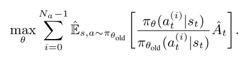</th>
  <th> (3) </th>
</tr>
</table>

解耦目标函数两个好处:

* 简化策略结构, 策略网络可以不考虑动作依赖关系.
* 提高动作多样性, 动作的每个 component 都有自己的值输出通道, 所以动作多样性增加, 提高训练的探索效率.
* **为了增加探索行, 在训练开始时随机初始化两个智能体的位置**.

#### action-mask

上述解耦复杂度太大, 为了减少复杂度, 剪枝, 并加入动作之间的关系.

* 物理禁区, 比如超某个方向走有障碍物, 那么动作就不能执行.
* 技能或攻击可用性, 比如技能冷却时不能用.
* 被敌方英雄技能或装备控制住不能动.
* 英雄或装备属性限制.

#### Dual-clip PPO

[PPO 使用 clip](./PPO.md)方式防止策略偏移过大.

<table>
<tr>
  <th>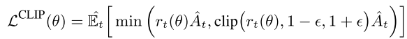</th>
  <th> (4) </th>
</tr>
</table>

PPO 方法是 on-policy 算法, 在大规模 off-policy 环境, trajectory 从不同的策略抽样, 可能与当前策略差别巨大. 例如当 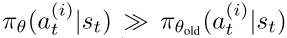, $$r_t(\theta)$$会很大, 当$$\hat{A}_t<0$$时, 方差很大$$r_t(\theta)\hat{A}_t \ll 0$$, 很难保证收敛. 因此使用 dual-clipped PPO, 增加一个下界值. 当$$\hat{A}_t < 0$$, 目标函数为

<table>
<tr>
  <th></th>
  <th> (5) </th>
</tr>
</table>

其中$$c>1$$, 是一个下界.

|    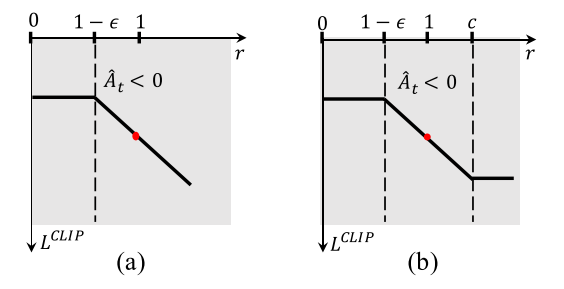     |
| :-------------------------------------: |
| fig 3: a) Standard PPO; b)Dual-clip PPO |

## 4. 实验

### 4.1 实验设置

* 硬件环境: 600000 CPU cores, 1064 GPUs
* 数据: 1600 向量特征(实体属性, 和游戏信息), 2 channels 图像特征(the obstacle channel and the hero position channel). 主要用 vector 表示观察. 用 FP16 传输数据, FP32 训练.
* 训练: 使用 48 个 P40 GPU 和 18000 个 CPU cores 训练一个英雄.
  + 每个 GPU 的 batchsize 是 4096; 
  + LSTM 的时间步是 16, 单元数为 1024.
  + 使用 full rollouts, 即一局游戏结束算一个 episode; 使用 zero-start, 即智能体从 Frame 0 开始
  + 训练速度大概每 GPU 卡每秒 80000 个样本. 同时, 每天收集的经验相当于 500 年.
* 参数细节
  + Adam opt, $$\gamma = 0.997, lr=0.0001$$
  + dual-clipped PPO, $$\epsilon=0.2, c=3$$
  + 使用 generalized advantage estimation (GAE)计算 reward, $$\lambda=0.95$$.
* 与人类玩家进行比赛, 每隔 133ms 决策一次.

### 4.2 实验结果

**1v1 比赛一般采用镜像比赛, 双方采用相同英雄.**

1. 与人类玩家, 平均每局 6 分 56 秒

|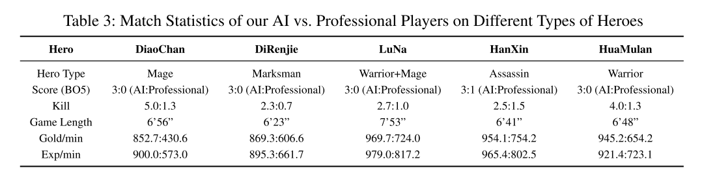 | 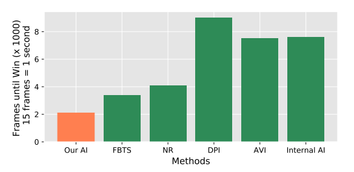 |
|----------------------------------|----------------------------------|
| Table 3: AI vs. Professional Players | Fig 4: 打败同一对手的平均时长  |

1. 专业比赛, 99.81%胜率
2. baseline: MCTS 方法. 没有开源, 所以比较打败基于行为树的内置 AI 狄仁杰 的时间, 本文方法更快.

| 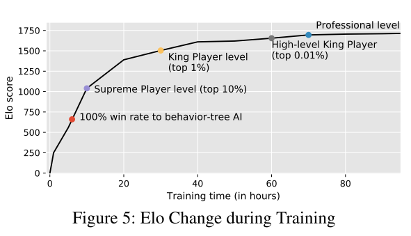 |
| :------------------------------: |
|              fig 5               |

**消融实验**:

1. 消融不同组件:action mask (AM), target attention (TA) and LSTM
2. 分析超参数: 固定 N 帧对比 full rollouts (FR) 和 partial rollouts (PR);对比 random initial frame (RIF) 和 zero-start (ZS).

   - FR 大大提高了 AI 的能力, 与 1000 帧、2000 帧和 3000 帧的 PR 相比, 胜率增加到 70% ~ 80%; 
   - RIF 可以加快 15%的收敛速度, 但代价是 AI 能力稍低(与 ZS 相比获胜率为 40%).

## 5 奖励设计

奖励函数设计成零和的, 实时奖励.

| 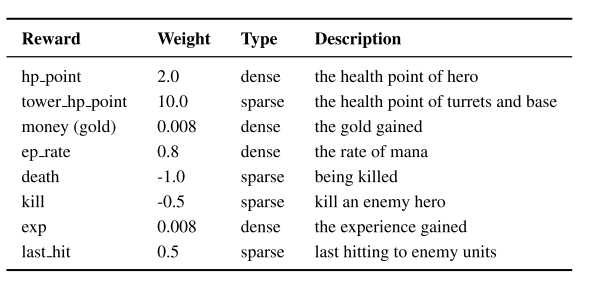 |
| :------------------------------: |
|      Table 6: Reward Design      |

## 相关的论文

通过自训练产生合适对手, 然后通过对手训练出负责控制任务的智能体. [Emergent complexity via multi-agent competition](https://arxiv.org/abs/1710.03748)
通用优势函数. [High-dimensional continuous control using generalized advantage estimation](https://arxiv.org/abs/1506.02438)
使用历史数据进行模仿学习. [Exponentially weighted imitation learning for batched historical data](https://proceedings.neurips.cc/paper/2018/file/4aec1b3435c52abbdf8334ea0e7141e0-Paper.pdf)
基于监督学习的 MOBA 5v5 宏观策略模型. [Hierarchical macro strategy model for moba game ai.](https://arxiv.org/abs/1705.10443)
基于 MCTS 的 MOBA 游戏. [Feedback-based tree search for reinforcement learning](https://arxiv.org/abs/1805.05935)
