# 3.6 游戏 AI-绝悟2(5v5)-NIPS

paper:[Towards Playing Full MOBA Games with Deep Reinforcement Learning](https://arxiv.org/abs/2011.12692)

核心: 目前研究 MOBA 游戏的算法都对游戏有很大的限制, 比如 DotaAI 限制英雄池最大为 17. 本文设计完整游戏的 DRL 范式, 玩大规模英雄池, 解决可扩展性问题. 将大量方法结合, curriculum(课程) self-play learning, policy distillation(蒸馏), off-policy adaption, multi-head value estimation, MCTS

## 1. 前言

MOBA 复杂性: 多智能体竞争合作, 不完全信息, 复杂动作, 据大状态动作空间($$10^{20000}$$, 围棋是$$10^{360}$$), 还有多种英雄, 每个英雄有不同机制. 尤其是 5v5 游戏.

目前 sota AI 是 openAI five, 其最大限制是英雄池最大支持 17 个. 智能体组合数量随英雄池大小多项式增长, 17 个英雄的组合是 4900896($$C_{17}^{10}\times C_{10}^{5}$$), 40 个英雄的组合为 213, 610, 453, 056($$C_{40}^{10}\times C_{10}^{5}$$).

openAI five 在英雄池增加时会学习崩溃, 本文要处理这种问题.

* 基于 actor-learner 模式, 首先构建分布式 RL 架构用 off-policy 方法生成训练数据.
* 然后用 actor-critic 网络学习不同英雄的玩法.
* 与[绝悟 1](./juewu1.md)相似的方法进行 off-policy 改进, 解决策略偏差问题.
* 由于 state-action value 不确定, 通过把 reward items 进行归组, 提出 multi-head value estimation 方法.
* **课程学习**, 多智能体训练的课程设计, 从小处开始, 逐渐增加学习难度. 开始从固定阵容得到教师模型, 并从中提取策略, 最后合并训练.
* 使用学生驱动的**策略蒸馏**迁移从简单到困难的知识.
* 最后, **如何选择英雄**. 现有的 Minimax 算法在大英雄池里不能用, 为此提出基于 MCTS 的 drafting agent.

本文还进行了大规模测试, AI 在与职业选手的 42 场比赛中取得了 95.2%的胜率, 在 642047 场比赛中与 3 级选手取得了 97.7%的胜率.

## 2. 相关工作

* **General RTS games. StarCraft**. 基于规则方法([SAIDA](https://github.com/TeamSAIDA/SAIDA), 2018 年竞赛冠军). 基于学习(AlphaStar, 结合监督学习和 MARL, 大师级水平).
* **MOBA games**, 宏策略模型(Tencent HMS, 属于微操管理, 不是动作执行智能体). 腾讯 1v1AI(Tencent Solo) 和 OpenAI Five(自博弈, PPO 训练)

本文和 Tencent Solo 的相同点在于, 动作头模型(价值头不同), off-policy 变体.

本文和 OpenAI Five 的区别是, 本文的目标是开发用于玩完整 MOBA 游戏的 AI 程序, 因此组合多种技术(**off-policy adaption, curriculum self-play learning, value estimation, and tree-search**)解决大规模英雄池的扩展性问题. **两者相同点: 动作空间设计, 使用 LSTM 解决部分可观察问题, 所用英雄的网络共享权重.**

## 3. 学习系统

多种技术组合: 神经网络, 分布式系统, RL, 多智能体训练, 课程学习, MCTS.

### 3.1 架构

MOBA 建模为 multi-agent POMDP, 一般用 LSTM 解决. 首先输入特征包含多种标量和空间特征.

* 标量特征包括可观察的实体属性, 游戏内部数据, 不可见的对手信息(hp 值, 技能冷却, 金币, 等级等)
* 空间特征是英雄的局部视图经过 conv 得到.
* 目标选择, 使用 LSTM 的 encoding 作为 query, 游戏实体的凭借作为 keys.
* action mask, 增加探索. 为了管理动作空间, 使用分层的动作头. AI 预测分层动作:
  + what action to take, e.g., move, attack, skill releasing, etc; 
  + who to target, e.g., a turret or an enemy hero or others; 
  + how to act, e.g., a discretized direction to move.

|      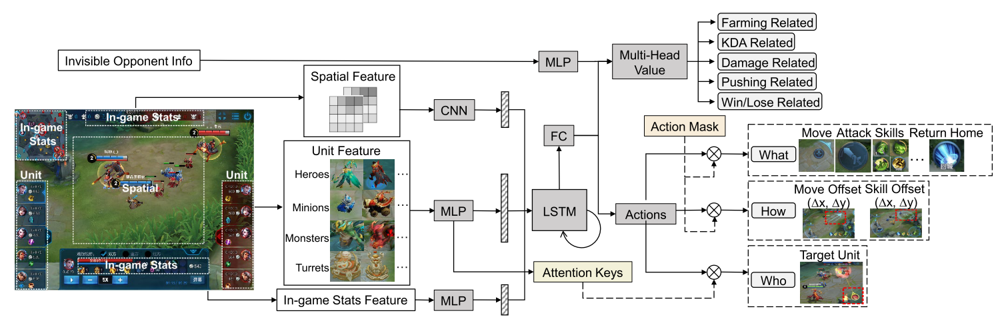      |
| :----------------------------------------: |
| Figure 1: Our neural network architecture. |

### 3.2 RL

AC 架构+ off-policy 训练.

困境:

* 长时间线下的 off-policy 不稳定性; 
* 动作空间的组合, 和动作的相关性; 
* 状态一直变化, 使得 reward 设计和 Q/V 值估计困难.

#### Policy updates

假设动作头之间相互独立, 例如 skill direction ("How")取决于 skill type ("What"). 使用 Dual-clip PPO 防止策略发散.

<table>
<tr>
  <th>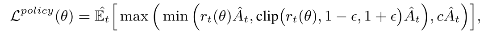</th>
  <th> (1) </th>
</tr>
</table>

#### Value updates

为了降低方差, 与 alphaStar 相同, 使用游戏状态全量信息, 包括策略网络隐藏层, 作为值函数的输入. 同时使用 multihead value (MHV), 本文设计了 5 个奖励类别, 每个有都有自己的损失函数.

* Farming related. 金币, 经验, mana, 打野, no-op
* KDA related, 击杀, 死亡, 辅助, tyrant buff, overlord buff, 发现没发现的敌人, 上次攻击.
* Damage related. hp 值, 对英雄的伤害
* Pushing related. 攻塔, 攻基地; 
* Win/lose related. 攻破敌人基地.

<table>
<tr>
  <th>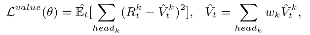</th>
  <th> (2) </th>
</tr>
</table>

其中$$R_t^k$$是折扣奖励, $$\hat{V}_t^k$$为第 k 个头的估计值. 最后的总价值为所有头的加权和.

### 3.3 Multi-agent Training

从大英雄池选英雄时, 英雄组合很复杂, 无序选择会导致性能变差, 因此需要一个范式指导英雄选择. 在此使用课程学习.

课程学习原理: 当实例不是随机的, 而是通过有意义的顺序逐渐包含更多意义的方式进行训练时, 机器学习模型的效果会更好.
本文使用课程自博弈学习(curriculum self-play learning, CSPL). CSPL 包含三个阶段, 其进入下一阶段的规则是基于 Elo 分数收敛的. 如图 2.

| 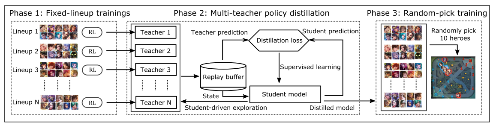 |
| :------------------------------: |
| 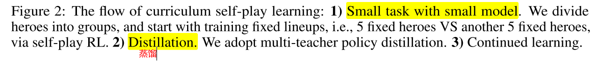 |

#### Phase 1

首先从简单的固定阵容开始, 把 40 个英雄分成 4 组, 每组 10 个英雄. 每组分别自博弈训练. 分组依据是根据人类比赛信息, 挑出每一种组合胜率为 50% 的阵容, 这样学习比较有效. 使用较小模型训练 teacher(参数量是阶段 3 模型的一半).

#### Phase 2

重点是如何使用上一阶段 teacher 学到的固定阵容的知识. 因此使用 multi-teacher policy distillation(策略蒸馏), 然后归并成一个 student model($$\pi_\theta$$). 策略蒸馏是一个监督学习过程, loss 函数为公式(3), 

<table>
<tr>
  <th>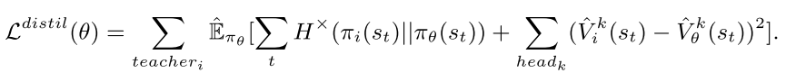</th>
  <th> (3) </th>
</tr>
</table>

其中, $$H^\times (p(s)||q(s))$$代表两个动作分布$$-\mathbb{E}_{a\sim p(s)}[\log q(a|s)]$$之间的 cross entropy, $$q_\theta$$. 通过 cross entropy loss 和 MSE 损失, 把所有 teachers 的 loss 加起来, 因此, student 可以蒸馏固定阵容组合 teachers 的策略和值函数的知识. 在蒸馏过程中, 学生模型用来在训练老师的环境中进行探索., 成为学生驱动的策略蒸馏. 探索输出动作, 状态, teachers 的预测值(用来引导监督学习)给 replay buffer.

#### Phase 3

第三阶段, 使用阶段二蒸馏的模型初始化模型, 随机组合阵容继续进行训练.

### 3.4 Learning to draft

学习英雄组合(40 个英雄的英雄池). openAI file 使用 Minimax 算法进行树搜索, 在这里不可行.

本文使用 MCTS 方法. MCTS 用来估计每种组合的长期值, 选择最大值的英雄. 本文使用 UCT(Upper Confidence bounds applied to Trees)版本. 在选择时, 迭代构建搜索树, 每个结点代表状态(已经选择的英雄), 边代表动作(选择哪个英雄).

UCT 包含四个步骤:selection, expansion, simulation, backpropagation, 其中 simulation 步骤最费时间, 要随机执行动作获取 reward 进行回传, 为了加速, 本文使用 value network 预测当前状态的值(类似 AlphaGo Zero). 训练数据仍然通过蒙特卡洛模拟过程得到的. **在训练值网络时, 仍然要模拟到 terminal 状态**. 注意, 对于棋类游戏, 终止状态是分出输赢, 而 drafting 过程的终止状态却不是游戏结束, 所以不能得到游戏输赢结果, 所以, 

* 首先用 3.3 节训练的 RL 模型通过 self-play 建立比赛数据.
* 然后, 用神经网络训练每个阵容的胜率. 预测的终止状态胜率作为监督信号训练值网络.
* 值网络和胜率预测器的结构是两个 3-layers MLPs.
  + 胜率预测器的输入是 10 个英雄的 one-hot 表示, 输出是胜率.
  + 值网络的树池是当前阵容的游戏状态, 包含双方队伍选择的英雄的 one-hot indexes, 未选择英雄的默认 index, 当前正在选择英雄的队伍索引; 输出是状态值.
* selection, expansion, backpropagation 步骤和原始 MCTS 一样.

### 3.5 Infrastructure

底层使用松耦合可扩展可并行化的 actor-learner 架构. Learner 使用 GPU 学习策略, Actor 使用 CPU 进行 self-policy. 实验数据从并行 Actor 传到 Learner 的 replay-buffer, 包含(o, a, r)的序列.
提高 CPU 和 GPU IO 效率的方式与[juewu1](./juewu1.md)差不多, 不同点是, 本文提出了 GPU 端的中心推断模块, 优化资源使用率, 类似于[Seed RL](#SeedRL)的 Learner 设计.

## 4. Evaluation

### 4.1. 实验设置

* 25 万 CPU, 2 千 GPU.
* 每个实验都进行消融研究、时间和性能比较, 用相同数量的资源进行训练, 即 320 个 gpu 和 35000 个 cpu, 称为一个资源单位. 本集群支持并行跑 6 到 7 个这样的实验.
* RL 模型:

  + 每个 GPU 的 mini-batch size 是 8192.
  + 用了 9227 个标量特征(可观察实体属性和游戏内部统计数据), 6 通道的空间特征(6\*17\*17).
  + 每个 teacher 模型有 900 万个参数, 最终模型有 1700 万个参数, . LSTM, 所有模型 time-step=16, unit-size(teacher 512, final models 1024).
  + 对于 teacher 模型, 使用 half resource unit 训练, 因为其 unit-size 相对较小.
  + 优化使用 Adam, 初始 lr=0.0001, 
  + Dual-clip PPO, $$\epsilon=0.2, c=3$$
  + $$\gamma=0.998$$
  + GAE, $$\lambda=0.95$$

* drafting 部分:

  + 胜率预测器使用 3000 万个样本进行训练, 该样本使用 CSPL 训练的聚合 RL 模型通过 self-play 得到.
  + 值网络有 1 亿个样本, 包含 1000 万个英雄组合, 每个组合有 10 个英雄. 用 MCTS 生成.
  + 每个组合的 10 个样本的标签相同, 由胜率估计器得到.

* 性能评估: 与人类玩家比赛
  + AI 决策延迟 193ms(观察延迟 133ms, 动作延迟 60ms), 
  + APM (action per minute). AI 与顶级玩家的平均 APMs 相当(分别是 80.5 和 80.3). 在游戏中, 高 APM 的比例(如《王者荣耀》中的 APM≥300)在顶级玩家和 AI 中分别为 4%和 5%.
  + 用 Elo 评价 AI 表现.

|  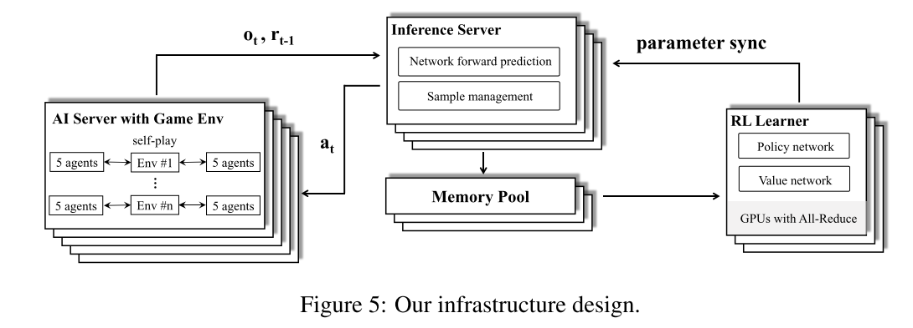   |
| :---------------------------------: |
| Figure 5: Our infrastructure design |

### 4.2. 实验结果

#### 4.2.1 AI 比赛表现

与职业玩家对战 42 场, 绝悟 AI 赢了其中的 40 场比赛(胜率 95.2%, 置信信区间(CI)[0.838, 0.994]). AlphaStar 决赛 11 场(10 胜 1 负, CI [0.587, 0.997]), OpenAI Five 决赛 8 场(8 胜 0 负, CI[0.631, 1]).

绝悟 AI 与顶级人类玩家进行了 642047 场比赛的测试. AI 赢得了 627280 场(获胜率为 97.7%, 置信区间[0.9766, 0.9774]). 最终版 AlphaStar 和 OpenAI Five 的公开测试分别为 90 场和 7257 场, 对参与的人类玩家没有游戏级别要求.

#### 4.2.2 训练过程

对比 JueWu 和 OpenAI Five. OpenAI Five 为基线.

JueWu 和 OpenAI Five 在小英雄池(10 个)的时候都很容易超过职业选手. 因此用 10 个人类职业玩家的 Elo 分数作为上限. 因此可以用 20/40 的英雄池来比较算法. 作为上限的 10 个英雄包含在 20.40 的英雄池里, 但是这 10 个英雄的阵容与阶段一的 teacher 阵容没有重合.

下面图 3 展示了训练过程, 表 1 对比了两种方法的训练时间.

| 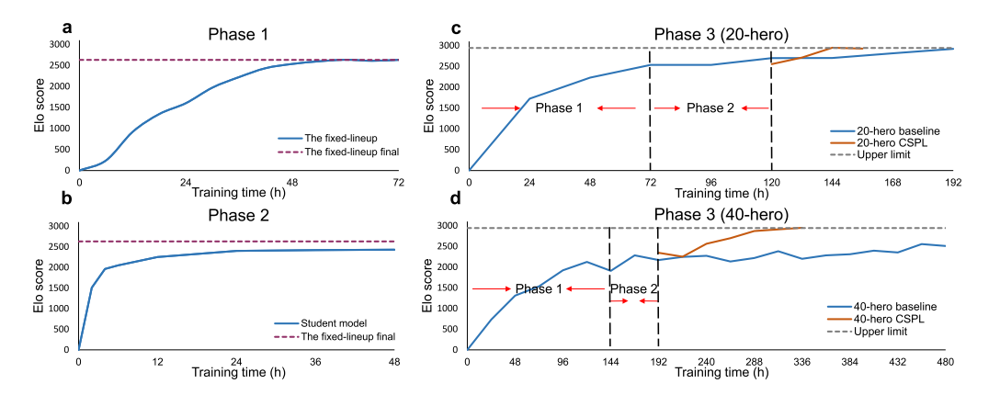 |
| :------------------------------: |
| 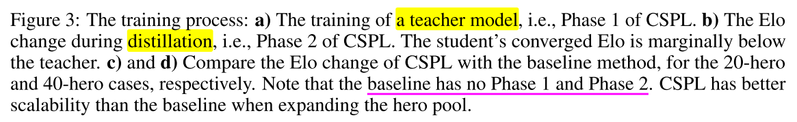 |

* 图 3(a), 72 小时稳定. 每个 teacher 都是用 half resource unit 进行训练的. 因此, 第一阶段一个资源单位并行训练两个 teacher model.
* 图 3(b), 策略蒸馏过程, student 模型快速收敛. 并且学生驱动的策略蒸馏的收敛性不受英雄池大小的影响.20/40 的英雄池都可以在 2 天内收敛.
* 图 3(c), 20 英雄 CSPL 过程, CSPL 和 baseline 都收敛很快, 但是 CSPL 更快.
* 图 3(d), 40 英雄 CSPL 过程, baseline 收敛比 CSPL 慢很多, Elo 分数也低 400 多分.

|              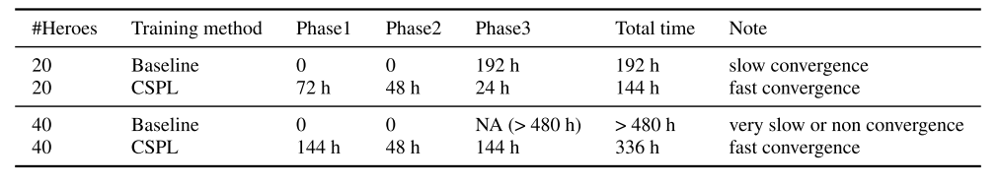              |
| :--------------------------------------------------------: |
| Table 1: Comparing training time of CSPL and the baseline. |

#### 4.2.3 消融实验

在同样的训练时间和训练资源情况下, 以 40 英雄池进行消融式样. 如图 4.

* (a). 对于多智能体, CSPL 有效.
* (b). 对于值估计方面, 使用 invisible opponent information 和 multi-head value 都可以有效地提高 Elo 分数; 
* (c). dual-clip PPO 对于训练稳定性有利.
* (d)给出了内置机器人, 监督学习智能体, RL 智能体的 Elo 得分, 其得分都是和一个 no-op 的机器人对比的.
* (e)对比了英雄阵容选择的效果. 每个阵容比赛 1000 场. drafting(MCTS-based)方法, 优于 RD(每次随机抽取未选择的英雄样本)和 HWR(根据频率计数选择胜率最高的英雄), 胜率分别为 0.86 和 0.68

## 5. 补充

### 5.1 相关论文

中心化的 GPU 推断模块, <a href="https://arxiv.org/abs/1910.06591" id="SeedRL"> Seed rl: Scalable and efficient deep-rl with accelerated central inference </a>

multi-teacher policy distillation. [策略蒸馏方法](https://arxiv.org/pdf/1511.06295.pdf)

2019 年 AlphaStar 星际论文, [Grandmaster level in StarCraft II using multi-agent reinforcement learning](https://www.nature.com/articles/s41586-019-1724-z)

多头值函数, 混合奖励[Hybrid reward architecture for reinforcement learning](https://arxiv.org/abs/1706.04208)

### 5.2 智能体动作

| 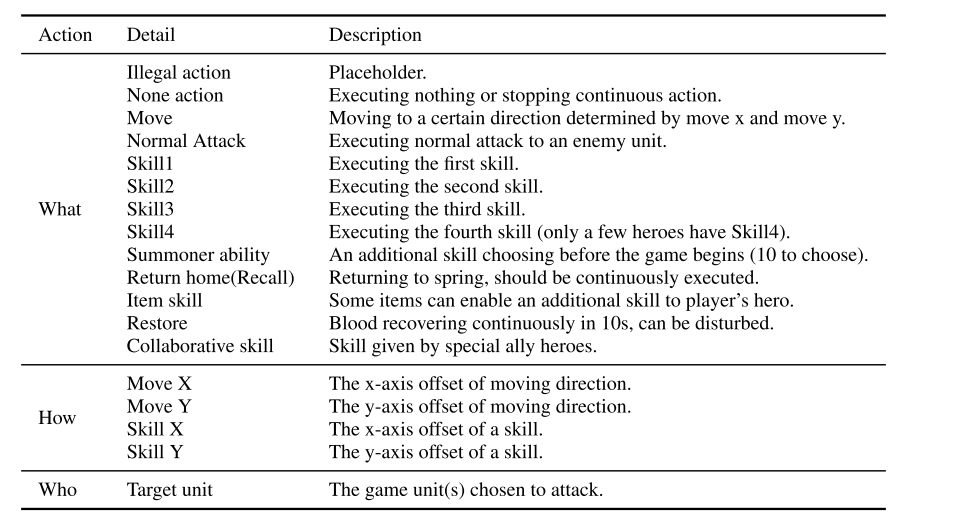 |
| :------------------------------: |
|   Table 3: Agent action space.   |

### 5.3 reward 设计

| 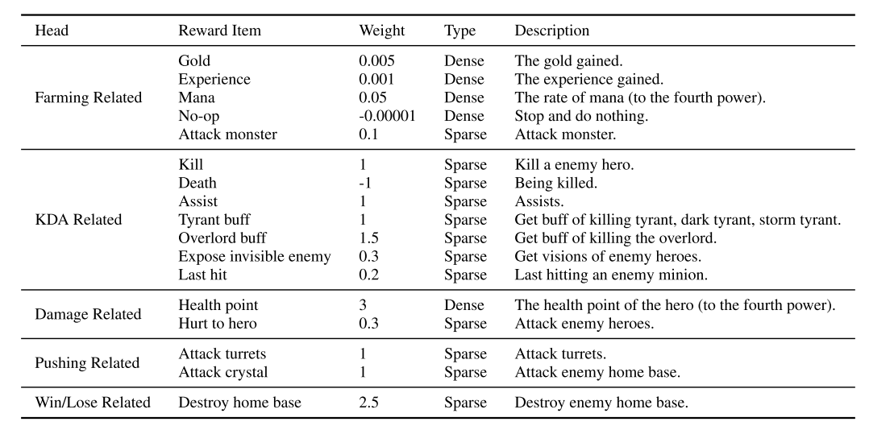 |
| :------------------------------: |
| Table 4: Reward design details.  |

### 5.4 特征设计

特征数据包括标量特征和空间特征. 其中标量特征包括实体属性, 游戏内部统计数据, 不可见对手信息(只用于值网络).

特征归一化方法:

* 对于连续特征, 我们使用最大值和最小值将其归一化为[0, 1]区间, 如 HP, mana, speed 等. 如 hp, 0 为死亡, 1 为全量 hp.
* 离散值, 使用 one-hot 方法, 枚举所有可能值. 例如英雄技能等级可以从 1 到 15 级, 所以用长度 15 的向量来表示.

| 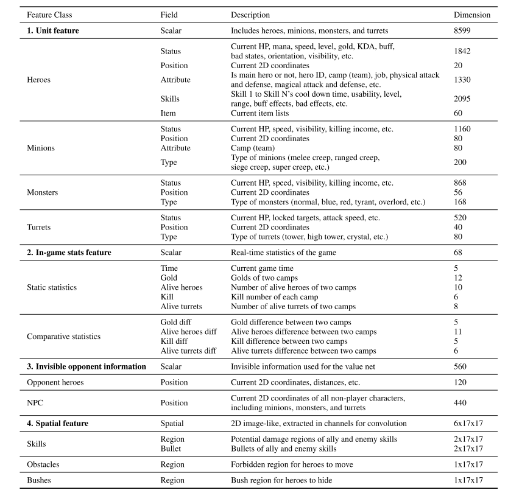 |
| :------------------------------: |
|    Table 5: Feature details.     |

## 评论和总结

多种策略组合: off-policy adaption, multi-head value estimation, curriculum self-play learning, multiteacher policy distillation, and Monte-Carlo tree search.

应该是用单智能体方法训练的, 每个智能体都用一个 PPO 训练.

注意, kill 也是+1 的奖励, 可能是为了鼓励对抗.
