# 3.7 游戏 JueWu-SL(TNNLS, 监督学习方法)

paper:[Supervised Learning Achieves Human-Level Performance in MOBA Games: A Case Study of Honor of Kings](http://arxiv.org/abs/2011.12582)

核心: 基于监督学习的MOBA AI, 用端到端的监督学习方法把宏观策略和微操整合到NN里.

* 宏策略体现玩家意图, 为了获得更多奖励, 接下来一段时间内"where to go on the map" and "what to do globally", 
* 微操, 主要是给定游戏状态去做什么(what to do concretely), 包括移动, 普通攻击和技能触发; 

这里使用监督学习的一个考虑点是, 在某个状态下, 玩家接下来的意图和动作可能很明显. 比如图1, 自己技能充足, 等级也比对方高, 玩家应该直接打对面英雄, 因此动作可以对应于状态作为一个标签.

|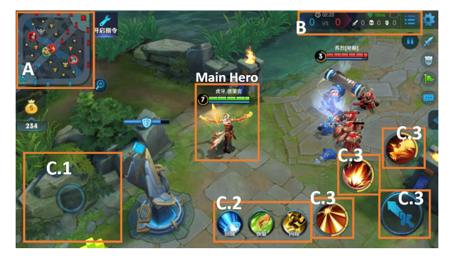|
|:-:|
|fig 1|

## 1. 前言

为什么要用监督学习(SL)?

1. SL一般是建立游戏AI的第一步, 例如围棋里作为策略网络; 星际里整合人类知识; 纯SL在视频游戏里达到了人类水平.
2. 近期策略蒸馏(policy distillation)方法表明, 如果知识表示合理, SL可以用于序列决策任务. 把人类玩家的动作作为标签, 内含了序列信息, 所以可以利用人类知识. 假设每个时间步都有已经有了注释好的labels(其嵌入了队伍的策略和动作), 和小战斗场景的表示, 当数据量足够大时, SL可以潜在蒸馏得到一个小战斗场景到labels的映射.

但是MOBA很复杂, 宏策略和微操建模很难. 因此, 

* 本文设计了多视角的意图标签建模玩家宏策略, 分层动作标签建模微操. 基于此, 将控制过程建模为**分层的多分类任务**. 
* 用CNN和FC同时建模宏策略和微操．
* 用端到端的方式进行SL学习, 这里的端到端不是训练过程, 而是宏策略的输出是嵌入式的, 作为辅助任务提供给微操模型. 
* 另外, 为训练数据预处理提出基于场景的抽样方法.

## 2. Method

主要讨论标签设计, 特征, 模型, 数据采样

### 2.1. Overview

为了实现SL, 用专家知识设计特征和标签. 特征包括两个方面, 向量特征和图像. 标签也包含两个部分: 

* **意图标签(训练宏策略)**. 是多视角的, 具有全局意图和局部意图; 
* **动作标签(训练微操)**, 具有分层多类别结构, 也包含两部分. 第一部分是高级动作(比如移动), 第二部分是具体动作(例如离散的移动方向).

动作标签是模型的输出标签, 而意图标签在训练期间作为辅助任务, 以提高模型的性能. 最后问题建模为一个分层的多分类任务. 训练NN模型预测在给定状态下采取动作. on-line执行时, 该模型分层地预测输出, 分为两个步骤:1)要采取的高级行动, 2)该行动的执行规范.

### 2.2. Multiview Intents for Macro-strategy

首先宏策略主要关注攻击的区域, 所以把下次攻击区域作为ground-truth区域. 然而, 某地点的偶然攻击不一定是玩家的目标, 它可能是移动过程中遇到了对手. 因此只考虑**连续攻击的区域**. 最后的multiview intent labels包括一个全局意图和一个局部意图标签来建模宏观策略. 如图2所示.

全局意图是下一个目标区域. 例如攻塔或打怪. 本文将地图分为$$N\times N$$的区域, 这里$$N=24$$, 共576个区域, 全局意图为预测的其中之一.

|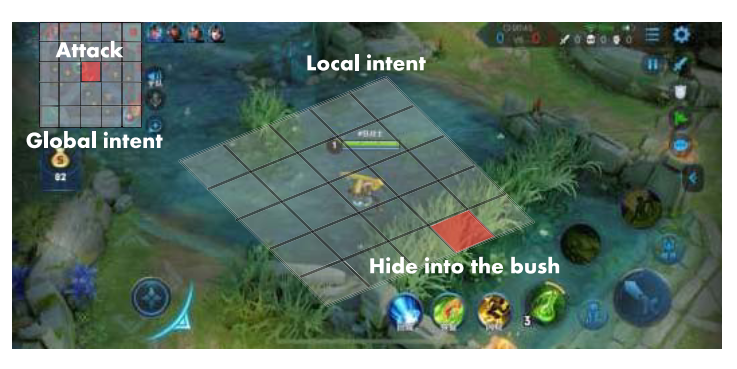|
|:-:|
|Fig. 2. Multiview intent label for macro-strategy |

局部意图为局部战斗中的短期计划, 包括藏在灌木丛或安全点, 撤退到附近的炮塔, 或等待目标过来然后攻击. 这里把英雄的局部视野划分成$$M\times M, M=12$$的区域, 每个区域大概和英雄差不多大. 局部意图标签是这些区域之一, 该地图是从两个攻击事件之间玩家的中间位置提取的. 以《王者荣耀》为例, 我们分析了两次攻击事件之间的间隔平均约为6.5秒. 这个局部意图标签为学习宏观策略提供了额外的中间信息.

图3给出了全局意图标签提取的例子. 令$$s$$表示包含多帧的session, $$s-1$$为前一个session, $$t_s$$为$$s$$的开始帧, **一个session的结束点为一次攻击事件**. 因此$$t_s$$中存在一个区域$$y_s$$己方英雄发动了一次攻击. 如图, $$s-1$$的标签是$$y_s$$, $$s$$的标签是$$y_{s+1}$$. 这样英雄就能学会根据当前装况移动到合适的敌方了.

|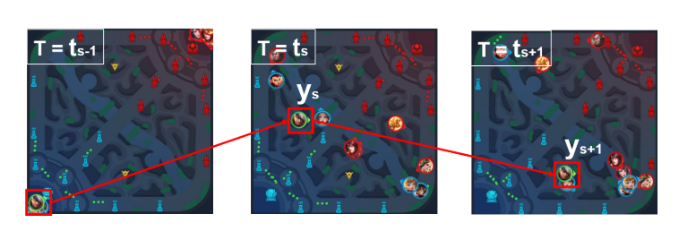|
|:-:|
|Fig. 3. Example of the global intent label extraction |

最后所有的标签多使用多模态特征进行训练, 其softmax结果作为action label训练的辅助特征. 如图7所示.

### 2.3. Hierarchical Action Design for Micromanagement

分层动作中, 每个标签包括两个子标签. 1级动作表明执行那个动作(包括move, normal attack, skill 1, skill 2, skill 3, summons, return base等), 2级动作根据动作类型具体执行(例如1级动作是移动, 那么2级动作就是2D方向; 1级动作是普通攻击, 2级动作为攻击目标; 如果1级动作为技能, 2级动作为接下来的方向, 目标, 位置等类型)

|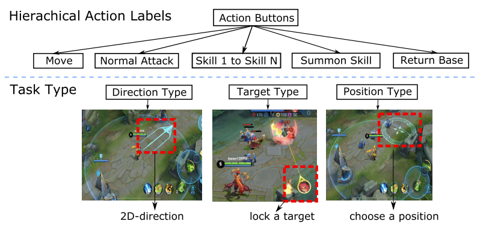|
|:-:|
|Fig. 4. Hierarchical action label for micromanagement|

### 2.4. Multimodal Features

feature数据包向量和图像, 如图5所示. 

|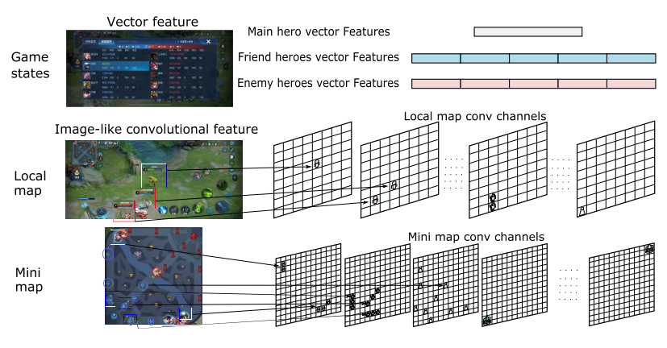|
|:-:|
|fig 5. 多模态特征. 从仪表盘提取向量特征, 从小地图和局部视角提取图像特征 |

* vectorfeature包括可见的英雄属性和游戏状态. 
  + 英雄属性包括当前hp, 历史hp, 技能冷却, 伤害属性, 防御属性, 金币, 等级, buff, 历史坐标等.
  + 游戏状态包括, 团队杀敌数量差、团队金币差、游戏时间、炮塔差等. 
* 图像特征从游戏引擎提取(不是图像). 包括英雄局部视图和全局小地图特征.
  + 图6描述了敌方英雄技能效果的damage channel的局部图像特征. 
  + 对于全局图像特征, 通道就像英雄、小兵、野怪和其他信息的位置矩阵. 

这些类图像特征代表了高级概念, 可以减少卷积层数.

|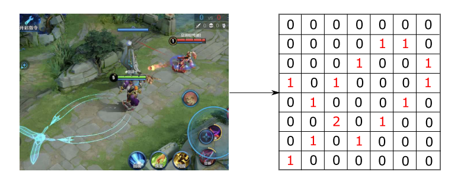|
|:-:|
|fig 6. 局部特征提取. damage通道提取例子. 这里敌人释放技能, 根据实时损伤情况对红色曲线的对应位置赋值|

### 2.5. Model

数据表示$$\{(x_i, y_i)|i=1, 2, ..., n\}$$, 其中

* $$x_i=\{x_i^v, x_i^g, x_i^l\}$$, 分别代表向量特征, 全局类图像特征, 局部类图像特征; 
* $$y_i=\{y_{ai}^0, y_{ai}^1, y_{bi}^g, y_{bi}^l\}$$. 其中$$y_{ai}^0 \in \{1, ..., m\}, y_{ai}^1$$分别为1, 2级动作; $$y_{bi}^g, y_{bi}^l$$分别代表全局和局部意图标签. 最后的Sl模型如图7所示.

|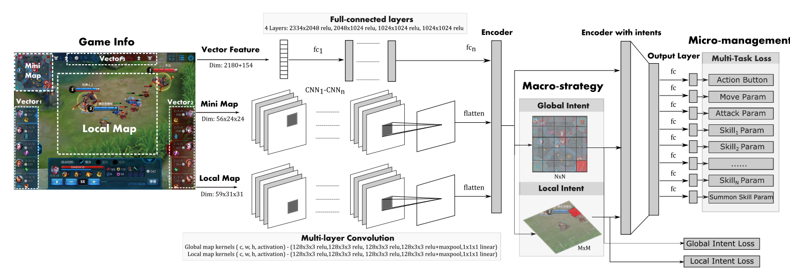|
|:-:|
|fig 7. multimodal and multitask deep neural network. The main structure consists of two parts: multimodal encoders and multitask output heads |

首先全局和局部类图像特征CNN编码, 然后进行拼接. 然后经过CF预测全局和局部意图.

(1)

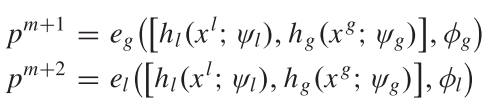

$$\psi_g, \psi_l, \phi_g, \phi_l$$分别是编码全局/局部feature的CNN参数, 和预测全局/局部意图的网络参数. 
向量特征被分成11部分(图5所示), 分别用FC网络$$\psi_v$$编码, 再拼接到一起.

最后, 上述5部分拼接到一起, 送到最后一个FC层, 

(2)

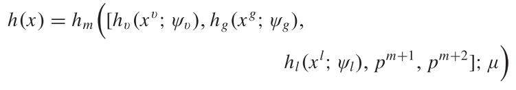

之后, 用m+1个函数  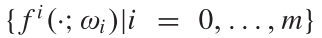 生成预测$$p=(p^0, ..., p^{m+2})$$, 其中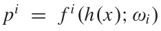. 
为了使预测fit预处理的人工数据, 使用以下loss的加权和组成一个多任务loss函数

(2)

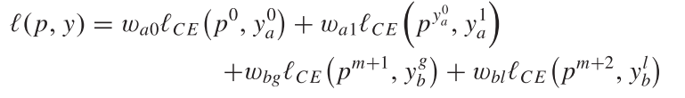

其中前两项为动作标签, 后两个为意图标签. $$\ell_{CE}$$表示交叉熵损失. 对于动作标签, 只对两个损失求和, 因为标签y没有提供动作的信息:$$\{y\ne y_a^0|y=1, ..., m \}$$

最后的优化目标函数为

(3)

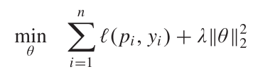

其中 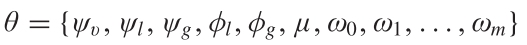和$$\lambda$$是正则化的参数(防止过拟合). 用Adam求解.

### 2.6. Data Preprocessing

#### 2.6.1. 场景区分. 

英雄为了不同目标, 其动作轨迹不同, 所以把游戏分割成不同的场景. 基于trajectory分析, 把游戏分为如下6个场景:

 1.  推塔(Push-Turret), 推塔占领视野
 2.  战斗(combat), 与敌方英雄战斗; 
 3.  清兵线(Lane-Farm), 清兵线获取经验和金币
 4.  清野怪(Jungle-Farm), 打野获取经验和金币
 5.  回城(Return).
 6.  导航(Navigation): 根据宏观策略意图, 移动到地图上的另一个区域.

场景划分是目标导向的. 前五个可以根据游戏区分, 剩下的归类为导航场景.

#### 2.6.2. 每个场景下数据调优

每个场景下都有比较重要的操作, 比如攻击场景中攻击和释放技能和移动都比较重要, 导航场景中移动更重要. 以貂蝉为例, 攻击场景中, (移动: 普通攻击: 技能1: 技能2: 技能3=3:1:1:1:1), 导航场景中, (该比例为10:1:1:1:1).

同时这些场景有重合, 比如敌方英雄在塔下, 那么推塔和攻击场景重合, 如果出现重合, 最终场景按照上述(1-6)的优先级分类.

#### 2.6.3. 跨场景数据调优

场景划分好后, 不同场景的数据不平衡, 比如推塔比战斗场景少. 
因此, 在每个场景中进行下采样平衡数据, 充分训练模型. 这些场景的下采样率是根据英雄来调整的. 
注意, **1)训练过程在场景之间没有区别, 2)场景划分只在训练时有, 3) 在线控制时, AI直接基于图7模型的输出预测动作**.

#### 2.6.4. Move Sample Enhancement

移动操作很重要, 所以要进行数据增强. 但是如果只使用一个帧预测移动方向, 噪声比较大. 
因此, 用当前帧的位置与未来N帧之后位置之间的差异, 表示**移动方向标签**. 

在战斗场景中, N设为细粒度值, $$N=5(0.33s)$$; 
其他场景中, 设置N为粗粒度值, $$N=15(1s)$$.

#### 2.6.5. Attack Sample Normalization

另一个重要的样本是推塔和攻击的目标. 在原始数据中, 选择攻击低伤害高HP(LDHH)英雄和高伤害低HP(HDLH)英雄的样本是不平衡的. 攻击LDHH的实例比较多. 
如果不进行下采样, 模型会更喜欢攻击LDHH的英雄. 但是攻击HDLH的英雄更重要. 

为了解决该问题, 本文提出英雄攻击的抽样方法, 称为攻击样本归一化(attack sample normalization). 对所有英雄攻击的整个过程抽样同样数量的样本. 实验表明, 该方法有效提高目标选择的效果.

## 3 实验

### 3.1. 实验设置

#### 3.1.1. 数据集

原始数据来自于人类top 1%玩家. 

* 首先设置了一些评价指标, 对数据进行筛选, 筛掉玩家表现不好的对局; 
* 然后以HDF5格式对数据进行预处理、shuffle和存储. 经过预处理后, 平均只保留二十分之一的帧. 
* 最后, 每个英雄从大约12万个游戏中抽取了1亿个样本. 
* 每个英雄的数据集随机分为两个子集:1)约9000万样本的训练集和2)约1000万样本的测试集.

#### 3.1.2. 模型设置

* vector feature有2334个元素, 其中2180个为是个英雄属性, 剩下的154个为当前玩家的英雄属性.
* 局部视图为边长为30000的正方形区域, 英雄在中间, 然后被划分成31\*31的格子, 每个大约1000, 与英雄差不多大. 然后抽取出59个通道的类图像特征, 即59\*31\*31.
* 全局视图(边长113000)被分成24\*24的格子, 其抽取的类图像特征为56\*24\*24.

每个英雄训练一个模型, 用16块GPU卡训练36小时.

* 使用Adam优化器, lr=0.0001
* 每个GPU batch_size=256
* 四个loss 的权重$$w_{a0}, w_{a1}, w_{bg}, w_{bl}$$与数据集比例有关, 所以这里设为1.
* 正则化项的$$\lambda=1$$
* 王者荣耀中每一帧大约66.7ms(15帧为1s), 在对局时, AI总的动作时间为188ms, 包括观察延迟(observation delay, OD, =133ms, 两帧), 动作延迟(reaction delay, RD, =55ms).

#### 3.1.3. Metrics, 评价指标

1. 与baselines进行比较. baselines包括:1)行为树方法(behavior-tree, BT); 2)HMS; 3)两阶段方法: 分别训练宏观战略模型和微观管理模型.
2. 与人类对手比赛;
3. 与人类队友合作;

### 3.2 实验结果

#### 3.2.1. 与baselines进行比较

|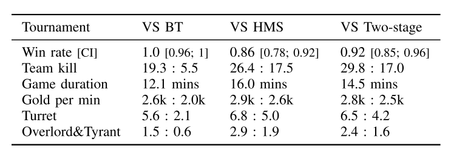|
|:-:|
|表1 与baseline比较 |

#### 3.2.2. 与人类对手比赛

|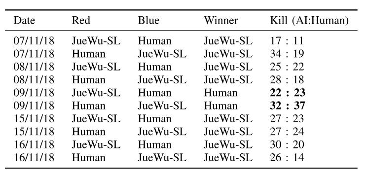|
|:-:|
|表3 与人类对手比赛 |

如表3所示, AI一开始赢了, 在5, 6场输了, 因为人类玩家在打野和团队防御方面做的很好, 之后作者对模型进行调优:

  1. 把丛林划分成己方丛林和敌方丛林
  2. 抽取出包含在将丛林战斗场景的数据
  3. 用上述数据微调模型.

之后模型又赢了.

#### 3.2.3. 与人类队友合作

一个AI与四个人类队友, 对战另外五个人类玩家队伍, 表现也很好.

#### 3.2.4. 消融实验

每个组件都有用

|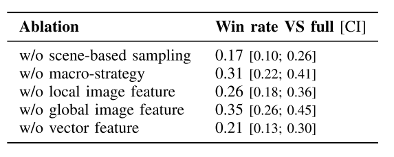|
|:-:|
|表4, 与人类队友合作 |

## 讨论和总结

**核心技术**: 监督学习整合人类知识, 同时建模宏策略和微操过程, 基于场景的采样方法. 多模态特征表示方法, 对数据集做筛选得到高质量的数据集(抽取一局游戏的二十分之一作为样本数据)

**SL与RL 相比:**

* 训练更快, RL使用大量CPU和GPU, 训练了一个月, 而SL只用36小时, 16块GPU.
* 更好的扩展性. RL在英雄池变大时很难训练, SL可以单独训练每一个英雄达到很高的水平, 直接让他们合作.
* 更好的可用性, 每个英雄单独学, 与人类玩家更相似, 也更好应用. 而RL方法不行.

另外SL的缺点是: 1), 缺少大量高质量人类数据; 2)在时间和机器重组的情况下, SL模型理论性能上限低于RL.

本文SL可以作为RL模型的策略模型, 也可以用来初始化RL模型, 也可以作为RL的对手模型. 如何结合二者下一步可以探索.

**相关游戏和方法**:

* Non-RTS, 有国际象棋(探索: "深蓝"); 围棋(树搜索+NN: alphaGo, alphaZero, FineArt, OpenGo(alphaGo的开源实现)); 其他比如Atari, 第一人称射击等
* 经典RTS, 主要是星际, rule-based: SAIDA; SL+RL: alphaStar
* MOBA, 主要是王者荣耀和Dota, Tencent HMS, OpenAI Five
