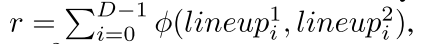
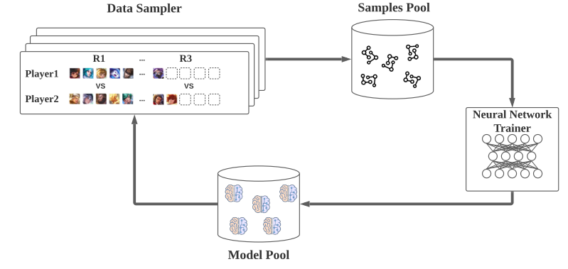

# 3.8 游戏AI-绝悟4-英雄选择

paper: [Which Heroes to Pick? Learning to Draft in MOBA Games with Neural Networks and Tree Search](https://arxiv.org/abs/2012.10171)

核心: hero-drafting问题. 英雄之间有互补作用, 5v5多轮赛时选过的英雄不能再用, 同时解决英雄池扩大(102的英雄池, 组合数有$$5.37\times 10^{15}$$)造成的模型性能变差问题. 本文基于神经网络和MCTS方法解决英雄组合问题. 设计了一个长期值估计机制解决best-of-N drafting 问题.

(best-of-N意思是为了确定胜者, N为奇数, 如3, 5, 7, 先超过半数的胜方.)

本文把drafting过程建模为**完全信息二人零和博弈过程**. 每个玩家的目标是, 同一队一个英雄只许选一次的情况下, 最大化己方5名英雄的胜率. 使用**MCTS+NN**相结合的方法.

用一个策略网络和值网络补充MCTS过程. 策略网络用来抽样选择动作(选择英雄); 值网络用来直接预测当前状态的值, 舍弃随机执行获得reward的步骤; 另外由于选完英雄游戏并没有结束, 所以使用一个单独的网络预测胜率, 该胜率作为reward进行MCTS的回溯过程和训练值网络.

另外, 当前回合的阵容会影响后面回合的效果(每个英雄在整个过程中只能用一次), 所以本文把drafting过程设计为多轮组合博弈问题, 并设计了一个长期的价值机制, 在考虑当前状态的价值时考虑后面回合的影响.

## 1. 相关工作

英雄drafting策略可分为如下四类:

1. Historical selection frequency. 该方法把drafting建模为序列预测问题, 当前英雄的选择基于之前的英雄序列, 使用监督学习训练, 不考虑游戏结果, 是基于频率进行选择的.
2. Previous winning rate based. 本质是一个短视的贪婪方法.
3. Minimax algorithm. OpenAI Five的方法. 
4. Monte-Carlo tree search (MCTS). [DraftArtist](#DraftArtist)使用MCTS来估计英雄组合的价值. 然而, 这种方法没有考虑到N轮比赛的场景; MCTS模拟的随机展开也不够有效.

## 2. Method

### 2.1. 问题形式化

首先规则为: 1)多轮比赛时, N为奇数(BO3或BO5), 首先超过半数的最终获胜. 2) 之前回合选过的英雄不能再选了.

本文把完整的游戏$$\mathcal{G}$$定义为, **具有多个相同子结构的, 二人零和完全信息博弈问题**, 包括如下元素:

* 玩家, $$P=2, \ \ \{player1, palyer2\}$$
* 阵营(camps), $$M=2, \{camp1, camp2\}$$, camp1先选. 玩家1和2都可以是camp1.
* 一场完整游戏的rounds, $$D$$, 最终的赢家必须打败对手$$\lceil D/2 \rceil$$次.
* 回合(a round)长度, $$L$$, 表示一回合的时间步数, 每一步选一个英雄.
* 玩家顺序 $$\mathcal{O}_{round}, \mathcal{O}_{first} $$. $$\mathcal{O}_{round}$$表示一个回合里选择英雄的阵营顺序, 如$$\mathcal{O}_{round}=\{1, 2, 2, 1, 12, 2, 1, 1, 2\}$$; $$\mathcal{O}_{first} $$表示在对应的回合里谁先选, 一般都是轮着来.
* 转换函数$$\rho:t\rightarrow \{player1, player2\}$$, 给出时间t时, 哪个玩家应该进行选择. 该函数基于$$\mathcal{O}_{round}, \mathcal{O}_{first} $$. 
* 游戏状态$$s\in S \subset[0, N_{classes}]^{L\times D}$$. 游戏状态是正整数向量, 其长度为$$L\times D$$. 其中$$s_i\in s$$表示第i步玩家已经选了i个英雄, 此时剩下的部分用$$N_{classes}$$填充, 其表示英雄池大小.
* 动作$$a\in A \subset [0, N_{classes}-1] \cap \mathbb{N}$$. 表示选择的英雄, 但是注意并不是每个英雄都是合法的, 不允许选择之前回合自己已经选过的, 和当前回合被双方选过的.
* 转移函数  .
* 单回合胜率预测器$$\phi$$. 每轮的胜率仅由当前英雄阵容预测.
* 奖励$$r$$. 双方奖励为$$\{r, -r\}$$.  
* 游戏目标, 获取正的奖励r.

### 2.2. MCTS+NN

利用AlphaZero的多项式上限置信树(polynomial upper confidence trees, PUCT)算法. 在英雄drafting任务里, 要修改一下value backpropagation机制, 并使框架适应多轮博弈.

||
|:-:|
|Fig. 2: Overall Training Framework |

#### 1) Overall Training Framework. 

训练框架是分布式的, 包括4部分:

   - data sampler, 由2个玩家和1个gamecore组成, 游戏核心通过模拟比赛生成样本; 
   - samples pool, 样本存储到样本池进行训练; 
   - neural network trainer, 使用**监督学习**训练策略网络和值网络.
   - model pool, 上一步训练好的模型传输到模型池, 模型池将训练好的模型同步到数据采样器, 用于继续生成数据.

#### 2)Parallel MCTS with Deep Neural Networks. 

本文使用**PUCT**方法.

树结构: **节点表示状态**, **边代表动作**. 节点包含统计信息 , 分别表示

* 访问次数, 
* 总价值, 
* 平均价值, 
* 策略网络对其父节点的预测的先验概率, 
* 并行树搜索的虚拟损失(当一个线程访问一个节点时, 虚拟损失会增加. 当线程通过这个节点反向传播奖励时, 它的虚拟损失会减少. 因此, 不同的线程更有可能探索不同的节点). 

PUCT包含四个过程:

**Selection**. 从当前状态根节点开始, 通过如下公式(1, 2)选择动作, 直到叶子节点.

(1, 2)

其中, 均值$$Q(s_t)=W(s_t)/C(s_t)$$. $$s_{t, a}$$表示执行动作a之后的新动作, $$s_{t, a} := s_{t+1}$$. 对于并行搜索, 应该增加所选节点的虚拟损失, 以避免不同的线程搜索树的同一分支: , 其中$$c_{vl}$$是虚拟损失的超参数. $$c_{puct}$$是balancing hyperparameter.

||
|:-:|
| |

**Evaluation**. 当算法到达叶子节点, 算法停止选择过程进入Evaluation过程. 通过策略和值网络推断得到预测的策略$$\pi(\cdot|s_T)$$和值$$f_\theta(s)$$.
围棋结束的时候有明确输赢. 但是drafting过程只是选出了英雄组合. 这里用胜率预测器$$\phi(s)$$预测的获胜率, 并将其作为估计值.
注意, 上面只在最后一轮替换值, 为了考虑长期信息. 但是每一轮都会用胜率预测器预测胜率.

**Expansion**. 在叶子节点, 首先去掉所有不合法动作, 并重新正则化策略向量; 
然后根据新的策略向量$$\pi(\cdot|s_T)$$, 对每一个合法动作生成一个新节点$$n(s_{T+1})$$; 
除了  , 节点内其他统计值都设为0.

**Back-propagation**. 从当前叶子节点$$n(s_T)$$回溯到根节点, 更新路径上的节点值. $$C(s) = C(s) + 1, \  VL(s) = VL(s) - c_{vl}, \ Q(s) = W(s)/C(s)$$.
对于值更新, 一般使用$$W(s) = W(s) + v(s_T)$$, 但是在多轮博弈里, 前几轮的节点会影响会面回合的节点. 因此本文设计了一个long-term value 机制, 在下面 **Long-term Value Propagation**部分介绍.

#### 3) Policy and Value Network Training.

网络用统一的结构, 输出为value和oracle策略. 用同一组参数同时预测$$v_\theta(s), p_\theta(s)$$. 在训练的时候, 看作是监督学习, 总的损失函数为MSE和CE损失的和:

(3)

其中, $$\pi$$是图3中MCTS返回的概率. $$c_p$$是L2惩罚常数, $$z$$是多轮游戏的目标输出.

最后因为胜率预测器给出了胜率$$\phi(s)\in [0, 1]$$, 可以映射到[-1, 1]之间作为奖励信号:

(4)

其中, $$z_d$$表示第d轮变换后的胜率. 由于多轮选择中, 已经选择的英雄不能再选了, 所以z得好好设计, 如下一部分所示.

#### 4) Long-term Value Propagation.

前几轮的选择会影响后面选择. 直觉方法是把前面的输出加起来作为当前步的值. 在long-term value propagation中有两个cases:

**(1) For the Back-propagation step in MCTS**. 节点更新的过程为:

(5)

其中$$z_i$$为第i论的转换后胜率. 前两项分别为当前节点值和叶子节点值. 如图4所示. $$v(s^D_T)$$只关注第D轮及以后的value. 因此上式第三项的求和表示了第d轮到D-1轮的动作的影响.

**(2) For the target label of the value network**. 第d轮的时间步的target label设计为

(6)

上式的意思是, 第d轮某一步的ground-truth值与当前和以后的轮中有关. 同一回合中同一玩家的每个步骤都具有相同的目标值. 同一轮中不同的时间步用同一个标签.

||
|:-:|
|Fig. 4: Value propagation |

图4中注意玩家1和2的back-propagation值符号相反.

#### 5) Network Structure and State Reconstruction.

本multi-round draft game中, 状态是$$L\times D$$的向量, 为了使训练更高效, 需要重建状态结构.

||
|:-:|
|Fig. 5: State vector configuration. |

重构后的状态信息包括三部分: 当前draft, 历史draft, 辅助信息, 这里使用的是英雄索引.

网络结构:3层MLP如图6(b)所示. 输入状态向量, 输出两个头: FC+sotmax的策略头输出动作概率; FC+tanh的值函数输出[-1, 1].

||
|:-:|
|Fig. 6: Network Architecture for (a) the winning rate predictor and (b) the policy and value network. |

### 2.3. 胜率预测器

胜率预测器使用比赛数据训练阵容的胜率. 输入是10个英雄的索引, 输入3层FC+sigmoid, 输出camp1视角的胜率值.

## 3. 实验

### 3.1. 胜率预测器

数据集: 训练胜率预测器的数据包括人类比赛数据((3000万局, 共95个英雄)), 还有JueWu-5v5自博弈的数据(3000万局, 共95个英雄). 表现如图7.

||
|:-:|
|fig7, 8 胜率预测器在AI和人类比赛数据集上的预测表现 |

### 3.2. 实现细节

训练:2400CPU+单GPU, minibatch size=400; Adam优化器lr=0.0001, $$c_{vl}=3, c_{puct}=1, \tau=1, c_p=0.0001$$.

single-round game: 40万局比赛(400万个样本), 对每个MCTS做3200次迭代. 用2小时loss收敛.

3-round game:40万局比赛(1200万个样本), 对每个MCTS做6400次迭代. 用24小时loss收敛.

5-round game:30万局比赛(1500万个样本), 对每个MCTS做9600次迭代. 用32小时loss收敛.

### 3.3. 测试细节

JueWuDraft与DraftArtist(纯MCTS方法), Highest winning rate (HWR), Random (RD)对比.

||
|:-:|
| 测试结果  |

平均选英雄的处理时间, 人类玩家是30秒.
||
|:-:|
|TABLE VII: Average process time of picking a hero for all methods (in seconds). |

消融实验

||
|:-:|
|Fig. 9: Ablation study for key components. These experiments use a specific setup: 3-round game on Human Dataset, taking HWR as a comparison method. |

## 相关论文

* 使用MCTS选择英雄. <a id="DraftArtist" href="http://web.cs.ucla.edu/~yzsun/papers/2018_recsys_drafting.pdf"> The art of drafting: a team-oriented hero recommendation system for multiplayer online battle arena games</a> .

## 讨论

如何考虑长时的决策.
