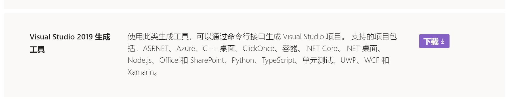
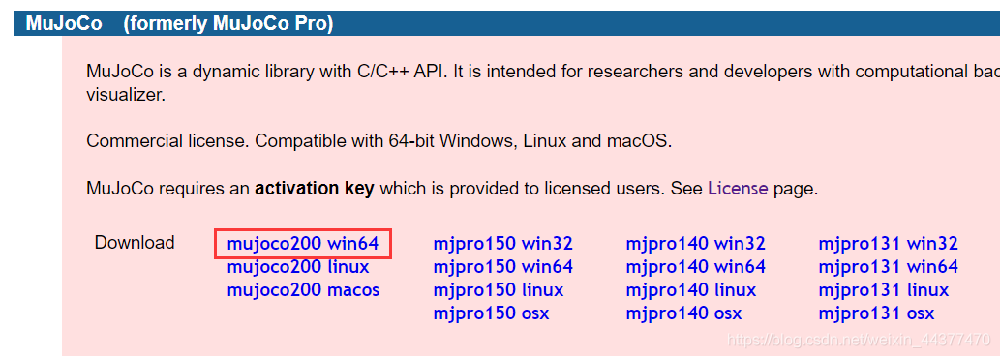
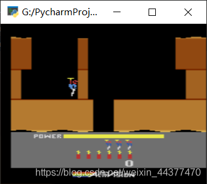

# Windows安装mujoco

安装顺序：Anaconda3, Mujoco, Gym，Mujoco-py。安装版本如下：

## 1. 安装anaconda

默认安装就行，记得加入环境变量.

## 2. VS Build Tools安装

不安装会报错

```
error: Microsoft Visual C++ 14.0 is required. Get it with “Microsoft Visual C++ Build Tools”:
```

直接下载[visualcppbuildtools_full.exe](./visualcppbuildtools_full.exe)默认安装就行. 

也可以去[官网](https://visualstudio.microsoft.com/zh-hans/downloads/?rr=https://medium.com/@sayanmndl21/install-openai-gym-with-box2d-and-mujoco-in-windows-10-e25ee9b5c1d5)安装. 

记得勾选visul studio 2015版本就行. (vc14.0 对应 vs2015)

|  |
| :------------------------------: |
|               fig                |

## 3. mujoco200安装 

1. MuJoCo官网填写信息。
2. 运行下载的工具`getid_win64`，将得到的`computer id`填入表单信息，填好后submit，然后邮箱会收到邮件，附件包含LICENSE.txt 和mjkey.txt文件。
3. 下载邮箱收到的`LICENSE.txt` 和`mjkey.txt`文件
4. 官网下载mujoco200对应平台的安装包 [https://www.roboti.us/index.html](https://www.roboti.us/index.html)。

    |  |
    | :------------------------------: |
    |              fig 2               |
5. 在系统主目录下新建 `.mujoco`文件夹。通常来讲系统主目录就是`C:\Users\你的名字`;
6. 将下载的`mujoco200_win64.zip`解压到 `.mujoco` 文件夹下，修改文件夹名字为 `mujoco200`。
7. 将下载的`mjkey.txt`和`LICENSE.txt` 文件拷贝到`C:\Users\你的名字\.mujoco\mujoco200\bin`和`C:\Users\你的名字\.mujoco`文件夹下。
8. 新建两个环境变量：
    变量名：`MUJOCO_PY_MJPRO_PATH`
    变量值：`C:\Users\你的名字\.mujoco\mujoco200`
    变量名：`MUJOCO_PY_MJKEY_PATH`
    变量值：`C:\Users\你的名字\.mujoco\mujoco200\bin\mjkey.txt`
    这里mjkey的变量值一定要精确到文件名，不然安装Mujoco_py的时候会提示找不到mjkey文件。

## 4. mujoco-py和gym安装

### 4.1 安装gym

1. 创建虚拟环境
   ```
    conda create -n gym python==3.7.6  //创建一个名为“gym”，Python版本为3.7.6的conda环境
    conda activate gym      
   ```
2. 安装gym
    ```
    git clone https://github.com/openai/gym.git
    cd gym
    pip install -e .
    ```
3. 安装box2d
   - 安装siwg. 不能使用pip安装，用anaconda3
        ```
        conda install swig
        ```
   - 再执行命令安装box2d
        ```
        pip install box2d-py
        ```
4. 安装mujoco-py
   ```
    pip install -U 'mujoco-py<2.1,>=2.0'
   ```

## 5.测试安装

1. 测试mujoco-py
   
```python
import mujoco_py
import os
mj_path, _ = mujoco_py.utils.discover_mujoco()
xml_path = os.path.join(mj_path, 'model', 'humanoid.xml')
model = mujoco_py.load_model_from_path(xml_path)
sim = mujoco_py.MjSim(model)
print(sim.data.qpos)
#[0.  0.  1.4 1.  0.  0.  0.  0.  0.  0.  0.  0.  0.  0.  0.  0.  0.  0.
# 0.  0.  0.  0.  0.  0.  0.  0.  0.  0. ]
sim.step()
print(sim.data.qpos)
#[-1.12164337e-05  7.29847036e-22  1.39975300e+00  9.99999999e-01
#  1.80085466e-21  4.45933954e-05 -2.70143345e-20  1.30126513e-19
# -4.63561234e-05 -1.88020744e-20 -2.24492958e-06  4.79357124e-05
# -6.38208396e-04 -1.61130312e-03 -1.37554006e-03  5.54173825e-05
# -2.24492958e-06  4.79357124e-05 -6.38208396e-04 -1.61130312e-03
# -1.37554006e-03 -5.54173825e-05 -5.73572648e-05  7.63833991e-05
# -2.12765194e-05  5.73572648e-05 -7.63833991e-05 -2.12765194e-05]

```

2. 测试gym

```python
import gym
env = gym.make("CartPole-v1") # 创建游戏环境
observation = env.reset() # 游戏回到初始状态
for _ in range(1000):
		env.render() # 显示当前时间戳的游戏画面
		action = env.action_space.sample() # 随机生成一个动作
		# 与环境交互，返回新的状态，奖励，是否结束标志，其他信息
		observation, reward, done, info = env.step(action)
		if done:#游戏回合结束，复位状态
				observation = env.reset()
env.close()
```

```python
import gym
env = gym.make('Hero-ram-v0')
for i_episode in range(20):
		observation = env.reset()
		for t in range(100):
				env.render()
				print(observation)
				action = env.action_space.sample()
				observation, reward, done, info = env.step(action)
				if done:
						print("Episode finished after {} timesteps".format(t+1))
						break
env.close()
```

|  |
| :------------------------------: |
|               fig                |